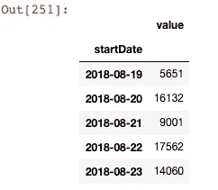
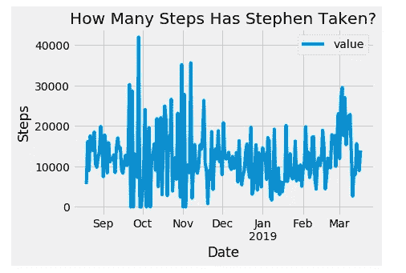
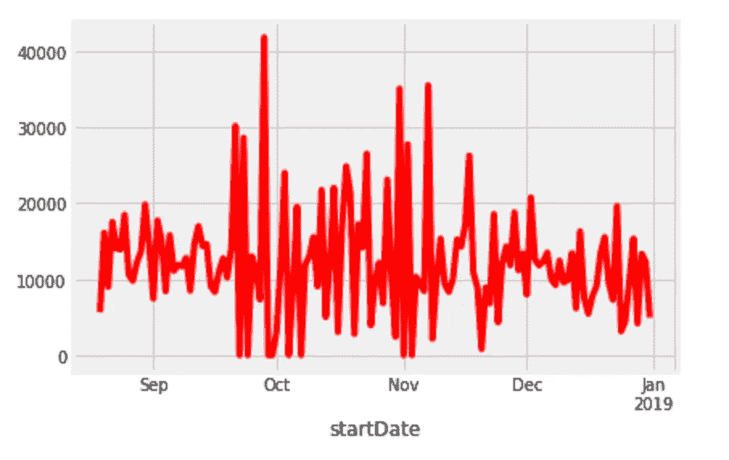
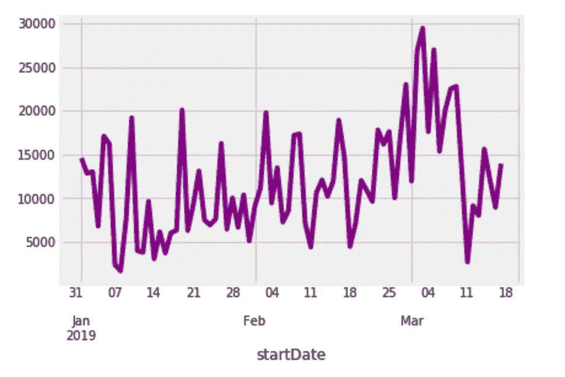
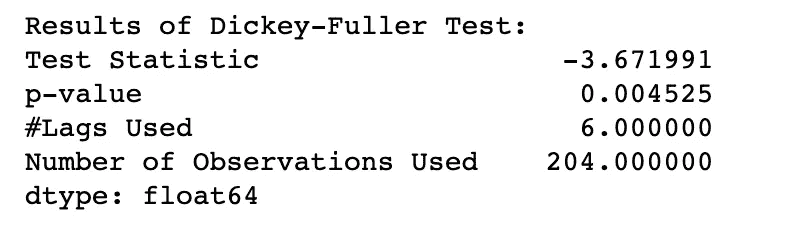
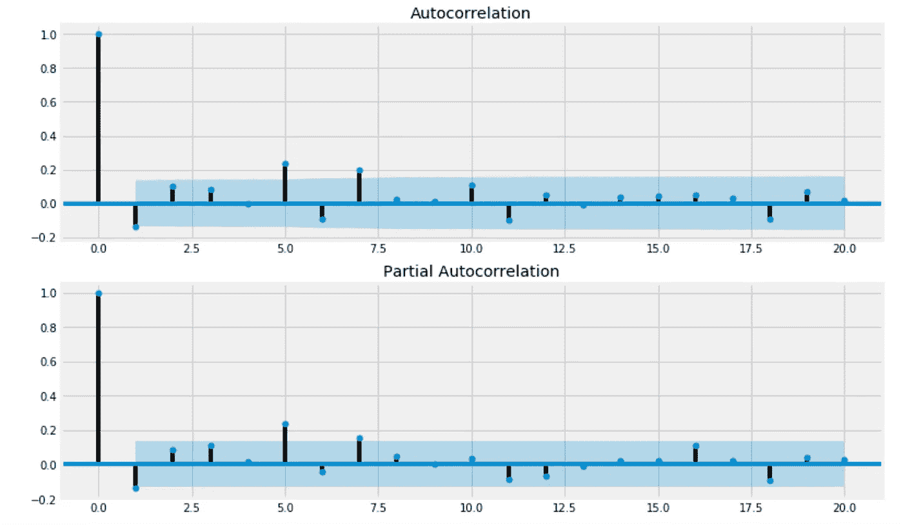
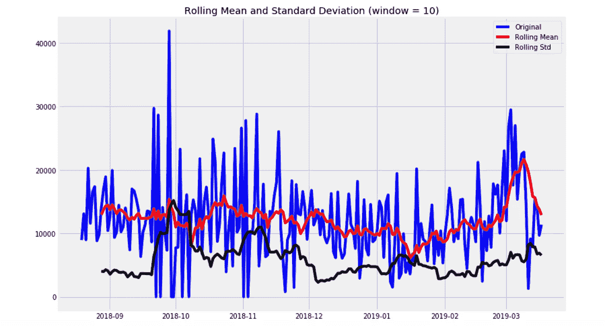
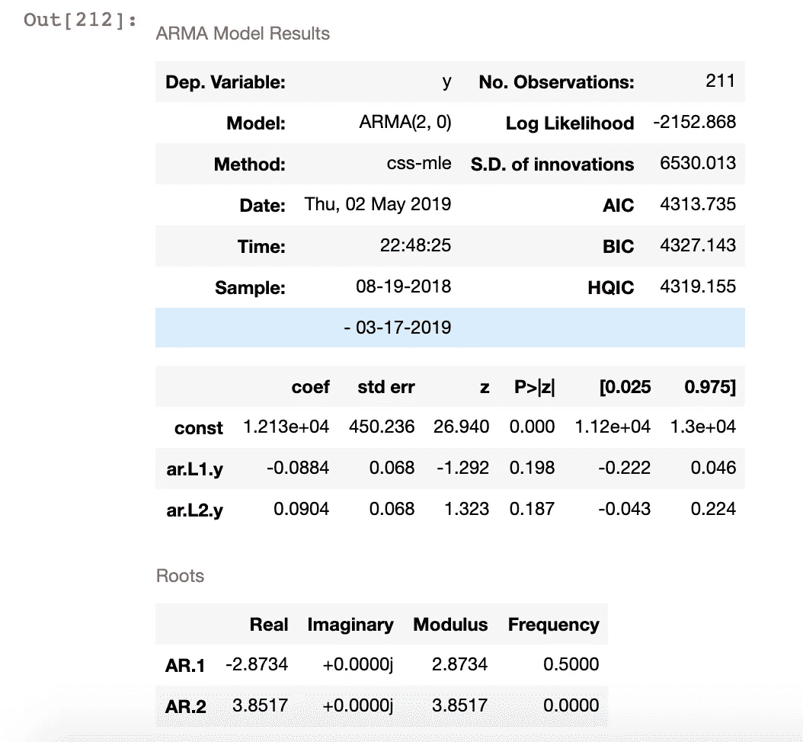
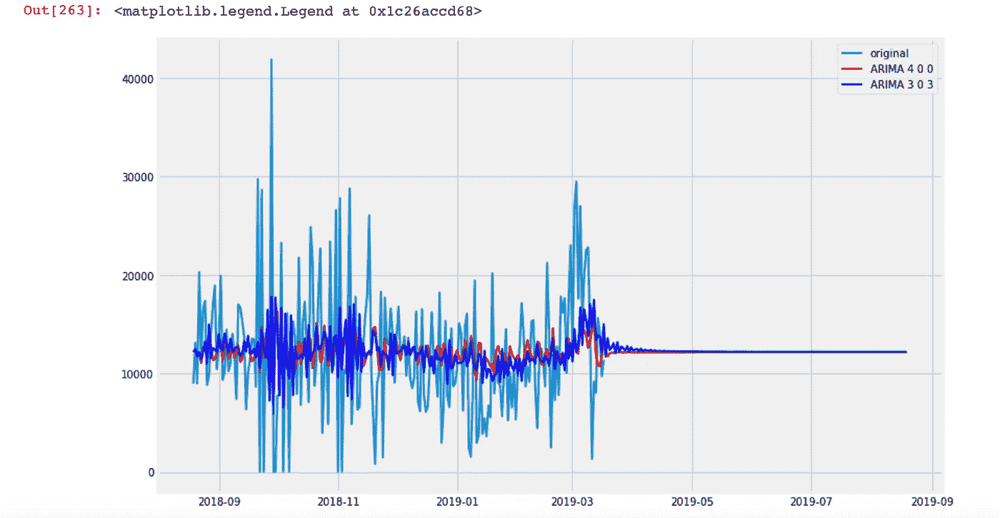

# 走向幸福，数据科学(第二部分)

> 原文：<https://towardsdatascience.com/towards-well-being-with-data-science-part-2-bcaf1db96064?source=collection_archive---------22----------------------->


Credit: EUFIC

请参考(第 1 部分)来看看我们在前面的故事中涵盖了什么。

[](/towards-well-being-with-data-science-part-1-7f8035f73aa) [## 走向幸福，数据科学(第 1 部分)

### 我用我的苹果健康数据来衡量我目前的状态，并设定未来的健身目标。

towardsdatascience.com](/towards-well-being-with-data-science-part-1-7f8035f73aa) 

现在…我们说到哪了？

上次，我们停止了用 matplotlib 可视化数据。我们还讲述了一些介绍性的材料，探索了表层的数据，并借助可视化开始了更深入的分析。我们注意到有 6 个不同的特征可以分析，但是我们决定把重点放在“*步骤*上，因为它更容易衡量，也更有趣。

在《迈向幸福》的第 2 部分，我们将从数据科学出发，继续我们的旅程，解决 C 分析和绘图(续)、d 测试和 e 结论。

# C.分析和绘图(续)

答看完上一张图表后，我意识到我必须**重新采样**数据。为什么，你会问吗？还记得我提到过“*start date”*不是一个每日集合，而是每当设备检测到我的运动时创建的吗？这意味着每天测量的步数是不一致的。

以下代码将其重新采样为每日格式:

```
steps_new = steps_new.resample('D').sum()steps_new.head()
```

现在，如果我们再看，我们可以看到这是一个日常视图。这确保了我们每天都有一致性，以做出公平、公正的比较和更准确的绘图。



figure 1

我还想检查是否有重复的数据。接近 40，000 步对我来说似乎有点可疑…

steps.sourceName.unique()

## 测绘

让我们再画一次。

```
steps_new.plot()
plt.title(‘How Many Steps Has Stephen Taken?’)
plt.ylabel(‘Steps’)
plt.xlabel(‘Date’)
plt.figure(figsize=(12,8))
```

我擅自改变了风格。我是 fivethirtyeight 的忠实粉丝，他们在 matplotlib 中有一种风格可以选择。注意我之前的图和这张图在风格上的不同:

```
plt.style.use(‘fivethirtyeight’)
```



figure 2

图 2 是我所有数据的图表。只做 2018 年的怎么样？

```
steps_new[‘2018’][‘value’].plot()
```



figure 3

将数据分成 2018 年和 2019 年有助于我理解数据中的峰值。我能够“放大”数据集的特定部分。例如，在 2018 年的 10 月和 11 月，天气很好，所以我花了更多的时间在外面做运动，比如慢跑和散步。

我怀疑假期在年底占据了我的大部分时间，这意味着我锻炼得更少了，也不太“灵活”。至于 8 月之前的数据，我在 8 月购买了 iPhone，因此没有该月之前的数据。

2019 年至今怎么样？

```
steps_new[‘2019’][‘value’].plot()
```



figure 4

## 更多分析

对于 2019 年，我在 2 月底和 3 月初之间旅行，所以作为一名游客，我走了很多路，并反映在图表中！查看之前日期的天气信息并将其映射到我的步骤会很有趣(这需要一点工作，因为我必须获取每个位置和日期的天气数据…所以可能在不久的将来当我感觉更有效率时:P)。

通常，有三种类型的时间序列结构:单变量、外部回归和多变量。在我们的例子中，它是单变量的，因为我们有一个带时间戳的数字向量，我们的预测模型将基于历史数据，以查看我采取了多少步骤。我们正在处理时间戳/索引和有序的单变量数据，因此我们可以应用时间序列模型进行预测，因为它有特定的顺序。

## 时间序列分析

既然我们已经确定我们的数据集适合于时间序列分析，我们需要确定一些特征。这四个特征有助于我们在建模之前确定使用哪个模型以及执行哪些步骤。

**季节性**:如果我在夏季看到同样的高峰，而在冬季看到较低的活动，我敢说存在季节性，但鉴于我只有> 1 年的数据，我想假定事实并非如此。从逻辑上讲，我会在春天和夏天多走路是有道理的…

**趋势**:我看不出有什么趋势。线图中没有真正的向上或向下移动。这意味着我们有一个恒定的平均值，这是缺乏趋势的结果，而不是水平的变化。

**可变性:**是与均值的偏差，数据集中没有一致性。如果我们拆分数据集，您可以说 2019 年低约为 5，000，高约为 20，000，2018 年低约为 0，高约为 25，000。

**平均值:**平均值似乎在 10，000 步左右，我们将在应用平滑器时对此进行更多探索。

# D.测试

一旦我们深入研究了特征，我们需要看看时间序列统计:自相关(ACF 和 PACF 图)和平稳性(增强的 Dickey-Fuller 测试)。为了分析这些统计数据，我们将进行一些测试。

## 平稳性

现在，我们将执行扩展的 Dickey-Fuller 测试来测试平稳性。记住，平稳性回答了这个问题:**数据在整个时间序列中具有相同的统计特性吗？方差，均值，自相关？**ADF(单位根测试之一，还有其他几个)非常强大，因为它消除了自相关并测试平稳性。

让我们进行测试:

```
# Test for Stationarity
def stationarity_test(timeseries):
    """"Augmented Dickey-Fuller Test
    Test for Stationarity"""
    from statsmodels.tsa.stattools import adfuller
    print("Results of Dickey-Fuller Test:")
    df_test = adfuller(timeseries, autolag = "AIC")
    df_output = pd.Series(df_test[0:4],
                          index = ["Test Statistic", "p-value", "#Lags Used",
                                   "Number of Observations Used"])
    print(df_output)
```

分析结果。如果 p < 0.05，则静止。测试统计、p 值、使用的滞后=过去多长时间

```
stationarity_test(steps_new)
```



figure 5

p 值确实小于 0.05，因此我们的数据集是稳定的。

## 自相关

自相关回答了这样一个问题:早期的观察会影响后期的观察吗？为了验证这一点，我们使用了 ACF 和 PACF 图。

## ACF 和 PACF

ACF 显示滞后之间的自相关。PACF 对所有早期的滞后进行了调整，因此，我们看到了两个图表之间的差异。蓝色区域是置信水平界限。CI 外的标记暗示自相关。95%的信心。

```
# Classic ACF and PACF Plots for Autocorrelation
from statsmodels.graphics.tsaplots import plot_acf, plot_pacf# Autocorrelation and partical autocorrelation in the Steps dataset
# Two plots on one sheet
%matplotlib inline
fig = plt.figure(figsize=(12,8))
ax1 = fig.add_subplot(211)
fig = plot_acf(steps_new, lags=20, ax=ax1)
ax2 = fig.add_subplot(212)
fig = plot_pacf(steps_new, lags=20, ax=ax2)
```



figure 6

没有多少数据集在突出显示的蓝色区域之外。这很好。

## 预言；预测；预告

我应用平滑器来消除数据中的一些巨大尖峰，这是预测之前的。请注意，数据集现在变得更加“平坦”:



figure 7

我们将使用自回归综合移动平均模型进行预测。我邀请您在此了解更多信息:

> [https://machine learning mastery . com/ARIMA-for-time-series-forecasting-with-python/](https://machinelearningmastery.com/arima-for-time-series-forecasting-with-python/)

python 包“statsmodel”使我们很容易使用它，但你仍然必须知道如何正确选择参数。对于我们的数据集，我们将研究两种不同的 ARIMA 模型，并对它们进行比较。ARIMA 模型为您提供了模型诊断和预测功能。

以下是我的模型的诊断:

```
# ARIMA Model Setup
from statsmodels.tsa.arima_model import ARIMA
# Model Diagnostics
results_AR.summary()
```



figure 8

AIC 和 BIC 都是模式选择和比较的标准。点击此处阅读更多内容:

 [## AIC 对 BIC

### 我经常用 AIC 和 BIC 这样的合适标准来选择模特。我知道他们试图平衡良好的契合度与…

www.methodology.psu.edu](https://www.methodology.psu.edu/resources/aic-vs-bic/) 

因为我们的数据是每月一次，所以我们来预测未来 5 个月的情况:

```
# ARIMA forecasts
# Setting up
model_AR4 = ARIMA(steps_new, order=(4, 0, 0)) 
results_AR4 = model_AR4.fit()# model 1
Fcast400 = results_AR4.predict(start = ‘08/19/2018’,
 end = ‘08/19/2019’)# setup 2
# Arima(2,0,2) model and its fitted values
model303 = ARIMA(steps_new, order=(3, 0, 3)) 
results_M303 = model303.fit()# model 2
Fcast303 = results_M303.predict(start = ‘08/19/2018’,
 end = ‘08/19/2019’)
```

形象化

```
# Comparing the forecasts via data visualization
plt.figure(figsize = (12, 8))
plt.plot(steps_new, linewidth = 2, label = “original”)
plt.plot(Fcast400, color=’red’, linewidth = 2,
 label = “ARIMA 4 0 0”)
plt.plot(Fcast202, color=’blue’, linewidth = 2,
 label = “ARIMA 3 0 3”)
plt.legend()
```



figure 9

这两个模型的预测似乎都表明，在接下来的 5 个月里，我将徘徊在 10，000 步以上。现实是，数据会更加不稳定，但我很高兴看到我在现实生活中有多接近/远。

# E.结论

你可能会说，好吧，那又怎么样？通读这些很酷(或者不是！哈哈)，但这怎么是迈向幸福的一步呢？

幸福是每个人个人的、持续的追求，我只分析了幸福的几个组成部分中的一个特征。在这个练习中，我的希望是在我的锻炼计划中增加目标，让自己负起责任。然而，我希望我能把我自己放在一些不同的衡量标准中，以看到进步、持续的健康和繁荣。

我认识到它的局限性，但我并不打算概括说幸福仅仅是由锻炼组成的，更不用说采取措施了。心理健康、财务健康、社会福祉、精神繁荣、营养等等都是等式的一部分。除了运动之外，还应该考虑冥想、睡眠、正念等活动。

我对这个过程做了很多改进。例如，我可以将我过去的数据与天气进行映射，并在那里看到相关性。这可能有点棘手，因为我还必须考虑每个日期戳的位置。

量化情绪、压力等无形因素，以及饮食(热量摄入、宏指令)、水摄入和睡眠时间等有形因素，也可以影响和补充预测。我提到的一些数据源现在很容易获得，但仍然是分散的，还没有找到一个设备来捕获所有这些数据。构建一个全面的、可定制的仪表板也会很有趣。

使用大数据和利用云计算来获得更多宏观分析也是非常有趣的。除了个性化体验，看到总体趋势将是有益的。

这让我不得不说…谢谢你阅读，我邀请你自己尝试这段代码！需要考虑的一些警告是:

位置和生活方式:这两个因素的数据会有所不同。有些人走路多，而有些人开车多。一个简单的例子是纽约对洛杉矶。通勤模式不同，这只是一个方面。

设备:我用的是 iPhone，但 Fitbit、Apple Watch、Garmin 和其他设备追踪的指标更全面。