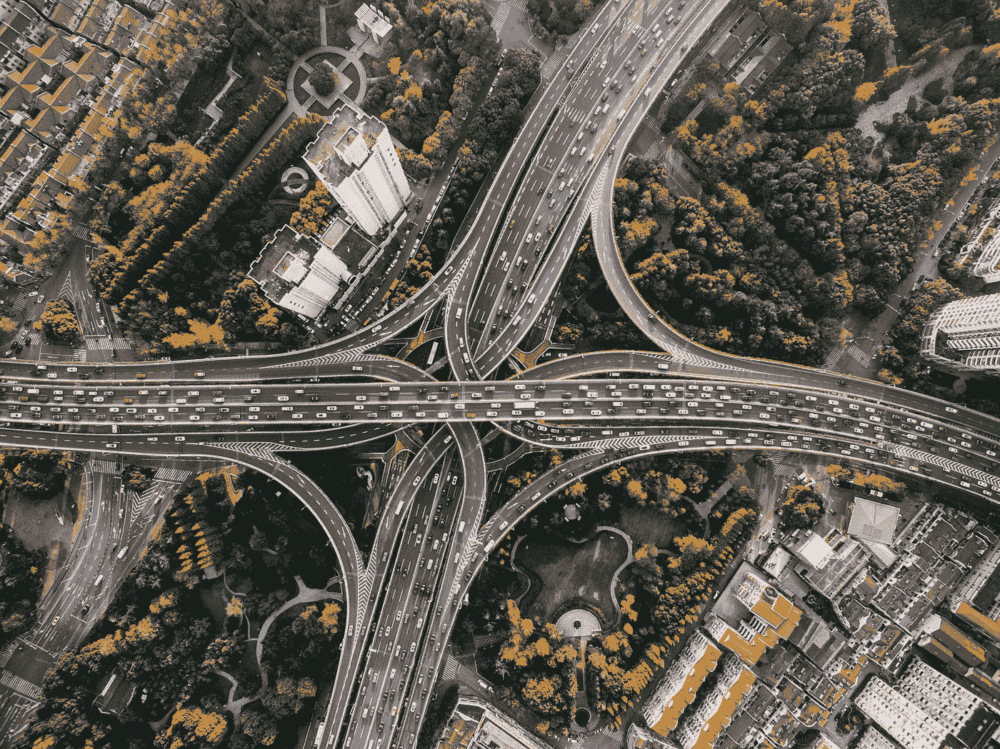
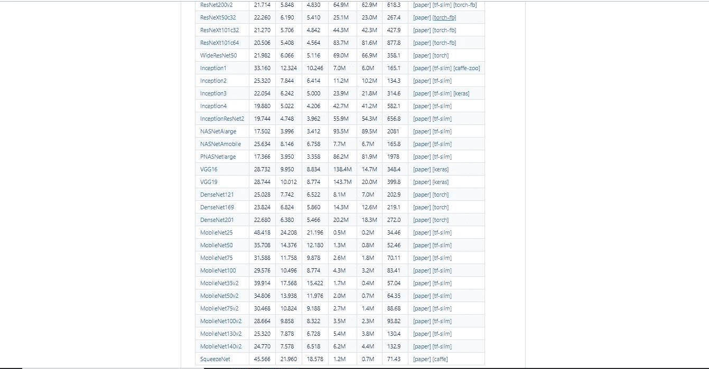
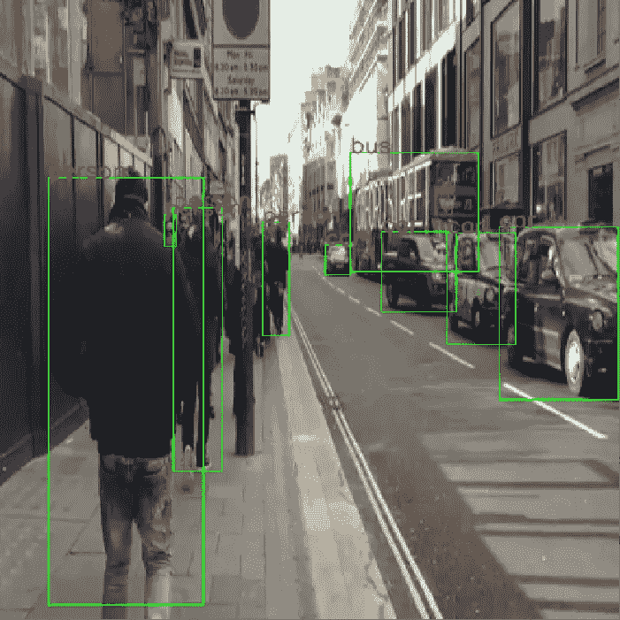

# 用 tensornets 在 tensorflow python 中实现 YOLOv3

> 原文：<https://towardsdatascience.com/track-vehicles-and-people-using-yolov3-and-tensorflow-4f3d0e5b1b5f?source=collection_archive---------12----------------------->



Spectacular architecture and a splendid view! source:[https://pixabay.com/en/architecture-buildings-cars-city-1837176/](https://pixabay.com/en/architecture-buildings-cars-city-1837176/)

从对象检测到[生成对抗网络](https://hackerstreak.com/pix2pix-gan/) (GAN)，深度学习显示了它的威力。[物体检测](https://hackerstreak.com/yolo-made-simple-interpreting-the-you-only-look-once-paper/)从很好的老式人工设计的特征检测器发展到现在的基于深度学习的卷积神经网络(CNN)物体检测器，如 R-CNN、 [YOLO](https://hackerstreak.com/yolo-made-simple-interpreting-the-you-only-look-once-paper/) 。使用 CNN 的检测通过预测对象的边界框坐标来近似图像中对象的位置，而分割通过预测图像中对象的边界来更进一步。在本文中，我们将逐步运行一个车辆检测网络，使用在 MS-COCO 数据集上训练的 YOLOv3，该网络可以检测大约 90 种不同类别的对象。有了这个网络，我们将能够检测和跟踪汽车，公共汽车，卡车，自行车，人和更多！要找到更多有趣的人工智能文章，请点击这里。

**1。了解张量网**

下载 YOLOv3 的暗网权重并让它在 tensorflow 上运行是一项相当繁琐的任务。但是我们两分钟后也要做同样的事情！你怎么问？

嗯，李泰勋先生将各种流行网络的权重转换成 tensorflow 的格式，并发布了一个名为“Tensornets”的 PyPi 库。Tensornets 使迁移学习和运行推理成为可能，只需“10 行”直观代码。

查看他的 Github 页面:[https://github.com/taehoonlee/tensornets](https://github.com/taehoonlee/tensornets)



Some of the models available in tensornets

**2。装载 YOLO**


You Only Look Once source:[https://pixabay.com/photos/yolo-sparklers-new-year-1758212/](https://pixabay.com/photos/yolo-sparklers-new-year-1758212/)

YOLOv3 是 YOLOv2 的改进版本，具有更高的精确度和地图得分，这也是我们选择 v3 而不是 v2 的主要原因。

让我们开始吧。

首先，我们需要安装“tensornets”库，使用方便的“PIP”命令可以很容易地做到这一点。“pip install tensornets”就可以了，但是你也可以从 GitHub 上下载来安装。在开始使用代码之前，请确保安装了 Tensorflow。

启动您最喜欢的 IDE 并导入 tensorflow 和 tensornets。除此之外，我们还需要 OpenCV 和 numpy 来帮助导入图像和视频。我们使用“时间”来监控网络处理一帧所需的时间。

```
import tensorflow as tf
import tensornets as nets
import cv2
import numpy as np
import time
```

一旦我们导入了必要的库，我们继续为网络和模型本身创建输入占位符。

```
inputs = tf.placeholder(tf.float32, [None, 416, 416, 3]) 
model = nets.YOLOv3COCO(inputs, nets.Darknet19)
```

这*两行*完成了加载权重和图形的繁重任务，**“就两行”。**

**3。运行推断**

现在是时候创建一个 tensorflow 会话并对视频进行推理了。下面几行定义了我们要跟踪的对象的类别和它们的 MS-COCO 索引。

```
classes={'0':'person','1':'bicycle','2':'car','3':'bike','5':'bus','7':'truck'}
list_of_classes=[0,1,2,3,5,7]#to display other detected #objects,change the classes and list of classes to their respective #COCO indices available in their website. Here 0th index is for #people and 1 for bicycle and so on. If you want to detect all the #classes, add the indices to this listwith tf.Session() as sess:
    sess.run(model.pretrained())

    cap = cv2.VideoCapture("D://pyworks//yolo//videoplayback.mp4")
    #change the path to your directory or to '0' for webcam
    while(cap.isOpened()):
        ret, frame = cap.read()
        img=cv2.resize(frame,(416,416))
        imge=np.array(img).reshape(-1,416,416,3)
        start_time=time.time()
        preds = sess.run(model.preds, {inputs: model.preprocess(imge)})
```

**4。结果**

继续前进。一旦视频帧被传送到网络，它就会返回边界框并将其封装在“preds”对象中。现在，我们可以从“preds”对象中获取检测到的类及其坐标。

```
print("--- %s seconds ---" % (time.time() - start_time)) #to time it
        boxes = model.get_boxes(preds, imge.shape[1:3])
        cv2.namedWindow('image',cv2.WINDOW_NORMAL)cv2.resizeWindow('image', 700,700)

        boxes1=np.array(boxes)
        for j in list_of_classes: #iterate over classes
            count =0
            if str(j) in classes:
                lab=classes[str(j)]
            if len(boxes1) !=0:
#iterate over detected vehicles
                for i in range(len(boxes1[j])): 
                    box=boxes1[j][i] 
                    #setting confidence threshold as 40%
                    if boxes1[j][i][4]>=.40: 
                        count += 1    

                        cv2.rectangle(img,(box[0],box[1]),(box[2],box[3]),(0,255,0),3)
                        cv2.putText(img, lab, (box[0],box[1]), cv2.FONT_HERSHEY_SIMPLEX, 1.0, (0, 0, 255), lineType=cv2.LINE_AA)
            print(lab,": ",count)

        #Display the output      
        cv2.imshow("image",img)  
        if cv2.waitKey(1) & 0xFF == ord('q'):
            break
```

这将在一个新窗口中显示带有名称标签的被跟踪车辆！



Et voila!

**就是这么做的！**

YOLOv3 在英伟达 GTX 1060 6GB 上运行时的速度约为 12 fps，在英伟达 Titan 上可以达到 30 fps。随着功能强大的边缘计算设备的兴起， [YOLO](https://hackerstreak.com/yolo-made-simple-interpreting-the-you-only-look-once-paper/) 可能会取代 Mobilenet 和其他不如 [YOLO](https://hackerstreak.com/yolo-made-simple-interpreting-the-you-only-look-once-paper/) 精确的紧凑型物体探测网络。卷积网络可以做的不仅仅是物体检测。语义分割、图像生成、实例分割和[更多](https://medium.com/analytics-vidhya/siamese-neural-network-for-signature-verification-efd2f399d586)。

跳转到这里深入研究 YOLO 文件，并了解其优雅的架构和工作。

解读 YOLO 文件的实质细节

机器学习无疑正在改变数字世界的面貌。而且几乎每个行业都会很快受到 AI 的冲击。

为了更深入地探索人工智能，请进入 [HackerStreak](https://hackerstreak.com)

在 GitHub 上找到完整的代码[https://GitHub . com/baakcshu/Vehicle-and-people-tracking-with-yolov 3-](https://github.com/Baakchsu/Vehicle-and-people-tracking-with-YOLOv3-)

有什么问题吗？向我开枪。

[](https://www.linkedin.com/in/anirudh-s-37307114b/) [## 在 Linkedin 上找到我](https://www.linkedin.com/in/anirudh-s-37307114b/) 

*原载于*[*https://hackerstreak.com*](https://hackerstreak.com)