# 使用 MLflow 跟踪 ML 实验

> 原文：<https://towardsdatascience.com/tracking-ml-experiments-using-mlflow-7910197091bb?source=collection_archive---------5----------------------->

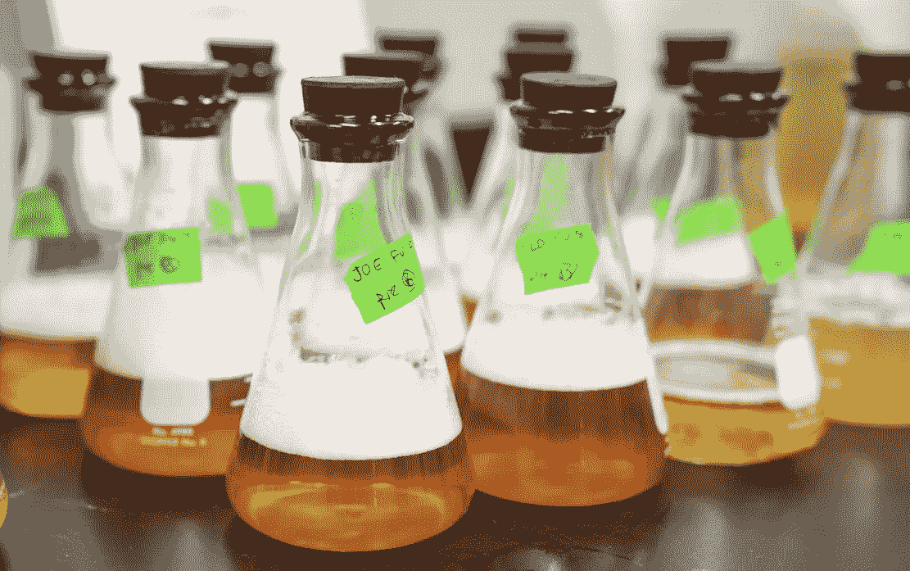

Photo by [Elevate](https://unsplash.com/@elevatebeer?utm_source=unsplash&utm_medium=referral&utm_content=creditCopyText) on [Unsplash](https://unsplash.com/search/photos/experiment?utm_source=unsplash&utm_medium=referral&utm_content=creditCopyText)

## 演示 MLflow 如何改善您的 ML 建模体验

# **简介**

如果你熟悉构建机器学习模型，无论是在工作中还是作为一种爱好；您可能遇到过这样的情况，您构建了大量不同的模型，具有不同的代码库，并且当您优化代码和调整模型以提升准确性时，需要跟踪大量的图表或笔记本和指标。

> 你并不孤单。[【1】](https://medium.com/@u39kun/managing-your-machine-learning-experiments-and-making-them-repeatable-in-tensorflow-pytorch-bc8043099dbd)

我认为，这些年来，随着我在数据科学领域的实践，我遇到了很多人们倾向于处理这个问题的方法。我的 go to 方法通常是一个 excel 表。它易于使用，易于可视化，易于传达给外部各方。

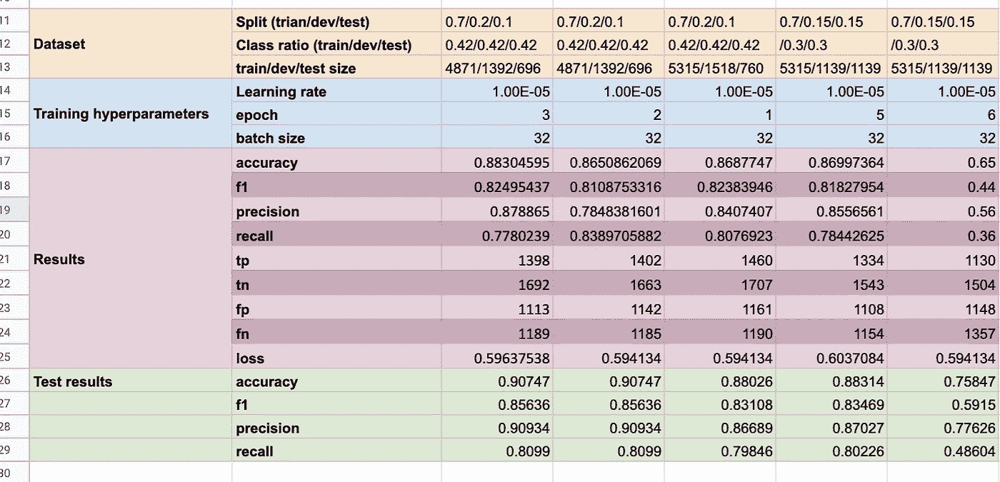

Tracking experiments on a spreadsheet

我也见过有人试图以编程方式将指标存储在数据库表中。但是这些可能会变得非常混乱(*不是说 excel 表格本身不混乱，但是如果我需要运行一些命令来添加一个新的指标——我会说从长远来看这是不可持续的*

一旦有多人在研究同一个机器学习问题，事情就会变得更加棘手。一些基本规则需要在项目执行前设定，否则跟踪将变得很麻烦。成熟的人工智能团队很可能已经解决了这个问题，但我想象早期阶段的初创公司在处理这种协调工作时会有一些问题(*如果他们能够负担得起让多个数据科学家从事同一件事情*)。

这是一个如此大的问题，以至于催生了一些致力于解决这个特殊问题的公司。我知道的一些例子是:

1.  海王星 ML:[https://neptune.ml/](https://neptune.ml/)

2.权重和偏差:[https://www.wandb.com/](https://www.wandb.com/)

3.彗星 ML:[https://www.comet.ml/](https://www.comet.ml/)

为了简洁起见，我将不涉及它们实际上有什么特性，它们是如何工作的，也不涉及它们的定价模型。一些更侧重于基于深度学习的实验，而另一些则覆盖更广的范围。我在这里想强调的一点是，这个问题已经大到人们实际上为了某种解决方案而付钱给其他人。

值得一提的是 TensorBoard，但它似乎是明确针对 Tensorflow 和深度学习的(*我本人不是一个重度 TensorBoard 用户，请在评论部分与我分享你所知道的内容，以便让大家受益*)。

## MLflow

另一个选择是 MLflow。由 Databricks 开始，它基本上是一个用于整个机器学习生命周期的开源平台 (一字不差地摘自他们的网站)。

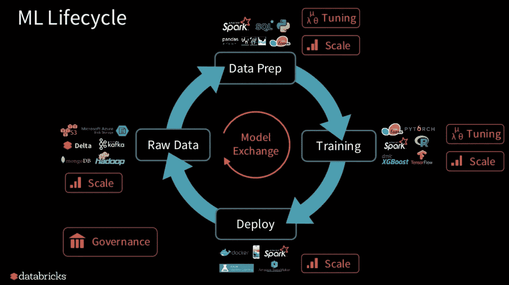

What they mean by covering the entire ML lifecycle [[2]](https://www.slideshare.net/databricks/mlflow-infrastructure-for-a-complete-machine-learning-life-cycle)

这就把我们带到了本文的焦点——跟踪指标。

# 我的 MLflow 环境

在我目前的工作场所，我们最常用的工具之一是数据块。最近几个月，他们增加了 MLflow 功能。作为一个渴望学习如何更好地跟踪事物的人，这是一个尝试的绝佳机会。我的 MLflow 跟踪演练的上下文将基于此(也就是 Databricks 用户)。

> 对于非 Databricks 用户，MLflow 可以单独设置并连接到您的环境。应该存在相同的功能。查看他们的[文档](https://mlflow.org/docs/latest/index.html)了解更多细节。

# 实验

为了展示我目前如何在工作中使用 MLflow，以及为什么我觉得它很有用，我将在 Kaggle 内核[3]上使用它，作者使用加密货币数据集进行了一些数据分析和预测实验。一些小的改动把从[3]中取出的原始代码变成了数据块(主要是为了能够可视化图形)，但本质上是一样的。

> 注:最近刚开始用 MLflow，很有可能会漏掉一些东西。

我在这篇文章中使用的笔记本可以参考这里的。笔记本有两个版本可用—*“*前的“T11”表示最初移植到 Databricks 的 Kaggle 内核，而“后的“T13”包含用于跟踪的附加代码。

要用 MLflow 开始一个实验，首先需要使用`mlflow.set_experiment`命令，然后是实验文件的存储路径。

接下来，你可以开始思考在你的分析/实验中，你想要跟踪什么。MLflow 将这些分为 3 个主要类别:

1.  参数(通过`mlflow.log_param()`)。参数是您在调整模型时更改或调整的变量。
2.  度量标准(使用`mlflow.log_metric()`)。度量是调整参数后想要测量的值。被跟踪的典型指标可以是 F1 分数、RMSE、MAE 等项目。
3.  工件(使用`mlflow.log_artifact()`)。工件是您希望存储的任何其他项目。我跟踪的典型工件是 png 图，即特性重要性变量列表。有时我也存储模型(腌 scikit 学习模型)。(更新:我突然想到，你也可以保存你正在使用的原始/转换/训练/测试/验证数据集。多酷啊。)

> MLflow 跟踪是围绕**运行**的概念组织的，这些运行是某段数据科学代码[【4】](https://mlflow.org/docs/latest/tracking.html)的执行。(接下来，我们将使用斜体` **run`** )来表示这个 run 概念)

在每一次*运行*中可以跟踪的其他事情是代码版本、开始和结束时间以及源文件。参考[文件](https://mlflow.org/docs/latest/tracking.html#logging-data-to-runs)了解更多细节。

## 跟踪参数和指标

在笔记本的第 37 单元中，作者试图反复探索不同的参数组合，以获得最适合我们数据的 ARIMA 模型。让我们使用这部分代码，并跟踪正在使用的参数和正在生成的指标。

为了开始我们的*运行*，我们使用`mlflow.start_run().`，然后将`qs`和`ps`参数以及`model.aic`度量记录到 MLFlow。*运行*以上代码将在 MLFLow UI 中使用以下结果。

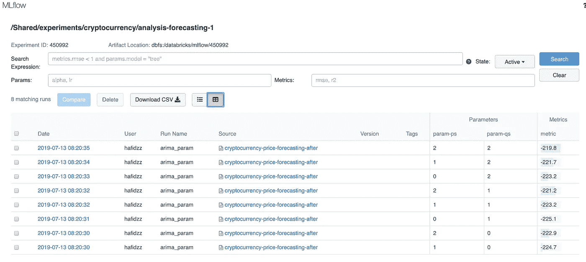

Each row of result is generated for each run.

如果我们要点击进入其中一个*运行*，我们将进入以下窗口。

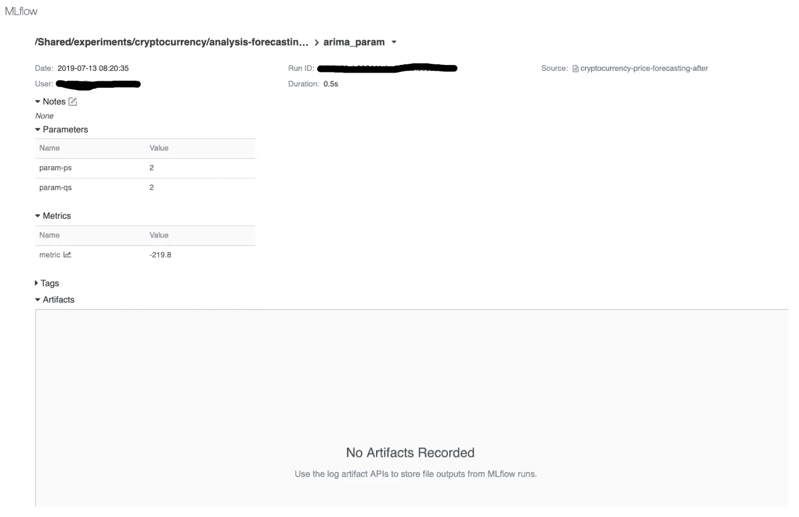

Detailed page for each MLflow run

从上面可以看出，我们只跟踪了每次*运行*的有限数量的参数和指标。既没有被记录的艺术品也没有标签。如果有的话，我们可以选择添加我们自己的注释。记录的其他内容包括日期、用户(在我的例子中是我的数据块 ID)、运行 ID、持续时间和源。

## 运行被提交给 Git

我发现后者非常有用，因为它实际上将正在运行的笔记本提交到 Git 中。我目前不确定这如何转化为 MLflow 的自设置版本，但在我的情况下，单击 source 链接会将我带回到 Databricks 中的笔记本提交版本(如下)。

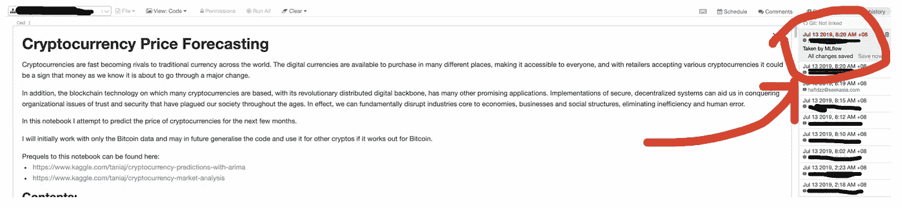

Opening the Revision History reveals that this notebook was committed by MLFlow (ie. “Taken by MLflow”)

现在让我们试试别的。

## 存储图和其他文件

按照前面的例子，我们构建了多个模型，以确定我们应该用于 ARIMA 模型的最佳参数。在我们的下一个例子中，我们将存储一些与模型相关的工件；即模型概要和一些情节。

让我们为我们的 SARIMAX 模型这样做。

从上面的代码中可以看出，登录工件需要比平常多一点的工作。该文件不能直接将图保存到 MLflow 中，而是必须先存储在某个地方，然后才能发送到 MLflow 的 S3 存储桶中。

在我的例子中，文件首先保存到本地 Databricks 集群，然后复制到 MLflow 的 S3 存储桶(在本例中也在 Databricks 内)。或者，也可以为每个实验定义一个外部 S3 存储桶，并将所有相关文件存储在那里。)

作为参考，下面是存储的工件在 UI 中的显示方式。

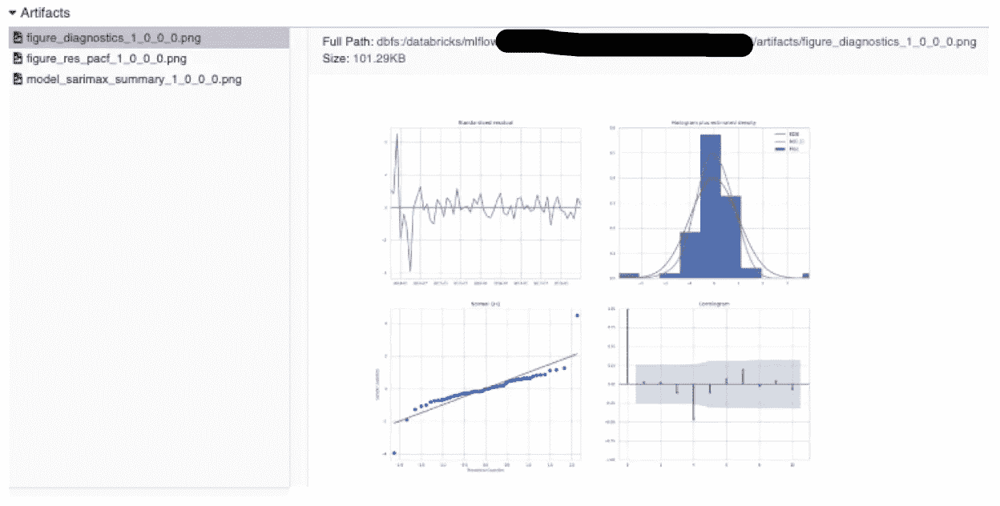

Artifact 1

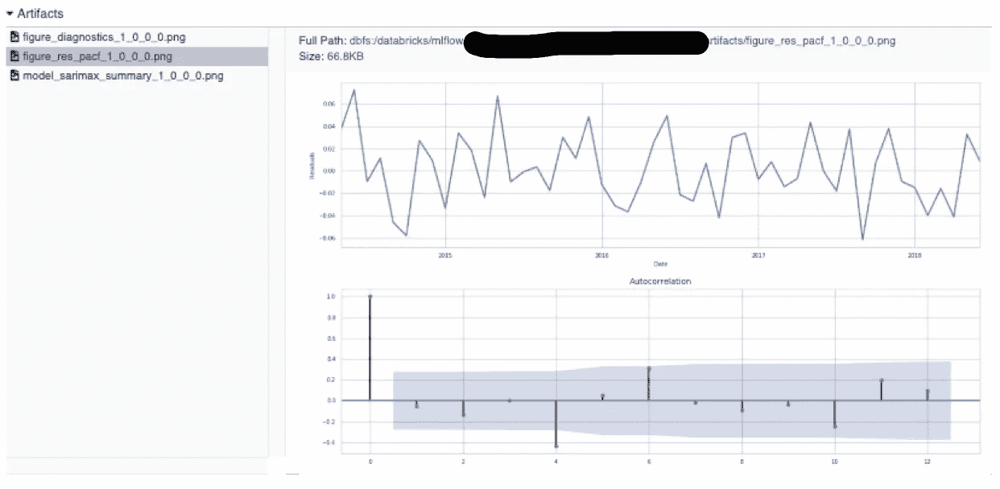

Artifact 2

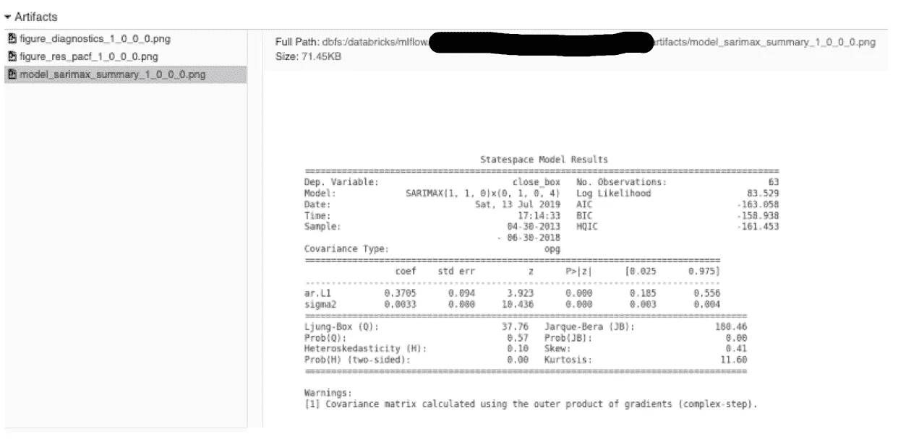

Artifact 3

对我来说，这相当简化和标准化了通常只存储在笔记本上的情节和摘要的集合。虽然让它们存在于 notebook 中是可以的，但是 notebook 可以按单元运行，而不是从上到下完整运行，这意味着某些图实际上可以作为很晚才发生的操作的结果而生成(或者在开发过程中可以完全删除)。由于存储在 MLflow 中的图与 Git 中提交的代码相关联，我们现在有了一种更好的方法来确保实验及其结果以可重复的方式被记录。

## 保存模型

MLflow 还允许您保存正在训练的模型。这可以通过将其作为工件登录到 MLflow(通过`[log_model](https://www.mlflow.org/docs/latest/python_api/mlflow.sklearn.html#mlflow.sklearn.log_model)()`)或者直接登录到本地文件系统(通过`[save_model](https://www.mlflow.org/docs/latest/python_api/mlflow.sklearn.html#mlflow.sklearn.save_model)`)来完成。

## 回溯测试

我最喜欢的 MLflow 特性之一是它的指标可视化。为了更好地突出这一点，我将使用内核的最后一部分[3],并对其进行修改，以便在部署运行一段时间(即滑动窗口验证)。

在上面的例子中，我们建立了一个 3 个月的时间窗口，并在 10 个滑动窗口的时间段内评估模型的 RMSE 得分，其中每个向前移动是 1 个月。每次评估时，我们还会将比较图记录到 MLflow 中，以备将来参考和验证。

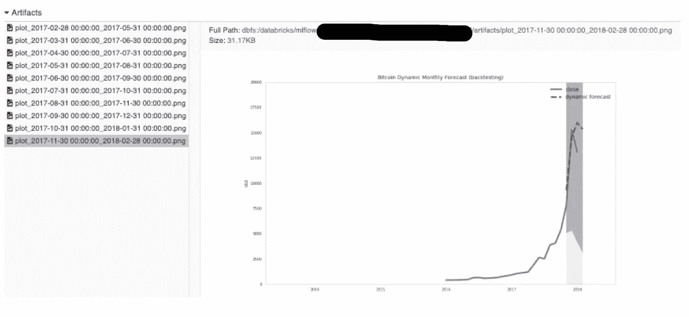

Plot are captured across multiple sliding window

深入研究 RMSE 指标，我们可以看到它在 10 个时间步长内的表现。我们可以看到，该模型通常在一段时间内是稳定的，直到在第 5 次迭代时达到峰值。如果我们回头参考上图中比特币价格的波动性，这是相当令人期待的。

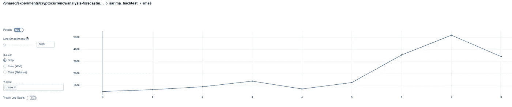

Performance of the SARIMA model over time

# 摘要

在这篇文章的过程中，我谈到了每个机器学习实践者都面临的问题——如何整齐地组织和跟踪多个建模实验结果。

MLflow 是实现这一目标的众多工具之一。在本文中，我通过运行几个例子强调了它的几个特性，这些例子说明了如何在日常建模工作中使用它来帮助数据科学从业者。

从短期来看，良好管理的结果有助于团队沟通和协作——这对远程团队来说尤其重要。

从长远来看，对建模活动及其可交付成果进行适当的治理有助于保留学到的知识和发现，减少错误，并确保过去的研究和结果可以被其他团队或其替代者复制。

这篇文章中使用的代码可以在我的 github [这里](https://github.com/ikanez/tracking-mlflow)找到。

Throw away those ugly spreadsheets you’re currently using. Pretty sure it’s not making you happy. ([source](https://www.forbes.com/sites/camilomaldonado/2019/02/05/marie-kondo-financial-goals/#24ec9d843091))

# 参考

1.  [https://medium . com/@ u39kun/managing-your-machine-learning-experiments-and-make-repeatable-in-tensor flow-py torch-BC 8043099 DBD](https://medium.com/@u39kun/managing-your-machine-learning-experiments-and-making-them-repeatable-in-tensorflow-pytorch-bc8043099dbd)
2.  [https://www . slide share . net/databricks/ml flow-infra structure-for-a-complete-machine-learning-life-cycle](https://www.slideshare.net/databricks/mlflow-infrastructure-for-a-complete-machine-learning-life-cycle)
3.  [https://www . ka ggle . com/taniaj/cryptocurrency-price-forecasting](https://www.kaggle.com/taniaj/cryptocurrency-price-forecasting)

4.[https://mlflow.org/docs/latest/tracking.html](https://mlflow.org/docs/latest/tracking.html#concepts)