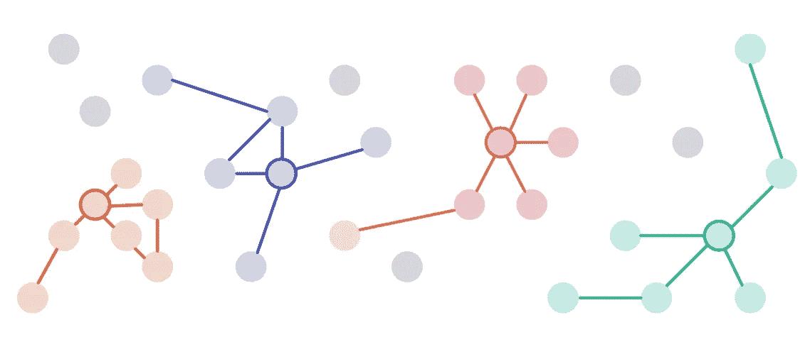
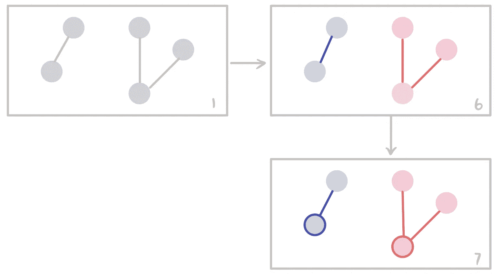
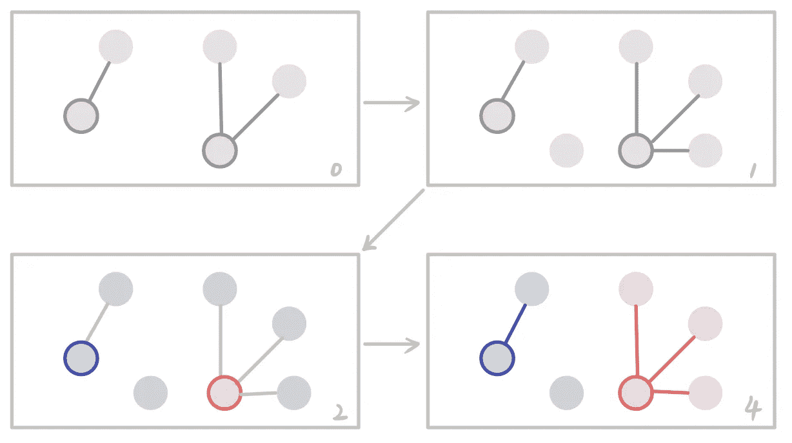
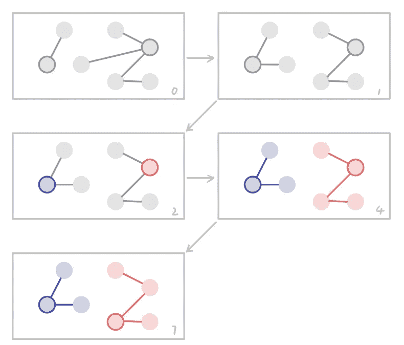
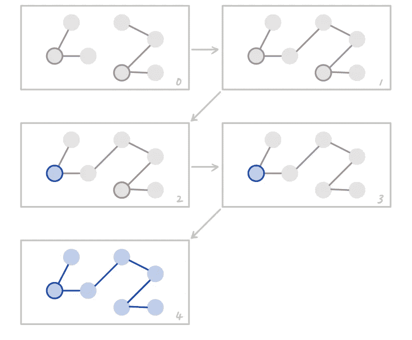
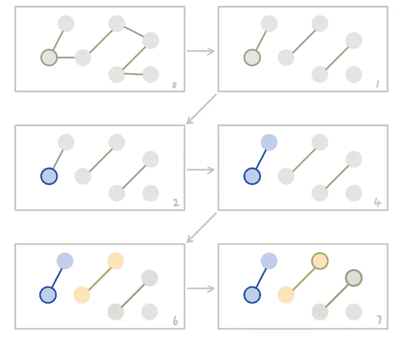
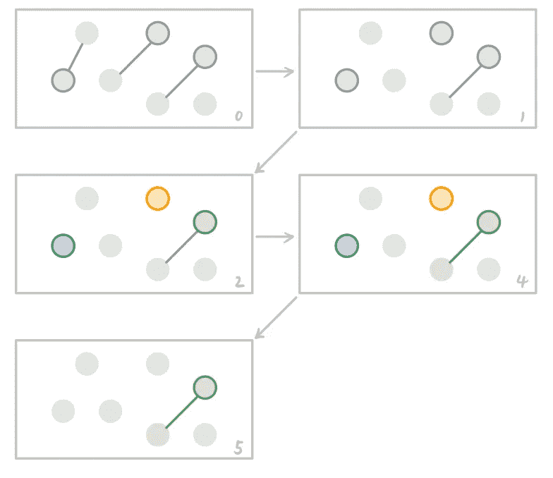

# 追踪社交网络的演变

> 原文：<https://towardsdatascience.com/tracking-social-networks-evolution-15313fe53ab3?source=collection_archive---------36----------------------->

## 一种跟踪社区出生、死亡、合并和分裂的算法

在社交网络中，社区无处不在:人们上同一所学校，在同一家公司工作，喜欢同一部电影，去同一家餐馆，等等。为了方便起见，我们认为拥有相似特征、偏好或历史的人属于同一个**社区**。

当社区拥有唯一的 ID 时，很容易跟踪他们的历史。例如，我们确切地知道一个学生什么时候被大学录取，什么时候毕业。这是因为学校名称充当社区的事实上的 ID，并且该 ID 不会改变。

当社区没有 id 时，挑战就出现了。ID 可能会丢失，因为这些现象是自然的。当两只蚂蚁随机选择一个地方开始一个蚁群时，它们不会声明一个唯一的名称，例如切萨皮克湾蚁群，以使数据科学家的工作更容易。有时，邪恶的实体会故意隐藏他们的目的(一群黑客计划摧毁你的服务器)。未能跟踪这些社区可能代价高昂。

当社区没有 ID 时，一个简单的方法是创建一个 ID。我们将第一个社区*称为*。如果出现另一个社区，我们称之为 *B* 。我们会一直分配新的 id 直到世界末日！

如果这能解决问题，我就不会写这篇博客了。虽然简单，但它留下了许多未解之谜。当两个社区合并时会发生什么？我们是否应该将合并后的社区视为拥有新 ID 的新社区？一个社区分裂成两个/三个/四个会怎么样？我们需要一种更优雅的方式来处理所有边缘情况。此外，我们应该能够追溯一个社区的历史，看看何时发生合并或分裂，谁是参与者。

所以有一天我在回家的路上想到了这个算法。用英语解释很简单。它优雅到足以解决所有的边缘情况。用大约 80 行 SQL 就可以轻松实现。所以我提出一个简单的名字:核心追踪算法。

## 直觉

一个图由**顶点**和**边**组成。顶点代表一个实体，在许多情况下，代表一个用户帐户。边表示两个顶点之间的某种连接。例如，如果两个帐户有相同的电话号码，我们可以在它们之间画一条边。

社区检测算法帮助你有效地发现社区。常见的算法有[连通分量](http://graphstream-project.org/doc/Algorithms/Connected-Components/)、[鲁汶模块化](https://neo4j.com/docs/graph-algorithms/current/algorithms/louvain/)、[标签传播](https://neo4j.com/docs/graph-algorithms/current/algorithms/label-propagation/)。这些算法都有很好的文档记录，并有开源的实现。所以这里就不细说了。核心跟踪方法足够通用，可以与任何社区检测算法一起工作。

社区检测算法为每个社区分配一个随机的字符串 ID。当两个人拥有相同的团体 ID 时，你知道他们属于同一个团体，但是 ID 不是持久的。如果您明天再次运行社区检测算法，这两个人将接收到不同的社区 ID，即使他们仍然属于同一个社区。

为了使临时 ID 持久化，我们需要从每个社区中挑选一个 ***代表顶点*** 来携带持久 ID。当然，我们希望代表是社区的稳定成员。我们不希望它突然变得与众不同。于是在每个社区中，我把边数(度数)最高的顶点标记为**核心**，因此得名核心追踪算法。

举例来说，在这个博客中，每个社区都用不同的颜色标记。每个社区的核心由一个带边框的圆圈标记。非核心顶点没有边界。不属于任何社区的顶点被标记为灰色。

Community cores have degree 4 (brown), 4 (blue), 5 (pink), 4 (green) respectively

## 核心跟踪算法

对于每个时间步长，运行以下六个步骤:

1.  **使用您选择的任何算法检测**社区。
2.  **从之前的时间步继承**核心顶点的社区 ID。这些顶点被称为幸存核心。
3.  **合并**现在属于同一团体的任何幸存核心。合并后的社区继承数字上最小的*社区 ID。*
4.  ***将**幸存核心的团体 ID 传播到属于幸存核心团体的所有顶点。*
5.  ***解散不再符合有效社区资格的**社区。*
6.  *发现现在有资格成为有效社区的新社区。分配社区 ID，从曾经使用过的最大的***ID 开始递增。****
7.  ***为所有有效社区重新分配**核心顶点。如有必要，中断联系。*
8.  ***缓存**有史以来最大的社区 ID。*

*让我们通过一个扩展的例子来剖析这个算法。*

## *时间步长 1:第一次运行*

*当我们第一次运行算法时，我们不需要做任何特别的事情。步骤 2 不会继承任何核心顶点，因此跳过步骤 2-5(图中未显示)。只有步骤 1、6 和 7 是重要。*在下图中，步数标记在每一帧的右下角。**

**

## *时间步长 2:新顶点寄存器*

*出现一个新顶点，并且没有边将其连接到任何现有顶点。它被独自留下。另一个新的顶点出现，并加入粉红色的社区。*

*   *第 0 帧是从先前时间步长的末尾复制的(颜色变灰)。*
*   *框架 1 是在注册了两个新帐户之后更新的图表。*
*   *第 2 帧继承核心顶点。*
*   *第 4 帧传播核心顶点的社区 ID。*
*   *算法的第 3，5，6，7 步并不重要。*

**

## *时间步骤 3:顶点离开社区*

*一个顶点决定离开粉红社区，现在只有两个成员。核心顶点度从三降到二。*

*   *帧 0 是从先前时间步长的末尾复制的。*
*   *帧 1 是当前图形。顶点离开粉红社区后。*
*   *第 2 帧继承核心顶点。*
*   *第 4 帧传播核心顶点的社区 ID。*
*   *算法的第 3，5，6，7 步并不重要。*

**

## *时间步 4:核心顶点移动*

*这两个独立的顶点都加入了粉红色社区。*

*   *帧 0 是从先前时间步长的末尾复制的。*
*   *帧 1 是更新的图形。*
*   *第 2 帧继承核心顶点。*
*   *第 4 帧传播核心顶点的社区 ID。*
*   *第 7 帧为每个社区重新指定核心顶点。粉色社区核心已经更新，现在有 3 级了。*
*   *算法的第 3，5，6 步并不重要。*

**

## *时间步骤 5:顶点迁移*

*一个顶点直接从粉色社区跳到蓝色社区。*

*   *帧 0 是从先前时间步长的末尾复制的。*
*   *帧 1 是更新的图形。*
*   *第 2 帧继承核心顶点。*
*   *第 4 帧传播核心顶点的社区 ID。*
*   *第 7 帧为每个社区重新指定核心顶点。请注意，两个顶点的度数为 2。 ***核心可能不可调职。*** 我们只需要一种一致的方式来打破束缚，例如按账号 ID 的字母顺序，或者按注册日期的升序。*
*   *算法的第 3，5，6 步并不重要。*

**

## *时间步骤 6:社区合并*

*两个社区合并，合并后的社区 ***继承旧社区的 ID*** 。因为我们在数字上增加了社区 ID。合并的团体总是继承组成团体中最小的团体 ID。我们假设蓝色社区比较老。*

*   *帧 0 是从先前时间步长的末尾复制的。*
*   *帧 1 是更新的图形。*
*   *第 2 帧继承核心顶点。*
*   *帧 3 发现两个幸存的核心属于同一个社区。检测到合并。所以我们忽略了新社区的核心，保留了最老的(这很容易推广到 N 路合并)。*
*   *第 4 帧传播核心顶点的社区 ID(现在全部为蓝色)。*
*   *算法的第 5，6，7 步并不重要。*

**

## *时间步骤 7:社区分裂*

*蓝色社区分裂成三个较小的社区和一个独立的顶点。*

*   *帧 0 是从先前时间步长的末尾复制的。*
*   *帧 1 是四路分割后的更新图。*
*   *第 2 帧继承核心顶点。*
*   *第 4 帧传播核心顶点的社区 ID。*
*   *帧 6 检测到两个新的社区，它们被分配了新的社区 ID 和颜色(以前从未使用过)。*
*   *第 7 帧为所有社区重新指定核心顶点。如有必要，中断联系。*
*   *算法的第 3 步和第 5 步无关紧要。*

**

## *时间步骤 8:社区解散*

*两个社区解散了。一般来说，独立的顶点不是有意义的社区。但是这一步让我们有更大的自由来定义什么是社区。例如，我们可以设置最小规模为 5 的社区作为有效社区。*

*   *帧 0 是从先前时间步长的末尾复制的。*
*   *帧 1 是两个社区解散后的更新图。*
*   *第 2 帧继承核心顶点。*
*   *第 4 帧传播核心顶点的社区 ID。*
*   *帧 5 分解无效社区。*
*   *算法的第 3，6，7 步并不重要。*

**

## *算法亮点*

*社区 id 不仅是持久的，而且是有意义的。较小的身份证号码意味着较老的社区。该特性反映了关系数据库中的自动递增索引。这一点由 step 8 来保证，step 8 花费恒定的内存来跟踪曾经使用过的最大 ID。*

*在扩展示例中，我使用了 [*连通分量*](http://graphstream-project.org/doc/Algorithms/Connected-Components/) 算法来检测社区，因为它在视觉上是直截了当的。在实践中，您可以将任何社区检测算法切换到步骤 1。*

*在扩展的例子中，我使用了****中心性*** 来分配社区核心。有不同的度量中心性的方法:接近度、中间度、调和度、特征向量。您可以将任何社区检测算法切换到步骤 7。**

**在极端的情况下，核心可能直接离开社区。在这种情况下，旧社区被解散，剩余的顶点成为一个全新的社区。这显然是不可取的。所以我们需要选择一个中心性度量来最小化一个核心顶点直接离开的概率。**

## **分析洞察力**

**在运行该算法足够的迭代次数后，无论您使用社区还是个人顶点作为分析单位，它都会产生巨大的洞察力。例如，要研究社区 10 的规模如何随时间演变，一个简单的 SQL 查询就足够了:**

**要查找用户“shawlu”何时从一个社区切换到另一个社区，以及他在每个社区停留了多少天，可以写:**

## **脚注**

**最初的实现是 Coupang Global LLC 的专有代码和知识产权。我不能透露。**

**尽管如此，该算法的每一步都可以被任何一个具有该语言基础知识的人翻译成一个 SQL 查询。**