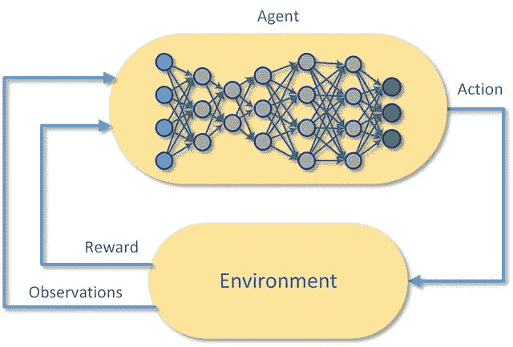
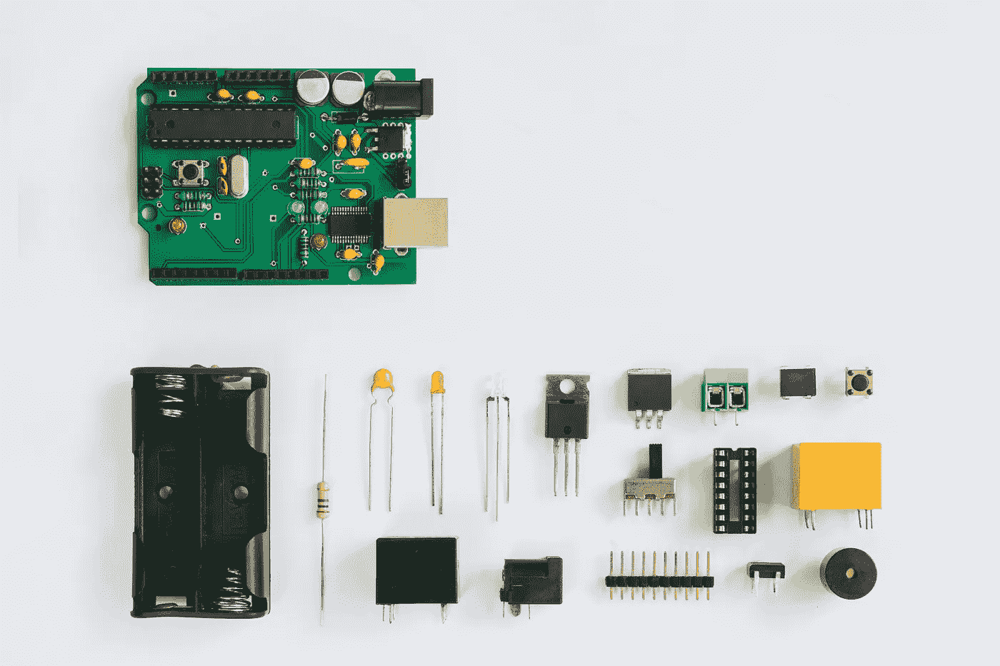
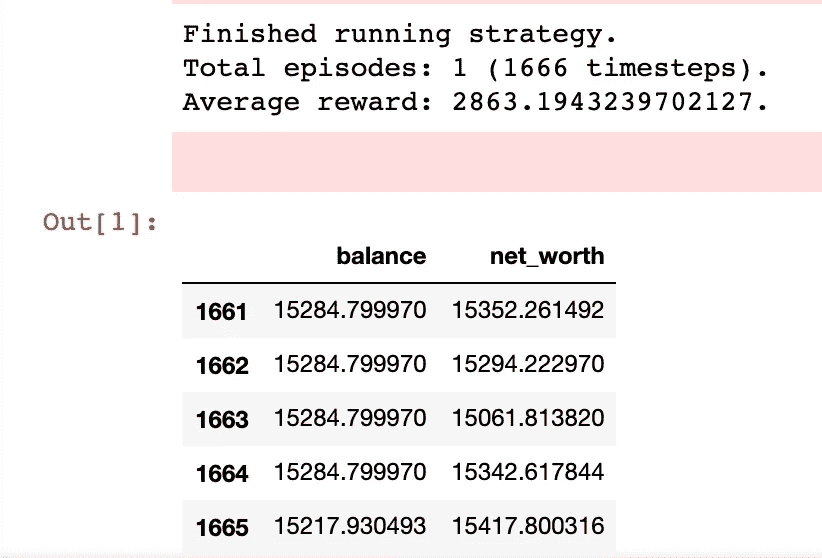
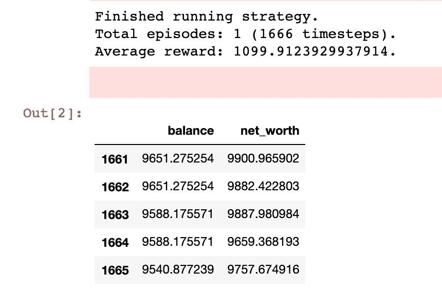
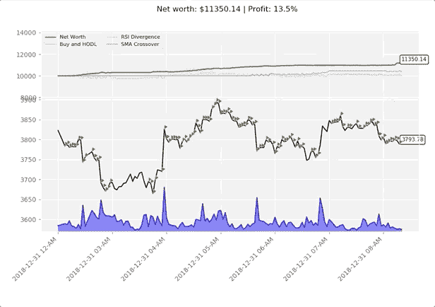
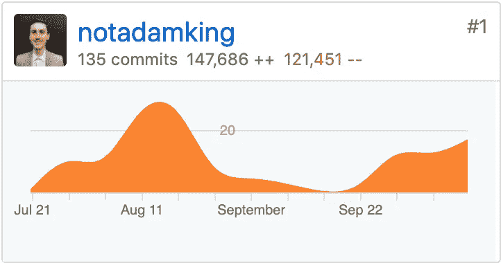

# 更明智地交易和投资——强化学习方式

> 原文：<https://towardsdatascience.com/trade-smarter-w-reinforcement-learning-a5e91163f315?source=collection_archive---------2----------------------->

## 深入探究 TensorTrade——使用深度强化学习进行交易和投资的 Python 框架


> ***注来自《走向数据科学》的编辑:*** *虽然我们允许独立作者根据我们的* [*规则和指导方针*](/questions-96667b06af5) *发表文章，但我们不认可每个作者的贡献。你不应该在没有寻求专业建议的情况下依赖一个作者的作品。详见我们的* [*读者术语*](/readers-terms-b5d780a700a4) *。*

[赢得高赌注扑克锦标赛](https://www.nature.com/articles/d41586-019-02156-9)，[击败世界级星际争霸玩家](https://deepmind.com/blog/alphastar-mastering-real-time-strategy-game-starcraft-ii/)，以及[自动驾驶特斯拉的未来跑车](https://www.tesla.com/autopilot)。他们都有什么共同点？长期以来，这些极其复杂的任务中的每一项都被认为是机器不可能完成的，直到深度强化学习的最新进展表明它们今天是可能的。

强化学习开始接管世界。


Source: [https://deepmind.com/blog/article/alphastar-mastering-real-time-strategy-game-starcraft-ii](https://deepmind.com/blog/article/alphastar-mastering-real-time-strategy-game-starcraft-ii)

两个多月前，我决定参加这场革命，于是我开始了一段旅程，利用最先进的深度强化学习算法创建一个有利可图的比特币交易策略。虽然我在这方面取得了相当大的进展，但我意识到这类项目的工具可能会令人望而生畏，因此很容易迷失在细节中。

在优化我之前的分布式高性能计算(HPC)系统项目之间；迷失在无尽的数据和功能优化管道中；围绕高效的模型建立、调整、培训和评估，我忙得团团转；我意识到一定有更好的做事方法。在对现有项目进行了无数小时的研究，花了无数个晚上观看 PyData 会议演讲，并与数百名 RL trading Discord 社区成员进行了多次来回交谈后，我意识到没有任何现有的解决方案是那么好。

互联网上散布着许多零碎的强化学习交易系统，但没有一个是完整的。出于这个原因，我决定创建一个开源的 Python 框架，使用深度强化学习，高效地将任何交易策略从想法变成产品。

输入 TensorTrade。想法是创建一个高度模块化的框架，以一种可组合、可维护的方式构建高效的强化学习交易策略。依我看，这听起来像是一大堆术语，所以让我们进入正题吧。

> **目录**

[**概述**](#85ac)

*   [RL 引物](#2b7a)
*   [入门](#7e3a)
*   [安装](#20b4)

[**TensorTrade 组件**](#9940)

*   [**交易环境**](#a323)
*   [交易所](#a178)
*   [特征管线](#02f5)
*   [行动策略](#0f23)
*   [奖励策略](#4ded)
*   [**学习代理**](#6f18)
*   [稳定基线](#8cec)
*   [张量力](#8cec)
*   [**交易策略**](#0ea3)

[](#4761)

*   **[创建环境](#d343)**
*   **[定义代理](#cde4)**
*   **[**训练一个策略**](#e048)**
*   **[**保存和恢复**](#f04b)**
*   **[调整你的策略](#d17a)**
*   **[**策略评估**](#5936)**
*   **[现场交易](#2667)**

**[**未来**](#99f2)**

*   **[最终想法](#af85)**
*   **[投稿](#6681)**
*   **[参考文献](#10c5)**

# **概观**

****

**TensorTrade 是一个开源的 Python 框架，使用深度强化学习来训练、评估和部署稳健的交易策略。该框架的重点是高度可组合和可扩展，以允许系统从单个 CPU 上的简单交易策略扩展到在分布的 HPC 机器上运行的复杂投资策略。**

**在引擎盖下，该框架使用现有机器学习库中的许多 API 来维护高质量的数据管道和学习模型。TensorTrade 的主要目标之一是通过利用由`numpy`、`pandas`、`gym`、`keras`和`tensorflow`提供的现有工具和管道，实现算法交易策略的快速试验。**

**框架的每一部分都被分割成可重用的组件，允许您利用社区构建的通用组件，同时保留您的专有特性。目的是使用深度强化学习来简化测试和部署稳健交易代理的过程，让你我专注于创造盈利策略。**

## **RL 底漆**

**如果你的强化学习技能有点生疏，让我们快速回顾一下基本概念。**

> ****强化学习** ( **RL** )是[机器学习](https://en.wikipedia.org/wiki/Machine_learning)的一个领域，涉及[软件代理](https://en.wikipedia.org/wiki/Software_agent)应该如何在一个环境中采取[行动](https://en.wikipedia.org/wiki/Action_selection)，以便最大化一些累积回报的概念。**

**每个强化学习问题都始于一个环境和一个或多个可以与环境交互的代理。**

**[](https://www.researchgate.net/publication/319121340_Enabling_Cognitive_Smart_Cities_Using_Big_Data_and_Machine_Learning_Approaches_and_Challenges)

This technique is based off Markov Decision Processes (MDP) dating back to the 1950s.** 

**代理将首先观察环境，然后建立当前状态的模型以及该环境中动作的期望值。基于该模型，代理将采取它认为具有最高期望值的行动。**

**基于所选动作在环境中的效果，代理将被奖励与该动作的实际价值相对应的金额。然后，强化学习代理可以通过试错过程(即，通过强化学习)来改进其底层模型，并随着时间的推移学习采取更有益的行动。**

**如果在这个问题上你还需要一点新鲜的东西，在这篇文章的参考资料中有一篇文章的链接，标题是*深度强化学习简介*，它更深入地介绍了细节。我们继续吧。**

## **入门指南**

**下面的教程将提供足够的例子，让你开始使用 TensorTrade 创建简单的交易策略，尽管你会很快发现这个框架能够处理更复杂的配置。**

**你可以跟随 [Google Colab](https://colab.research.google.com/drive/1hzbugXnkGWO6l3vpQ0bSqnJJxBGiogar) 或者 [Github](https://github.com/notadamking/tensortrade/blob/master/examples/TensorTrade_Tutorial.ipynb) 上的教程。**

## **装置**

**TensorTrade 需要 Python 3.6 或更高版本，所以在 pip 安装框架之前，请确保您使用的是有效版本。**

```
pip install git+https://github.com/notadamking/tensortrade.git
```

**为了完成整个教程，您需要安装一些额外的依赖项，比如`tensorflow`、`tensorforce`、`stable-baselines`、`ccxt`、`ta`和`stochastic`。**

```
pip install git+[https://github.com/notadamking/tensortrade.git#egg=tensortrade[tf,tensorforce,baselines,ccxt,ta,fbm](https://github.com/notadamking/tensortrade.git#egg=tensortrade[tf,tensorforce,baselines,ccxt,fbm)] -U
```

**这就是所有必要的安装！让我们进入代码。**

# **TensorTrade 组件**

**TensorTrade 是围绕模块化组件构建的，这些组件共同构成了交易策略。交易策略以`gym`环境的形式将强化学习代理与可组合的交易逻辑结合起来。交易环境是由一组模块组成的，这些模块可以混合和匹配，以创建高度多样化的交易和投资策略。稍后我将进一步详细解释这一点，但现在知道一些基本知识就足够了。**

****

**就像电气组件一样，TensorTrade 组件的目的是能够根据需要混合和匹配它们。**

> **本节中的代码片段应该作为创建新策略和组件的指南。随着更多组件的定义，可能会遗漏一些实现细节，这些细节将在后面的章节中变得更加清晰。**

# **贸易环境**

**交易环境是遵循 OpenAI 的`gym.Env`规范的强化学习环境。这允许我们在交易代理中利用许多现有的强化学习模型，如果我们愿意的话。**

****

**交易环境是完全可配置的`gym`环境，具有高度可组合的`Exchange`、`FeaturePipeline`、`ActionScheme`和`RewardScheme`组件。**

*   **`Exchange`提供对环境的观察并执行代理的交易。**
*   **在将交换输出传递给代理之前，`FeaturePipeline`可选地将交换输出转换成一组更有意义的特性。**
*   **`ActionScheme`将代理的行为转换成可执行的交易。**
*   **`RewardScheme`根据代理的表现计算每个时间步的奖励。**

**如果说现在看起来有点复杂，其实真的不是。这就是全部内容，现在只需要将这些组件组成一个完整的环境。**

**当`TradingEnvironment`的`reset`方法被调用时，所有的子组件也将被重置。每个交换、特性管道、变形金刚、行动方案和奖励方案的内部状态将被设置回默认值，为下一集做好准备。**

**让我们从一个示例环境开始。如前所述，初始化一个`TradingEnvironment`需要一个交换，一个行动方案，一个奖励方案，特征流水线是可选的。**

```
**from** tensortrade.environments **import** TradingEnvironmentenvironment = TradingEnvironment(exchange=exchange,
                                 action_scheme=action_scheme,
                                 reward_scheme=reward_scheme,
                                 feature_pipeline=feature_pipeline)
```

> **虽然推荐的用例是将交易环境插入到交易策略中，但是很明显，您可以单独使用交易环境，就像使用`gym`环境一样。**

## **交换**

**交易所确定交易环境中可交易工具的范围，在每个时间步将观察结果返回给环境，并在该环境中执行交易。有两种类型的交流:现场交流和模拟交流。**

**实时交易所是由实时定价数据和实时交易执行引擎支持的`Exchange`的实现。例如，`CCXTExchange`是一个实时交易所，它能够返回定价数据，并在数百个实时加密货币交易所执行交易，如[币安](https://www.binance.com/en/register?ref=PDOJ9XB8)和[比特币基地](http://coinbase-consumer.sjv.io/c/1949163/626313/9251)。**

```
**import** ccxt**from** tensortrade.exchanges.live **import** CCXTExchangecoinbase = ccxt.coinbasepro()exchange = CCXTExchange(exchange=coinbase, base_instrument='USD')
```

> **也有股票和 ETF 交易的交易所，如`RobinhoodExchange`和`InteractiveBrokersExchange`，但这些仍在进行中。**

**另一方面，模拟交易所是由模拟定价数据和交易执行支持的`Exchange`的实现。**

**例如，`FBMExchange`是一个模拟的交易所，它使用分数布朗运动(FBM)生成定价和交易量数据。因为它的价格是模拟的，所以它执行的交易也必须模拟。该交易所使用简单的滑点模型来模拟交易的价格和交易量滑点，尽管像 TensorTrade 中的几乎所有东西一样，这个滑点模型可以很容易地被更复杂的东西取代。**

```
**from** tensortrade.exchanges.simulated **import** FBMExchangeexchange = FBMExchange(base_instrument='BTC', timeframe='1h')
```

**虽然`FBMExchange`使用随机模型生成虚假的价格和交易量数据，但它只是`SimulatedExchange`的一个实现。在幕后，`SimulatedExchange`只需要一个价格历史的`data_frame`来生成它的模拟。这个`data_frame`既可以由编码实现(如`FBMExchange`)提供，也可以在运行时提供，如下例所示。**

```
**import** pandas **as** pd**from** tensortrade.exchanges.simulated **import** SimulatedExchangedf = pd.read_csv('./data/btc_ohclv_1h.csv')exchange = SimulatedExchange(data_frame=df, base_instrument='USD')
```

## **特征管线**

**特征管道意味着将来自环境的观察转换成有意义的特征，以便代理从中学习。如果一个管道已经被添加到一个特定的交换中，那么在输出到环境之前，观察结果将通过`FeaturePipeline`。例如，特性管道可以标准化所有价格值，使时间序列稳定，添加移动平均列，并删除不必要的列，所有这些都在观察结果返回给代理之前完成。**

****

**可以用任意数量的逗号分隔的转换器初始化特征管线。每个`FeatureTransformer`都需要用要转换的列集进行初始化，否则如果没有传递任何内容，所有输入列都将被转换。**

**每个特征转换器都有一个`transform`方法，该方法将从更大的数据集中转换单个观察值(a `pandas.DataFrame`),在内存中保留任何必要的状态以转换下一帧。因此，经常需要定期对`reset`和`FeatureTransformer`进行调整。每次重置父`FeaturePipeline`或`Exchange`时，这将自动完成。**

**让我们创建一个示例管道，并将其添加到现有的交换中。**

```
**from** tensortrade.features **import** FeaturePipeline
**from** tensortrade.features.scalers **import** MinMaxNormalizer
**from** tensortrade.features.stationarity **import** FractionalDifference
**from** tensortrade.features.indicators **import** SimpleMovingAverageprice_columns = ["open", "high", "low", "close"]normalize_price = MinMaxNormalizer(price_columns)
moving_averages = SimpleMovingAverage(price_columns)
difference_all = FractionalDifference(difference_order=0.6)feature_pipeline = FeaturePipeline(steps=[normalize_price,
                                          moving_averages,
                                          difference_all])exchange.feature_pipeline = feature_pipeline
```

> **此功能管道在添加一些移动平均列并通过连续值的微小差异使整个时间序列平稳之前，将价格值标准化为 0 到 1 之间。**

## **行动计划**

**行动方案定义了环境的行动空间，并将代理的行动转换成可执行的交易。例如，如果我们使用 3 个动作的离散动作空间(0 = `hold`，1 = `buy 100%`，2 = `sell 100%`)，我们的学习代理不需要知道返回一个动作 1 等同于购买一个乐器。相反，我们的代理需要知道在特定情况下返回动作 1 的回报，并且可以将动作转换为交易的实现细节留给`ActionScheme`。**

**每个动作方案都有一个`get_trade`方法，它会将代理的指定动作转化为可执行的`Trade`。通常需要在方案中存储额外的状态，例如跟踪当前交易的头寸。每次调用动作方案的`reset`方法时都应该重置该状态，这是在重置父`TradingEnvironment`时自动完成的。**

```
**from** tensortrade.actions **import** DiscreteActionsaction_scheme = DiscreteActions(n_actions=20,      
                                instrument_symbol='BTC')
```

> **该离散动作方案使用 20 个离散动作，相当于 5 种交易类型(市场买入/卖出、限价买入/卖出和持有)中每种交易类型的 4 个离散金额。例如[0，5，10，15]= `hold`，1= `market buy 25%`，2= `market sell 25%`，3= `limit buy 25%`，4= `limit sell 25%`，6= `market buy 50%`，7= `market sell 50%`等…**

## **奖励计划**

**奖励方案接收在每个时间步进行的交易，并返回一个`float`，对应于特定行动的收益。例如，如果这一步采取的行动是导致正利润的出售，我们的`RewardScheme`可以返回一个正数，以鼓励更多这样的交易。另一方面，如果行动是导致损失的销售，该方案可以返回负奖励，以教导代理人在未来不要做出类似的行动。**

**该示例算法的一个版本在`SimpleProfit`组件中实现，然而显然可以使用更复杂的策略来代替。**

**每个奖励方案都有一个`get_reward`方法，它接受在每个时间步执行的交易，并返回一个与该动作的*值*相对应的浮点数。与动作方案一样，出于各种原因，经常需要在奖励方案中存储附加状态。每次调用奖励方案的`reset`方法时都应该重置该状态，这是在重置父`TradingEnvironment`时自动完成的。**

```
**from** tensortrade.rewards **import** SimpleProfitreward_scheme = SimpleProfit()
```

> **简单利润方案返回的回报为-1 表示不持有交易，1 表示持有交易，2 表示购买工具，如果出售工具，则对应于交易所得(正/负)利润的值。**

# **学习代理**

**到目前为止，我们还没有看到深度强化学习框架的“深度”部分。这就是学习代理的用武之地。学习代理是数学(阅读:魔术)发生的地方。**

****

**在每个时间步，代理将来自环境的观察作为输入，通过其底层模型(大部分时间是神经网络)运行它，并输出要采取的行动。例如，观察值可能是交易所以前的开盘价、最高价、最低价和收盘价。学习模型将这些值作为输入，并输出对应于要采取的动作的值，例如购买、出售或持有。**

**重要的是要记住，学习模型对这些值所代表的价格或交易没有直觉。相反，该模型只是学习对于特定的输入值或输入值序列输出哪些值，以获得最高的回报。**

## **[稳定基线](https://stable-baselines.readthedocs.io/en/master)**

**在本例中，我们将使用[稳定基线](https://stable-baselines.readthedocs.io/en/master)库为我们的交易策略提供学习代理，然而，TensorTrade 框架与许多强化学习库兼容，如 [Tensorforce](https://tensorforce.readthedocs.io/en/0.4.4) 、 [Ray 的 RLLib](https://ray.readthedocs.io/en/latest/rllib.html) 、 [OpenAI 的基线](https://github.com/openai/baselines)、[英特尔的蔻驰](https://github.com/NervanaSystems/coach)，或 TensorFlow 系列中的任何库，如 [TF 代理](https://github.com/tensorflow/agents)。**

**自定义 TensorTrade 学习代理可能会在未来添加到该框架中，尽管该框架的目标始终是与尽可能多的现有强化学习库进行互操作，因为该领域有如此多的并发增长。**

**但是现在，稳定的基线对于我们的需求来说足够简单和强大。**

```
**from** stable_baselines.common.policies **import** MlpLnLstmPolicy
**from** stable_baselines **import** PPO2model = PPO2
policy = MlpLnLstmPolicy
params = { "learning_rate": 1e-5 }agent = model(policy, environment, model_kwargs=params)
```

> **注意:使用 TensorTrade 并不需要稳定的基线，尽管在本教程中它是必需的。这个例子使用了一个支持 GPU 的近似策略优化模型和一个层标准化的 LSTM 感知器网络。如果您想了解更多关于稳定基线的信息，您可以查看[文档](https://stable-baselines.readthedocs.io/en/master/)。**

**[**张量力**](https://tensorforce.readthedocs.io/en/0.4.4)**

**我还将快速介绍一下 [Tensorforce](https://tensorforce.readthedocs.io/en/0.4.4) 库，以展示在强化学习框架之间切换是多么简单。**

```
**from** tensorforce.agents **import** Agentagent_spec = {
    "type": "ppo_agent",
    "step_optimizer": {
        "type": "adam",
        "learning_rate": 1e-4
    },
    "discount": 0.99,
    "likelihood_ratio_clipping": 0.2,
}network_spec = [
    dict(type='dense', size=64, activation="tanh"),
    dict(type='dense', size=32, activation="tanh")
]agent = Agent.from_spec(*spec*=agent_spec,
                        *kwargs*=*dict*(*network*=network_spec,
                                    *states*=environment.states,
                                    *actions*=environment.actions))
```

> **如果你想了解更多关于 Tensorforce 代理的信息，你可以查看[文档](https://tensorforce.readthedocs.io/en/0.4.4)。**

# **交易策略**

**一个`TradingStrategy`由一个学习代理和一个或多个交易环境组成，用于调整、训练和评估。如果只提供一个环境，它将用于调优、培训和评估。否则，可以在每个步骤提供单独的环境。**

```
**from** tensortrade.strategies **import** TensorforceTradingStrategy,
                                   StableBaselinesTradingStrategya_strategy = TensorforceTradingStrategy(environment=environment,
                                        agent_spec=agent_spec,
                                        network_spec=network_spec)b_strategy = StableBaselinesTradingStrategy(environment=environment,
                                            model=PPO2,
                                            policy=MlpLnLSTMPolicy)
```

> **如果您还不理解策略初始化，请不要担心，稍后会有更详细的解释。**

# **把所有的放在一起**

**现在我们知道了组成`TradingStrategy`的每个组件，让我们构建并评估一个组件。**

****

**简单回顾一下，`TradingStrategy`由`TradingEnvironment`和学习代理组成。一个`TradingEnvironment`是一个`gym`环境，它接受一个`Exchange`、一个`ActionScheme`、一个`RewardScheme`和一个可选的`FeaturePipeline`，并返回观察结果和奖励，学习代理可以在这些观察结果和奖励上进行培训和评估。**

## **创造环境**

**第一步是使用上面概述的组件创建一个`TradingEnvironment`。**

```
**from** tensortrade.exchanges.simulated **import** FBMExchange
**from** tensortrade.features.scalers **import** MinMaxNormalizer
**from** tensortrade.features.stationarity **import** FractionalDifference
**from** tensortrade.features **import** FeaturePipeline
**from** tensortrade.rewards **import** SimpleProfit
**from** tensortrade.actions **import** DiscreteActions
**from** tensortrade.environments **import** TradingEnvironmentnormalize_price = MinMaxNormalizer(["open", "high", "low", "close"])
difference = FractionalDifference(difference_order=0.6)
feature_pipeline = FeaturePipeline(steps=[normalize_price, 
                                          difference])exchange = FBMExchange(timeframe='1h',
                       base_instrument='BTC',
                       feature_pipeline=feature_pipeline)reward_scheme = SimpleProfit()action_scheme = DiscreteActions(n_actions=20, 
                                instrument_symbol='ETH/BTC')environment = TradingEnvironment(exchange=exchange,
                                 action_scheme=action_scheme,
                                 reward_scheme=reward_scheme,
                                 feature_pipeline=feature_pipeline)
```

**很简单，现在`environment`是一个`gym`环境，可以被任何兼容的交易策略或学习代理使用。**

## **定义代理**

**既然环境已经设置好了，是时候创建我们的学习代理了。同样，我们将为此使用稳定的基线，但也可以在这里随意添加任何其他强化学习代理。**

**由于我们使用的是`StableBaselinesTradingStrategy`，所以我们需要做的就是为要训练的底层神经网络提供模型类型和策略类型。对于这个例子，我们将使用一个简单的近似策略优化(PPO)模型和一个层标准化的 LSTM 策略网络。**

**有关模型和策略规范的更多示例，请参见稳定基线[文档](https://stable-baselines.readthedocs.io/en/master)。**

```
**from** stable_baselines.common.policies **import** MlpLnLstmPolicy
**from** stable_baselines **import** PPO2model = PPO2
policy = MlpLnLstmPolicy
params = { "learning_rate": 1e-5 }
```

## **训练策略**

**创建我们的交易策略就像插入我们的代理和环境一样简单。**

```
**from** tensortrade.strategies **import** StableBaselinesTradingStrategystrategy = StableBaselinesTradingStrategy(environment=environment,
                                          model=model,
                                          policy=policy,
                                          model_kwargs=params)
```

**然后，为了训练策略(即，在当前环境下训练代理)，我们需要做的就是调用`strategy.run()`并告知您想要运行的步骤或剧集的总数。**

```
performance = strategy.run(steps=100000,
                           episode_callback=stop_early_callback)
```

**瞧啊。三个小时和数以千计的打印报表后，你会看到你的代理如何做的结果！**

**如果这个反馈循环对你来说有点慢，可以给`run`传递一个回调函数，每集结束时都会调用。回调函数将传入一个包含代理在那一集的表现的数据帧，并期待一个`bool`作为返回。如果`True`，代理将继续培训，否则，代理将停止并返回其整体绩效。**

****

**A simple performance output at the end of the episode, including the final 5 balances and net worths of the agent.**

## **保存和恢复**

**所有的交易策略都能够将它们的代理保存到一个文件中，以便以后恢复。环境没有被保存，因为它没有我们关心保存的状态。为了将我们的`TensorflowTradingStrategy`保存到一个文件中，我们只需要将文件的`path`提供给我们的策略。**

```
strategy.save_agent(path="../agents/ppo_btc_1h")
```

**为了从文件中恢复代理，在调用`restore_agent`之前，我们首先需要实例化我们的策略。**

```
**from** tensortrade.strategies **import** StableBaselinesTradingStrategystrategy = StableBaselinesTradingStrategy(environment=environment,
                                          model=model,
                                          policy=policy,
                                          model_kwargs=params)strategy.restore_agent(path="../agents/ppo_btc/1h")
```

**我们的策略现在恢复到了之前的状态，并准备再次使用。**

## **调整您的策略**

**有时，交易策略需要在一个环境中调整一组超参数或特征，以达到最佳性能。在这种情况下，每个`TradingStrategy`提供一个可选的可实现的`tune`方法。**

**调整模型类似于训练模型，但是除了调整和保存最佳执行模型的权重和偏差之外，该策略还调整和保持产生该模型的超参数。**

```
**from** tensortrade.environments **import** TradingEnvironment
**from** tensortrade.exchanges.simulated **import** FBMExchangeexchange = FBMExchange(timeframe='1h',
                       base_instrument='BTC',
                       feature_pipeline=feature_pipeline)environment = TradingEnvironment(exchange=exchange,
                                 action_scheme=action_scheme,
                                 reward_scheme=reward_scheme)strategy.environment = environmenttuned_performance = strategy.tune(episodes=10)
```

> **在这种情况下，代理将被训练 10 集，每集有一组不同的超参数。最佳设置将保存在策略中，并在此后调用`strategy.run()`时使用。**

## **战略评估**

**现在我们已经调优并训练了我们的代理，是时候看看它的表现如何了。为了评估我们的策略在看不见的数据上的性能，我们需要在这样的数据支持的新环境上运行它。**

```
**from** pandas **import** pd**from** tensortrade.environments **import** TradingEnvironment
**from** tensortrade.exchanges.simulated **import** SimulatedExchangedf = pd.read_csv('./btc_ohlcv_1h.csv')exchange = SimulatedExchange(data_frame=df, 
                             base_instrument='BTC',
                             feature_pipeline=feature_pipeline)environment = TradingEnvironment(exchange=exchange,
                                 action_scheme=action_scheme,
                                 reward_scheme=reward_scheme)strategy.environment = environmenttest_performance = strategy.run(episodes=1, testing=True)
```

**完成后，`strategy.run`返回代理绩效的 Pandas 数据框架，包括代理在每个时间步的净值和余额。**

****

**Example evaluation performance — this agent has not been trained on this feature set, so performance is arbitrary.**

## **现场交易**

**一旦你建立了一个有利可图的交易策略，训练了一个代理来正确交易它，并确保它对新数据集的“泛化能力”，剩下要做的就是盈利。使用像`CCXTExchange`这样的实时交流，你可以插入你的策略并让它运行！**

****

**虽然你可能喜欢开始一个策略，并让它无限制地运行，但你可以使用一个`trade_callback`，它将在每次策略交易时被调用。这个回调函数类似于剧集回调，将传入一个包含代理整体表现的数据帧，并期望得到一个`bool`作为回报。如果`True`，代理将继续交易，否则，代理将停止交易并返回其在整个交易期间的表现。**

```
**import** ccxt**from** tensortrade.environments **import** TradingEnvironment
**from** tensortrade.strategies **import** StableBaselinesTradingStrategy
**from** tensortrade.exchanges.live **import** CCXTExchangecoinbase = ccxt.coinbasepro(...)exchange = CCXTExchange(exchange=coinbase,
                        timeframe='1h',
                        base_instrument='USD', 
                        feature_pipeline=feature_pipeline)environment = TradingEnvironment(exchange=exchange,
                                 action_scheme=action_scheme,
                                 reward_scheme=reward_scheme)strategy.environment = environmentstrategy.restore_agent(path="../agents/ppo_btc/1h")*live_performance = strategy.run(steps=0, trade_callback=episode_cb)*
```

> **通过`steps=0`指示策略运行，直到停止。**

**这就是全部了！正如你所看到的，使用简单的组件和深度强化学习来构建复杂的交易策略是非常简单的。你还在等什么？投入其中，亲自动手，看看使用 TensorTrade 能做些什么。**

# **未来**

**目前，该框架正处于早期阶段。到目前为止，重点是获得一个工作原型，具有创建高利润战略所需的所有必要构件。下一步是构建未来的路线图，并决定哪些即将到来的构件对社区是重要的。**

**很快，我们将看到框架中增加了高度信息化的可视化环境，以及更多交易所、交易更多工具的更深入的策略。**

****

**An example environment visualization, created in a [previous article](/using-reinforcement-learning-to-trade-bitcoin-for-massive-profit-b69d0e8f583b).**

**天空是极限。基础(即框架)已经奠定，现在要由社区来决定下一步做什么。我希望你能成为其中的一员。**

## **最后的想法**

**TensorTrade 是一个强大的框架，能够构建高度模块化、高性能的交易系统。尝试新的交易和投资策略是相当简单和容易的，同时允许你在另一个策略中利用一个策略的成分。但不要相信我的话，创建一个自己的策略，并开始教你的机器人接管世界！**

**虽然这个教程应该足以让你开始，但如果你想创造一个有利可图的交易策略，还有很多东西要学。我鼓励你去 [Github](https://github.com/notadamking/tensortrade) 看看代码库，或者看看我们在 tensortrade.org[的文档。还有一个相当活跃的](https://tensortrade.org) [Discord 社区](https://discord.gg/ZZ7BGWh)，共有近 1000 名成员，所以如果你有问题、反馈或功能请求，请随时在那里提出！**

****

**This is my GitHub commit history for the TensorTrade framework — you could say I’ve been busy.**

**我已经让这个项目达到了高度可用的状态。不过，我的时间有限，我相信你们中有很多人可以为开源代码库做出有价值的贡献。因此，如果你是一个对构建最先进的交易系统感兴趣的开发人员或数据科学家，我希望看到你打开一个拉请求，即使它只是一个简单的测试案例！**

## **贡献的**

**其他人问他们如何在不写代码的情况下为项目做贡献。目前有三种方法可以做到这一点。**

1.  **为 TensorTrade 框架编写代码或文档。 [Github](https://github.com/notadamking/tensortrade) 上的许多问题都是通过 [Gitcoin 智能合约](https://gitcoin.co/profile/notadamking/active)资助的，所以你可以通过贡献获得报酬。迄今为止，社区捐赠的近 10 ETH(～2000 美元)已经用于支付开源开发者对框架的贡献。**
2.  **用[比特币](https://www.blockchain.com/btc/address/1Lc47bhYvdyKGk1qN8oBHdYQTkbFLL3PFw)或[以太坊](https://www.blockchain.com/eth/address/0x9907A0cF64Ec9Fbf6Ed8FD4971090DE88222a9aC)资助这个项目。这些捐赠用于资助我们的 [Gitcoin 智能合同](https://gitcoin.co/profile/notadamking/active)，它允许任何贡献优质代码和文档的人获得报酬。**
3.  **在 Github 上赞助我。Github 目前正在 1:1 匹配所有捐款，最高可达 5000 美元，因此这是赞助我的工作和 TensorTrade 发展的最佳时机。所有的赞助都直接用于资助框架的开源开发。**

***感谢阅读！一如既往，本教程的所有代码都可以在我的* [*GitHub*](https://github.com/notadamking/tensortrade) *上找到。如果您有任何问题或反馈，请在下面留下评论，我很乐意收到您的来信！我也可以通过@notadamking 上的*[*Twitter*](https://twitter.com/notadamking)*联系到。***

***你也可以通过下面的链接在* [*Github 赞助商*](https://github.com/users/notadamking/sponsorship) *或者*[*Patreon*](https://www.patreon.com/join/notadamking)*上赞助我。***

**[](https://github.com/users/notadamking/sponsorship) [## GitHub 赞助商

### 嗨，我是亚当。我是一名开发人员、作家和企业家，尤其对深度…

github.com](https://github.com/users/notadamking/sponsorship) [](https://patreon.com/notadamking) [## 亚当·金正在创造改变世界的内容

### 嗨，我是亚当。我是一名开发人员、作家和企业家，尤其对深度…

patreon.com](https://patreon.com/notadamking) 

## 参考

*   **【1。】深度强化学习介绍**惠，乔纳森。" RL-深度强化学习入门."*中*2019 年 1 月 7 日[https://Medium . com/@ Jonathan _ hui/rl-introduction-to-deep-reinforcement-learning-35 c 25 e04c 199。](https://medium.com/@jonathan_hui/rl-introduction-to-deep-reinforcement-learning-35c25e04c199.)
*   **【2。]政策梯度算法**
    翁，李莲。“政策梯度算法。”*Lil ' log*2018 年 4 月 8 日[https://lilian Weng . github . io/Lil-log/2018/04/08/policy-gradient-algorithms . html #加强。](https://lilianweng.github.io/lil-log/2018/04/08/policy-gradient-algorithms.html#reinforce.)
*   **【3。]干净的代码:敏捷软件技术手册**
    [马丁，罗伯特 C. *干净的代码:敏捷软件技术手册*。普伦蒂斯霍尔，2010 年](https://amzn.to/2XANX1X)。
*   **【4。]金融机器学习进展** [普拉多马科斯 Ló pez de。*金融机器学习的进展*。威利，2018](https://amzn.to/2J6YCrW) 。**