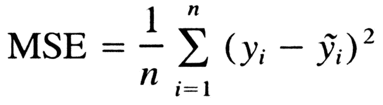
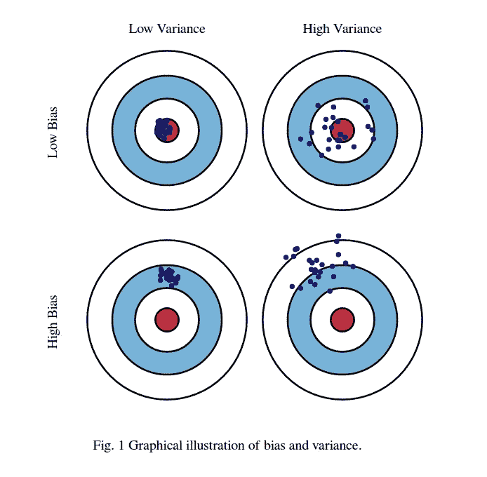

# 权衡:偏差还是差异

> 原文：<https://towardsdatascience.com/tradeoff-bias-or-variance-1409eec38caf?source=collection_archive---------16----------------------->

Photo by [Afif Kusuma](https://unsplash.com/@javaistan?utm_source=medium&utm_medium=referral) on [Unsplash](https://unsplash.com?utm_source=medium&utm_medium=referral)

# 什么是偏差方差权衡？

我从小就喜欢射箭。也许是因为我是一个历史迷，或者是因为这是一项优雅而危险的运动。射箭与偏差和方差权衡有什么关系？

上图展示了一个很好的例子。如果我们想象一个射手射击一个目标，他们击中靶心的能力证明了他们的准确性。然而，能够反复击中靶心向我们展示了精确性。我不知道你怎么想，但如果我在战争中，我会希望我的小队精确无误，能够在不同的场景和环境中多次击中目标，而不是让一个士兵一生中只有一次运气好，击中了靶心。

精确是我们构建和微调模型的目标。

B ias 方差权衡是数据科学家在开发有效和有用的模型时面临的一个非常真实和常见的问题。当谈到偏差方差权衡时，我们只是在谈论我们的模型对看不见的数据执行的灵活性。

等等！在我们前进之前，我们需要知道如何测量偏差和方差。这就是均方差(MSE)发挥作用的时候。

[source](https://www.freecodecamp.org/news/machine-learning-mean-squared-error-regression-line-c7dde9a26b93/)

MSE 是我们的预测值和真实值之间的均方差。这将为我们提供一种方法来观察我们的模型是具有高方差还是低方差。那么 MSE 如何向我们展示模型是否表现良好呢？当我们的模型表现良好时，我们的 MSE 将会很低，这表明我们的预测非常接近真实值。否则我们的 MSE 会很大，表明我们的预测与真实值不太接近。重要的是要记住 MSE 总是正的，数字越小越好。本质上，我们使用 MSE 来确定模型有效预测未知数据的能力。

# 偏差和方差

好吧！现在我们已经有了 MSE，让我们来谈谈偏差和方差。

什么是偏见？

B ias 是我们的预测值和真实值之间的平均差值。我们应该将偏差视为准确性，它是指测量值与标准值或已知值的接近程度。这就好比一个弓箭手射中了靶心。虽然这似乎是任何数据科学家都想努力实现的目标，但高偏见实际上可能会伤害我们。它对特定数据的定制非常严格，当处理稍有不同的数据时，它不知道该怎么办。高偏差将导致我们的模型对看不见的数据预测不佳。我们的目标是降低训练数据的偏差，以便我们的模型能够更好地预测其他数据。

什么是方差？

方差是我们模型中的变化量。它表明了我们的模型概括数据的能力。我更愿意将此视为精度，或者两个或多个测量值相互之间的接近程度和频率。偏差是精确的，方差是精确的或能够重复预测分布中的值。

[source](https://nealanalytics.com/wp-content/uploads/2016/11/)

# 权衡

如果我们认为偏差是准确的能力，方差是精确的能力，我们可以保证我们会有一个好的模型。我们这样做的方式被称为偏差方差权衡。我们正在做的是调整我们的模型，使我们的训练数据得分 MSE 接近我们的测试数据得分 MSE。如果在我们的训练或测试数据中，我们有 MSE 值不接近的分数，那么我们需要权衡。当我们说“权衡”时，我们指的是参数调整，我们在偏差和方差之间“交易”。当我们有很多参数时，我们的模型在预测时会变得过于复杂、低效和不精确。当我们减少我们的模型用于生成预测的参数数量，以便我们的训练和测试 MSE 分数将更接近值时，就会出现权衡。然而，我们不希望我们的模型变得过于简单，否则我们最终会得到如上图所示的低偏差高方差的情况。

一个弓箭手想要磨练技能，让他们以最高的效率和效力射箭。然而，射手需要在某些方面做出妥协，才能有效地发挥作用。例如，灵巧和力量是重要的，但是过度补偿其中任何一个都会影响射手反复击中目标的能力。弓箭手想要流畅的拉和放，所以拉弓弦所需的力量就是所有需要的力量。

作为数据科学家，我们必须使用我们的判断和直觉来为我们的模型确定一个可接受的平衡。我们必须在可用的参数中进行选择，这样我们可以降低模型的复杂性，但不会剥夺模型有效执行的能力。因此，在我们的模型中，我们希望平衡参数与它对我们想要预测的值的重要性之间的关系。

# TLDR

本文旨在帮助更好地理解什么是偏差和方差权衡，以及为什么它很重要。要吸收的信息很多，但是简短而甜蜜的可以用记住这四个要点来概括。

*   偏差:模型预测 Y 的好坏
*   方差:模型概括数据的好坏程度
*   随着偏差减少，方差增加
*   调整我们的参数将帮助我们平衡我们的模型分数