# 美联储会议纪要的交易信号？

> 原文：<https://towardsdatascience.com/trading-signal-from-fed-minutes-4c2def891134?source=collection_archive---------24----------------------->

## 即使延迟 3 周，美联储会议纪要还能成为交易信号吗？

社交网络情绪以及新闻情绪已经被广泛用于实时驱动市场运动。数十家公司已经建立了用于交易目的的实时情绪分析 feed。然而，我发现在分析美联储 FOMC(联邦公开市场委员会)会议记录时有一个缺口。


# 背景

FOMC 是美联储中负责直接与市场打交道的部门。当美联储想要实施 QE(量化宽松)时，实际操作的是 FOMC。有了如此强大的支持，市场先生密切关注每次会议的新闻稿也就不足为奇了。然而,“市场先生”对美联储操作的反应最多只有几天，他失去了记忆，转而关注非农就业数据、PMI、GDP 等。

美联储负责两个重要目标

*   将通货膨胀率保持在目标水平(2%)
*   最大化就业率

这些目标对经济有长期影响。然后，我开始怀疑 FOMC 会议纪要中的情绪实际上是否对经济有更长期的影响。

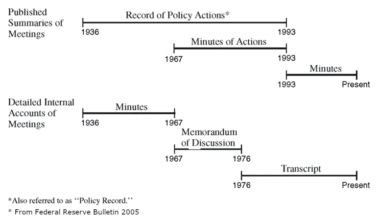

FOMC 会议召开后，会产生三个关键文件，会议记录和文字记录。当会议在日**结束时，一份**声明**([2019 年 9 月](https://www.federalreserve.gov/newsevents/pressreleases/monetary20190918a.htm))发布，这是市场先生对 FOMC 的任何行动/不行动做出反应和调整的时候。**三周后**，会议纪要( [Sep 2019](https://www.federalreserve.gov/monetarypolicy/fomcminutes20190918.htm) )发布，包括会议期间的一些关键讨论。而**五年后**，FOMC 会议的完整抄本([2013 年 12 月](https://www.federalreserve.gov/monetarypolicy/files/FOMC20131218meeting.pdf))将会发布。**

当我看这三份文件时，新闻声明太短，很容易用人工分析。它没有给出为什么得出这个结论的背景。完整的记录是在第一次会议后的 5 年后。考虑到整个经济周期只持续 5 年左右。很难想象它作为交易信号会有多大价值。这让我仔细看了一下会议记录。

# 把会议记录排好

通过回顾所有会议记录的完整历史，我发现 FOMC 最初的会议记录确实非常短，其中许多会议记录的长度与当前的新闻稿相似。看看这份 1937 年 6 月的 FOMC 会议记录。

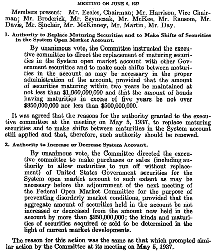

早些年，它们只有 PDF 格式，所以我使用 Tika-python(包装 Tesseract OCR)从 PDF 中提取文本。首先，我绘制了所有会议记录的平均字数和平均句子数。会议记录可以追溯到 1936 年，但我发现它提供的信息不多，所以被忽略了。正如我们所见，随着时间的推移，美联储变得非常罗嗦，特别是在 2008 年次贷危机之后。


然后，我使用了一个快速情感分析库 TextBlob 来快速检查它是否随时间波动足够大。根据之前的文本分析经验，专业文章往往在情绪上有小的变化。

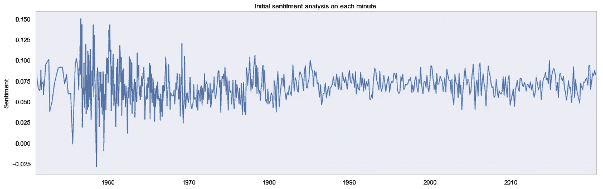

在这里，我绘制了每一分钟的原始情绪。我们可以看到，纪要字数在 2500 以下或者 1970 年以前的，情绪是很嘈杂的。我们可以看到，情绪的整体范围很小，在 0.05 和 0.1 之间波动，而整个范围是-1 和 1。在这种原始情绪下，图表非常嘈杂，很难观察到任何总体趋势。因此，我设置了一个 10 分钟的滚动窗口，计算他们的情绪均值。

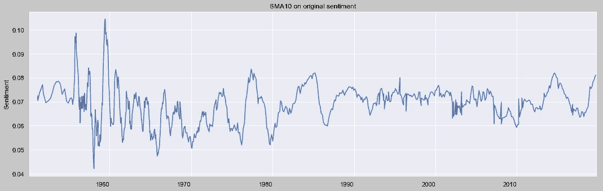

随着我们消除情绪中的噪音，一些有趣的趋势出现了。我们可以看到一些明显的趋势。1973 年和 1979 年的石油危机已经在市场情绪中得到反映，次贷危机也是如此。

我们可以看到原文中有很多杂音，这是因为与政策无关的文字破坏了统计数据。这可能是会议的与会者名单、投票说明等。因此，我使用了路标，让我们只关注政策文本。(参见黄色高亮部分)

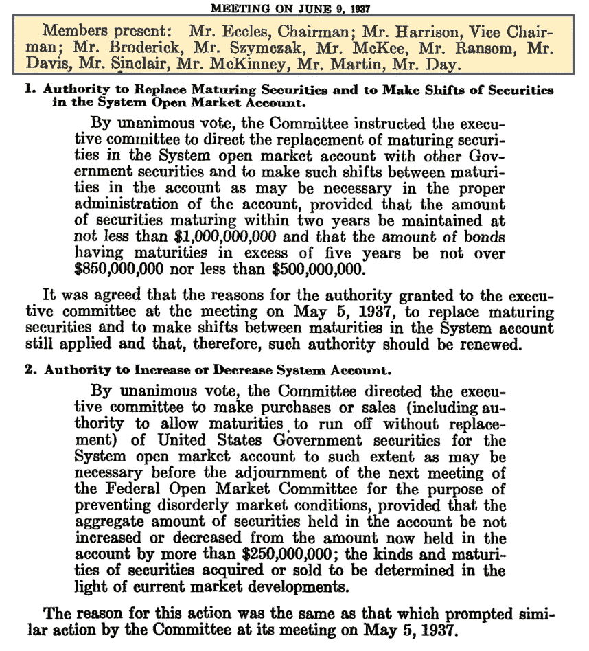

在文本裁剪之后，已经执行了标准的 NLP 预处理工作，如词汇化，这导致情感的更平滑的结果。

# 装满市场

我用标准普尔 500 作为一般市场的代表，因为它覆盖了广泛的行业，不像道琼斯和纳斯达克。感谢雅虎！金融，我能够加载它的日常历史追溯到 1950 年(部分原因是我从 1950 年开始分析)。

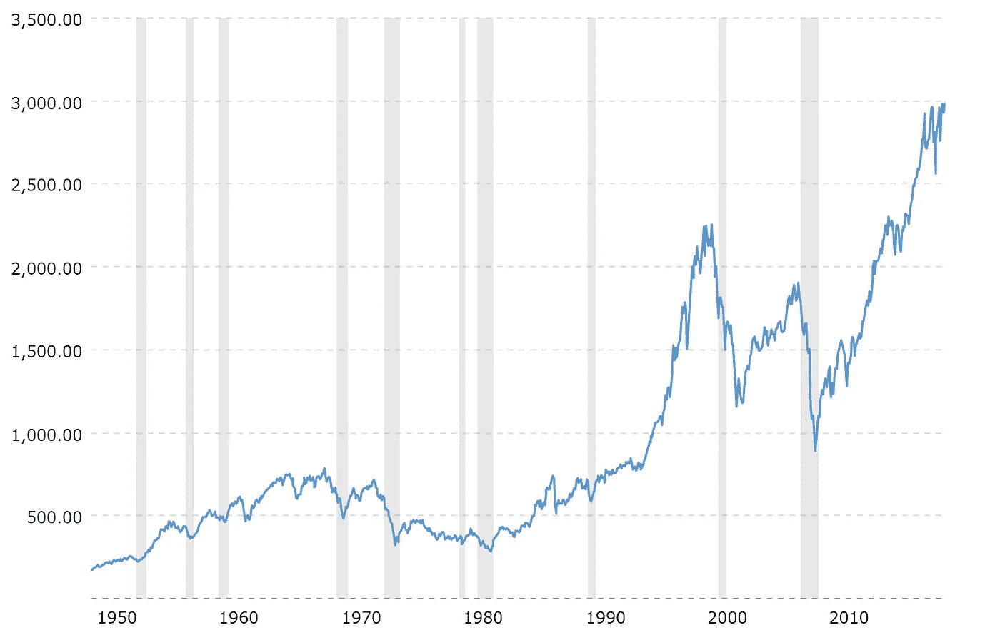

[https://www.macrotrends.net/2324/sp-500-historical-chart-data](https://www.macrotrends.net/2324/sp-500-historical-chart-data)

然而，我们只对任何给定日期后的短期回报感兴趣。最好的替代方法是使用一段时间内每日回报的累积积。下图显示了平滑情绪与过去 200 个交易日(一年大约 250 天)的累计回报。这两者之间似乎有某种关联。

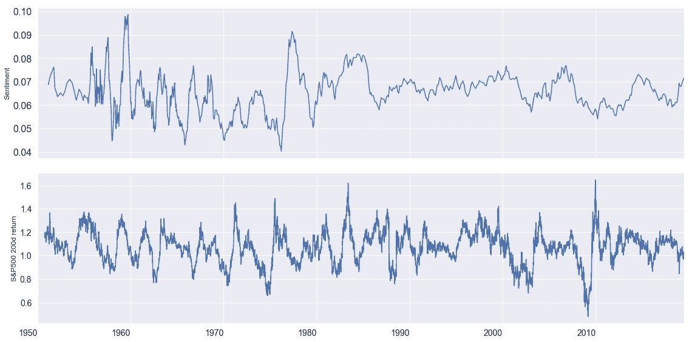

在我们进行进一步的分析之前，我们可能想改变一下我们用来分析金融文本的字典。因为 TextBlob 中包含的模式库主要来源于互联网、新闻和社交网络。它可能不是金融文本分析的最佳库。有一个图书馆叫《拉夫兰和麦克唐纳词典》，是从美国 10K 年度报告中摘录的。在这种情况下，它可能是一个更相关的库，市场之间的相关性与它相符。

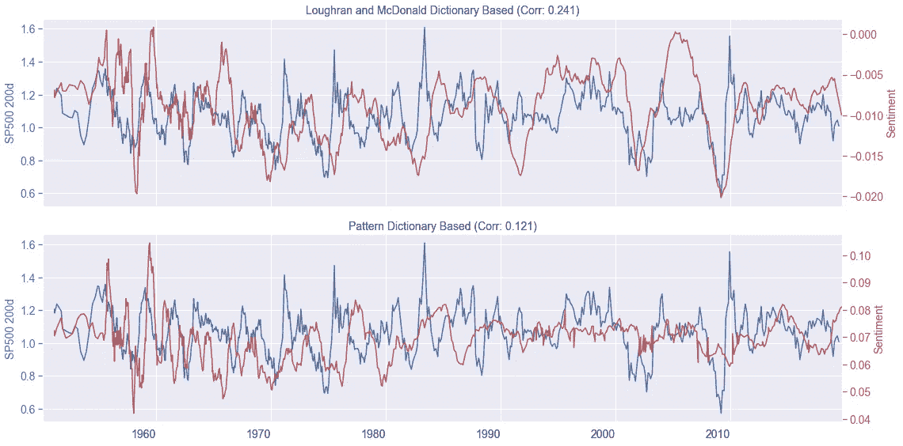

为了形象化，我想立刻说出情绪是否与市场相关。此外，我想将市场向前和向后移动，以检查移动后的相关性。这将告诉我信号是领先还是落后于市场。

为了实现这一目标，我们需要将时间序列移动多个步骤，并绘制许多图表，这些图表看起来可能会让人不知所措。

这个助手方法通过将市场来回移动多个步骤并重新计算两个时间序列之间的相关性来解决这个问题。在这样做的同时，我们还计算了它需要的 p 值，以使相关性具有统计显著性。因此，此图结合了三个不同的图表。

1.  标准普尔 500 回报叠加美联储情绪(上图)
2.  移动市场 ***N*** 步后，标准普尔 500 和美联储情绪之间的相关性(下图蓝色柱线)
3.  具有统计意义的相关 p 值。如果红色柱高于蓝色柱，这意味着相关性太低，没有统计学意义。(在下面用红色条标出)

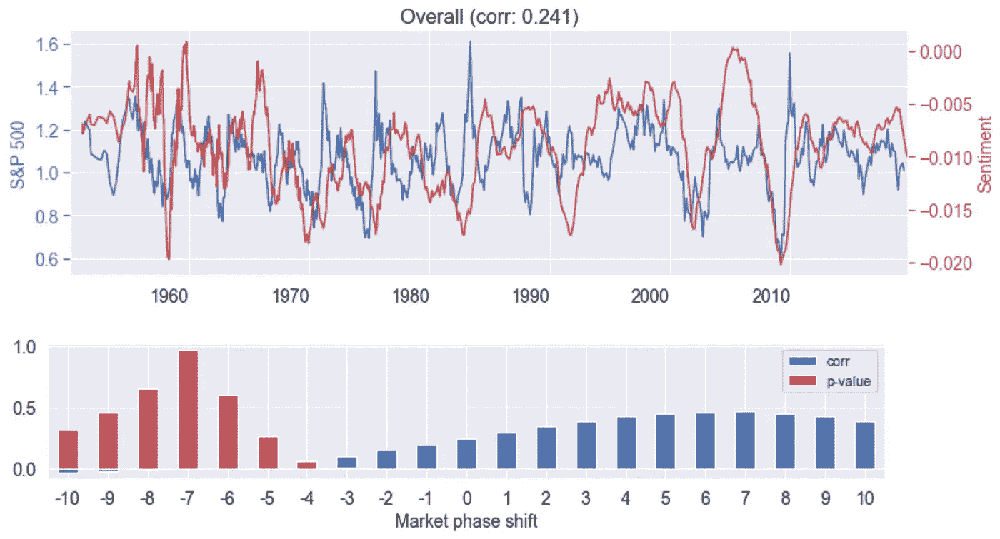

在这种特殊情况下，我们可以立即看出，与市场相比，情绪是一个滞后的指标。在市场延迟 5 个周期后，相关性达到稳定。换句话说，会议纪要中的情绪需要大约 6 -7 个月的延迟才能完全适应市场的反应。基于这一点，我们可以说市场确实非常有效。

# 我们能做得更好吗？

看到情绪不是市场的领先指标，令人非常失望，但并不令人惊讶。让我们拿出 NLP 处理中的一把更大的枪——LDA(潜在狄利克雷分配)，主题抽取模型。它允许我们基于单词袋方法提取抽象概念。

最初，我们在文章和它的单词包之间有一个映射。

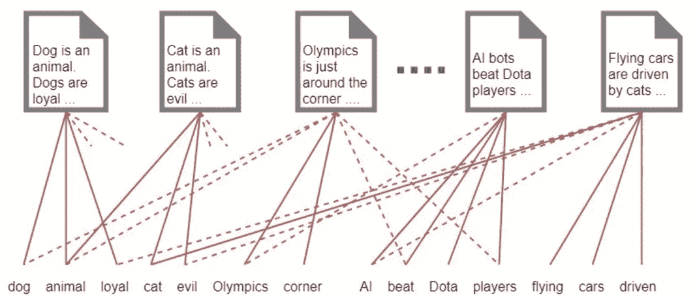

Can’t remember where I got this from, but it’s really nice illustration!

LDA 允许我们指定我们认为有多少主题。它试图在单词和我们的文章之间插入一个额外的层，以降低文章和单词之间的连接复杂性。


因此，这创造了一些抽象的概念，将相关的单词分组到主题中。这些主题中的每一个都可以计算为不同单词的权重之和。例如，主题可以表述为:

> 0.047*“利率”+ 0.024*“市场”+ 0.016*“期限”+ 0.015*“下降”+ 0.015*“国库券”+ 0.014*“利息”

现在的问题变成了，我如何决定我应该使用多少主题。虽然 LDA 能够创建主题，但它并不真正了解每个主题是关于什么的。在这里，我使用 pyLDAvis 库来可视化主题建模结果，减少不同主题之间的重叠，试图拥有一个相同大小的主题。经过几次反复试验和错误，我选定了一个看起来像这样的模型。

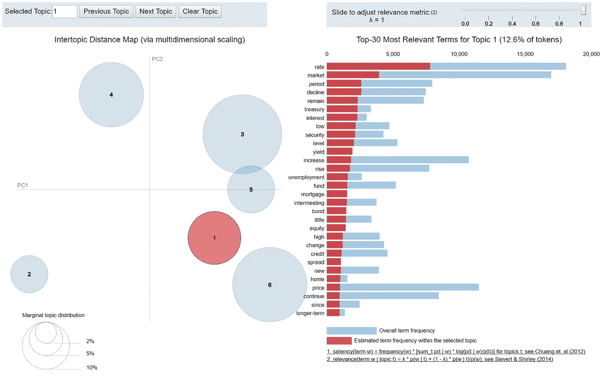

最后，我让 LDA 创建了 6 个不同的主题，因为它有一个相对均等的主题分布和大部分重叠的主题。然而，这仍然没有解决知道每个主题是关于什么的问题。

为此，我打印出了每个主题排名靠前的句子，并试图了解这个主题试图描述的内容。

主题 1:

```
Short-term market interest rates declined substantially on balance  over the meeting interval: in private short-term markets, yields fell 2 to 3-1/2 percentage points; in the Treasury bill market, yields fell some what less, about 3/4 to 2 percentage points, as the Treasury raised large  amounts of new money through bill auctions and heavy seasonal issuance of  cash management bills.
```

话题 2:

```
M1 comprises demand deposits at commercial banks and thrift institutions, currency in circulation, travellers checks, negotiable orders of withdrawal (NOW) and automatic transfer service (ATS) accounts at banks and thrift institutions, and credit union share draft accounts.
```

通过对所有主题进行这一练习，我已经给出了主题的名称，并打印出了它们的前 10 个关键词。

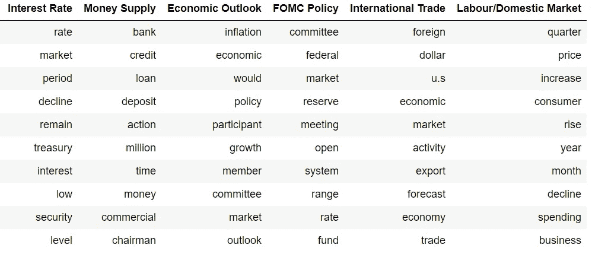

# 斗牛中的最后一剑

最后，我们已经到了可以将每个主题中的情绪与市场相对照的地步。

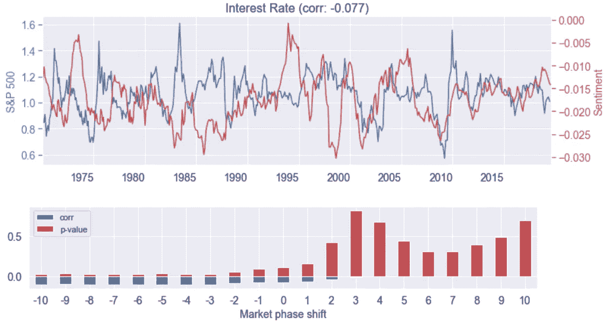

对于利率，很难看出情绪和市场之间有多大的相关性，但感觉利率情绪的重大转变将导致市场大幅波动，但方向不太清楚。因为相关性在 2000 年之后似乎是正的，但在 2000 年之前是负相关的。

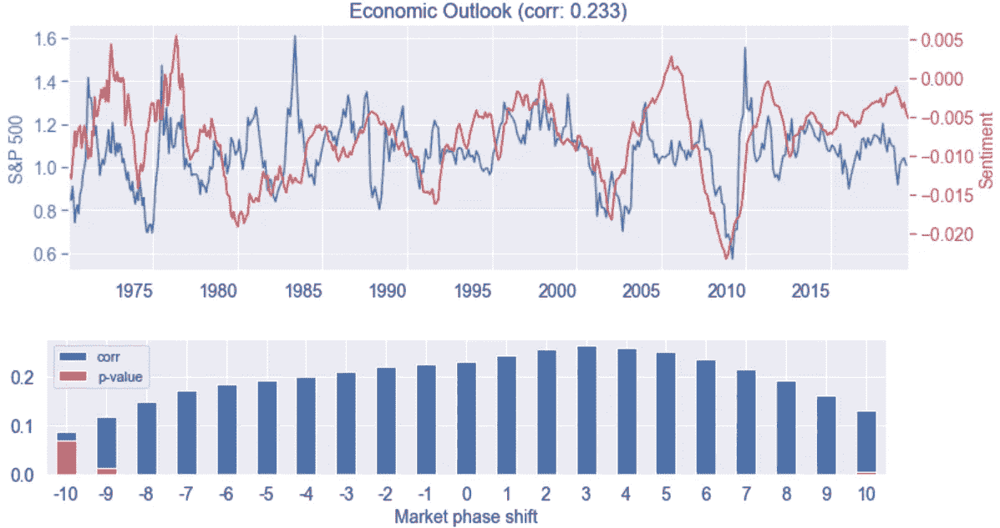

就经济前景而言，这种情绪肯定与市场走势存在一定的相关性。然而，随着时间的推移，它不是很稳定，有时它领先市场，有时它滞后。但相关性似乎在 0 个周期后趋于平稳，即总体上滞后于市场。

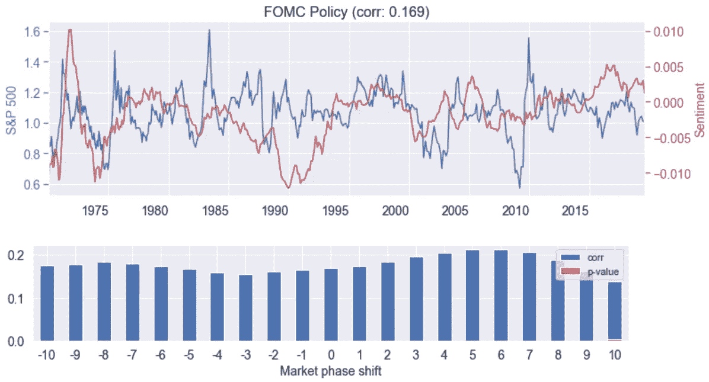

就 FOMC 政策而言，这看起来很像一个经济前景话题。它并没有明确指出信号是超前还是滞后。

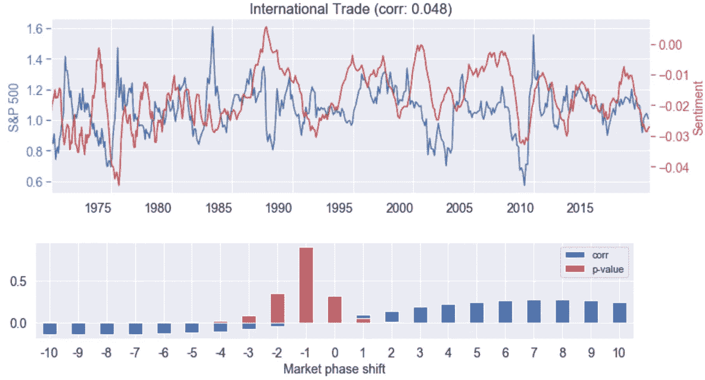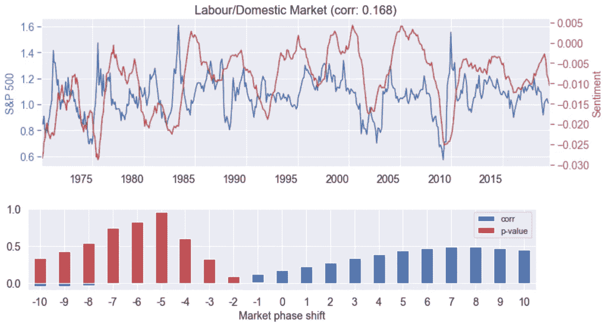

随着国际贸易和劳动力/国内市场，情绪肯定落后于市场。这种相关性表明，市场的全面影响只是在大约 7 次会议之后，即在将近一年的延迟之后，才完全反映在市场情绪中。这可能是由于我在情感分析中使用的平滑操作。我已经在 10 次会议上缓和了这种情绪。

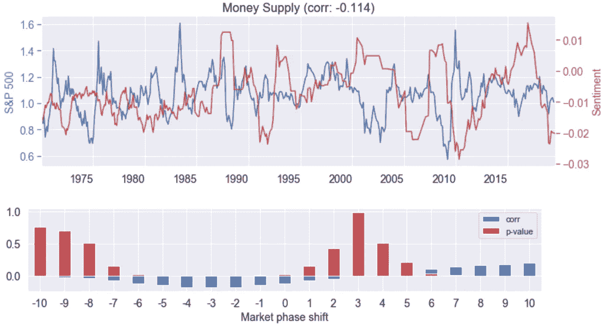

最有趣的图表是货币供应话题。它与市场有微弱但有意义的负相关性，在市场情绪开始赶上趋势之前的 3 次会议。即使在过去 10 次会议中情绪平稳后，这一领先信号仍然有效。我相信这是一个事实，公开市场操作是一个持续的过程，超越了市场先生的记忆广度。因此，在接下来的几个月里，市场并没有完全消化后续操作。

希望这项工作能给你带来一些如何进行情感或一般文本分析的想法。欢迎在下面留言或直接联系我。

***注来自《走向数据科学》的编辑:*** *虽然我们允许独立作者根据我们的* [*规则和指导方针*](/questions-96667b06af5) *发表文章，但我们不认可每个作者的贡献。你不应该在没有寻求专业建议的情况下依赖一个作者的作品。详见我们的* [*读者术语*](/readers-terms-b5d780a700a4) *。*