# 用 Python 构建金融交易工具箱:简单移动平均线

> 原文：<https://towardsdatascience.com/trading-toolbox-01-sma-7b8e16bd9388?source=collection_archive---------6----------------------->

## [交易工具箱](https://medium.com/tag/trading-toolbox)


Photo by [Markus Spiske](https://unsplash.com/@markusspiske?utm_source=medium&utm_medium=referral) on [Unsplash](https://unsplash.com?utm_source=medium&utm_medium=referral)

Python 凭借其强大的数据分析包*熊猫*，席卷了金融市场分析领域。它使研究人员能够进行复杂的分析，而这曾经需要专用的昂贵的软件包。

在这篇文章中，我们将使用 Python 和熊猫涉水金融市场分析。我们将绘制一个市场价格序列，并添加一个基本指标。在接下来的文章中，我们将通过构建一个完整的工具箱来学习如何游泳，这个工具箱可以用来创建交易股票或其他金融资产的系统。

我们将要实现的大多数概念属于一个被称为[技术分析](https://www.investopedia.com/terms/t/technicalanalysis.asp)的领域，这是一个旨在通过分析交易活动产生的数据(如价格和交易量)来评估投资和识别机会的学科。

## 介绍移动平均线

**移动平均线**是最简单的技术指标之一，但它可以以许多不同的方式使用和组合，为交易系统和投资决策框架提供支柱。

移动平均线，作为所有的技术指标，是基于金融工具的价格序列。在我们的例子中，我们考虑在纽约证券交易所交易的[交易所交易基金](https://www.investopedia.com/terms/e/etf.asp) (ETF)的 [SPDR 的& P 500 ETF 信托](https://en.wikipedia.org/wiki/SPDR_S%26P_500_Trust_ETF)(代码:SPY)的每日价格序列。这只 ETF 模仿了标准普尔 500 指数的表现。我们希望使用移动平均线来做出投资决策——决定何时买入或卖出 SPY 的股票。

有不同种类的移动平均线。最常用的三种是:

*   简单移动平均线
*   线性加权移动平均
*   指数平滑移动平均

本帖中的例子将集中在**简单移动平均线(SMA)** 。它的构造非常简单:我们首先定义一个长度为 *n* 的滚动窗口(在我们的例子中是几天——让我们使用 *n=5* )。然后，我们从第 5 天开始，考虑从第 1 天到第 5 天(包括在内)的所有价格。我们计算这些价格的算术平均值(将它们相加并除以 5):这就是第 5 天的 SMA 值。然后，我们继续到第 6 天，我们取出第 1 天的价格，包括第 6 天的价格，并计算下一个 SMA。我们不断重复这个过程，直到我们达到系列中的最后一个价格。参见表格:

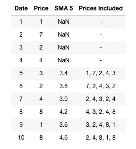

您已经注意到我们的移动平均线的前 4 个值没有被计算:直到第 5 天才有足够的天数来填充 5 天的窗口。

## 直观的例子

让我们将这个概念付诸实践，并使用 Python、 [pandas](https://pandas.pydata.org/) 和 [Matplotlib](https://matplotlib.org/) 创建一些实际的例子。我假设您至少有一些基本的 Python 知识，并且知道什么是数据帧和序列对象。如果不是这样，你可以在这里找到温柔的介绍[。我还建议你用一个笔记本来跟随下面的代码。在这里你可以找到一个方便的](https://www.dataquest.io/course/python-for-data-science-fundamentals/) [Jupyter 教程](https://www.dataquest.io/blog/jupyter-notebook-tutorial/)。但是，您总是以自己喜欢的方式执行代码，通过 IDE 或交互式提示符。我们首先加载所需的库并检查它们的版本:

```
import pandas as pd
import matplotlib.pyplot as plt
```

如果您正在使用 **Jupyter** ，最好在笔记本中显示图表:

```
%matplotlib inline
```

在这种情况下，你可以省略本文所有代码中的所有`plt.show()`语句。

接下来，我们将数据加载到数据帧中。我已经从雅虎获得了一个每日间谍数据的 CSV 文件。财务。你可以在这里下载[我的 CSV 文件](https://raw.githubusercontent.com/stebas101/TradingToolbox/master/data/SPY.csv)。

```
datafile = 'data/SPY.csv'#This creates a dataframe from the CSV file:
data = pd.read_csv(datafile, index_col = 'Date')data
```

Jupyter 中的输出显示了我们的数据:

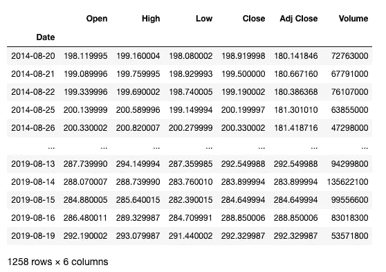

我们的数据框架总共有六列，分别代表开盘价、最高价、最低价、收盘价、调整后收盘价和成交量。为了简单起见，在我们的例子中，我们将只使用调整后的收盘价。这是反映股息、股票分割和其他影响股票回报的公司事件的价格系列。

```
#This selects the 'Adj Close' column
close = data['Adj Close']#This converts the date strings in the index into pandas datetime format:
close.index = pd.to_datetime(close.index)close
```

输出:

```
Date
2014-08-20    180.141846
2014-08-21    180.667160
2014-08-22    180.386368
2014-08-25    181.301010
2014-08-26    181.418716
                 ...    
2019-08-13    292.549988
2019-08-14    283.899994
2019-08-15    284.649994
2019-08-16    288.850006
2019-08-19    292.329987
Name: Adj Close, Length: 1258, dtype: float64
```

我们可以很容易地绘制价格系列，以便直观地观察:

```
close.plot()plt.show()
```

如果你正在使用 Jupyter ，记住你可以在这里和下一行代码中删除`plt.show()`行。我们得到:

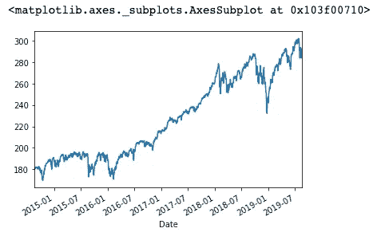

close.plot() output in Jupyter

熊猫让计算 50 天移动平均线变得容易。使用**滚动()**方法，我们设置了一个 50 天的窗口，在此窗口上，我们使用**均值()**方法计算算术平均值:

```
sma50 = close.rolling(window=50).mean()sma50
```

我们得到:

```
Date
2014-08-20           NaN
2014-08-21           NaN
2014-08-22           NaN
2014-08-25           NaN
2014-08-26           NaN
                 ...    
2019-08-13    293.540820
2019-08-14    293.635375
2019-08-15    293.696567
2019-08-16    293.805137
2019-08-19    293.926582
Name: Adj Close, Length: 1258, dtype: float64
```

正如我们所料，序列的前 49 个值为空:

```
sma50.iloc[45:52]
```

显示:

```
Date
2014-10-23           NaN
2014-10-24           NaN
2014-10-27           NaN
2014-10-28           NaN
2014-10-29    178.725250
2014-10-30    178.750461
2014-10-31    178.806655
Name: Adj Close, dtype: float64
```

我们现在可以在图表上画出我们的第一条均线。为了改善外观，我们可以使用预定义的样式:

```
plt.style.use('fivethirtyeight')
```

你可以尝试不同的风格，看看这里有什么。我们现在可以绘制图表了:

```
#The size for our chart:
plt.figure(figsize = (12,6))#Plotting price and SMA lines:
plt.plot(close, label='SPY Adj Close', linewidth = 2)
plt.plot(sma50, label='50 day rolling SMA', linewidth = 1.5)#Adding title and labeles on the axes, making legend visible:
plt.xlabel('Date')
plt.ylabel('Adjusted closing price ($)')
plt.title('Price with a single Simple Moving Average')
plt.legend()plt.show()
```

这是我们的移动平均线与价格的关系图:

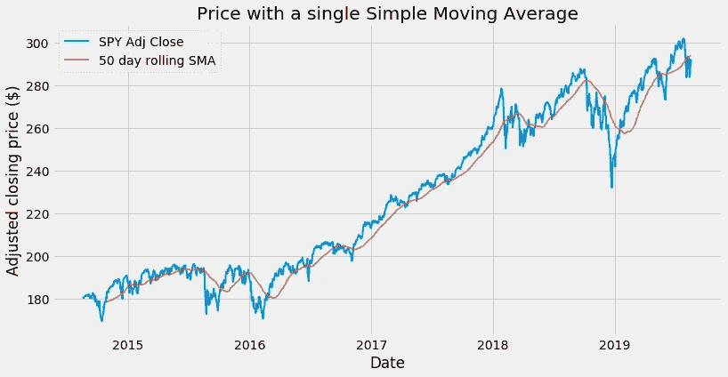

## 使用一个移动平均线

我们的简单移动平均线做得很好，它平滑了价格运动，帮助我们直观地识别趋势:当平均线向上攀升时，我们有上升趋势。当均线向下时，我们处于下跌趋势。

我们能做的不止这些:用一条均线就能产生交易信号。当收盘价从下方移动到均线上方时，我们有买入信号:

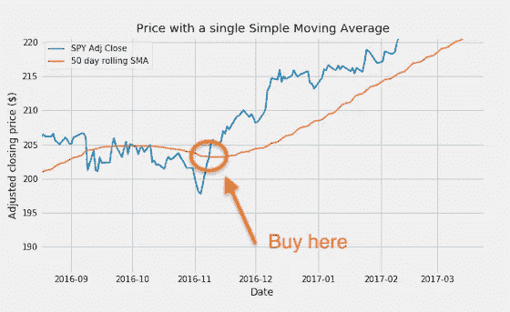

同样，当价格从上方穿过移动平均线时，就会产生卖出信号:

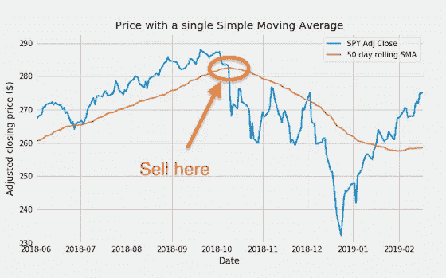

## 绘制两个平均值并选择日期范围

让我们比较两个不同长度的移动平均线，分别是 20 天和 50 天:

```
sma20 = close.rolling(window=20).mean()plt.figure(figsize = (12,6))#Plotting price with two SMAs:
plt.plot(close, label='SPY Adj Close', linewidth = 2)
plt.plot(sma20, label='20 day rolling SMA', linewidth = 1.5)
plt.plot(sma50, label='50 day rolling SMA', linewidth = 1.5)plt.xlabel('Date')
plt.ylabel('Adjusted closing price ($)')
plt.title('Price with Two Simple Moving Averages')
plt.legend()plt.show()
```

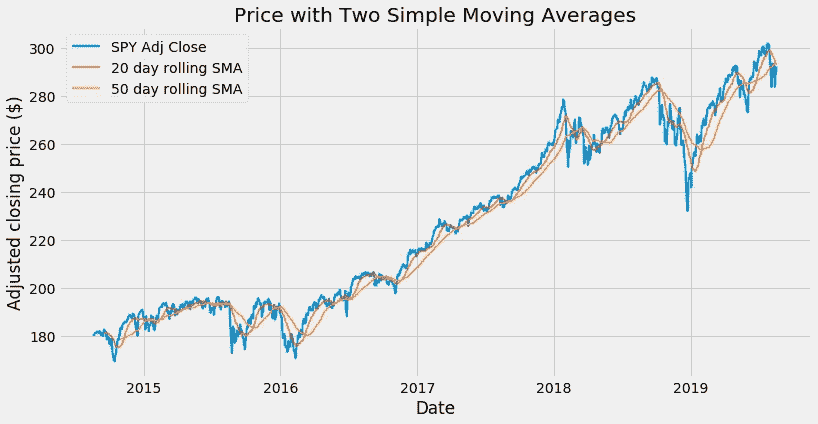

我们的图表现在变得有点拥挤:如果能够放大我们选择的日期范围就好了。我们可以使用一个 **plt.xlim()** 指令(例如`plt.xlim('2017-01-01','2018-12-31')`:试着把它添加到上面的代码中)。然而，我想探索一条不同的路线:建立一个新的数据框架，包括价格和移动平均线:

```
priceSma_df = pd.DataFrame({
      'Adj Close' : close,
      'SMA 20' : sma20,
      'SMA 50' : sma50
     })priceSma_df
```

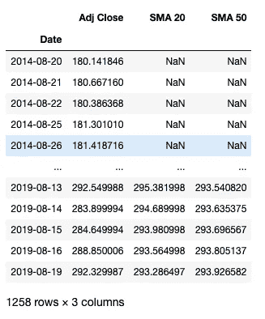

将我们的所有系列放在一个数据框架中，可以轻松创建快照图:

```
priceSma_df.plot()plt.show()
```

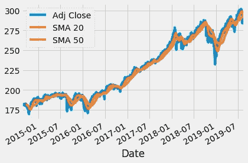

虽然使用 dataframe own **plot()** 方法创建一个 snap plot 很方便，但是我更喜欢使用单独的函数调用来定制我的图表。将我们的所有系列放在一个数据框架中的另一个好处是，我们可以轻松选择一个**日期范围**(例如，包括 2017 年和 2018 年的日期)并仅绘制该范围内的数据:

```
plt.figure(figsize = (12,6))#Plotting price and two SMAs with a specified date range:
plt.plot(priceSma_df['2017':'2018']['Adj Close'], label='SPY Adj Close', linewidth = 2)
plt.plot(priceSma_df['2017':'2018']['SMA 20'], label='20 days rolling SMA', linewidth = 1.5)
plt.plot(priceSma_df['2017':'2018']['SMA 50'], label='50 days rolling SMA', linewidth = 1.5)plt.xlabel('Date')
plt.ylabel('Adjusted closing price ($)')
plt.title('Price with Two Simple Moving Averages - Selected Date Range')
plt.legend()plt.show()
```

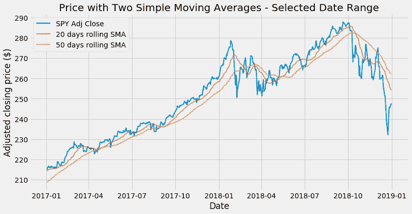

Dates between 2017 and 2018 included

按日期范围对数据进行切片是 pandas 的一大特色。以下所有语句都有效:

*   `priceSma_df['2017-04-01':'2017-06-15']`:由两个特定日期定义的范围
*   `priceSma_df['2017-01]`:某月价格
*   `priceSma_df['2017]`:某一年的价格

## 使用两个移动平均线

通过合并两条均线，我们可以使用一种叫做*双交叉法*的技术。在这种情况下，只要短均线从下方穿过长均线，就会产生买入信号。类似地，当短均线从上方穿过长均线时，就会产生卖出信号:

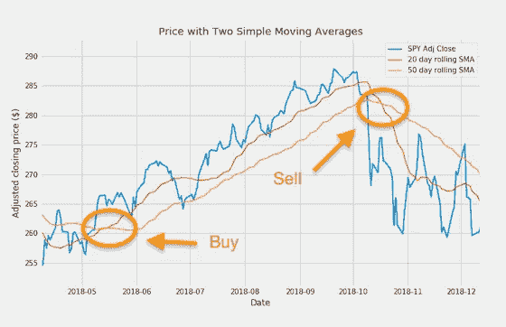

Trading signals with two SMAs

与只使用一条均线和价格的技术相比，双交叉方法产生的拉锯更少。另一方面，它可以产生具有一定延迟的信号。

## 使用三条移动平均线

如果我们可以一起使用两条均线，为什么不可以用三条呢？

```
sma200 = close.rolling(window=200).mean()priceSma_df['SMA 200'] = sma200priceSma_df
```

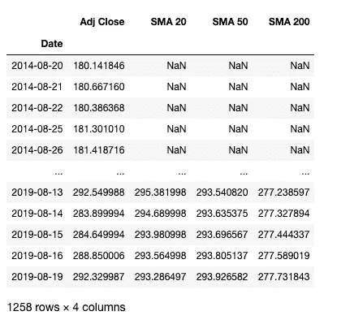

```
#Our start and end dates:
start = '2016'
end = '2019'plt.figure(figsize = (12,6))#Plotting price and three SMAs with start and end dates:
plt.plot(priceSma_df[start:end]['Adj Close'], label='SPY Adj Close', linewidth = 2)
plt.plot(priceSma_df[start:end]['SMA 20'], label='20 day rolling SMA', linewidth = 1.5)
plt.plot(priceSma_df[start:end]['SMA 50'], label='50 day rolling SMA', linewidth = 1.5)
plt.plot(priceSma_df[start:end]['SMA 200'], label='200 day rolling SMA', linewidth = 1.5)plt.xlabel('Date')
plt.ylabel('Adjusted closing price ($)')
plt.title('Price with Three Simple Moving Averages')
plt.legend()plt.show()
```

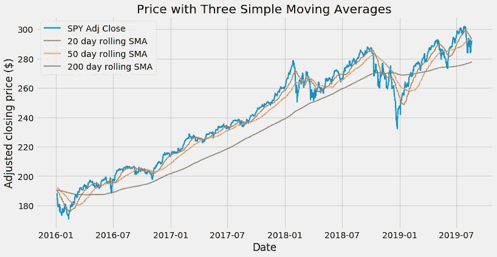

Three SMAs — dates from 2016 to 2018 included

你可以看到长期 200 SMA 如何帮助我们以一种非常平稳的方式识别趋势。

这就给我们带来了*三重交叉法*。我们使用的移动平均线的长度分别为 20、50 和 200 天，在分析师中广泛使用。当 20 日均线从下方穿过 50 日均线时，我们可以选择考虑买入信号，但只有当两条均线都在 200 日均线上方时。所有出现在 200 均线以下的买入交叉都将被忽略。

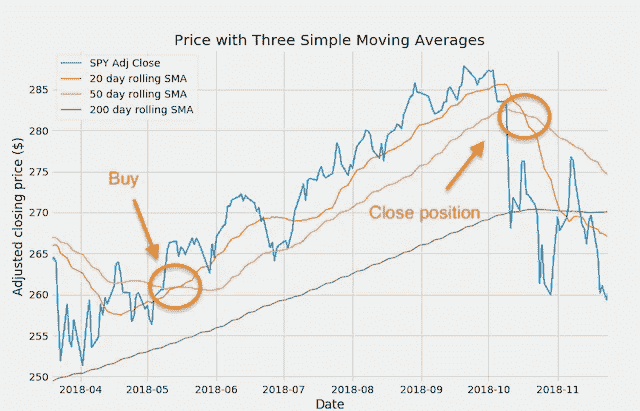

Crosses above the 200 SMAs

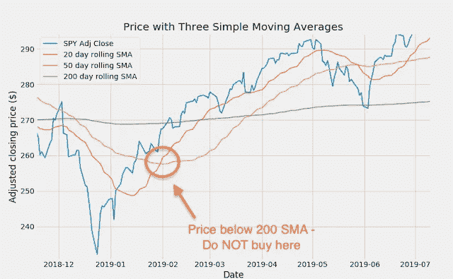

A cross below the 200 SMAs

本文中的例子只是结合不同长度的价格和移动平均线产生的许多可能性中的一部分。此外，价格和移动平均线可以与其他可用的[技术指标](https://school.stockcharts.com/doku.php?id=technical_indicators)或我们可以自己创建的指标相结合。Python 和 pandas 提供了研究和构建盈利交易系统所需的所有能力和灵活性。

***来自《走向数据科学》编辑的提示:*** *虽然我们允许独立作者根据我们的* [*规则和指导方针*](/questions-96667b06af5) *发表文章，但我们并不认可每个作者的贡献。你不应该在没有寻求专业建议的情况下依赖一个作者的作品。详见我们的* [*读者术语*](/readers-terms-b5d780a700a4) *。*