# Python 交易工具箱:加权和指数移动平均线

> 原文：<https://towardsdatascience.com/trading-toolbox-02-wma-ema-62c22205e2a9?source=collection_archive---------1----------------------->

## [交易工具箱](https://medium.com/tag/trading-toolbox)


Photo by [M. B. M.](https://unsplash.com/@m_b_m?utm_source=medium&utm_medium=referral) on [Unsplash](https://unsplash.com?utm_source=medium&utm_medium=referral)

在金融交易工具箱系列的第一篇文章([用 Python 构建金融交易工具箱:简单移动平均线](/trading-toolbox-01-sma-7b8e16bd9388))中，我们讨论了如何计算简单移动平均线，将其添加到价格系列图中，并将其用于投资和交易决策。简单移动平均线只是几种移动平均线中的一种，可以应用于价格序列来建立交易系统或投资决策框架。其中，金融市场中常用的另外两种移动平均线是:

*   加权移动平均( **WMA** )
*   指数移动平均线(**均线**)

在本文中，我们将探讨如何计算这两个平均值，以及如何确保结果与我们需要实现的定义相匹配。

## 加权移动平均

在某些应用中，简单移动平均线的一个限制是，它对窗口中包含的每个每日价格给予相同的权重。例如，在 10 天移动平均线中，最近的一天接收与窗口中的第一天相同的权重:每个价格接收 10%的权重。

与简单移动平均线相比，*线性加权移动平均线*(或简称为*加权移动平均线、* **WMA** )，给予最近价格的权重更大，随着时间的推移逐渐减小。在 10 天加权平均中，第 10 天的价格乘以 10，第 9 天乘以 9，第 8 天乘以 8，以此类推。总数将除以权重的总和(在本例中为:55)。在这个特定的例子中，最近的价格获得总权重的大约 18.2%，第二个最近的价格获得 16.4%，等等，直到窗口中最早的价格获得权重的 0.02%。

让我们用 Python 中的一个例子来实践这一点。除了 *pandas* 和 Matplotlib，我们还将使用 NumPy:

```
import pandas as pd
import numpy as np
import matplotlib.pyplot as plt
import matplotlib as mpl
```

我们为图表应用一种样式。如果你正在使用 **Jupyter** ，添加`%matplotlib inline`指令是个好主意(在创建图表时跳过`plt.show()`):

```
plt.style.use('fivethirtyeight')
```

在接下来的例子中，我们将使用来自[StockCharts.com 文章](https://school.stockcharts.com/doku.php?id=technical_indicators:moving_averages)的价格数据。这是一篇关于均线的优秀教育文章，我推荐阅读。那篇文章中使用的价格序列可以属于任何股票或金融工具，并且将服务于我们的说明目的。

我修改了[原始的 Excel 表格](https://school.stockcharts.com/lib/exe/fetch.php?media=technical_indicators:moving_averages:cs-movavg.xls)，加入了 10 天 WMA 的计算，因为已经包含了均线的计算。您可以访问我的 [Google Sheets 文件](https://drive.google.com/open?id=1LztjXRI0O2YP7Dezcczqz7TdFfXDrCsduYV9kVv0Qck)并在此下载 CSV 格式的数据[。](https://raw.githubusercontent.com/stebas101/TradingToolbox/master/data/cs-movavg.csv)

在对数据建模时，从模型的简单实现开始总是一个好的做法，我们可以用它来确保最终实现的结果是正确的。

我们首先将数据加载到数据框中:

```
datafile = 'cs-movavg.csv'data = pd.read_csv(datafile, index_col = 'Date')
data.index = pd.to_datetime(data.index)# We can drop the old index column:
data = data.drop(columns='Unnamed: 0')data
```


我们现在只考虑价格和 10 天 WMA 柱，以后再看均线。

当谈到线性加权移动平均线时， *pandas* 库没有现成的方法来计算它们。然而，它提供了一个非常强大和灵活的方法:`.apply()`这个方法允许我们创建任何[自定义函数](https://pandas.pydata.org/pandas-docs/stable/reference/api/pandas.core.window.Rolling.apply.html)并将其传递给一个滚动窗口:这就是我们将如何计算我们的加权移动平均值。为了计算 **10 天 WMA** ，我们首先创建一个权重数组——从 1 到 10 的整数:

```
weights = np.arange(1,11) #this creates an array with integers 1 to 10 includedweights
```

看起来像是:

```
array([ 1,  2,  3,  4,  5,  6,  7,  8,  9, 10])
```

接下来，使用`.apply()`方法，我们通过自己的函数(a [*lambda* 函数](https://www.w3schools.com/python/python_lambda.asp))计算滚动窗口中权重和价格的 [*点积*](https://docs.scipy.org/doc/numpy/reference/generated/numpy.dot.html) (窗口中的价格将乘以相应的权重，然后求和)，然后除以权重之和:

```
wma10 = data['Price'].rolling(10).apply(lambda prices: np.dot(prices, weights)/weights.sum(), raw=True)wma10.head(20)
```

这给出了:

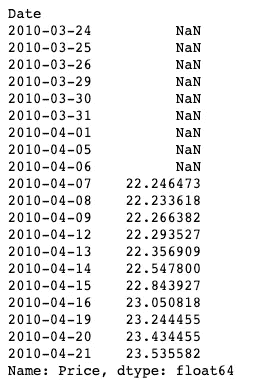

现在，我们想将我们的 WMA 与通过电子表格获得的进行比较。为此，我们可以在数据框中添加一个*‘我们的 10 天 WMA’*列。为了便于直观比较，我们可以使用 NumPy 的`.round()`方法将 WMA 级数四舍五入到三位小数。然后，我们选择要显示的价格和 WMA 列:

```
data['Our 10-day WMA'] = np.round(wma10, decimals=3)data[['Price', '10-day WMA', 'Our 10-day WMA']].head(20)
```

显示:

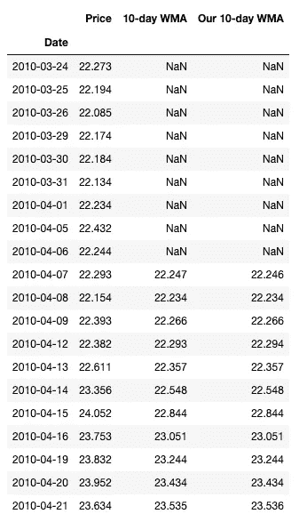

这两根 WMA 柱子看起来一样。第三位小数有一些差异，但我们可以将其归因于舍入误差，并得出结论，我们的 WMA 实现是正确的。在实际应用中，如果我们想要更严格，我们应该计算两列之间的差异，并检查它们是否太大。现在，我们保持事情简单，我们可以满足于视觉检查。

在剧情中比较我们新创造的 **WMA** 和熟悉的 **SMA** 会很有趣:

```
sma10 = data['Price'].rolling(10).mean()plt.figure(figsize = (12,6))plt.plot(data['Price'], label="Price")
plt.plot(wma10, label="10-Day WMA")
plt.plot(sma10, label="10-Day SMA")plt.xlabel("Date")
plt.ylabel("Price")
plt.legend()plt.show()
```

这表明:

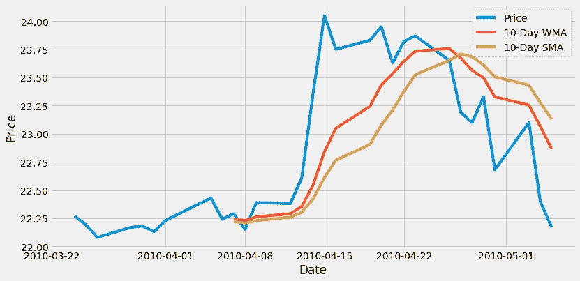

正如我们所看到的，这两个平均值平滑了价格运动。WMA 比 SMA 更具反应性，更贴近价格:我们预计，因为 WMA 更重视最近的价格观察。此外，两个移动平均线系列都从第 10 天开始:第一天有足够的可用数据来计算平均值。

加权移动平均线可能不如它的指数兄弟那样为人所知。然而，当我们试图构建原创解决方案时，它可能是我们工具箱中的一个额外项目。在 Python 中实现 WMA 迫使我们寻找一种使用`.apply()`创建定制移动平均线的方法:这种技术也可以用于实现新的和原始的移动平均线。

## 指数移动平均线

与加权移动平均线类似，指数移动平均线( **EMA** )赋予最近的价格观察值更大的权重。虽然它对过去的数据赋予较小的权重，但它是基于一个递归公式，该公式在其计算中包括我们价格系列中所有过去的数据。

时间 *t* 的均线计算方法是当前价格乘以平滑因子 *alpha* (小于 1 的正数)加上𝑡−1 时间的均线乘以 1 减去 *alpha* 。它基本上是介于之前的均线和当前价格之间的一个值:

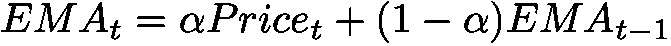

平滑因子𝛼(*α*)定义为:

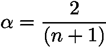

其中𝑛是我们跨度中的天数。因此， **10 日均线**会有一个平滑因子:

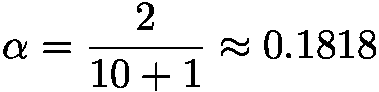

*Pandas* 包含了一个计算任意时间序列的均线移动平均线的方法:`[.ewm()](https://pandas.pydata.org/pandas-docs/stable/reference/api/pandas.DataFrame.ewm.html).`这个方法会满足我们的需求并计算出符合我们定义的平均值吗？让我们来测试一下:

```
ema10 = data['Price'].ewm(span=10).mean()ema10.head(10)
```

这给出了:

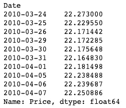

我们想将这个 EMA 系列与电子表格中的相比较:

```
data['Our 10-day EMA'] = np.round(ema10, decimals=3)data[['Price', '10-day EMA', 'Our 10-day EMA']].head(20)
```

结果是:

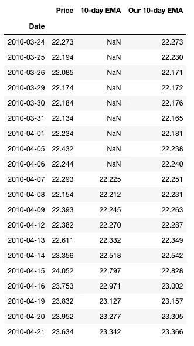

正如你已经注意到的，我们这里有一个问题:我们刚刚计算的 10 天均线和下载的电子表格中计算的不一致。一个从第 10 天开始，另一个从第 1 天开始。此外，这些值并不完全匹配。

我们的计算错了吗？还是提供的电子表格中的计算有误？都不是:这两个系列对应着两种不同的均线定义。更具体地说，用来计算均线的公式是一样的。改变的只是初始值的使用。

如果我们仔细看看 StockCharts.com[网页](https://school.stockcharts.com/doku.php?id=technical_indicators:moving_averages)上的指数移动平均线的定义，我们可以注意到一个重要的细节:他们在第 10 天开始计算 10 天移动平均线，忽略前几天，并用其 **10 天移动平均线**替换第 10 天的价格。这与我们直接使用`.ewm()`方法计算均线时使用的定义不同。

以下代码行创建了一个新的修改后的价格序列，其中前 9 个价格(当 SMA 不可用时)被替换为 *NaN* ，第 10 个日期的价格成为其 10 天 SMA:

```
modPrice = data['Price'].copy()
modPrice.iloc[0:10] = sma10[0:10]modPrice.head(20)
```

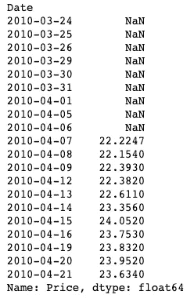

我们可以用这个修改后的价格序列来计算第二版的 EWM。通过查看[文档](https://pandas.pydata.org/pandas-docs/stable/reference/api/pandas.DataFrame.ewm.html)，我们可以注意到`.ewm()`方法有一个**调整**参数，默认为*真*。该参数调整权重以考虑开始期间的不平衡(如果您需要更多详细信息，请参见 [*熊猫*文档](https://pandas.pydata.org/pandas-docs/stable/user_guide/computation.html#exponentially-weighted-windows)中的*指数加权窗口*部分)。

如果我们想用修改后的价格序列模拟电子表格中的均线，我们不需要这个调整。我们接着设定`adjust=False`:

```
ema10alt = modPrice.ewm(span=10, adjust=False).mean()
```

这个新计算的均线会和电子表格中计算的一致吗？让我们来看看:

```
data['Our 2nd 10-Day EMA'] = np.round(ema10alt, decimals=3)data[['Price', '10-day EMA', 'Our 10-day EMA', 'Our 2nd 10-Day EMA']].head(20)
```

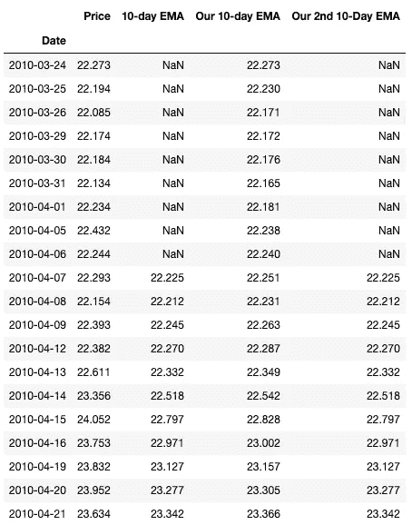

现在，我们做得好多了。我们得到了一个与电子表格中计算的相匹配的均线序列。

我们最终得到了两个不同版本的 EMA:

1.  `ema10`:这个版本使用简单的`.ewm()`方法，从我们的价格历史开始，但不符合电子表格中使用的定义。
2.  `ema10alt`:这个版本从第 10 天开始(初始值等于 10 天的 SMA)，符合我们电子表格上的定义。

哪个最好用？答案是:这取决于我们的应用程序和构建我们的系统需要什么。如果我们需要一个从第一天开始的均线系列，那么我们应该选择第一个。另一方面，如果我们需要将我们的平均值与其他没有初始日值的平均值(如 SMA)结合使用，那么第二种方法可能是最好的。

第二种 EMA 在金融市场分析师中广泛使用:如果我们需要实现一个已经存在的系统，我们需要小心使用正确的定义。否则，结果可能不是我们所期望的，并可能使我们所有工作的准确性受到质疑。在任何情况下，这两个平均值之间的数字差异都很小，对我们交易或投资决策系统的影响仅限于最初几天。

让我们来看看迄今为止图表中使用的所有移动平均线:

```
plt.figure(figsize = (12,6))plt.plot(data['Price'], label="Price")
plt.plot(wma10, label="10-Day WMA")
plt.plot(sma10, label="10-Day SMA")
plt.plot(ema10, label="10-Day EMA-1")
plt.plot(ema10alt, label="10-Day EMA-2")plt.xlabel("Date")
plt.ylabel("Price")
plt.legend()plt.show()
```

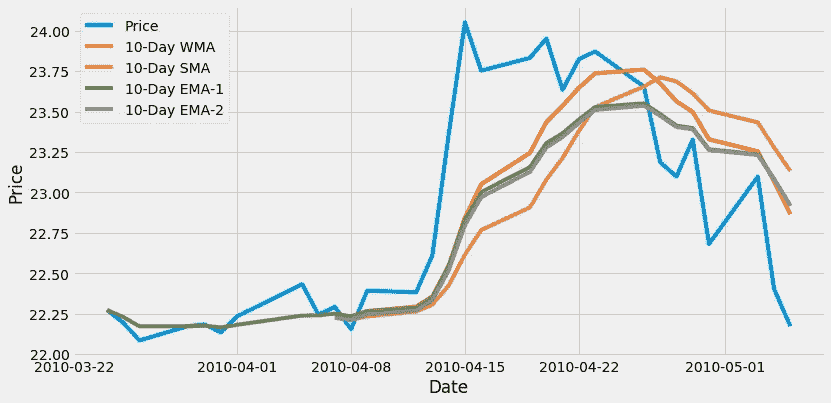

在所有均线中， **WMA** 似乎反应更快，价格贴得更近，而 **SMA** 反应更滞后。两个版本的**均线**往往会重叠，主要是在最后几天。

我希望这篇文章对你有用。引入加权移动平均有助于我们学习和实现基于特定定义的自定义平均。使用指数移动平均线让我们有机会强调，确保我们用来处理价格序列的任何函数与我们对任何给定任务的定义相匹配是多么重要。

***来自《走向数据科学》编辑的提示:*** *虽然我们允许独立作者根据我们的* [*规则和指南*](/questions-96667b06af5) *发表文章，但我们并不认可每个作者的贡献。你不应该在没有寻求专业建议的情况下依赖一个作者的作品。详见我们的* [*读者术语*](/readers-terms-b5d780a700a4) *。*