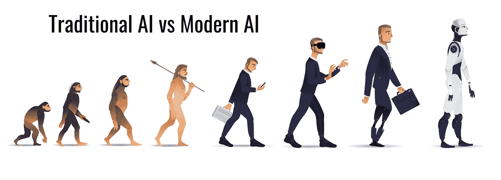
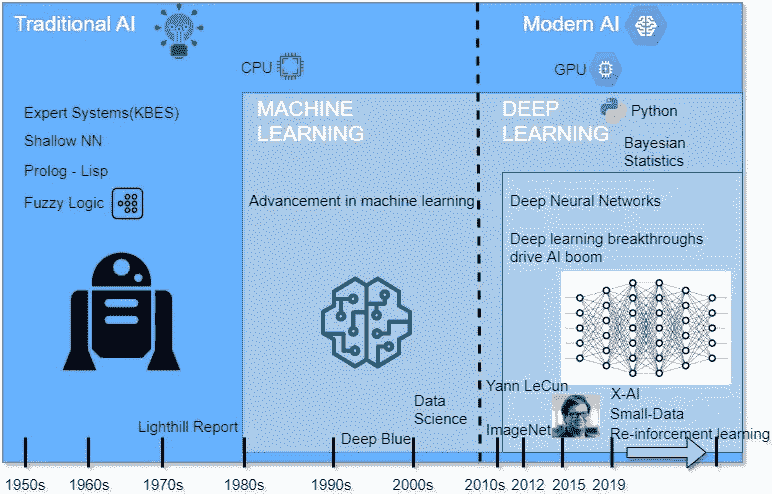
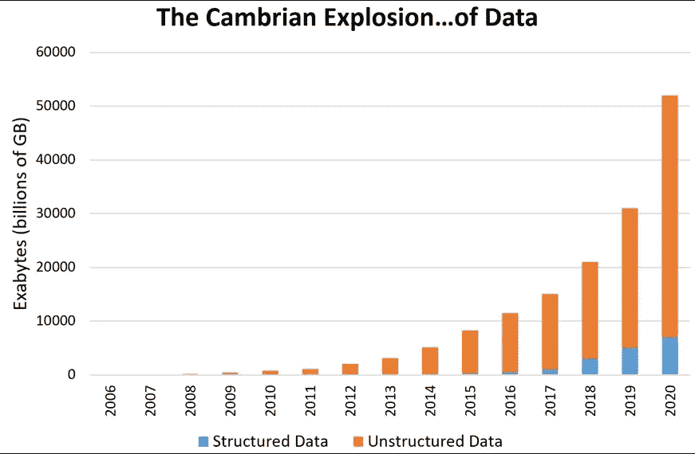

# 传统人工智能与现代人工智能。

> 原文：<https://towardsdatascience.com/traditional-ai-vs-modern-ai-5117b469a0c9?source=collection_archive---------9----------------------->

## 人工智能的进化和“未来人工智能”的新浪潮。

source [shutterstock.com](http://shutterstock.com/)

**今天的 AI**

毫无疑问，今天最大的流行语是人工智能或 AI。包括 Gartner、麦肯锡和普华永道在内的大多数知名研究机构都用令人惊叹的统计数据和未来预测美化了人工智能的未来。[这里](https://www.pwc.com/gx/en/issues/analytics/assets/pwc-ai-analysis-sizing-the-prize-report.pdf)是普华永道的报告(2018)，其中预测到 2030 年，人工智能将为全球经济贡献 15.7 万亿美元。总体生产率& GDP 将分别增长 55%和 14%。正如美国总统唐纳德·j·特朗普签署的那样，这项行政命令可以迅速证明人工智能在美国的重要性。

[source](https://jp.usembassy.gov/maintaining-american-leadership-in-artificial-intelligence/)

*“齐心协力，我们可以利用世界上最具创新性的技术，让我们的政府更好地为美国人民服务。”
迈克尔·克拉特西奥斯
美国首席技术官(* [*来源*](https://www.whitehouse.gov/presidential-actions/executive-order-maintaining-american-leadership-artificial-intelligence/) *)*

我们在日常生活中有几个例子，我们甚至没有注意到就利用了人工智能。这包括[谷歌地图](https://www.theverge.com/2018/5/10/17340004/google-ai-maps-news-secret-weapon-remaking-old-apps-products-io-2018)、Gmail 中的智能回复(2018+)、facebook 图片标签(2015 年左右)、youtube/ [网飞](https://becominghuman.ai/how-netflix-uses-ai-and-machine-learning-a087614630fe)视频推荐(2016+)等。也有一些惊人的新闻报道概述了人工智能的意义和范围；像[这个](https://onezero.medium.com/novak-djokovic-used-a-i-to-train-for-wimbledon-e22b62f7504a) (2019)诺瓦克·德约科维奇在温网决赛中使用人工智能，或者看看[这个网站](https://thispersondoesnotexist.com/)(2019 年推出)100%假的图片，看起来 100%真实的人利用深度神经网络(深度学习)。这个清单还在继续。

传统人工智能(1950 年至 2008 年)

“人工智能”一词是 1956 年在达特茅斯的一次历史性会议上创造的。在人工智能发展的早期阶段，科学家和媒体炒作围绕人工智能突破的可能性提出了乌托邦式的主张。一些科学家明确表示，在未来 20 年内，机器将做人类可能做的一切事情[做的事情](https://www.ubs.com/microsites/nobel-perspectives/en/laureates/herbert-simon.html)。

*“人类能做的任何工作，机器都能做。”*

1965 年——赫伯特·西蒙

70 years history of AI by [Awais Bajwa](https://medium.com/@awaisbajwa)

自那以后，人工智能的发展经历了许多起伏。1973 年，英国政府在调查后发表了一份名为 [Lighthill report](https://en.wikipedia.org/wiki/Lighthill_report) 的报告，并查封了许多主要人工智能研究大学的资金。当时突出的人工智能方法是[专家系统](https://en.wikipedia.org/wiki/Expert_system)和[模糊逻辑](https://www.geeksforgeeks.org/fuzzy-logic-introduction/)，Prolog 和 Lisp 是 C/C++中编程语言的首选。专家系统的第一次重大突破发生在 80 年代，第一个杰出的专家系统 [SID](https://ieeexplore.ieee.org/abstract/document/25691) 问世了。后来，在人工智能领域出现了一些其他的挫折，随后是 IBM 的另一个突破，它的超级计算机“深蓝”在 1997 年的纽约市打败了世界冠军加里·卡斯帕罗夫。由于人工智能的概念在当时被视为失败，IBM 声称它没有在深蓝中使用人工智能，这引起了一些有趣的讨论。

请注意，所有的突破都发生在过去的 8-10 年里。反向传播算法是深度学习/神经网络的核心，于 1986 年[首次推出。问题是“**为什么在过去的 8-10 年(即 2009-2019 年)里，AI 已经存在了 70 多年？**”。](https://www.iro.umontreal.ca/~vincentp/ift3395/lectures/backprop_old.pdf)

为了得到答案，让我们跳到当前的“现代人工智能”时代。

**现代人工智能** (2008+)

“数据科学”这个术语是 Linkedin &脸书的两位数据团队领导在 2008 年初创造的。( [DJ 帕特尔](https://en.wikipedia.org/wiki/DJ_Patil) & [杰夫哈默巴赫](https://en.wikipedia.org/wiki/Jeff_Hammerbacher))。计算机科学的这个新领域引入了高级分析，利用了统计学、概率、线性代数&多元微积分。2012 年末，人工智能领域出现了真正的突破，在一场历史性的 [ImageNet 竞赛](https://en.wikipedia.org/wiki/ImageNet)中，一个基于 [CNN](/a-comprehensive-guide-to-convolutional-neural-networks-the-eli5-way-3bd2b1164a53) 的名为 AlexNet 的提交作品远远超过了所有其他竞争对手，错误率比亚军低 10.8 %。这是现代人工智能的到来，并被认为是人工智能世界新一轮繁荣的触发器。获胜的一个主要原因是利用图形处理单元 [(GPU)](https://en.wikipedia.org/wiki/Graphics_processing_unit) 来训练神经网络架构。2015 年晚些时候，脸书的人工智能领袖 Yann LeCun 与其他“人工智能教父”一起努力推动深度学习及其可能性今天，多家云供应商正在为“现代人工智能”提供基于云的 GPU，而在更早的时候，他们的采用从来都不是一个选项。

GPU 从 CPU 到 GPU 的转换确实改变了游戏。它革新了技术，重新定义了计算能力和并行处理。由于高级数学计算，AI 需要高速计算能力。尤其是因为在过去的十年中，生成的数据量呈指数级增长。

因此，全世界的人工智能研究呈指数增长，在撰写本文时，人工智能研究论文的数量约为 **100 篇/天**。

因此，我们对之前的问题有了答案:

"**为什么在 AI 已经存在 70 多年的最近 8-10 年(即 2009-2019 年)里？**”。

**答案:数据的巨大增长，更快更便宜的处理“GPU”，以及快节奏的人工智能研究。**

[source](https://www.eetimes.com/author.asp?section_id=36&doc_id=1330462)

未来的人工智能浪潮

谷歌很仁慈，让员工把 20%的时间分配在自己的抱负和好玩的项目上。2015 年，谷歌搜索过滤器团队的成员亚历山大·莫尔德温采夫(Alexander Mordvintsev)开发了一个神经网络程序，作为一种爱好，它以梦幻般的迷幻外观震惊了他的同事。而这个项目被 Google 命名为[深梦](https://znah.net/)。这个项目是[实验](https://www.wired.com/2015/12/inside-deep-dreams-how-google-made-its-computers-go-crazy/)的结果，同时训练一个神经网络，并在一定范围内发挥激活功能。但即使在今天，人工智能最大的一个谜是，我们没有真正理解人工智能在内部做出决策的准确性，或者神经网络如何在 back-pro p 中[学习推理。用外行人的话说，人工智能的实际推理或做出决策的偏好是一个谜，它被称为“人工智能的黑箱”](/the-mystery-behind-back-propagation-2ad97d1cf700)

**XAI**

人工智能努力的新浪潮之一是打破这个黑箱，并获得决策过程的逻辑解释。这个新概念现在被称为“可解释的人工智能”或“XAI”。一旦 XAI 成功，人工智能社区将迎来新一轮人工智能浪潮。更强大和更有弹性的人工智能框架将成为可能，包括对人工智能过程和未来增长模式的可预测理解。

**小数据**

主要的人工智能突破正在深度学习领域发生，在深度学习中，神经网络对海量数据有着超级渴望。例如，为了训练一个模型来识别一只猫，需要输入大约 10 万张猫/非猫图像，以获得与人眼大致相当的猫的完美分类。另一个正在迅速发展的研究领域是用更少的数据集快速学习，并利用概率框架。这个新概念被称为**“小数据”**研究领域是“如何用更少量的数据训练你的机器学习模型，并得到准确的预测。”在人工智能领域，这是一个巨大的机会，预计将带来未来创新的前景。

未来人工智能研究的另外两个领域是在**“无监督学习”**和**“****强化学习领域取得重大进展。”**我们可以通过迁移学习利用现有知识，并通过一些强化学习生成人工创建的采样数据，例如通过 [GAN](https://en.wikipedia.org/wiki/Generative_adversarial_network) 网络模型。

**关键要点**

传统人工智能理论上已经有 70 年的历史了，但在过去的 8-10 年里已经获得了巨大的发展势头(现代人工智能)。这些现代人工智能突破促进了数据的指数级增长、快速研究和云上“按需付费”模式的廉价计算能力。

未来的 AI 浪潮是打破“AI 黑箱”，理解机器学习模型做出的决策和预测的推理。未来人工智能浪潮的另一个主要领域是从有限的数据集或“小数据”中学习。

*感谢您阅读本文，希望对您有所帮助。请随时分享您的反馈，并提出您可能有的任何问题。我的 LinkedIn:*[*Awais Bajwa*](https://www.linkedin.com/in/aabajwa/)*。*