# 纽约市的交通事故——线性回归研究

> 原文：<https://towardsdatascience.com/traffic-accidents-in-new-york-city-a-linear-regression-study-3af7159ef088?source=collection_archive---------25----------------------->

Photo by [Phil Hauser](https://unsplash.com/@pjhauser?utm_source=medium&utm_medium=referral) on [Unsplash](https://unsplash.com?utm_source=medium&utm_medium=referral)

# 问题陈述

纽约市是美国最大的城市，也是世界第 28 大城市，人口约 860 万。这些人口加上每年超过 6000 英里的道路和大量的游客，确保了具有挑战性的交通状况。作为纽约市的一名司机，知道什么时候最有可能发生车祸是有益的，这样你就可以尽量避免在那个时候开车。这个时间是在上午还是下午的高峰时间？深夜还是凌晨？或者说，一天中的时间和交通事故之间没有真正的相关性吗？

# 数据争论

为了回答这些问题，这个项目利用了两个数据集，都可以从纽约市数据仓库获得。第一个是 NYPD 机动车碰撞-碰撞数据集，该数据集由 158 万行数据组成，详细说明了日期、时间、位置(街道名称、交叉街道和经纬度坐标)、成因、事故中涉及的车辆类型和数量以及受伤人数。

 [## 机动车碰撞事故|纽约市公开数据

### 编辑描述

data.cityofnewyork.us](https://data.cityofnewyork.us/Public-Safety/NYPD-Motor-Vehicle-Collisions-Crashes/h9gi-nx95) 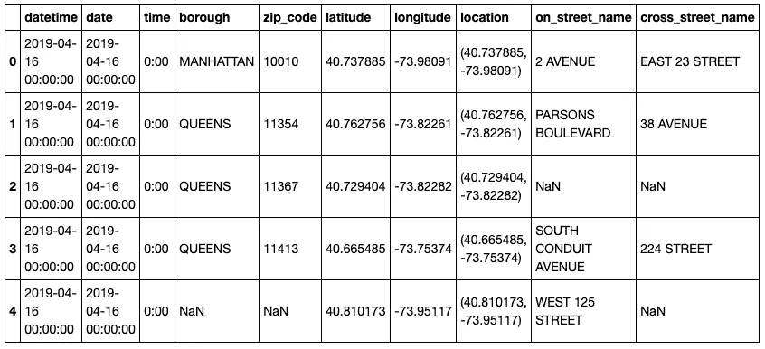

Format of the minimally processed accident DataFrame

第二个数据集是交通量计数(2014–2018)数据集。该数据集包含位置、交通方向和每小时记录的车辆数量。

 [## 交通量统计(2014-2018) |纽约市开放数据

### 编辑描述

data.cityofnewyork.us](https://data.cityofnewyork.us/Transportation/Traffic-Volume-Counts-2014-2018-/ertz-hr4r) 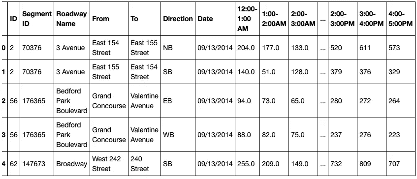

Format of the minimally processed traffic volume DataFrame

在这项研究中。我们要问的问题广泛涉及整个纽约的所有事故，因此不需要事故的具体地点或车辆数量。我们将转换和汇总事故(和计数)，给出每小时的计数。事故数据集中的每个条目都与一个事故有关，因此我们可以按日期和时间进行排序，并将它们聚合起来以获得计数。交通量数据已经按小时和天进行了分类，我们只需对这些特征进行分类，并对所有不同道路的观测数据进行计数。

## 体积数据

通过上面的链接下载的. csv 文件中的体积数据被导入到 pandas 数据帧中。这些数据是以杂乱的格式提供的——每个小时都是包含计数的单独一列。单独的小时列被合并成一个时间列，每个时间跨度减少到一个小时，表示小时窗口的开始。

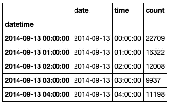

Final format of the traffic volume DataFrame. All data has been aggregated by hour

因为我们对全市的交通感兴趣，所以每天和每个小时都被聚合起来，以提供一个包含日期、时间和车辆数量的新数据帧。这是之前使用的数据集。

Average traffic volume for each hour across the entire dataset showing a peak in traffic volume at 8 am and again at 5pm, corresponding to morning and evening rush hours

## 事故数据

事故数据被导入，列标题以类似于体积数据的方式转换。数据集中的每条线代表向 NYPD 报告的事故的时间和位置。

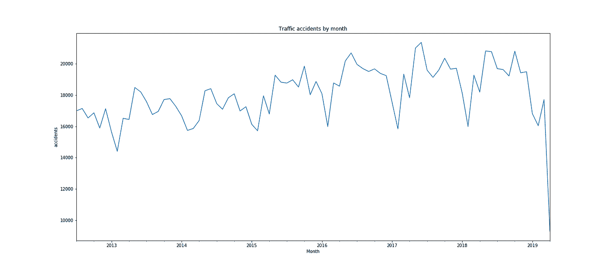

Time course of the total number of accidents per month

通过按日期和小时分组并对结果行进行计数，生成了一个新的数据帧。这给出了与交通量数据格式相似的数据帧:交通量；日期；小时；和事故计数。

# 探索性数据分析

## 体积数据

对体积数据的初步研究表明，值> 0 的计数非常稀少，这在原始数据格式中并不明显。大约 73%的条目是 0 值。当排除所有 0 值时，计数直方图显示最小的箱包含最多的计数。每个聚类的开始日期和结束日期是通过遍历日期并检查计数是否存在来确定的。一旦定义了日期区域，超过每天 25，000 次计数的任意阈值的值将被复制到新的数据帧中。这提供了 7，944 个交通量数据点用于与交通事故数据相结合。

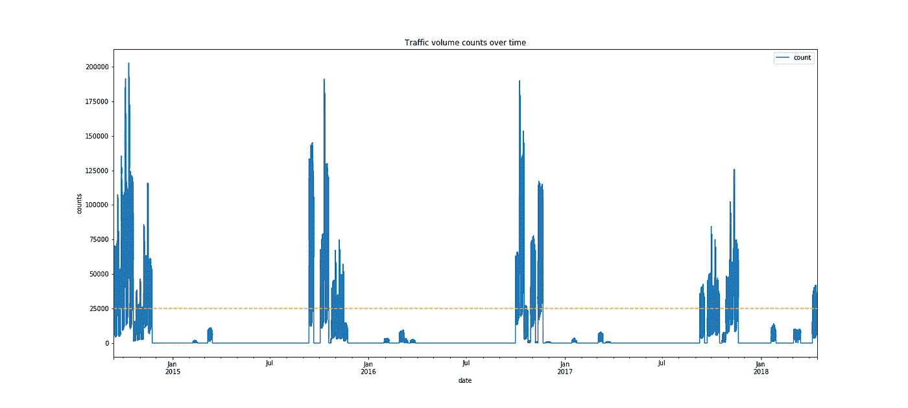

Time course of the number of counts over time. Regions of high counts are separated by low or zero count periods. The orange line corresponds to the threshold that was set for data that was used in this study

绘制每天的小时计数显示了双峰分布，这是可以预期的，因为交通流量通常在每天早晚高峰时达到两次峰值。

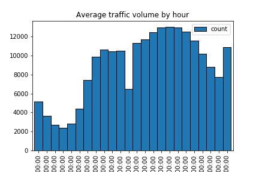

## 事故数据

事故数据也按日期和时间分组，并创建一个新的数据框架，记录日期和时间，包括记录的事故数量。绘制这些数据会导致与交通量数据有些相似的双峰分布。

既然我们已经以我们想要的形式获得了两个数据集，我们就可以使用两个数据集都有计数数据的所有日期和时间。体积数据是限制数据，并且基于阈值选择以提供 7，944 个数据点。为了获得相应小时的体积数据的事故数据，我们执行了体积数据与事故数据的内部合并，只保留包含匹配日期和时间的行。

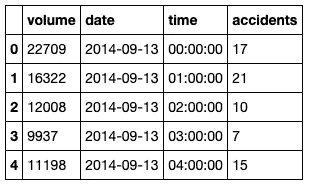

Final form of the DataFrame containing combined traffic volume and accident counts

快速检查显示，我们的最终数据帧包含日期、时间、体积和事故列，以及 7，944 行。以这种方式按小时对事故数据进行分组导致将 179，026 个单独的事故聚集到 7，944 个每小时的时间点。

由于车流量和交通事故的计数相差悬殊(这是好事！)每小时最大值的分数通过将每小时计数除以每小时最大计数来计算。这使得数据集之间可以进行直接比较。当重叠时，交通和事故数据显示类似的模式。

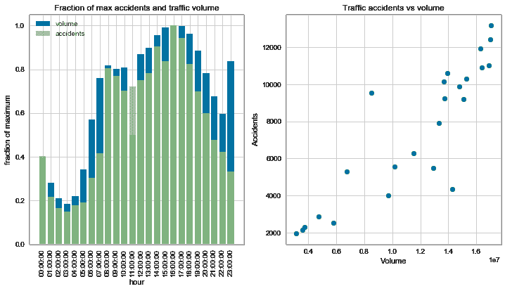

Left — overlay of the fraction of max traffic volume and accident data showing similar trends. Right — scatter plot of the fraction max volume verses fraction max accidents.

当我们将这些未转换的数据相互作图时，我们观察到一种大致线性的关系。观察到这一点，我们提出了这个问题；我们能不能用一个线性回归模型来代表整个纽约的交通事故和交通流量之间的关系。线性回归可以说是可用的最简单的模型之一

我们建立了一个线性回归模型，看看它在复制数据方面有多有效。这个模型也允许正则化来确定重要的系数。这些系数虽然对确定回归线很重要，但也可以表明一天中事故风险增加或减少的时段。考虑到这是计数数据，我们还可以建立泊松回归模型进行比较。

# 模型结构

在这项工作中，我们采用了一个丰富的数据集，并随着时间的推移将其提取为简单的计数。线性回归可以说是最简单的机器学习算法之一，所以我们将把它应用到我们的问题中，看看一个简单模型的预测能力如何。

## 1.线性回归

现在我们有了一个包含日期、时间、体积计数和事故计数的数据框架，我们可以开始构建我们的模型了。为了回答我们的第一个问题，事故数量仅仅是交通量的函数吗？我们忽略了日期和时间，仅将模型拟合到交通量。我们使用在 scikit-learn 中实现的普通最小二乘(OLS)线性回归模型。五重交叉验证(CV)的结果给出了 0.07 的平均 R 值，表明事故数量与交通量本身没有太大的相关性。

我们尝试的第二个模型是另一个 OLS 线性回归，这一次数据按小时聚合，每个小时用虚拟变量表示。该日期也由对应于数据集中第一个日期之后的天数的整数表示。该模型表现得更好，平均 5 倍 CV R 值为 0.63。考虑到数据取自纽约市所有的事故，交通量仅从统计的街道子集推断，这是相当了不起的。

残差图显示它们以 0 为中心，但模式应该是完全随机的。这些值向较大的 X 值呈扇形散开，表明它们存在一些异方差。预测值的直方图显示它们再次以零为中心，有一些向左倾斜。

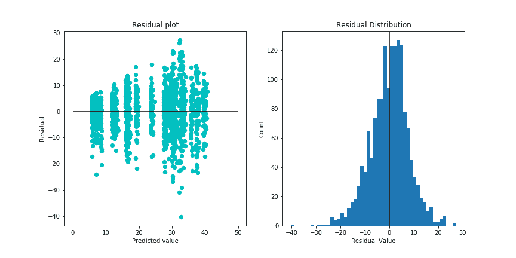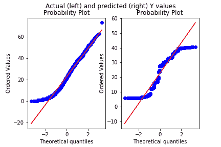

左上图显示了*实际*小时事故的分布与正态分布。在大多数情况下，数据遵循正态分布，从数据偏离左手边的对角线可以看出左偏斜。右图显示了*预测的*事故分布与正态分布的对比。上限值偏离对角线可能表明模型分散不足。

## 2.泊松回归

泊松回归是另一种广义线性模型，用于对计数数据建模。交通流量和交通事故是计数数据的示例，即只能是非负整数值的数据。例如，发生-3 次或 1.5 次事故是没有意义的。泊松回归的一个假设是响应变量 Y 遵循泊松分布。我们再次在 statsmodel 模块中使用广义线性模型。将泊松回归应用于我们的数据，我们立即看到 chi2 值为 1.86e4。如果数据遵循泊松分布，方差将等于均值，从而使 chi2 值更接近 1。显然，这不是该数据的最佳模型。我们可以尝试负二项式回归，它是泊松模型的一种推广，具有一个宽松的要求，即方差不必等于均值。

## 3.负二项式回归

负二项式模型类似于泊松模型，增加了一个变量α，以降低严格的方差要求。泊松回归过程中发现的λ值用于确定最佳 alpha 值(有关教程，请参见:[https://towardsdatascience . com/negative-binomial-regression-f 99031 bb 25 b 4](/negative-binomial-regression-f99031bb25b4))。发现α值为 0.071，当使用该值进行负二项式回归时，结果模型显示出统计显著性，这改进了泊松回归的模型。

# 4.套索回归

我们感兴趣的第二个问题是，是否在一天中的某个特定时间发生事故的风险更高。测试这一点的一种可能方式是使用正则化来执行特征选择。为此，我们将 L1 正则化应用于线性回归。Lasso 或 L1 正则化将不重要的系数缩小到 0，从而为更简洁的模型选择最重要的特征。通过将 lasso 正则化应用于我们的线性模型，最慢接近 0 的特征对于模型的拟合是最重要的。我们选择α值为 0.001、0.25 和 0.5。应用较高的 alpha 值会将更多的系数减少到 0。应用 0.25 的 alpha 值，R 值减少到 0.52。24 个小时系数中有 7 个降低到 0，表明这些对模型的拟合最不重要。其余系数中，最高值出现在下午 2-6 点，峰值出现在下午 4 点，其次是上午 8 点。

这些系数很好地对应了早晚高峰时间。不出所料，交通量的系数在 5.6e-5 处为最小值，这与仅拟合交通量时模型的 R 值较差相一致。如果我们观察 lasso 回归的概率图，我们会发现尽管 R 值降低了，但数据还是具有更正态的分布。

# 评估模型

将每个回归的测试集的预测与一天的事故数据进行比较，可以发现所有模型都显示出非常一致的预测。这些模型似乎再现了总体趋势，但普遍高估了事故数量。预测中的偏差，至少对于线性和 lasso 回归，反映在它们适度的 R 值中。同样显而易见的是，lasso 回归具有较低的 R 值，因为它在特定区域而不是整体上失去了预测能力。

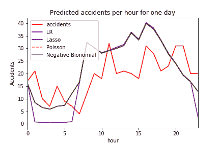

Overlay of predicted accidents on accidents per hour for a selected day

当我们对测试集中所有每小时的事故计数进行平均并将模型与之进行比较时，我们当然会看到极好的一致性，这表明模型捕捉到了数据的平均属性。

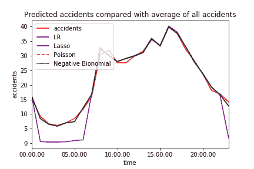

Overlay of predicted accidents on average accidents per hour

# 结论

3.5 年内的 179，026 起事故按小时汇总，并与交通量数据相匹配，以提供包含 7，944 个每小时数据点的最终数据集。

线性回归表明，交通量本身是纽约市交通事故的不良预测因素。进一步 L1 正则化强调的回归系数显示，下午 4 点是最有可能发生事故的时间。

这种模式的局限性包括:

*   从道路子集推断整个纽约都会区的交通量。为了提高模型的准确性，参与统计的街道可以与事故数据相匹配，而不是在整个 302 平方英里的城市中进行概化。
*   交通量数据中观察到的计数可变性表明测量不一致，因此可能导致计数不准确。
*   按小时汇总不考虑交通模式的波动，例如正常交通的季节性或月度变化。

考虑这些因素中的任何一点都可以提高我们模型的准确性。