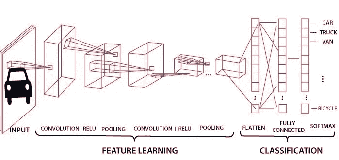
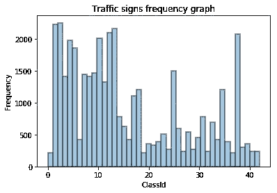

# 基于卷积神经网络的交通标志检测

> 原文：<https://towardsdatascience.com/traffic-sign-detection-using-convolutional-neural-network-660fb32fe90e?source=collection_archive---------5----------------------->

## 我们将建立一个 CNN 模型，以检测交通标志。



CNN Model

如果你想从事计算机视觉领域的职业，学习卷积神经网络或 ConvNets 或 CNN 是非常重要的。CNN 有助于直接在图像上运行神经网络，并且比许多深度神经网络更有效和准确。与其他模型相比，ConvNet 模型在图像上的训练更容易、更快。

如果你不熟悉 ConvNet 的基础知识，你可以从[这里](https://medium.com/@sdoshi579/convolutional-neural-network-learn-and-apply-3dac9acfe2b6)学习。

我们将使用`keras`包来建立 CNN 模型。

# 获取数据集

德国交通标志检测数据集在此提供[。该数据集由 43 个不同类别的 39209 幅图像组成。这些图像在这些类别之间分布不均匀，因此该模型可以比其他类别更准确地预测一些类别。](http://benchmark.ini.rub.de/)

我们可以用各种图像修改技术填充数据集，如旋转、颜色失真或模糊图像。我们将在原始数据集上训练模型，并将查看模型的准确性。然后，我们将添加更多的数据，使每个类均匀，并检查模型的准确性。

# 数据预处理

CNN 模型的局限性之一是它们不能在不同维度的图像上进行训练。因此，数据集中必须有相同维度的图像。

我们将检查数据集的所有图像的尺寸，以便我们可以将图像处理成具有相似的尺寸。在该数据集中，图像具有从 16*16*3 到 128*128*3 的非常动态的尺寸范围，因此不能直接传递给 ConvNet 模型。

我们需要将图像压缩或插值成一维图像。不，为了压缩大部分数据，不要过度拉伸图像，我们需要确定两者之间的维度，并保持图像数据的最大准确性。我决定用 64*64*3 的尺寸。

我们将使用`[opencv](https://opencv-python-tutroals.readthedocs.io/en/latest/py_tutorials/py_setup/py_intro/py_intro.html)`包将图像转换成给定的尺寸。

```
import cv2def resize_cv(img):
    return cv2.resize(img, (64, 64), interpolation = cv2.INTER_AREA)
```

`cv2`是`opencv`的一个包。`[resize](https://opencv-python-tutroals.readthedocs.io/en/latest/py_tutorials/py_imgproc/py_geometric_transformations/py_geometric_transformations.html?highlight=resize#scaling)`方法将图像变换到给定的维度。在这里，我们将图像转换为 64*64 的尺寸。插值将定义您想要使用哪种类型的技术来拉伸或压缩图像。Opencv 提供了 5 种类型的插值技术，基于它们用来评估结果图像的像素值的方法。技法有 [](https://docs.opencv.org/2.4/modules/imgproc/doc/geometric_transformations.html#resize) `[INTER_AREA, INTER_NEAREST, INTER_LINEAR, INTER_CUBIC, INTER_LANCZOS4](https://docs.opencv.org/2.4/modules/imgproc/doc/geometric_transformations.html#resize)`。我们将使用`INTER_AREA`插值技术，它更适合图像抽取，但对于外推技术，它类似于`INTER_NEAREST`。我们可以使用`INTER_CUBIC`,但是它需要很高的计算能力，所以我们不会使用它。

# 数据加载

上面我们学习了如何预处理图像。现在，我们将加载数据集，并在决定的维度中转换它们。

该数据集总共包括 43 个类。换句话说，该数据集中有 43 种不同类型的交通标志，每个标志都有自己的文件夹，由不同大小和清晰度的图像组成。数据集中总共有 39209 幅图像。

我们可以绘制不同交通标志的图像数量直方图。

```
import seaborn as sns
fig = sns.distplot(output, kde=False, bins = 43, hist = True, hist_kws=dict(edgecolor="black", linewidth=2))
fig.set(title = "Traffic signs frequency graph",
        xlabel = "ClassId",
        ylabel = "Frequency")
```



Traffic signs frequency graph

ClassId 是为每个唯一的交通标志指定的唯一 Id。

正如我们从图表中看到的，数据集并不包含每个类别的等量图像，因此，该模型在检测某些交通标志时可能会比其他交通标志更准确。

我们可以通过使用旋转或扭曲技术改变图像来使数据集一致，但我们将在其他时间这样做。

由于数据集被划分到多个文件夹中，并且图像的命名不一致，我们将通过将(64*64*3)维中的所有图像转换到一个列表`list_image` 中，并将它相似的交通标志转换到另一个列表`output`中来加载所有图像。我们将使用`imread`读取图像。

```
list_images = []
output = []
for dir in os.listdir(data_dir):
    if dir == '.DS_Store' :
        continue

    inner_dir = os.path.join(data_dir, dir)
    csv_file = pd.read_csv(os.path.join(inner_dir,"GT-" + dir + '.csv'), sep=';')
    for row in csv_file.iterrows() :
        img_path = os.path.join(inner_dir, row[1].Filename)
        img = imread(img_path)
        img = img[row[1]['Roi.X1']:row[1]['Roi.X2'],row[1]['Roi.Y1']:row[1]['Roi.Y2'],:]
        img = resize_cv(img)
        list_images.append(img)
        output.append(row[1].ClassId)
```

`data_dir`是数据集所在目录的路径。

数据集已加载，现在我们需要将其分为训练集和测试集。也在验证集中。但是如果我们直接分割，那么模型将不会得到所有交通标志的训练，因为数据集不是随机的。所以，首先我们将随机化数据集。

```
input_array = np.stack(list_images)import keras
train_y = keras.utils.np_utils.to_categorical(output)randomize = np.arange(len(input_array))
np.random.shuffle(randomize)
x = input_array[randomize]
y = train_y[randomize]
```

我们可以看到，我已经将输出数组转换为分类输出，因为模型将以这种方式返回。

现在，分割数据集。我们将以 60:20:20 的比例将数据集分别拆分为训练数据集、验证数据集和测试数据集。

```
split_size = int(x.shape[0]*0.6)
train_x, val_x = x[:split_size], x[split_size:]
train1_y, val_y = y[:split_size], y[split_size:]split_size = int(val_x.shape[0]*0.5)
val_x, test_x = val_x[:split_size], val_x[split_size:]
val_y, test_y = val_y[:split_size], val_y[split_size:]
```

# 训练模型

```
from keras.layers import Dense, Dropout, Flatten, Input
from keras.layers import Conv2D, MaxPooling2D
from keras.layers import BatchNormalization
from keras.optimizers import Adam
from keras.models import Sequentialhidden_num_units = 2048
hidden_num_units1 = 1024
hidden_num_units2 = 128
output_num_units = 43epochs = 10
batch_size = 16
pool_size = (2, 2)
#list_images /= 255.0
input_shape = Input(shape=(32, 32,3))model = Sequential([Conv2D(16, (3, 3), activation='relu', input_shape=(64,64,3), padding='same'),
 BatchNormalization(),Conv2D(16, (3, 3), activation='relu', padding='same'),
 BatchNormalization(),
 MaxPooling2D(pool_size=pool_size),
 Dropout(0.2),

 Conv2D(32, (3, 3), activation='relu', padding='same'),
 BatchNormalization(),

 Conv2D(32, (3, 3), activation='relu', padding='same'),
 BatchNormalization(),
 MaxPooling2D(pool_size=pool_size),
 Dropout(0.2),

 Conv2D(64, (3, 3), activation='relu', padding='same'),
 BatchNormalization(),

 Conv2D(64, (3, 3), activation='relu', padding='same'),
 BatchNormalization(),
 MaxPooling2D(pool_size=pool_size),
 Dropout(0.2),Flatten(),Dense(units=hidden_num_units, activation='relu'),
 Dropout(0.3),
 Dense(units=hidden_num_units1, activation='relu'),
 Dropout(0.3),
 Dense(units=hidden_num_units2, activation='relu'),
 Dropout(0.3),
 Dense(units=output_num_units, input_dim=hidden_num_units, activation='softmax'),
])model.compile(loss='categorical_crossentropy', optimizer=Adam(lr=1e-4), metrics=['accuracy'])trained_model_conv = model.fit(train_x.reshape(-1,64,64,3), train1_y, epochs=epochs, batch_size=batch_size, validation_data=(val_x, val_y))
```

我们已经使用了`keras`包。

对于了解每一层的意义你**可以阅读** [**这篇博客**](https://medium.com/@sdoshi579/convolutional-neural-network-learn-and-apply-3dac9acfe2b6) **。**

# 评估模型

```
model.evaluate(test_x, test_y)
```

该模型得到评估，你可以找到 99%的准确性。

# 预测结果

```
pred = model.predict_classes(test_x)
```

您可以预测每个图像的类别，并验证模型的工作方式。

你可以在这里 找到整个**工作** [**代码。**](https://gist.github.com/sdoshi579/748fa76919ffe35a78fff24ce22b43a3)