# 制作:风的轨迹

> 原文：<https://towardsdatascience.com/trails-of-wind-39967f07a67f?source=collection_archive---------17----------------------->

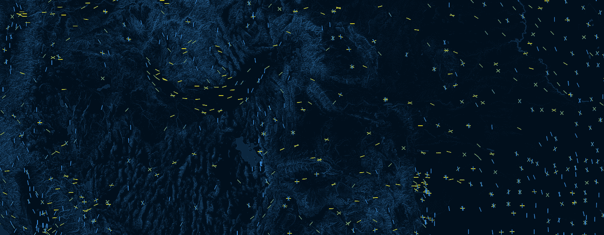

## *我们如何创建了一个机场跑道全球建筑的地图，结果是一个风的地图。*

> 这篇文章是由[大卫·埃尔斯什](https://twitter.com/ElscheDavid)、[斯特芬·汉斯奇](https://twitter.com/steffenhaensch)和[萨沙·科莱](https://twitter.com/sascha_collet)合作完成的。

 [## 风的轨迹——机场跑道的建筑

### 空中旅行已经存在了一百多年。自成立以来，数以千计的机场跑道已经…

trailsofwind.figures.cc](https://trailsofwind.figures.cc/) 

当在飞机上飞行时，人造建筑以及它们如何改变地球的面貌令人叹为观止。鸟瞰图为人类如何与景观互动提供了一个全新的视角，利用每个山谷建造村庄，在森林周围塑造田野，在山路上修建高速公路。然而，一些最大的人造建筑是航空旅行本身所需要的:机场。但是为什么它们被建成现在的样子，跑道的方向是如何确定的呢？

在做了一些研究后，我们发现大多数机场跑道都建在该地区的平均风向上，以防止[侧风着陆](https://en.wikipedia.org/wiki/Crosswind_landing)，这对飞机和乘客都是危险的。在风向非常不规则的地区，跑道通常被设计成不同的方向，以确保运行过程的平稳。这就是为什么在这样的地区，机场不仅有平行的跑道，还会根据风向的变化形成不同的形状，比如三角形和正方形。

***机场跑道形状***

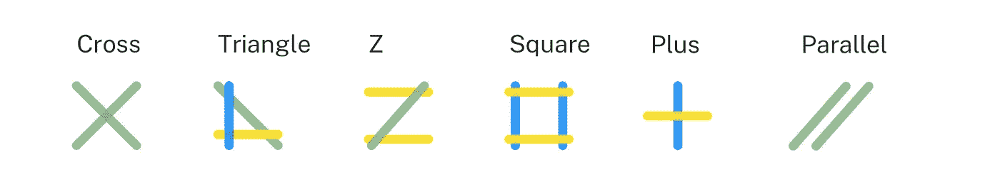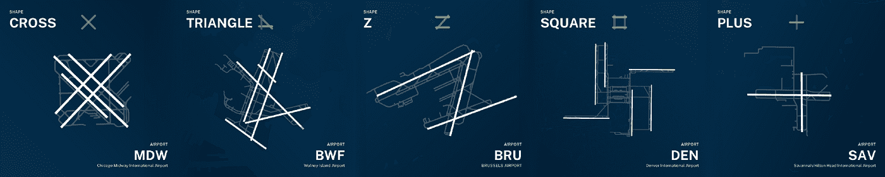

我们的结论是，机场的方位和巨大数量理论上可以提供一个地区的大致风向信息，因为机场在其建筑中反映了风向。

# 数据探索

***工具*** *JupiterLab，牛郎星*

 [## 开放数据@我们的机场

### 对于更密集的工作，我们有一个 CSV 格式的所有机场、国家和地区的数据转储，我们更新…

ourairports.com](http://ourairports.com/data/) 

在寻找合适的记录时，我们看到了 [*我们的报告*](http://ourairports.com/data/) 页面。它包含了世界上所有机场的广泛集合，还提供了进一步的信息，如**乘客频率**、高于的**海拔**和低于海平面**的**以及另一个具有关于跑道(长度、宽度、表面等)的详细参考的数据集。).在移除了不相关的数据，如**直升机场**、**关闭的机场**和**没有坐标的跑道**之后，我们将跑道数据集与机场数据集进行了比较。****

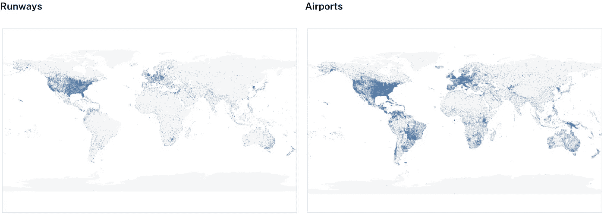

如您所见，数据集中的许多跑道都没有地理配准，这就是大量跑道无法显示的原因。由此导致的许多机场的缺乏在南美、非洲和巴布亚新几内亚尤为明显。

在使用 follow 初步可视化跑道以查看数据集中偏离的跑道线后，我们手动消除了错误。

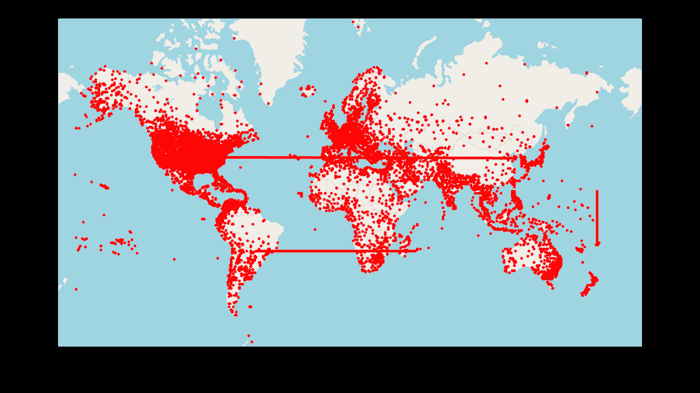

跑道在长度和宽度方面有很大的不同，在大多数情况下遵循在机场降落的飞机类型的规格。一种类型的飞机起飞所需的跑道长度取决于各种属性，如重量、空气动力学、发动机和当地气压，对于一架 [A380(见第 130 页)](https://www.airbus.com/content/dam/corporate-topics/publications/backgrounders/techdata/aircraft_characteristics/Airbus-Aircraft-AC-A380.pdf)来说，长度在几百米到几千米之间。

这个可视化的数据集显示，跑道的宽度比长度有更清晰的结构。

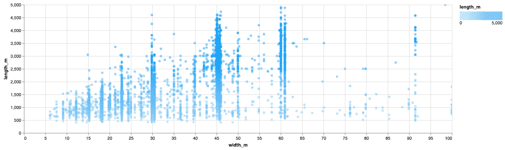

为了比较跑道方向，统一显示它们是很重要的。我们用 [Geographiclib](https://pypi.org/project/geographiclib/) 计算了跑道端点坐标之间的中点，并计算了相对于南北轴的旋转角度，以便稍后在地图上投影这些线。

计算出各自的角度后，是时候看看全球跑道的方向了。因此，我们将方位减少到几乎 179°的半圆，以避免重复计算角度(因为着陆带可以从两侧飞行),并给出更清晰的表示。

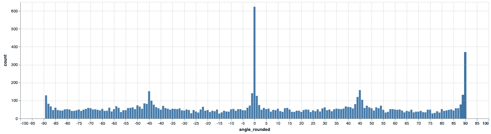

这里引人注目的是跑道朝向磁北极的高架方向。在南北轴(0°)和东西轴(90°**)**可以看到明显增加的数量，较小的峰值在 45°和-45°处。

为了在 web 应用程序中进一步使用，所有不重要的信息都被删除并导出到最终的 JSON 文件中。坐标点四舍五入到小数点后六位数，以减小文件大小。

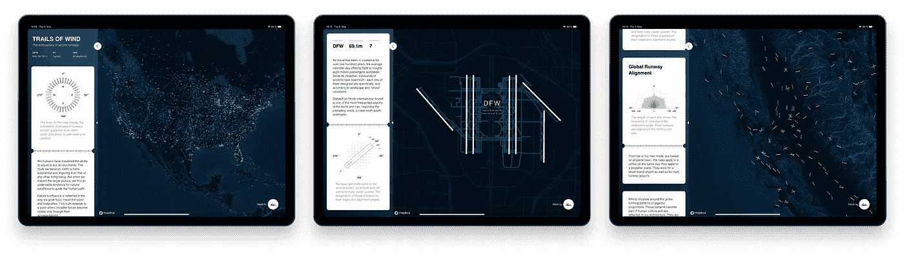

# 设计

***工具*** *Sketchapp，Mapbox Studio*

为了可视化我们的发现，我们需要一个交互式的世界地图，它将跑道绘制成可比较的线条，并给出各个跑道的详细视图。

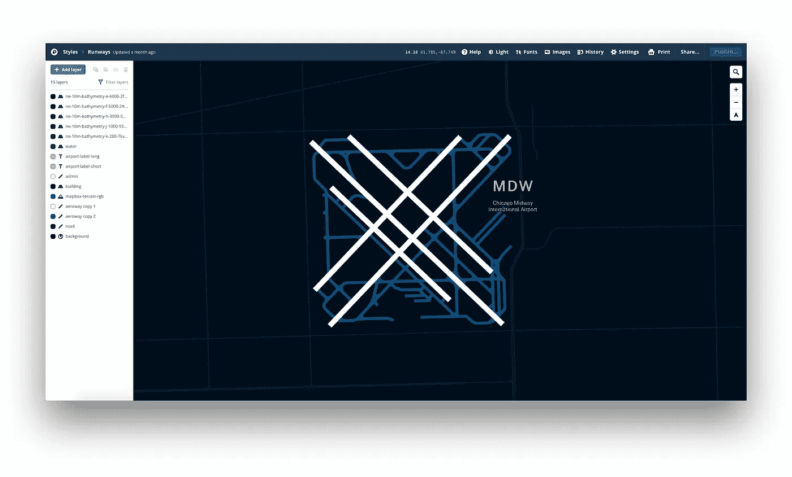

Mapbox Studio Interface

Mapbox Studio 提供了用您自己的设计来设计 Openstreet 地图数据的可能性，以及添加额外的外部地图数据和字体的可能性。为了可视化实际的地图，我们的挑战是使地图尽可能简单，同时提供适当的方向信息。

应该表示以下元素。

*   **跑道**
*   **滑行道**
*   **立面模型**
*   **水**
*   **街道**
*   **国家边界**
*   **机场名称**
*   **国际航空运输协会机场代码**

由三个字母组成的国际航空运输协会-机场代码用于准确识别机场。类似于国家的 ISO 代码。

这也用于设计机场机票，我们想把它放在微型网站的侧边栏中。在这些票的帮助下，可以讲述一个带有相应的可视化、图例和插图的故事。

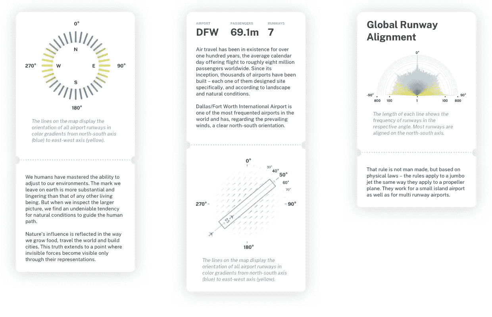

在完整的桌面版本中，用户可以在地图上自由导航，也可以在侧边栏中滚动讲故事。在智能手机版本中，地图用于在滚动浏览故事的同时显示我们探索的本质，因为地图上许多线条的表示非常注重性能，并且导航有限。为了在移动设备上提供更好的用户体验，重点应该是故事而不是免费导航。

在探险中还有许多其他有趣的发现。然而，为了保持故事简短切题，我们在我们的社交媒体账户中发布了有趣的事实作为预尝，而不是用太多的信息塞满网站。

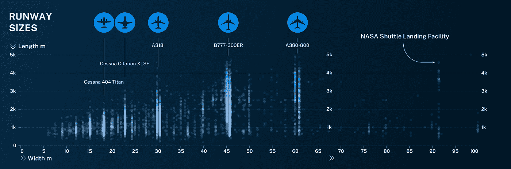

# 编码

***主要工具*** React.js，D3.js，Mapbox GL，Typescript，React Waypoints

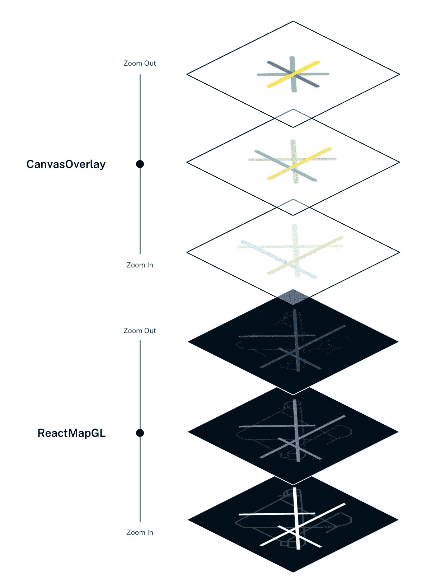

我们的微型网站的基础是 react-map-gl，一个绑定到 Mapbox GL JS 的 react，它允许我们显示我们自己在 Mapbox Designstudio 中创建的地图设计。地图上的画布覆盖使线条的实际可视化成为可能。

为了在缩放时使线条变小并消失，我们使用了 D3 提供的缩放功能。

React Waypoints 提供了在滚动侧边栏时触发某些事件的可能性，以便使用 react-map-gl 提供的 fly to 插值器飞到地图的区域。

虽然在 Sketchapp 中有两个侧边栏图形被设计并导出为静态 SVG，但所有跑道的分布表示必须通过编程来创建。为了不超出南北轴上的计数范围，对数标度是必要的。同时，可视化应该与地图直接联系起来理解，这就是为什么线的径向表示似乎是最合适的，能够直接在地图上读取角度。

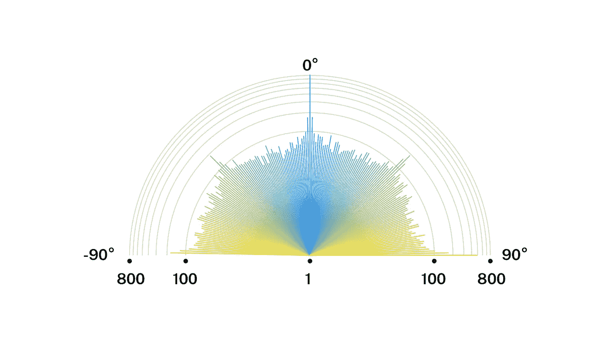

# 结论

像往常一样，我们会在项目上花更多的时间来展示更多有趣的事实和见解。

未来，我们希望直接从 [OpenStreetMap](http://www.openstreetmap.org) 中提取跑道数据，以增加显示机场的数量。此外，可以添加一个带有一些过滤器的微型网站，以便根据某些标准搜索跑道。为了提高性能，还可以为显示的行编写自己的着色器。

我们乐于分享我们的知识，并一直在寻找新的挑战和跨学科的项目和合作伙伴。

我们将非常高兴收到您的反馈。