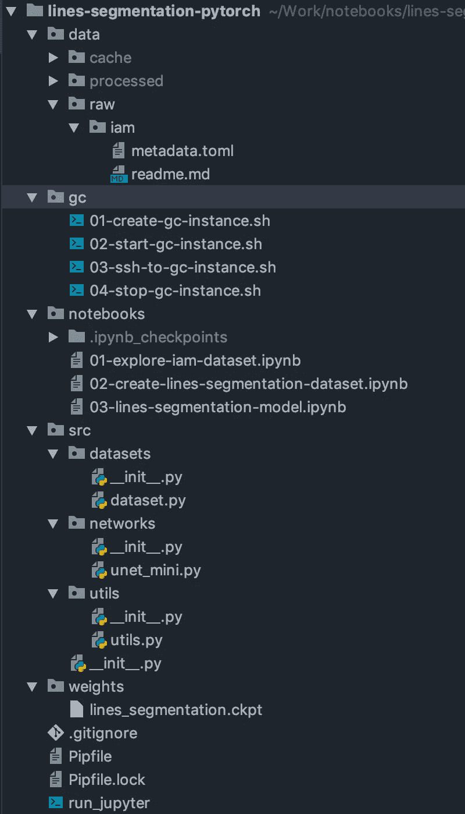
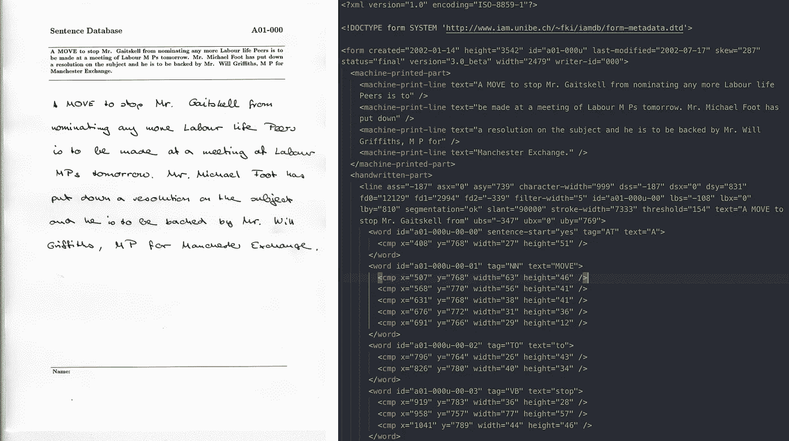
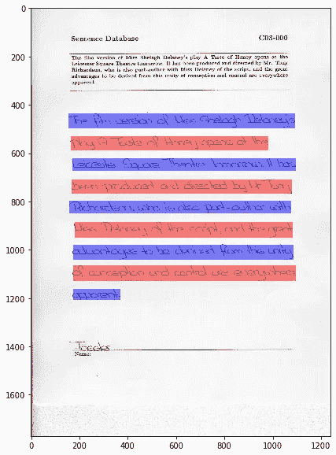
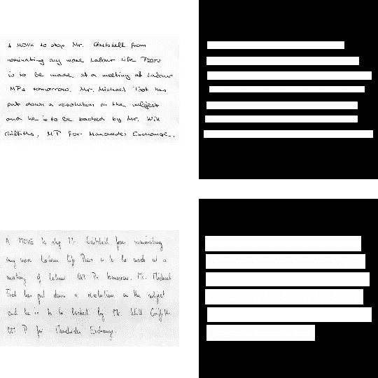
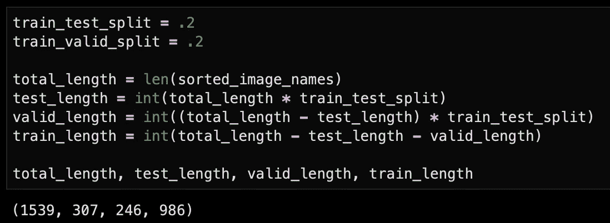
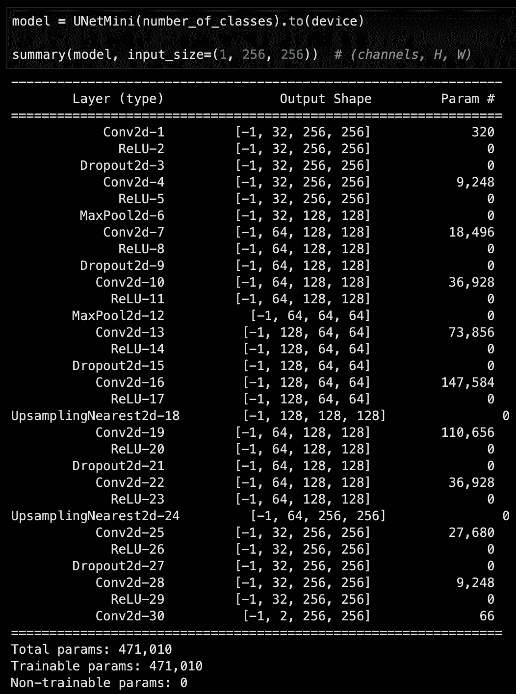
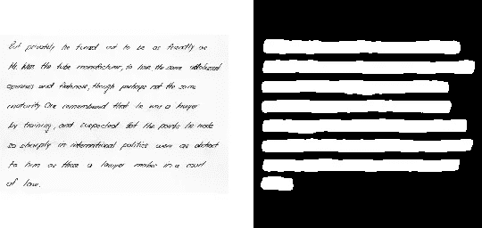

# 使用 Pytorch 训练线条分割模型

> 原文：<https://towardsdatascience.com/train-a-lines-segmentation-model-using-pytorch-34d4adab8296?source=collection_archive---------9----------------------->

让我们从确定[我们想要解决的问题](https://github.com/full-stack-deep-learning/fsdl-text-recognizer-project/blob/5574813a0ee48cccd067092e5bd024953c264f67/lab6_sln/readme.md#lab-6-line-detection)开始，这个问题是由[这个项目](https://github.com/full-stack-deep-learning/fsdl-text-recognizer-project)激发的。

> 给定包含文本行的图像，返回该图像的像素标签，每个像素属于背景或手写行。

# [项目](https://github.com/MostafaGazar/lines-segmentation-pytorch)结构

它由 5 个主要部分组成，一个用于笔记本，一个用于共享 python 代码、数据集、Google Cloud 脚本，一个用于保存模型权重。



在一个生产项目中，您可能会有更多像`web`和`api`这样的目录。

我还选择使用`pipenv`而不是`conda`和`virtualenv`来管理我的 python 环境。我最近才从`conda`切换到`pipenv`，我发现它在任何地方都能一如既往地正常工作。

对于 GPU 培训，我使用了一个谷歌云实例和一个 T4 英伟达 GPU。Bash 脚本管理实例的生命周期，从最初创建到启动、连接和停止。

## 数据

数据集在`raw`目录中的`[toml](https://en.wikipedia.org/wiki/TOML)`文件中描述，一个`toml`文件基本上由键、值对组成。git 忽略了`data`下的其他目录，因为它们将包含实际的完整数据集下载。

## 笔记本电脑

我使用笔记本进行探索，并将其作为构建、清理数据集和构建培训基本管道所需代码的高级容器。

## Python 文件

在`src`目录下，我保存了可以在不同笔记本之间共享和重用的代码。遵循良好的软件工程实践是快速正确完成工作的关键，在 ML 代码中发现和识别 bug 是非常困难的。这就是为什么你要从小处着手，并经常重申。

## python 环境

您可以使用以下命令使用 [linuxbrew](https://docs.brew.sh/Homebrew-on-Linux) 或 [macbrew](https://brew.sh) 在 Linux 或 mac 上安装`pipenv`:

```
brew install pipenv
```

然后您可以使用`pipenv install SOMETHING`从您的项目目录中下载您的依赖项。

# 数据集

我将使用这个[旧的学术数据集](http://www.fki.inf.unibe.ch/databases/iam-handwriting-database)作为基础来构建线条分割数据集，以训练一个 [UNet](https://arxiv.org/pdf/1505.04597.pdf) 小型网络来检测手写线条。

数据集中的原始图像如下所示，它们还带有定义边界框的 XML 文件。



在`notebooks/01-explore-iam-dataset.ipynb`我下载了数据集，解压后用 XML 文件中的数据叠加了一些随机图像。



接下来，我裁剪图像并生成遮罩图像来匹配新的尺寸。遮罩图像是我们将用于训练最终模型的地面真实图像。



最后，我将数据分为训练、有效和测试



# 网络

因为我们没有很多数据可用于训练，所以我使用了一个基于 Keras 实现的迷你版本的 UNet 架构。

使用这个巨大的库，我可以通过一个特定输入大小的前馈来可视化网络。



# 培训渠道

既然我们已经准备好了数据，并且定义了我们想要训练的网络，那么是时候建立一个基本的训练管道了。

首先是定义一个火炬`dataset`，并使用`DataLoader`遍历它

```
from torch.utils.data import Dataset, DataLoader
from torchvision import transforms, utils class FormsDataset(Dataset): def __init__(self, images, masks, num_classes: int, transforms=None):
        self.images = images
        self.masks = masks
        self.num_classes = num_classes
        self.transforms = transforms

    def __getitem__(self, idx):
        image = self.images[idx]
        image = image.astype(np.float32)
        image = np.expand_dims(image, -1)
        image = image / 255
        if self.transforms:
            image = self.transforms(image)

        mask = self.masks[idx]
        mask = mask.astype(np.float32)
        mask = mask / 255
        mask[mask > .7] = 1
        mask[mask <= .7] = 0
        if self.transforms:
            mask = self.transforms(mask)

        return image, mask

    def __len__(self):
        return len(self.images)train_dataset = FormsDataset(train_images, train_masks, number_of_classes, get_transformations(True))
train_data_loader = DataLoader(train_dataset, batch_size=batch_size, shuffle=True)
print(f'Train dataset has {len(train_data_loader)} batches of size {batch_size}')
```

接下来，我定义训练循环

```
# Use gpu for training if available else use cpu
device = torch.device('cuda:0' if torch.cuda.is_available() else 'cpu')# Here is the loss and optimizer definition
criterion = torch.nn.NLLLoss()
optimizer = torch.optim.Adam(model.parameters(), lr=learning_rate)# The training loop
total_steps = len(train_data_loader)
print(f"{epochs} epochs, {total_steps} total_steps per epoch")for epoch in range(epochs):
    for i, (images, masks) in enumerate(train_data_loader, 1):
        images = images.to(device)
        masks = masks.type(torch.LongTensor)
        masks = masks.reshape(masks.shape[0], masks.shape[2], masks.shape[3])
        masks = masks.to(device)

        # Forward pass
        outputs = model(images)
        softmax = F.log_softmax(outputs, dim=1)
        loss = criterion(softmax, masks)

        # Backward and optimize
        optimizer.zero_grad()
        loss.backward()
        optimizer.step()

        if (i) % 100 == 0:
            print (f"Epoch [{epoch + 1}/{epochs}], Step [{i}/{total_steps}], Loss: {loss.item():4f}")
```

以下是最终的预测



你可以点击查看 TF2 支持的 Keras 项目。

谢谢你能走到这一步。我想说的最后一点是，不幸的是，大多数可用的在线材料要么提供了糟糕的建议，要么非常基本，它们实际上没有提供多少价值，有些是完全错误的。有一些很棒的资源，比如他们的 60 分钟闪电战系列(T1)和很棒的 T2 API 文档(T3)。还有这个[小抄](https://pytorch.org/tutorials/beginner/ptcheat.html?highlight=loss)和这个[伟大的 GitHub 回购](https://github.com/yunjey/pytorch-tutorial)。

如果你喜欢阅读这篇文章，或者觉得它有帮助，我很乐意收到你的来信，给我留言或者在 Twitter 上关注我，当我发布新内容时，你会得到通知。