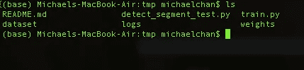
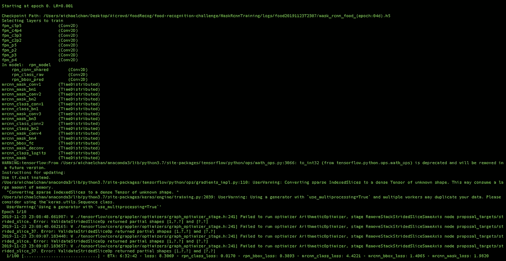

# 训练自定义数据集掩码 RCNN

> 原文：<https://towardsdatascience.com/train-custom-dataset-mask-rcnn-6407846598db?source=collection_archive---------11----------------------->

## 在 Mask RCNN 模型上轻松训练自定义数据集的教程:终于轮到你了！


如何使用自定义数据集训练掩膜 RCNN 模型的分步说明。

## 要求

首先简单地克隆下面的库，它是一个单独类分段的演示。(我们也将涵盖多个类别)。

```
git clone [https://github.com/miki998/Custom_Train_MaskRCNN](https://github.com/miki998/Custom_Train_MaskRCNN)
```

正如 README.md 中提到的，需要安装一个 mrcnn 库，这个库不是标准的。您只需要做以下事情:

```
git clone [https://github.com/matterport/Mask_RCNN.git](https://github.com/matterport/Mask_RCNN.git)
cd Mask_RCNN
python setup.py install
cd ../
rm -rf Mask_RCNN
```

最重要的是，需要一个起始权重，当然你可以编写自己的随机初始化器，但是在我们的例子中，我们决定简单地选择原作者给出的缺省值. h5。要得到重量，你可以从我的驱动器上得到。

```
cd weights
wget [https://drive.google.com/open?id=1h62_fPkdrBufw1xCaeGwm2SgLWVtFHFQ](https://drive.google.com/open?id=1h62_fPkdrBufw1xCaeGwm2SgLWVtFHFQ)
cd ../
```

## 用法(指训练脚本)



在克隆存储库之后，您应该得到如下结构。所有要进行的修改都在 train.py 文件中，因此使用您最喜欢的文本编辑器，您只需编辑然后添加数据集。

从第 65 行到第 74 行，简单地修改 category 变量和它的类名，以匹配您的数据集(下面是最初编写的内容):

```
# define 81 classes that the coco model knowns about
Category = 'food'class_names = [‘bread-wholemeal’, ‘potatoes-steamed’, ‘broccoli’, ‘butter’, ‘hard-cheese’, ‘water’, ‘banana’, ‘wine-white’, ‘bread-white’, ‘apple’, ‘pizza-margherita-baked’, ‘salad-leaf-salad-green’, ‘zucchini’, ‘water-mineral’, ‘coffee-with-caffeine’, ‘avocado’, ‘tomato’, ‘dark-chocolate’, ‘white-coffee-with-caffeine’, ‘egg’, ‘mixed-salad-chopped-without-sauce’, ‘sweet-pepper’, ‘mixed-vegetables’, ‘mayonnaise’, ‘rice’, ‘chips-french-fries’, ‘carrot’, ‘tomato-sauce’, ‘cucumber’, ‘wine-red’, ‘cheese’, ‘strawberries’, ‘espresso-with-caffeine’, ‘tea’, ‘chicken’, ‘jam’, ‘leaf-spinach’, ‘pasta-spaghetti’, ‘french-beans’, ‘bread-whole-wheat’]
```

额外注意:显然，如果你想改变超参数，如学习每张图片或批量大小的 GPU 的步骤/ nb，这里是如何做到这一点。

```
class CustomConfig(Config): """Configuration for training on the toy  dataset.    Derives from the base Config class and overrides some values.    """   

# Give the configuration a recognizable name    NAME = category     # We use a GPU with 12GB memory, which can fit two images. # Adjust down if you use a smaller GPU.   
IMAGES_PER_GPU = 1 # Number of classes (including background)   
NUM_CLASSES = 1 + len(class_names)  
# Background + toy # Number of training steps per epoch    
STEPS_PER_EPOCH = 100 # Skip detections with < 90% confidence    
DETECTION_MIN_CONFIDENCE = 0.9
```

你只需要改变写在 train.py 这一部分的参数，更多的参数，你可以查看 matterport 的 github:[https://github.com/matterport/Mask_RCNN](https://github.com/matterport/Mask_RCNN)

最后，在将您自己的数据集放入数据集文件夹(检查文件夹内部以了解要放入的内容及其格式)后，运行以下命令开始训练:

```
python3 train.py train --dataset=./dataset --weights=coco
```

输入以下命令后，您应该会看到下图:



非常感谢您的阅读，敬请关注更多有趣的文章！你可以随时联系我获取更多的信息，或者如果你想在这个问题上合作。另外，点击这个[链接](https://direct-link.net/91830/aitechfordummies)(指向联盟计划)真的会帮我解决问题！您只需完成一些快速任务(只需等待和激活通知)，所有这些将真正帮助我了解更多未来的硬件相关内容！