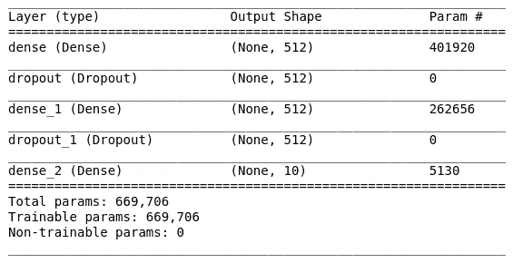

# 使用 AMD GPU 和 Keras 训练神经网络

> 原文：<https://towardsdatascience.com/train-neural-networks-using-amd-gpus-and-keras-37189c453878?source=collection_archive---------6----------------------->

## ROCm 平台入门


AMD 正在开发一个新的高性能计算平台，称为 ROCm。它的目标是创建一个通用的开源环境，能够与 Nvidia(使用 CUDA)和 AMD GPUs 接口([进一步信息](https://rocm.github.io/index.html))。

本教程将解释如何设置一个神经网络环境，在一个或多个配置中使用 AMD GPUs。

在软件方面:我们将能够使用 Docker 在 ROCm 内核上运行 Tensorflow v1.12.0 作为 Keras 的后端。


安装和部署 ROCm 需要特定的硬件/软件配置。

# 硬件要求

官方文档(ROCm v2.1)建议采用以下[硬件解决方案](https://rocm-documentation.readthedocs.io/en/latest/Installation_Guide/Installation-Guide.html#hardware-support)。

## 支持的 CPU

当前支持 PCIe Gen3 + PCIe 原子处理器的 CPU 有:

*   AMD 锐龙 CPUs
*   AMD 锐龙 APU 中的 CPU:
*   AMD 锐龙线程处理器
*   AMD EPYC CPU；
*   英特尔至强 E7 v3 或更新的 CPUs
*   英特尔至强 E5 v3 或更新的 CPUs
*   英特尔至强 E3 v3 或更新的 CPUs
*   英特尔酷睿 i7 v4(i7–4xxx)、酷睿 i5 v4(i5–4xxx)、酷睿 i3 v4(i3–4xxx)或更新的 CPU(即 Haswell 系列或更新的产品)。
*   一些 Ivy Bridge-E 系统

## 支持的 GPU

ROCm 官方支持使用以下芯片的 AMD GPUs:

*   GFX8 GPUs
*   “斐济”芯片，如 AMD 公司的镭龙 R9 Fury X 和镭龙本能 MI8
*   “北极星 10”芯片，如在 AMD 镭龙 RX 480/580 和镭龙本能军情六处
*   “北极星 11”芯片，如 AMD 镭龙 RX 470/570 和镭龙专业 WX 4100
*   “北极星 12”芯片，如 AMD 公司的镭龙 RX 550 和镭龙 RX 540
*   GFX9 GPUs
*   “织女星 10”芯片，如 AMD 公司的镭龙 RX 织女星 64 和镭龙本能 MI25
*   “织女星 7 纳米”芯片(镭龙本能 MI50，镭龙七)

# 软件要求

在软件方面，ROCm 的当前版本(v2.1)仅在基于 Linux 的系统中受支持。

> ROCm 2.1.x 平台支持以下操作系统:
> 
> Ubuntu 16.04.x 和 18.04.x(版本 16.04.3 和更新版本或内核 4.13 和更新版本)
> 
> CentOS 7.4、7.5 和 7.6(使用 devtoolset-7 运行时支持)
> 
> RHEL 7.4、7.5 和 7.6(使用 devtoolset-7 运行时支持)

# 测试设置

作者使用了以下硬件/软件配置来测试和验证环境:

## **硬件**

*   CPU:英特尔至强 E5–2630 l
*   内存:2 个 8 GB
*   主板:微星 X99A 金环版
*   GPU: 2 个 RX480 8GB + 1 个 RX580 4GB
*   固态硬盘:三星 850 Evo (256 GB)
*   硬盘:WDC 1TB

## **软件**

*   操作系统:LTS Ubuntu 18.04

# ROCm 安装

为了让一切正常工作，建议在全新安装的操作系统中开始安装过程。以下步骤[参照 Ubuntu 18.04 LTS 操作系统，其他操作系统请参照](https://rocm.github.io/index.html)[官方文档](https://rocm-documentation.readthedocs.io/en/latest/Installation_Guide/Installation-Guide.html#installing-from-amd-rocm-repositories)。

第一步是安装 ROCm 内核和依赖项:

## **更新你的系统**

打开一个新的终端`CTRL + ALT + T`

```
sudo apt update
sudo apt dist-upgrade
sudo apt install libnuma-dev
sudo reboot
```

## **添加 ROCm apt 库**

要下载和安装 ROCm stack，需要添加相关的存储库:

```
wget -qO - http://repo.radeon.com/rocm/apt/debian/rocm.gpg.key | sudo apt-key add -echo 'deb [arch=amd64] http://repo.radeon.com/rocm/apt/debian/ xenial main' | sudo tee /etc/apt/sources.list.d/rocm.list
```

## **安装 ROCm**

现在需要更新 apt 库列表并安装`rocm-dkms`元包:

```
sudo apt update
sudo apt install rocm-dkms
```

## 设置权限

官方文档建议使用当前用户创建一个新的`video`组来访问 GPU 资源。

首先，检查系统中的组，发出:

```
groups
```

然后将您自己添加到视频群组:

```
sudo usermod -a -G video $LOGNAME
```

您可能希望确保您添加到系统中的任何未来用户都被默认放入“视频”组。为此，您可以运行以下命令:

```
echo 'ADD_EXTRA_GROUPS=1' | sudo tee -a /etc/adduser.conf
echo 'EXTRA_GROUPS=video' | sudo tee -a /etc/adduser.conf
```

然后重新启动系统:

```
reboot
```

## 测试 ROCm 堆栈

现在建议发出以下命令来测试 ROCm 安装。

打开一个新的终端`CTRL + ALT + T`，发出以下命令:

```
/opt/rocm/bin/rocminfo
```

输出应该如下所示:[链接](https://gist.github.com/mattiavarile/957193417b2a5b8d647759d0c3bfb537)

然后复核签发:

```
/opt/rocm/opencl/bin/x86_64/clinfo
```

输出应该是这样的:[链接](https://gist.github.com/mattiavarile/8ecff9d728eac3d08584271720269e9d)

官方文档最后建议将 ROCm 二进制文件添加到 PATH:

```
echo 'export PATH=$PATH:/opt/rocm/bin:/opt/rocm/profiler/bin:/opt/rocm/opencl/bin/x86_64' | sudo tee -a /etc/profile.d/rocm.sh
```

恭喜你！ROCm 已正确安装在您的系统中，并且命令:

```
rocm-smi
```

应该显示您的硬件信息和统计数据:


rocm-smi command output

***提示:*** 看看`rocm-smi -h`命令，探索更多的功能和 OC 工具

# 张量流 Docker

让 ROCm + Tensorflow 后端工作的最快、最可靠的方法是使用 AMD 开发者提供的 docker 镜像。

## 安装 Docker CE

首先，需要安装 Docker。为此，请遵循 Ubuntu 系统的说明:

[](https://docs.docker.com/install/linux/docker-ce/ubuntu/) [## 获取 Ubuntu 的 Docker CE

### 要在 Ubuntu 上开始使用 Docker CE，请确保您满足先决条件，然后安装 Docker。先决条件…

docs.docker.com](https://docs.docker.com/install/linux/docker-ce/ubuntu/) 

***提示*** :为了避免插入`sudo docker <command>`而不是`docker <command>` ，向非根用户提供访问权限是很有用的:[将 Docker 作为非根用户管理](https://docs.docker.com/install/linux/linux-postinstall/)。

## 拉 ROCm 张量流图像

现在该拉 AMD 开发者提供的 [Tensorflow docker](https://hub.docker.com/r/rocm/tensorflow) 了。

打开新的终端`CTRL + ALT + T`并发布:

```
docker pull rocm/tensorflow
```

几分钟后，映像将被安装到您的系统中，准备就绪。

## 创造一个持久的空间

由于 docker 容器的短暂性，一旦 Docker 会话关闭，所有的修改和存储的文件都将随容器一起删除。

因此，在物理驱动器中创建一个永久空间来存储文件和笔记本是非常有用的。更简单的方法是创建一个文件夹，用 docker 容器初始化。为此，发出以下命令:

```
mkdir /home/$LOGNAME/tf_docker_share
```

该命令将创建一个名为`tf_docker_share`的文件夹，用于存储和查看 docker 中创建的数据。

## 起始码头工人

现在，在新的容器会话中执行图像。只需发送以下命令:

```
docker run -i -t \
--network=host \
--device=/dev/kfd \
--device=/dev/dri \
--group-add video \
--cap-add=SYS_PTRACE \
--security-opt seccomp=unconfined \
--workdir=/tf_docker_share \
-v $HOME/tf_docker_share:/tf_docker_share rocm/tensorflow:latest /bin/bash
```

docker 正在目录`/tf_docker_share`上执行，您应该看到类似于:


这意味着你现在正在 Tensorflow-ROCm 虚拟系统中运行。

## 安装 Jupyter

Jupyter 是一个非常有用的工具，用于神经网络的开发、调试和测试。不幸的是，它目前没有默认安装在由 ROCm 团队发布的 tensor flow-ROCm Docker image 上。因此需要手动安装 Jupyter。

为此，在 Tensorflow-ROCm 虚拟系统提示符下，

1.发出以下命令:

```
pip3 install jupyter
```

它会将 Jupyter 包安装到虚拟系统中。让这个终端开着。

2.打开一个新的端子`CTRL + ALT + T`。

找到发出命令的`CONTAINER ID`:

```
docker ps
```

应该会出现一个类似如下的表格:


Container ID on the left

第一列表示被执行容器的*容器 ID* 。复制它，因为下一步需要它。

3.是时候*提交*了，永久地写入图像的修改。从同一个终端，执行:

```
docker commit <container-id> rocm/tensorflow:<tag>
```

其中`tag`值是任意名称，例如`personal`。

4.要再次检查图像是否已正确生成，请从同一终端发出以下命令:

```
docker images
```

这应该会生成如下所示的表格:


值得注意的是，在本教程的剩余部分，我们将引用这个新生成的图像。

使用新的`docker run`命令，看起来像:

```
docker run -i -t \
--network=host \
--device=/dev/kfd \
--device=/dev/dri \
--group-add video \
--cap-add=SYS_PTRACE \
--security-opt seccomp=unconfined \
--workdir=/tf_docker_share \
-v $HOME/tf_docker_share:/tf_docker_share rocm/tensorflow:<tag> /bin/bash
```

同样，`tag`的值是任意的，例如`personal`。

# 进入 Jupyter 笔记本电脑环境

我们终于可以进入木星的环境了。在其中，我们将使用 Tensorflow v1.12 作为后端，Keras 作为前端，创建第一个神经网络。

## 清洁

首先关闭所有先前执行的 Docker 容器。

1.  检查已经打开的容器:

```
docker ps
```

2.关闭所有码头集装箱:

```
docker container stop <container-id1> <container-id2> ... <container-idn>
```

3.关闭所有已经打开的终端。

## 执行 Jupyter

让我们打开一个新的终端`CTRL + ALT + T`:

1.  运行一个新的 Docker 容器(`personal`标签将被默认使用):

```
docker run -i -t \
--network=host \
--device=/dev/kfd \
--device=/dev/dri \
--group-add video \
--cap-add=SYS_PTRACE \
--security-opt seccomp=unconfined \
--workdir=/tf_docker_share \
-v $HOME/tf_docker_share:/tf_docker_share rocm/tensorflow:personal /bin/bash
```

您应该登录 Tensorflow-ROCm docker 容器提示符。


Logged into docker container

2.执行 Jupyter 笔记本:

```
jupyter notebook --allow-root --port=8889
```

应该会出现一个新的浏览器窗口，如下所示:


Jupyter root directory

如果新标签没有自动出现，在浏览器上，返回到执行`jupyter notebook`命令的终端。在底部，有一个链接(在上面按下`CTRL + left mouse button`)然后，浏览器中的一个新标签会将你重定向到 Jupyter 根目录。


Typical Jupyter notebook output. The example link is on the bottom

# 用 Keras 训练神经网络

在本教程的最后一部分，我们将在 [MNIST 数据集](http://yann.lecun.com/exdb/mnist/)上训练一个简单的神经网络。我们将首先建立一个完全连接的神经网络。

## 全连接神经网络

让我们创建一个新的笔记本，从 Jupyter 根目录的右上角菜单中选择 *Python3* 。


The upper-right menu in Jupyter explorer

一个新的 Jupiter 笔记本应该会在新的浏览器选项卡中弹出。通过点击窗口左上角的`Untitled`将其重命名为`fc_network`。


Notebook renaming

让我们检查 Tensorflow 后端。在第一个单元格中插入:

```
import tensorflow as tf; print(tf.__version__)
```

然后按`SHIFT + ENTER`执行。输出应该类似于:


Tensorflow V1.12.0

我们用的是 Tensorflow v1.12.0。

让我们导入一些有用的函数，接下来使用:

```
from tensorflow.keras.datasets import mnist
from tensorflow.keras.models import Sequential
from tensorflow.keras.layers import Dense, Dropout
from tensorflow.keras.optimizers import RMSprop
from tensorflow.keras.utils import to_categorical
```

让我们设置批量大小、时期和类的数量。

```
batch_size = 128
num_classes = 10
epochs = 10
```

我们现在将下载并预处理输入，将它们加载到系统内存中。

```
# the data, split between train and test sets
(x_train, y_train), (x_test, y_test) = mnist.load_data()x_train = x_train.reshape(60000, 784)
x_test = x_test.reshape(10000, 784)
x_train = x_train.astype('float32')
x_test = x_test.astype('float32')
x_train /= 255
x_test /= 255
print(x_train.shape[0], 'train samples')
print(x_test.shape[0], 'test samples')# convert class vectors to binary class matrices
y_train = to_categorical(y_train, num_classes)
y_test = to_categorical(y_test, num_classes)
```

是时候定义神经网络架构了:

```
model = Sequential()
model.add(Dense(512, activation='relu', input_shape=(784,)))
model.add(Dropout(0.2))
model.add(Dense(512, activation='relu'))
model.add(Dropout(0.2))
model.add(Dense(num_classes, activation='softmax'))
```

我们将使用一个非常简单的双层全连接网络，每层有 512 个神经元。它还包括神经元连接 20%的下降概率，以防止过度拟合。

让我们来看看网络架构的一些见解:

```
model.summary()
```



Network architecture

尽管问题很简单，但我们有相当多的参数需要训练(大约 700.000)，这也意味着相当大的计算功耗。卷积神经网络将解决降低计算复杂性的问题。

现在，编译模型:

```
model.compile(loss='categorical_crossentropy',
              optimizer=RMSprop(),
              metrics=['accuracy'])
```

并开始训练:

```
history = model.fit(x_train, y_train,
                    batch_size=batch_size,
                    epochs=epochs,
                    verbose=1,
                    validation_data=(x_test, y_test))
```


Training process

神经网络已经在单个 RX 480 上以相当高的 47us/step 进行了训练。相比之下，Nvidia Tesla K80 达到了 43us/step，但贵了 10 倍。

## 多 GPU 训练

作为一个额外的步骤，如果您的系统有多个 GPU，可以利用 Keras 功能，以减少培训时间，在不同的 GPU 之间分割批处理。

为此，首先需要通过声明一个环境变量来指定用于训练的 GPU 数量(将以下命令放在单个单元上并执行):

```
!export HIP_VISIBLE_DEVICES=0,1,...
```

从 0 到…的数字定义了用于训练的 GPU。如果您想禁用 GPU 加速，只需:

```
!export HIP_VISIBLE_DEVICES=-1
```

还需要添加`multi_gpu_model`功能。

举个例子，如果你有 3 个 GPU，前面的代码会[相应地](https://gist.github.com/mattiavarile/223d9c13c9f1919abe9a77931a4ab6c1)修改。

# 结论

本教程到此结束。下一步将在 MNIST 数据集上测试卷积神经网络。比较单个和多个 GPU 的性能。

这里相关的是，AMD GPUs 在计算负载下表现相当好，而价格只是它的一小部分。GPU 市场正在快速变化，ROCm 为研究人员、工程师和初创公司提供了非常强大的开源工具，可以采用，从而降低了硬件设备的前期成本。

*条乘* [*条乘*](http://www.linkedin.com/in/mattia-varile)

请随意评论这篇文章，以提高他的质量和效果。