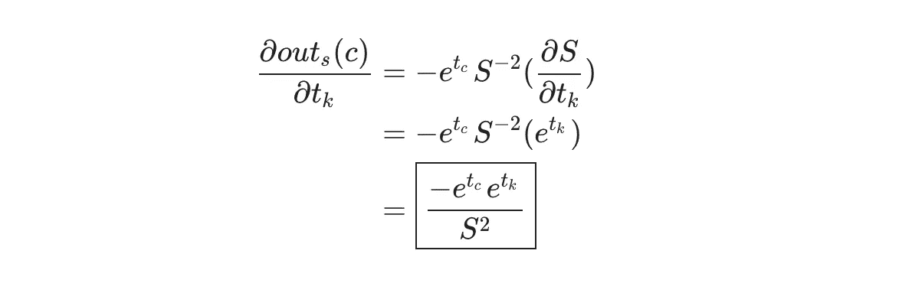

# 从头开始训练卷积神经网络

> 原文：<https://towardsdatascience.com/training-a-convolutional-neural-network-from-scratch-2235c2a25754?source=collection_archive---------0----------------------->

## 一个为 CNN 派生反向传播并在 Python 中从头实现它的简单演练。

在这篇文章中，我们将深入探讨大多数卷积神经网络(CNN)介绍所缺乏的东西:**如何训练 CNN** ，包括推导梯度，从头实现反向投影*(仅使用 [numpy](https://www.numpy.org/) )，并最终建立一个完整的训练管道！*

***这篇文章假设你对 CNN 有基本的了解**。我对 CNN 的介绍涵盖了你需要知道的一切，所以我强烈建议你先读一下。如果你来这里是因为你已经读过了，欢迎回来！*

***这篇文章的部分内容也假设了多变量微积分的基础知识**。如果你想的话，你可以跳过这些章节，但是我建议即使你不理解所有的内容，也要阅读它们。当我们得到结果时，我们将逐步编写代码，即使是表面的理解也会有所帮助。*

# *1.搭建舞台*

*系好安全带。是时候进入状态了。*

*我们将继续我对 CNN 的介绍。我们用 CNN 来解决 [MNIST](http://yann.lecun.com/exdb/mnist/) 手写数字分类问题:*

**

*Sample images from the MNIST dataset*

*我们的(简单的)CNN 由一个 Conv 层、一个 Max 池层和一个 Softmax 层组成。这是我们 CNN 的图表:*

**

*Our CNN takes a 28x28 grayscale MNIST image and outputs 10 probabilities, 1 for each digit.*

*我们写了 3 个类，每层一个:`Conv3x3`、`MaxPool`和`Softmax`。每个类都实现了一个`forward()`方法，我们用它来构建 CNN 的前向传递:*

*你可以在你的浏览器 中**查看代码或者** [**运行 CNN。在**](https://repl.it/@vzhou842/A-CNN-from-scratch-Part-1) **[Github](https://github.com/vzhou842/cnn-from-scratch) 上也有。***

*这是我们 CNN 现在的输出:*

```
*MNIST CNN initialized!
[Step 100] Past 100 steps: Average Loss 2.302 | Accuracy: 11%
[Step 200] Past 100 steps: Average Loss 2.302 | Accuracy: 8%
[Step 300] Past 100 steps: Average Loss 2.302 | Accuracy: 3%
[Step 400] Past 100 steps: Average Loss 2.302 | Accuracy: 12%*
```

*显然，我们想做到 10%以上的准确率…让我们给 CNN 一个教训。*

# *2.培训概述*

*训练神经网络通常包括两个阶段:*

1.  *前向阶段，输入完全通过网络。*
2.  ***反向**阶段，其中梯度被反向传播(反向传播)并且权重被更新。*

*我们将遵循这种模式来训练我们的 CNN。我们还将使用两个主要的特定于实现的想法:*

*   *在向前阶段，每一层将**缓存**向后阶段所需的任何数据(如输入、中间值等)。这意味着任何反向阶段之前必须有相应的正向阶段。*
*   *在反向阶段，每一层将**接收一个梯度**，并且**返回一个梯度**。它将接收关于其*输出* (∂L / ∂out)的损耗梯度，并返回关于其*输入* (∂L / ∂in).)的损耗梯度*

*这两个想法将有助于保持我们的培训实施干净和有组织。了解原因的最佳方式可能是查看代码。训练我们的 CNN 最终会是这样的:*

*看到那看起来多漂亮多干净了吗？现在想象建立一个有 50 层而不是 3 层的网络——拥有好的系统更有价值。*

# *3.反向投影:Softmax*

*我们将从结尾开始，然后朝着开头前进，因为这就是反向传播的工作方式。首先，回忆一下**交叉熵损失**:*

**

*其中 p_c 是正确类别 c 的预测概率(换句话说，我们当前图像*实际上*是多少位)。*

> **想要更长的解释？阅读我的 CNN 简介的* [*交叉熵损失*](https://victorzhou.com/blog/intro-to-cnns-part-1/#52-cross-entropy-loss) *部分。**

*我们需要计算的第一件事是 Softmax 层的反向相位∂L / ∂out_s 的输入，其中 out_s 是 Softmax 层的输出:10 个概率的向量。这很简单，因为只有 p_i 出现在损耗方程中:*

**

*Reminder: c is the correct class.*

*这是你在上面看到的初始梯度:*

*我们几乎已经准备好实现我们的第一个反向阶段——我们只需要首先执行我们之前讨论过的正向阶段缓存:*

*我们在这里缓存了 3 个对实现后向阶段有用的东西:*

*   *在变平之前`input`的形状*。**
*   *后的`input` *我们把它压平。**
*   ***总计**，是传递给 softmax 激活的值。*

*这样一来，我们就可以开始推导反投影阶段的梯度了。我们已经导出了 Softmax 反向阶段的输入:∂L / ∂out_s。关于∂L / ∂out_s，我们可以利用的一个事实是*只有正确的类* c *才是非零的。这意味着除了 out_s(c)之外，我们可以忽略任何东西！**

*首先，让我们计算 out_s(c)相对于总数的梯度(传递给 softmax 激活的值)。设 t_i 为第 I 类的总和，那么我们可以写出 _s(c)为:*

**

> **你应该从我的 CNN 教程的* [*Softmax*](https://victorzhou.com/blog/intro-to-cnns-part-1/#5-softmax) *部分认出了上面的等式。**

*现在，考虑某个类 k，使得 k 不是 c，我们可以将 out_s(c)重写为:*

**

*并使用链式法则推导出:*

**

*记住，这是假设 k 不等于 c。现在让我们对 c 进行推导，这次使用[商法则](https://en.wikipedia.org/wiki/Quotient_rule):*

**

*唷。这是整篇文章中最难的部分——从这里开始只会变得更容易！让我们开始实现它:*

*还记得∂L / ∂out_s 只对正确的类 c 是非零的吗？我们通过在`d_L_d_out`中寻找非零梯度来开始寻找 c。一旦我们发现了这一点，我们就可以使用上面得出的结果来计算梯度∂out_s(i) / ∂t ( `d_out_d_totals`):*

**

*我们继续吧。我们最终想要损失相对于权重、偏差和输入的梯度:*

*   *我们将使用权重梯度，∂L / ∂w，来更新我们的层的权重。*
*   *我们将使用偏差梯度∂L / ∂b 来更新图层的偏差。*
*   *我们将从我们的`backprop()`方法返回输入渐变，∂L / ∂input，这样下一层可以使用它。这是我们在培训概述部分谈到的回报梯度！*

*为了计算这 3 个损失梯度，我们首先需要导出另外 3 个结果:总数*相对于权重、偏差和输入的梯度。这里的相关等式是:**

**

*这些渐变很容易！*

**

*将所有东西放在一起:*

**

*将它写入代码就不那么简单了:*

*首先，我们预计算`d_L_d_t`，因为我们将多次使用它。然后，我们计算每个梯度:*

*   *`**d_L_d_w**`:我们需要 2d 数组来做矩阵乘法(`@`)，但是`d_t_d_w`和`d_L_d_t`是 1d 数组。 [np.newaxis](https://docs.scipy.org/doc/numpy-1.13.0/reference/arrays.indexing.html#numpy.newaxis) 让我们很容易地创建一个新的长度为 1 的轴，所以我们最终将维度为(`input_len`，1)和(1，`nodes`)的矩阵相乘。因此，`d_L_d_w`的最终结果将具有 shape ( `input_len`，`nodes`)，与`self.weights`相同！*
*   *`**d_L_d_b**`:这个很简单，因为`d_t_d_b`是 1。*
*   *`**d_L_d_inputs**`:我们将维度为(`input_len`，`nodes`)和(`nodes`，1)的矩阵相乘，得到长度为`input_len`的结果。*

> **试着做上面计算的小例子，特别是* `*d_L_d_w*` *和* `*d_L_d_inputs*` *的矩阵乘法。这是理解为什么这段代码能正确计算梯度的最好方法。**

*随着所有的梯度计算，所有剩下的是实际训练 Softmax 层！我们将使用随机梯度下降(SGD)来更新权重和偏差，就像我们在我的[神经网络简介](https://victorzhou.com/blog/intro-to-neural-networks/#training-stochastic-gradient-descent)中所做的那样，然后返回`d_L_d_inputs`:*

*注意，我们添加了一个`learn_rate`参数来控制我们更新权重的速度。此外，在返回`d_L_d_inputs`之前，我们必须`reshape()`，因为我们在向前传球时拉平了输入:*

*整形为`last_input_shape`确保该层返回其输入的渐变，格式与输入最初提供给它的格式相同。*

## *试驾:Softmax Backprop*

*我们已经完成了我们的第一个反向投影实现！让我们快速测试一下，看看它有什么好的。我们将从我的[CNN 简介](https://victorzhou.com/blog/intro-to-cnns-part-1/)开始实现一个`train()`方法:*

*运行此命令会得到类似于以下内容的结果:*

```
*MNIST CNN initialized!
[Step 100] Past 100 steps: Average Loss 2.239 | Accuracy: 18%
[Step 200] Past 100 steps: Average Loss 2.140 | Accuracy: 32%
[Step 300] Past 100 steps: Average Loss 1.998 | Accuracy: 48%
[Step 400] Past 100 steps: Average Loss 1.861 | Accuracy: 59%
[Step 500] Past 100 steps: Average Loss 1.789 | Accuracy: 56%
[Step 600] Past 100 steps: Average Loss 1.809 | Accuracy: 48%
[Step 700] Past 100 steps: Average Loss 1.718 | Accuracy: 63%
[Step 800] Past 100 steps: Average Loss 1.588 | Accuracy: 69%
[Step 900] Past 100 steps: Average Loss 1.509 | Accuracy: 71%
[Step 1000] Past 100 steps: Average Loss 1.481 | Accuracy: 70%*
```

*损失在下降，准确性在上升——我们的 CNN 已经在学习了！*

# *4.反向推进:最大池化*

*Max Pooling 层不能被训练，因为它实际上没有任何权重，但是我们仍然需要为它实现一个方法来计算梯度。我们将从再次添加前向阶段缓存开始。这次我们需要缓存的只是输入:*

*在向前传递期间，最大池层通过在 2x2 块上选取最大值来获取输入体积并将其宽度和高度尺寸减半。反向过程则相反:**我们将通过将每个梯度值分配给**来加倍损失梯度的宽度和高度**，其中原始最大值是其对应的 2x2 块中的**。*

*这里有一个例子。考虑最大池层的这个前进阶段:*

**

*An example forward phase that transforms a 4x4 input to a 2x2 output*

*同一层的反向阶段将如下所示:*

**

*An example backward phase that transforms a 2x2 gradient to a 4x4 gradient*

*每个渐变值都被分配到原始最大值所在的位置，其他值为零。*

*为什么最大池层的反向阶段是这样工作的？思考一下∂L / ∂inputs 直觉上应该是什么样子。不是其 2x2 块中最大值的输入像素对损失的边际影响为零，因为稍微改变该值根本不会改变输出！换句话说，对于非最大像素，∂L / ∂inputs = 0。另一方面，*为*最大值的输入像素会将其值传递给输出，因此∂output / ∂input = 1，意味着∂L / ∂input = ∂L / ∂output.*

*我们可以使用我在 CNN 简介中写的助手方法很快实现这一点。我将再次把它包括在内作为提醒:*

*对于每个过滤器中每个 2×2 图像区域中的每个像素，如果它是正向传递期间的最大值，我们将梯度从`d_L_d_out`复制到`d_L_d_input`。*

*就是这样！我们的最后一层。*

# *5.背景:Conv*

*我们终于来了:通过 Conv 层反向传播是训练 CNN 的核心。前向阶段缓存很简单:*

> **提醒一下我们的实现:为了简单起见，* ***我们假设 conv 层的输入是一个 2d 数组*** *。这只对我们有用，因为我们把它作为网络的第一层。如果我们正在构建一个需要多次使用* `*Conv3x3*` *的更大的网络，我们必须使输入成为一个* ***3d*** *数组。**

*我们主要对 conv 图层中滤镜的损耗梯度感兴趣，因为我们需要它来更新我们的滤镜权重。我们已经有了∂L / ∂out 的 conv 层，所以我们只需要∂out / ∂filters。为了计算，我们问自己:改变过滤器的重量会如何影响 conv 层的输出？*

*事实是**改变任何滤波器权重都会影响该滤波器的整个输出图像**，因为在卷积期间*每个*输出像素使用*每个*像素权重。为了更容易理解，让我们一次只考虑一个输出像素:**修改一个滤镜会如何改变一个特定输出像素的输出？***

*这里有一个超级简单的例子来帮助思考这个问题:*

**

*A 3x3 image (left) convolved with a 3x3 filter (middle) to produce a 1x1 output (right)*

*我们将一个 3×3 图像与一个全零 3×3 滤波器进行卷积，产生 1×1 输出。如果我们将中央过滤器的重量增加 1 会怎么样？输出将增加中心图像值 80:*

**

*类似地，将任何其他过滤器权重增加 1 将使输出增加相应图像像素的值！这表明特定输出像素相对于特定滤波器权重的导数就是相应的图像像素值。计算证实了这一点:*

**

*我们可以将所有这些放在一起，找出特定滤波器权重的损耗梯度:*

**

*我们已经准备好为我们的 conv 层实现反向投影了！*

*我们通过迭代每个图像区域/滤波器并递增地构建损失梯度来应用我们导出的方程。一旦我们涵盖了所有内容，我们就像以前一样使用 SGD 更新`self.filters`。请注意解释我们为什么要返回的注释——输入损耗梯度的推导与我们刚才所做的非常相似，留给读者作为练习:)。*

*就这样，我们结束了！我们已经通过我们的 CNN 实现了一个完整的向后传递。是时候测试一下了…*

# *6.训练 CNN*

*我们将训练 CNN 几个时期，在训练过程中跟踪它的进展，然后在单独的测试集上测试它。以下是完整的代码:*

*运行代码的输出示例:*

```
*MNIST CNN initialized!
--- Epoch 1 ---
[Step 100] Past 100 steps: Average Loss 2.254 | Accuracy: 18%
[Step 200] Past 100 steps: Average Loss 2.167 | Accuracy: 30%
[Step 300] Past 100 steps: Average Loss 1.676 | Accuracy: 52%
[Step 400] Past 100 steps: Average Loss 1.212 | Accuracy: 63%
[Step 500] Past 100 steps: Average Loss 0.949 | Accuracy: 72%
[Step 600] Past 100 steps: Average Loss 0.848 | Accuracy: 74%
[Step 700] Past 100 steps: Average Loss 0.954 | Accuracy: 68%
[Step 800] Past 100 steps: Average Loss 0.671 | Accuracy: 81%
[Step 900] Past 100 steps: Average Loss 0.923 | Accuracy: 67%
[Step 1000] Past 100 steps: Average Loss 0.571 | Accuracy: 83%
--- Epoch 2 ---
[Step 100] Past 100 steps: Average Loss 0.447 | Accuracy: 89%
[Step 200] Past 100 steps: Average Loss 0.401 | Accuracy: 86%
[Step 300] Past 100 steps: Average Loss 0.608 | Accuracy: 81%
[Step 400] Past 100 steps: Average Loss 0.511 | Accuracy: 83%
[Step 500] Past 100 steps: Average Loss 0.584 | Accuracy: 89%
[Step 600] Past 100 steps: Average Loss 0.782 | Accuracy: 72%
[Step 700] Past 100 steps: Average Loss 0.397 | Accuracy: 84%
[Step 800] Past 100 steps: Average Loss 0.560 | Accuracy: 80%
[Step 900] Past 100 steps: Average Loss 0.356 | Accuracy: 92%
[Step 1000] Past 100 steps: Average Loss 0.576 | Accuracy: 85%
--- Epoch 3 ---
[Step 100] Past 100 steps: Average Loss 0.367 | Accuracy: 89%
[Step 200] Past 100 steps: Average Loss 0.370 | Accuracy: 89%
[Step 300] Past 100 steps: Average Loss 0.464 | Accuracy: 84%
[Step 400] Past 100 steps: Average Loss 0.254 | Accuracy: 95%
[Step 500] Past 100 steps: Average Loss 0.366 | Accuracy: 89%
[Step 600] Past 100 steps: Average Loss 0.493 | Accuracy: 89%
[Step 700] Past 100 steps: Average Loss 0.390 | Accuracy: 91%
[Step 800] Past 100 steps: Average Loss 0.459 | Accuracy: 87%
[Step 900] Past 100 steps: Average Loss 0.316 | Accuracy: 92%
[Step 1000] Past 100 steps: Average Loss 0.460 | Accuracy: 87%

--- Testing the CNN ---
Test Loss: 0.5979384893783474
Test Accuracy: 0.78*
```

*我们的代码有效！仅在 3000 个训练步骤中，我们就从一个损失 2.3、准确率 10%的模型，变成了损失 0.6、准确率 78%的模型。*

*想自己尝试或修改这段代码吗？ [**在浏览器中运行本 CNN**](https://repl.it/@vzhou842/A-CNN-from-scratch-Part-2)**。**在 [Github](https://github.com/vzhou842/cnn-from-scratch) 上也有。*

*为了节省时间，我们在这个例子中只使用了整个 MNIST 数据集的一个子集——我们的 CNN 实现不是特别快。如果我们真的想训练一个 MNIST CNN，我们会使用一个 ML 库，比如 [Keras](https://keras.io/) 。为了展示我们 CNN 的强大，我使用 Keras 来实现和训练我们刚刚从头构建的*完全相同的* CNN:*

*在*完整的* MNIST 数据集(60k 训练图像)上运行该代码会得到如下结果:*

```
*Epoch 1
loss: 0.2433 - acc: 0.9276 - val_loss: 0.1176 - val_acc: 0.9634
Epoch 2
loss: 0.1184 - acc: 0.9648 - val_loss: 0.0936 - val_acc: 0.9721
Epoch 3
loss: 0.0930 - acc: 0.9721 - val_loss: 0.0778 - val_acc: 0.9744*
```

*我们用这个简单的 CNN 实现了 **97.4%** 的测试准确率！有了更好的 CNN 架构，我们可以进一步改进——在这个[官方的 Keras MNIST CNN 示例](https://keras.io/examples/mnist_cnn/)中，他们在 12 个时期后达到了 **99.25%** 的测试准确度。这个*真的*准确度好。*

***这篇帖子的所有代码都可以在**[**Github**](https://github.com/vzhou842/cnn-from-scratch)**上获得。***

# *现在怎么办？*

*我们完了！在这篇文章中，我们做了一个完整的演练如何训练一个卷积神经网络。然而，这仅仅是开始。您还可以做更多的事情:*

*   *使用适当的 ML 库，如 [Tensorflow](https://www.tensorflow.org/) 、 [Keras](https://keras.io/) 或 [PyTorch](https://pytorch.org/) ，尝试更大/更好的 CNN。*
*   *了解如何将[批处理规范化](https://en.wikipedia.org/wiki/Batch_normalization)用于 CNN。*
*   *了解**数据扩充**如何用于改善图像训练集。*
*   *阅读 [ImageNet](https://en.wikipedia.org/wiki/ImageNet) 项目及其著名的计算机视觉竞赛 ImageNet 大规模视觉识别挑战赛( [ILSVRC](http://image-net.org/challenges/LSVRC/) )。*

**最初发表于*[*【https://victorzhou.com】*](https://victorzhou.com/blog/intro-to-cnns-part-2/)*。**