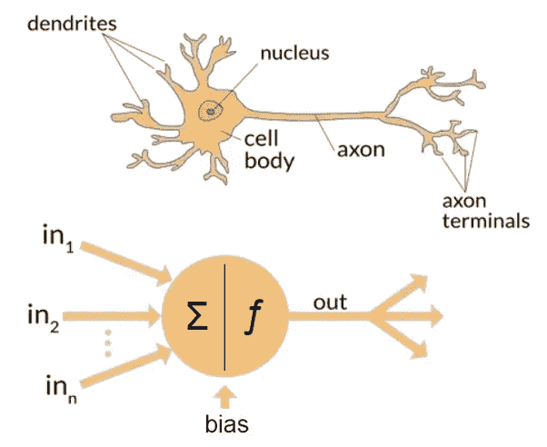
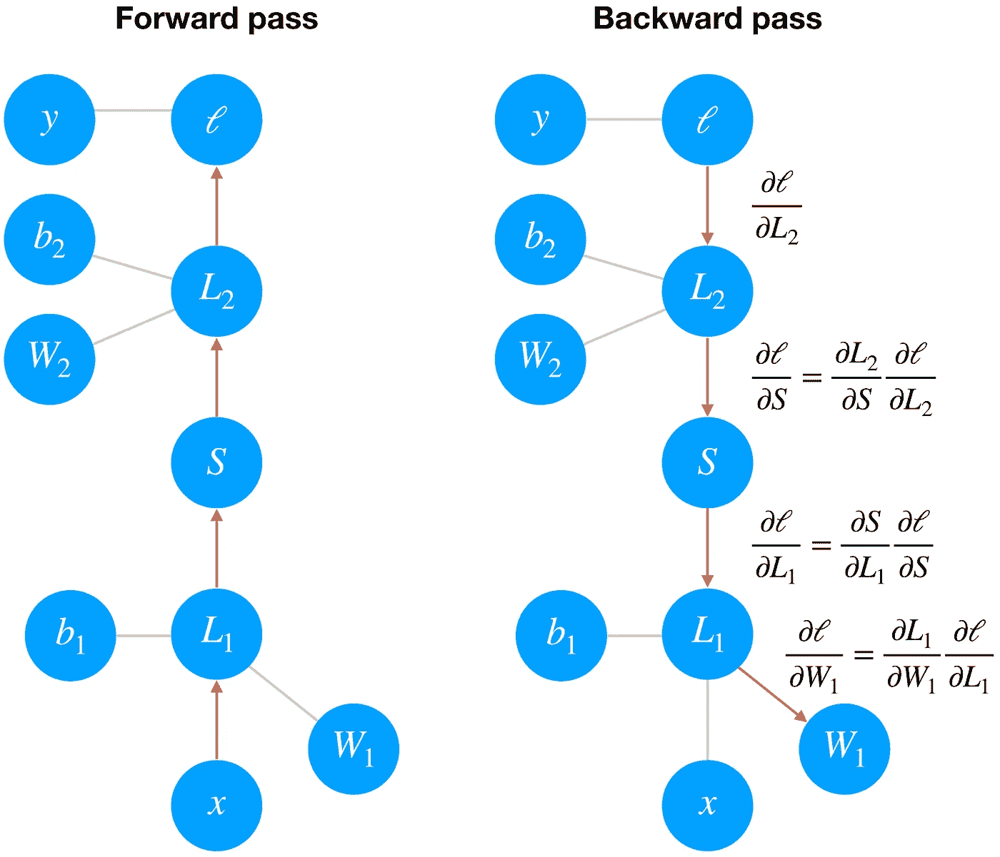
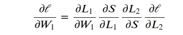
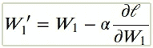
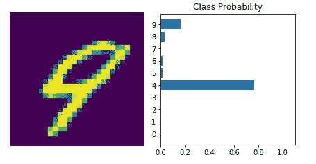

# 用 PyTorch 训练神经网络

> 原文：<https://towardsdatascience.com/training-a-neural-network-using-pytorch-72ab708da210?source=collection_archive---------6----------------------->

> “一知半解是一件危险的事情；**(亚历山大·波普)**深饮或尝不出皮耶里的春天



Human brain vs Neural network (image source [here](https://www.quora.com/What-is-the-difference-between-artificial-intelligence-and-neural-networks))

所以在[之前的](/building-neural-network-using-pytorch-84f6e75f9a)文章中，我们已经建立了一个非常简单和“幼稚”的神经网络，它不知道将输入映射到输出的函数。为了使它更加智能，我们将通过向它显示“真实数据”的例子来训练网络，然后调整网络参数(权重和偏差)。简而言之，我们在调整模型参数(权重和偏差)的同时，通过迭代训练数据集来提高精确度。

为了找到这些参数，我们需要知道我们的网络对真实输出的预测有多差。为此，我们将计算`cost`，也称为`loss function`。

# **成本**

`Cost`或`loss function`是我们预测误差的度量。通过相对于网络参数最小化`loss`，我们可以找到`loss`最小的状态，并且网络能够以高精度预测正确的标签。我们使用一个叫做`gradient descent`的过程找到这个`minimum loss`。在处检查不同种类的`cost`功能

# 梯度下降

梯度下降需要成本函数。我们需要这个`cost`函数，因为我们需要将其最小化，以便获得高预测精度。GD 的全部意义在于最小化`cost`函数。该算法的目标是到达最低值`error value`的过程。为了在成本函数中得到最低的`error value`(相对于一个权重)，我们需要调整模型的参数。那么，我们需要调整参数到什么程度呢？我们可以使用`calculus`找到它。使用`calculus`我们知道函数的`slope`是关于值的函数的`derivative`。`gradient`是损失函数的斜率，指向变化最快的方向。

# 在上反向传播

**`Gradient Descent`对于单层网络来说实施起来很简单，但是对于多层网络来说，实施起来更复杂和更深入。多层网络的训练是通过**反向传播**完成的，这实际上是微积分中链式法则的应用。如果我们把一个两层网络转换成一个图形表示，这是最容易理解的。**

****

**image source: udacity course material**

## **向前传球**

**在向前传递中，数据和操作是自下而上的。**

****步骤 1:** 我们通过线性变换`**𝐿1**`将输入`**𝑥**`传递给权重`**𝑊1**`和偏差`**𝑏1**`**

****第二步:**然后输出经过 sigmoid 运算`**𝑆**`和另一个线性变换`𝐿2`**

**第三步:最后我们计算ℓ.的损失**

**我们用这个损失来衡量网络的预测有多糟糕。目标是调整`weights`和`biases`以最小化损失。**

## **偶数道次**

**为了用梯度下降来训练权重，我们通过网络反向传播损失的梯度。**

**每个操作在输入和输出之间都有一些梯度。**

**当我们向后发送梯度时，我们将引入的梯度与操作的梯度相乘。**

**从数学上来说，这实际上就是用链式法则计算损耗相对于重量的梯度。**

****

**我们使用这个梯度和一些学习速率α来更新我们的权重。**

****

**学习率`α`被设置为使得权重更新步长足够小，使得迭代方法稳定在最小值。**

**点击了解更多关于 backprop [的信息](https://mattmazur.com/2015/03/17/a-step-by-step-backpropagation-example/)**

# **PyTorch 的损失**

**PyTorch 提供了损失，如[交叉熵损失](https://pytorch.org/docs/stable/nn.html#torch.nn.CrossEntropyLoss) `nn.CrossEntropyLoss`。对于像 MNIST 这样的分类问题，我们使用 softmax 函数来预测分类概率。**

**为了计算`loss`,我们首先定义`criterion`,然后传入网络的`output`,并修正标签。**

> **`nn.CrossEntropyLoss`标准将`nn.LogSoftmax()`和`nn.NLLLoss()`组合在一个类中。**
> 
> **输入应该包含每个类的分数。**

**也就是说，我们需要将网络的原始输出传递给损耗，而不是 softmax 函数的输出。这种原始输出通常被称为`*logits*` 或`*scores*` 我们使用`logits`是因为`softmax`给出的概率通常非常接近于`zero`或`one`，但浮点数不能准确地表示接近 0 或 1 的值([在此阅读更多信息](https://docs.python.org/3/tutorial/floatingpoint.html))。通常最好避免用概率进行计算，通常我们使用对数概率。**

# **亲笔签名**

**Torch 提供了一个名为`autograd`的模块来自动计算张量的**。这是一种计算导数的引擎。它记录在**梯度激活张量**上执行的所有操作的图形，并创建一个**非循环**图形，称为**动态计算图形**。该图的*叶*是输入张量，而*根*是输出张量。****

****`Autograd`的工作原理是跟踪在张量上执行的操作，然后通过这些操作向后*前进*，计算沿途的梯度。****

****为了确保 PyTorch 跟踪张量上的操作并计算梯度，我们需要设置`requires_grad = True`。我们可以用`torch.no_grad()`关闭代码块的渐变。****

# ******训练网络******

****最后，我们需要一个`optimizer`来更新梯度权重。我们从 PyTorch 的`[optim](https://pytorch.org/docs/stable/optim.html)` [包](https://pytorch.org/docs/stable/optim.html)中得到这些。例如，我们可以通过`optim.SGD`使用随机梯度下降。****

******训练神经网络的过程:******

*   ****通过网络向前传递****
*   ****使用网络输出来计算损耗****
*   ****用`loss.backward()`对网络进行反向遍历，以计算梯度****
*   ****使用优化器更新权重****

****我们将准备用于训练的数据:****

```
**import torch
from torch import nn
import torch.nn.functional as F
from torchvision import datasets, transforms# Define a transform to normalize the data
transform = transforms.Compose([transforms.ToTensor(),
                                transforms.Normalize((0.5,), (0.5,)),
                              ])# Download and load the training data
trainset = datasets.MNIST('~/.pytorch/MNIST_data/', download=True, train=True, transform=transform)
trainloader = torch.utils.data.DataLoader(trainset, batch_size=64, shuffle=True)**
```

****用真实数据训练:****

****在一些术语中，一次遍历整个数据集被称为`*epoch*`。所以这里我们将循环通过`trainloader`来获得我们的训练批次。对于每一批，我们将进行一次训练，计算损失，进行一次反向训练，并更新权重。****

```
**model = nn.Sequential(nn.Linear(784, 128),
                      nn.ReLU(),
                      nn.Linear(128, 64),
                      nn.ReLU(),
                      nn.Linear(64, 10),
                      nn.LogSoftmax(dim=1))# Define the loss
criterion = nn.NLLLoss()# Optimizers require the parameters to optimize and a learning rate
optimizer = optim.SGD(model.parameters(), lr=0.003)epochs = 5
for e in range(epochs):
    running_loss = 0
    for images, labels in trainloader:
        # Flatten MNIST images into a 784 long vector
        images = images.view(images.shape[0], -1)

        # Training pass
        optimizer.zero_grad()

        output = model(images)
        loss = criterion(output, labels)
        loss.backward()
        optimizer.step()

        running_loss += loss.item()
    else:
        print(f"Training loss: {running_loss/len(trainloader)}")**
```

> ****N 注:`optimizer.zero_grad()`:当我们用相同的参数进行多次反向传递时，梯度就会累积。这意味着我们需要在每次训练过程中将梯度归零，否则我们将保留以前训练批次的梯度。****

****看吧！训练损失在每一个时期都在下降。****

****随着网络的训练，我们可以检查它的预测。****

********

****Prediction result after training****

****现在我们的网络是辉煌的！它能准确预测我们图像中的数字。是不是很酷？****

****声明:本文基于我在 facebook-udacity 奖学金挑战项目中的学习。****