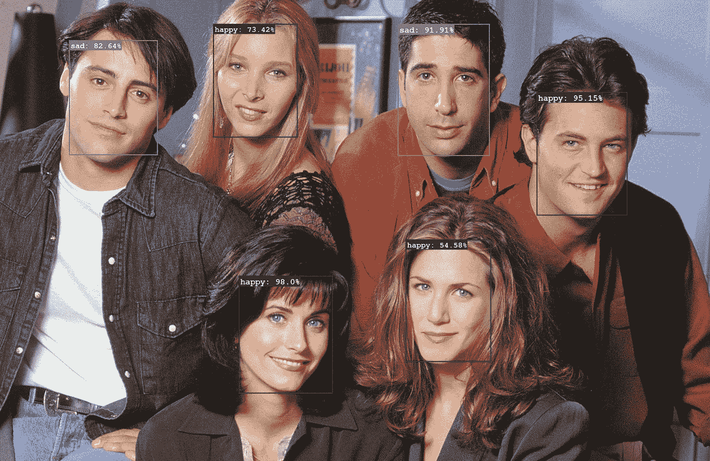
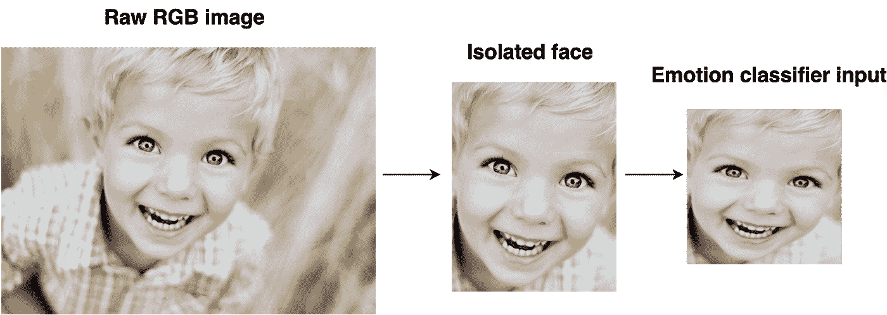
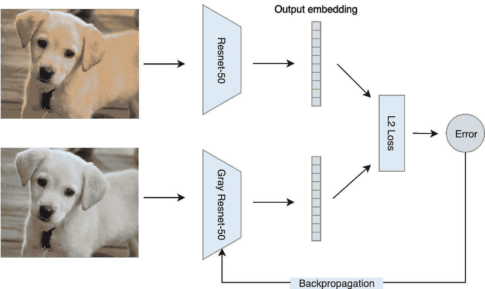
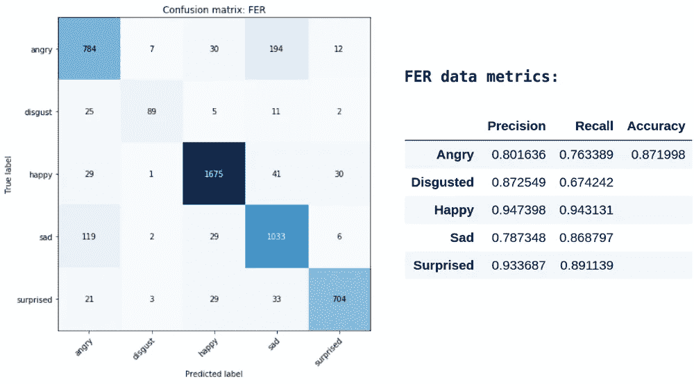
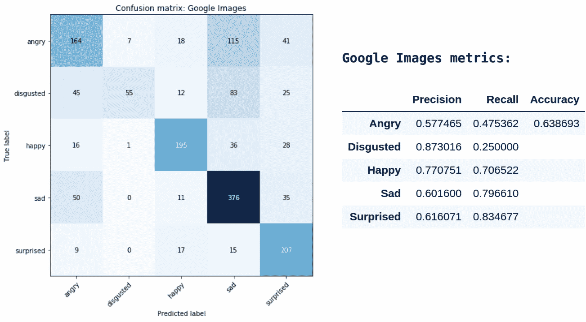
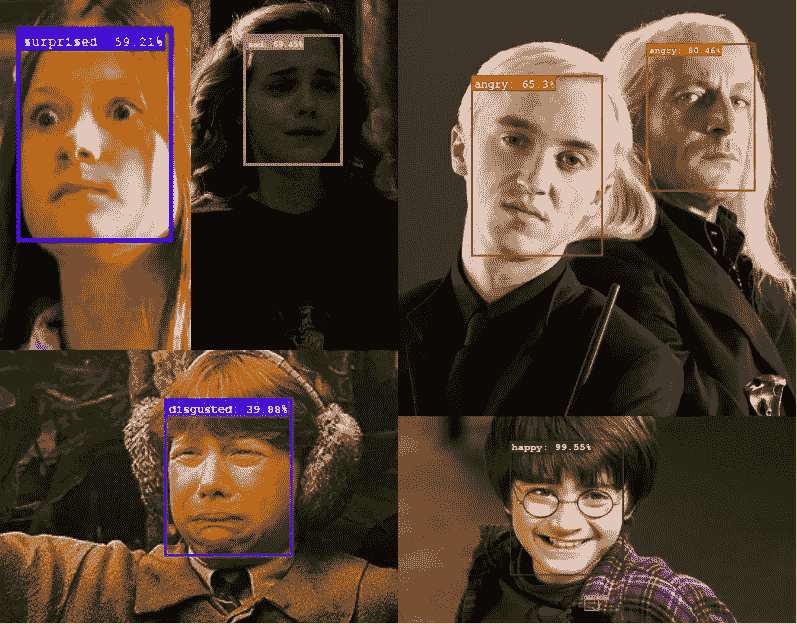

# 用迁移学习训练情绪检测器

> 原文：<https://towardsdatascience.com/training-an-emotion-detector-with-transfer-learning-91dea84adeed?source=collection_archive---------10----------------------->

在这篇博文中，我们将讨论如何使用预先训练的计算机视觉模型、迁移学习以及使用谷歌图像创建自定义数据集的巧妙方法来快速创建情绪检测器。

**注意**:特定任务的代码片段包含在本文中，但是要重新创建结果，你应该参考[代码库](https://github.com/martin-chobanyan/emotion)。

**Figure 1.** Applying the trained emotion detection model on the cast of *Friends*

# 让我们得到一些数据

在任何机器学习任务中，要做的第一件事就是收集数据。我们需要的是成千上万张带有面部表情标签的图像。公开的 [FER 数据集](https://www.kaggle.com/c/challenges-in-representation-learning-facial-expression-recognition-challenge/data) [1]是一个很好的起点，有 28，709 张带标签的图片。我们将使用他们标签的子集作为我们的目标情绪:

*   愤怒的
*   厌恶的
*   幸福的
*   悲哀的
*   惊讶的

但是，由于这些图像的分辨率只有 48 x 48，因此最好也有一个具有更丰富功能的数据集。为此，我们将使用[Google _ Images _ download](https://google-images-download.readthedocs.io/en/latest/installation.html)python 包从 Google Images 中查询和抓取数据。

这种方法的好处是:( a)它从“野外”检索成千上万的图像,( b)我们可以使用查询中的关键字自动标记图像。

当查询谷歌图片时，通常你在结果列表中走得越远，它们就变得越不相关。这意味着我们应该为每次查询返回的图像数量设定一个限制。

为了增加图像的数量，可以使用同义词对每种情感执行几个查询。例如，除了“快乐”，我们还可以查询“微笑”、“愉快”和“兴高采烈”。

大部分的查询应该被结构化为“<emotion>人脸”。事实证明，如果在查询中不包含“人类”,那么大部分图片都是表情符号😊</emotion>

下面的代码片段显示了我们如何配置图像抓取器并检索最多 1000 个“快乐”图像。

这里需要注意一些事情:

1.  要使用这个库，必须下载 chrome 驱动程序。详见[本页](https://google-images-download.readthedocs.io/en/latest/troubleshooting.html#installing-the-chromedriver-with-selenium)。
2.  Google Images 限制了返回的项目数量(通常少于 1000 个)

太好了，我们现在有两个不同来源的面部表情标签了！

# 寻找面孔

在我们训练情绪检测器之前，我们首先必须能够定位每张图像中的人脸。由于目标是从面部表情中对情绪进行分类，因此只保留我们找到的面部并丢弃所有其他(大部分不相关)特征是有意义的。

幸运的是，有一些开源库提供了预先训练好的人脸检测模型。对于这个项目，我们将使用 [facenet-pytorch](https://github.com/timesler/facenet-pytorch) 库，它提供了一个在 VGGFace2 和 CASIA-Webface 数据集上预先训练的多任务 CNN [2]。

下面的代码片段显示了我们如何加载预训练的 MTCNN 模型，并使用它来为图像中的每个人脸找到一个边界框。

这有两个应用:

1.  为了训练，我们将把我们的图像过滤成只有一张脸的图像(查询到的有多张脸的图像可能与目标情感不太相关)，然后使用得到的边界框从图像中裁剪出该脸。
2.  在情感分类器被训练后，人脸检测模型将被用于从一幅图像中提取所有人脸，并将它们分别馈送给模型(例如，参见**图 1** )。

一旦人脸从每张图像中分离出来，它就会被调整到标准形状，然后转换成单通道灰度图像(见**图 2** )。后一步是确保模型将专注于实际的面部表情，而不是学习颜色可能带来的任何偏见。

例如，“sad”查询更可能包含已经是黑白的图像。强制所有图像为灰度将消除这种偏见。

**Figure 2.** The first step crops the face from the raw image using an open-source, pre-trained face detection model. The second step resizes the image and transforms it to grayscale.

# 准备基础模型

由于我们没有大型数据集，我们应该避免从头开始训练我们的分类器。正如大多数计算机视觉转移学习任务中常见的那样，我们将继续对 ImageNet 上预先训练的模型进行微调，ImageNet 是一个数据集，包含数百万张来自一千个不同标签的图像。

这里的目标是通过给它的参数一个好的起点，使我们的模型更容易训练。它可以利用从 ImageNet 学到的现有特征提取器，并调整它们来完成这项新任务。

对 ImageNet 预训练模型的一个警告是，它们期望它们的输入是 RGB 图像。我们可以通过将图像转换为三通道灰度图像来回避这个问题。虽然这可行，但不是最佳的，因为我们将模型外推至新的特征空间(ImageNet 不包含灰度图像)。

相反，让我们用一个随机初始化的单通道卷积层替换模型中的第一个(三通道)卷积层。我们将使用 Resnet-50 [3]作为我们的模型。

下一步是微调这个模型，以便在给定灰度输入时，它使用彩色输入模拟原始模型的输出。图 3 中概述了培训流程。

**Figure 3.** Fine-tuning Resnet-50 using grayscale versions of ImageNet

这里，RGB 图像作为输入被馈送到预训练的 Resnet-50 模型。该图像还被转换为灰度，并作为输入馈送到修改后的“Gray Resnet-50”，其中第一卷积层现在接受单通道输入。

然后，两个输出嵌入通过 L2 损失函数。尽管有大量的计算在进行，反向传播步骤中唯一更新的参数是“Gray Resnet”模型中的第一个单通道卷积层。

这个过程是无人监督的，这意味着我们可以在任何数据集上微调模型，而不用担心找到标签。我最终使用同一个谷歌图片抓取器为每个标签下载了 10 张图片。所有 1000 个 ImageNet 标签见[该资源](https://gist.github.com/yrevar/942d3a0ac09ec9e5eb3a)。

**图 4** 在两幅不同的图像上比较原始模型和修改后的版本，每幅图像都有彩色和灰度版本。对于有金翅雀的那一对，“灰色 Resnet”模型对这只鸟是金翅雀的信心较低，因为它看不到这只鸟与众不同的黄色羽毛。

对于有疣猪的那一对，“灰色 Resnet”模型比原始模型对其预测有更高的信心。作为一种推测，这可能是因为原始模型专注于皮毛的颜色(疣猪和公猪有相似的棕色皮毛)，而“灰色 Resnet”可以专注于结构差异。

**Figure 4.** The top-3 predicted labels of the original Resnet and the “Gray Resnet” model for two pairs of images.

这一微调步骤的目标是建立一个预训练模型，该模型较少关注颜色，而更多关注形状和结构。

# 面部训练

现在我们有了基本模型，让我们应用迁移学习对情绪进行分类！这将涉及我们的预训练“灰色 Resnet”模型的两个阶段的微调。

第一阶段涉及对 FER 数据集的微调。这将作为在“野生”数据上训练模型之前的中间步骤。由于影像的分辨率较低(48 x 48)，我们希望模型能够从 FER 数据集中识别简单的要素。

第二阶段从第一阶段获取模型，然后根据“野生”数据进一步微调它。这里，模型将扩展先前的表示，以从“野生”数据中存在的更丰富的特征中学习。

在实践中，我发现，当所有的参数都允许训练时，FER 微调模型达到了最佳的验证分数。另一方面，当除了最后 11 层之外的所有层都被冻结时，对“野生”数据进行微调的模型获得了最好的分数(参见下面的代码，了解如何使用初始化的 Resnet-50 来实现这一点的示例)。

在第二阶段不允许训练整个模型的原因是因为在“野生”数据集中的例子较少。考虑到其大容量，如果在该阶段允许训练其所有参数，则该模型将更容易过度拟合。

**下面的图 5** 显示了 80:20 列车测试分割的 FER 数据的验证结果。该模型的总体准确度为 87.2%，并且似乎该模型发现“高兴”和“惊讶”情绪最成功。另一方面，该模型在区分“愤怒”和“悲伤”方面最为费力。也许这是因为这两种情绪通常都包含皱眉。

**Figure 5.** Evaluation metrics on the FER images

**下面的图 6** 显示了 70:30 训练测试分割的“野生”谷歌图像数据的验证结果。

**Figure 6.** Evaluation metrics on the scraped Google Images

乍看之下，该模型的性能似乎有所下降，因为整体精度已降至 63.9%。这是因为我们模型的特征空间已经改变了。这个“野生”数据集中的图像更加多样和嘈杂，使得它们比科学的 FER 基准更难分类。事实上，直接应用来自 FER 数据(第一阶段)的模型，而不对“野生”数据进行微调，其准确度低于 51%。

# 应用训练好的模型

现在模型已经训练好了，让我们找点乐子，试着把它应用到不同的图像上。

在**图 1 中，**情绪检测器被应用到《老友记》的演员阵容中(为了方便起见，下面复制了这张图片)。这张图片突出了模型如何在“快乐”和“悲伤”的面孔之间做出决定。特别是，有更多曲线和露出牙齿的笑容比没有曲线和牙齿的笑容更能让人对“开心”产生更高的信心。

**Figure 1.** Applying the trained emotion detection model on the cast of *Friends*

在下面的**图 7** 中，该模型被应用于哈利波特角色。这里我们有五种目标情绪的例子。

**Figure 7.** Detecting emotions expressed by Harry Potter characters

我们甚至可以扩展这一模型，通过找到人脸并对每一帧中的情绪进行分类，来检测视频中的情绪(见下面的**图 8** )。这个模型似乎把我做出的悲伤表情和惊讶混淆了，然而，这可能是因为我不擅长做出悲伤表情:)

**Figure 8.** Applying the emotion detector on a video

不足为奇的是，当目标情绪被强烈表现出来，并与更复杂/混合的面部表情斗争时，该模型似乎工作得很好。这可能是因为谷歌图片更有可能返回强烈表达的情感，因为它们与查询更相关。

# 结束语

我开始这个项目是为了通过利用大量现有的开源工作来创造一些有趣的东西。这样做让我能够快速旋转项目的重要部分，这反过来又让我能够专注于学习这些部分是如何工作的，以及我可以将它们粘合在一起的最佳方式。

请注意，根据从 Google Images scraper 返回的数据量，花一些时间手动检查结果可能是个好主意。例如，在我的例子中，返回了 5000 多张图片，我花了大约 30 分钟浏览数据并删除任何错误标记/无意义的图片。

改进项目的一些潜在方法包括:

1.  使用预训练的面部检测模型作为基础模型(而不是 ImageNet)
2.  对微调步骤进行更多的实验(例如，应该允许训练多少层？)
3.  使用与面部图像串联的面部标志数据/模型

**代码库:**【https://github.com/martin-chobanyan/emotion】T2

# 参考

[1] I. J. Goodfellow，D. Erhan，P. L. Carrier，A .库维尔，M. Mirza，B. Hamner，W. Cukierski，Y. Tang，D. Thaler，D.-H. Lee 等人，“表征学习中的挑战:关于三次机器学习竞赛的报告”，国际神经信息处理会议。施普林格，2013

[2]蔡、、、和杨百奇."基于多任务级联卷积网络的联合头部姿态估计用于人脸对齐." *2018 年第 24 届国际模式识别大会(ICPR)* ，2018

[3]何、、、、任、。"图像识别的深度剩余学习." *2016 年 IEEE 计算机视觉与模式识别大会(CVPR)* ，2016