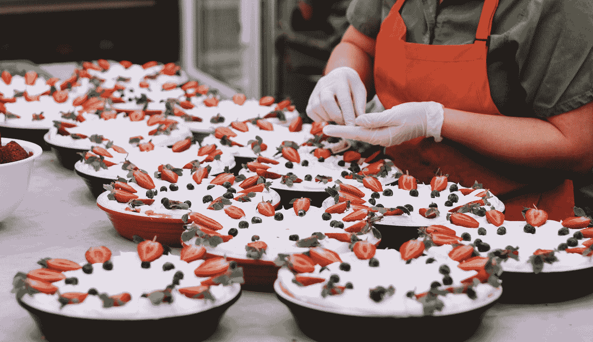
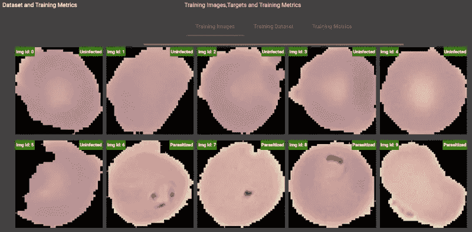

# 浏览器中的机器学习:为自定义图像分类训练和服务 Mobilenet 模型

> 原文：<https://towardsdatascience.com/training-custom-image-classification-model-on-the-browser-with-tensorflow-js-and-angular-f1796ed24934?source=collection_archive---------19----------------------->


Photo by [Louis Hansel](https://unsplash.com/@louishansel?utm_source=medium&utm_medium=referral) on [Unsplash](https://unsplash.com?utm_source=medium&utm_medium=referral)

# Tensorflow.js

有几种方法可以微调深度学习模型，但在 web 浏览器上使用 WebGL 加速是我们不久前经历的事情，引入了 [Tensorflow.js](https://www.tensorflow.org/js) 。我将使用 Tensorflow.js 与 [Angular](https://angular.io/) 一起构建一个 Web 应用程序，该应用程序在 [Mobilenet](https://arxiv.org/abs/1704.04861) 和 [Kaggle 数据集](https://www.kaggle.com/iarunava/cell-images-for-detecting-malaria)的帮助下训练卷积神经网络来检测疟疾感染的细胞，该数据集包含 27.558 个感染和未感染的细胞图像。

# 演示 WebApp

访问[现场演示应用程序](https://tfjs-customimageclassification.web.app/)查看运行中的代码。该应用程序在 Google Chrome 浏览器中运行没有任何问题。

访问我的 [GitHub repositor](https://github.com/eisbilen/TFJS-CustomImageClassification) y 获取该项目的完整代码。您可以在此存储库的[资产文件夹中找到图像，以及将图像加载到浏览器所需的](https://github.com/eisbilen/TFJS-CustomImageClassification/tree/master/assets) [CSV 文件](https://github.com/eisbilen/TFJS-CustomImageClassification/tree/master/assets)。您应该解压缩这些图像，并将它们放入您正在处理的 Angular 项目的 assets 文件夹中。

# 作为基础模型的 Mobilenet

正如我上面提到的，我将使用“mobilenet”作为自定义图像分类器的基础模型。预训练的“mobilenet”模型，兼容 tensorflow.js，相对较小(20MB)，可以直接从 [Google API 存储文件夹](https://storage.googleapis.com/tfjs-models/tfjs/mobilenet_v1_0.25_224/model.json)下载。

未感染和寄生细胞，这是我想用我们的定制模型分类的两个类别，而原始的“mobilenet”模型被训练来分类 1000 个不同的对象。

我将使用除最后 5 层之外的所有“mobilenet”层，并在这个截断模型的顶部添加一个具有 2 个单元和 softmax 激活的密集层，以使修改后的模型适合我们的分类任务。

我不会训练所有的层，因为这将需要大量的时间和计算能力。这对于我们的情况也是不必要的，因为我们使用预先训练的模型，该模型已经学习了许多表示。相反，我将冻结大多数层，只保留最后 2 层可训练。

# 疟疾细胞图像的预处理

在开始编码之前，我们必须考虑如何在训练期间将图像输入到我们的定制模型中。mobilenet 模型需要特定的图像大小(224x224x3)和图像预处理操作，我们必须对图像应用相同的预处理，然后才能将它们提供给我们的模型。此外，为了不使我们的模型偏向一个类，我们必须在训练时期为每个类提供相同数量的图像。


Photo by [Paweł Czerwiński](https://unsplash.com/@pawel_czerwinski?utm_source=medium&utm_medium=referral) on [Unsplash](https://unsplash.com?utm_source=medium&utm_medium=referral)

# Angular WebApp 正在初始化

在我们清楚了模型和数据集之后，是时候使用 Angular 命令行界面来初始化 [Angular](https://angular.io) web 应用程序了。

```
npm install -g @angular/cli
ng new TFJS-CustomImageClassification
cd TFJS-CustomImageClassification
```

然后我会使用' nmp '包管理器来安装 tensorflow.js 库。为了完善 web 应用程序，我将使用[角状材料](https://material.angular.io/)类。

```
TFJS-CustomImageClassification **npm install @tensorflow/tfjs --save** TFJS-CustomImageClassification **ng add @angular/material**
```

# 生成基于自定义 Mobilenet 的模型

首先，让我们开始编码，生成一个函数来修改预训练的模型，以便我们可以使用这个修改后的模型来完成我们的特定任务，即对感染疟疾的图像进行分类。由于我不想从头开始训练模型，我将冻结所有层，除了我需要重新训练微调模型的层。

```
//-------------------------------------------------------------
// modifies the pre-trained mobilenet to detect malaria infected
// cells, freezes layers to train only the last couple of layers
//-------------------------------------------------------------
async getModifiedMobilenet()
{
 *const* trainableLayers=     ['denseModified','conv_pw_13_bn','conv_pw_13','conv_dw_13_bn','conv _dw_13'];
 *const* mobilenet =  await
 tf.loadLayersModel('https://storage.googleapis.com/tfjs- models/tfjs/mobilenet_v1_0.25_224/model.json');*console*.log('Mobilenet model is loaded')
 *const* x=mobilenet.getLayer('global_average_pooling2d_1');
 *const* predictions= <tf.SymbolicTensor> tf.layers.dense({units: 2,  activation: 'softmax',name: 'denseModified'}).apply(x.output); 
 *let* mobilenetModified = tf.model({inputs: mobilenet.input, outputs:  predictions, name: 'modelModified' });
 *console*.log('Mobilenet model is modified')mobilenetModified =
 this.freezeModelLayers(trainableLayers,mobilenetModified)
 *console*.log('ModifiedMobilenet model layers are freezed')mobilenetModified.compile({loss: categoricalCrossentropy,  optimizer: tf.train.adam(1e-3), metrics:   ['accuracy','crossentropy']});mobilenet.dispose();
 x.dispose();
 return mobilenetModified
}
//-------------------------------------------------------------
// freezes mobilenet layers to make them untrainable
// just keeps final layers trainable with argument trainableLayers
//-------------------------------------------------------------freezeModelLayers(*trainableLayers*,*mobilenetModified*)
{
 for (*const* layer of mobilenetModified.layers)
 {
  layer.trainable = false;
  for (*const* tobeTrained of trainableLayers)
  {
    if (layer.name.indexOf(tobeTrained) === 0)
     {
      layer.trainable = true;
      break;
     }
   }
  }
 return mobilenetModified;
}
```



Photo by [Toa Heftiba](https://unsplash.com/@heftiba?utm_source=medium&utm_medium=referral) on [Unsplash](https://unsplash.com?utm_source=medium&utm_medium=referral)

# 准备培训数据

为了训练该模型，我们需要 224×224×3 形状张量和另一个包含 1，0 值的 1 维张量中的未感染和感染细胞图像来指示图像的类别。我要做的是读取包含图像 src 和类信息的 CSV 文件，然后生成 HTMLImageElement 以在浏览器中查看它们。Capture()函数然后将获取图像 id，以便从浏览器上的图像生成所需的图像张量。请注意，我们必须预处理图像张量，因为 mobilenet 需要标准化的输入。老实说，我在这里使用的数据管道并不是正确的方式，因为我是一次将整块图像数据加载到内存中。使用 [**tf.fitDataset**](https://js.tensorflow.org/api/latest/#tf.LayersModel.fitDataset) 并在需要时迭代使用内存会好得多。

```
//-------------------------------------------------------------
// this function generate input and target tensors for the training
// input tensor is produced from 224x224x3 image in HTMLImageElement
// target tensor shape2 is produced from the class definition
//-------------------------------------------------------------
generateData (*trainData*,*batchSize*)
{
  *const* imageTensors = [];
  *const* targetTensors = [];*let* allTextLines = this.csvContent.split(/\r|\n|\r/);
  *const* csvSeparator = ',';
  *const* csvSeparator_2 = '.';for ( *let* i = 0; i < batchSize; i++)
  {
    // split content based on comma
    *const* cols: *string*[] = allTextLines[i].split(csvSeparator);
    *console*.log(cols[0].split(csvSeparator_2)[0])if (cols[0].split(csvSeparator_2)[1]=="png")
    {
     *const* imageTensor = this.capture(i);
      *let* targetTensor   =tf.tensor1d([this.label_x1[i],this.label_x2[i]]);
      targetTensor.print();
      imageTensors.push(imageTensor);
      targetTensors.push(targetTensor);
    }
  }
  *const* images = tf.stack(imageTensors);
  *const* targets = tf.stack(targetTensors);
  return {images, targets};
}
//-------------------------------------------------------------
// converts images in HTMLImageElement into the tensors
// takes Image Id in HTML as argument
//-------------------------------------------------------------
capture(*imgId*)
{
  // Reads the image as a Tensor from the <image> element.
  this.picture = <HTMLImageElement> document.getElementById(imgId);
  *const* trainImage = tf.browser.fromPixels(this.picture);
  // Normalize the image between -1 and 1\. The image comes in  between  0-255, so we divide by 127 and subtract 1.
  *const* trainim =  trainImage.toFloat().div(tf.scalar(127)).sub(tf.scalar(1));
  return trainim;
}
```



Cell Images listed in Web App

# 微调模型

当我们准备好数据和模型时，现在是时候对模型进行微调，以便它可以对感染疟疾的细胞图像进行分类。为了减少训练过程的时间，我将总共使用 120 幅图像，5 个时期的训练过程，每个时期包含 24 幅图像。损失函数为' [**类别交叉熵**](https://gombru.github.io/2018/05/23/cross_entropy_loss/) **'** 和**'一个** [**坝优化器**](https://machinelearningmastery.com/adam-optimization-algorithm-for-deep-learning/) **'** 用于学习率值相对较小的训练。我使用 [**Keras**](https://keras.io/) 提供的“[**on batchend**](https://keras.io/callbacks/)**”**回调函数将每个历元的训练指标写入控制台。一旦训练完成，我们必须释放张量来释放内存。最后一步，我们将把训练好的模型保存到我们的本地存储器中，以便以后用于推理。

```
async fineTuneModifiedModel(*model*,*images*,*targets*)
{
  *function* onBatchEnd(*batch*, *logs*)
  {
    *console*.log('Accuracy', logs.acc);
    *console*.log('CrossEntropy', logs.ce);
    *console*.log('All', logs);
  }
  *console*.log('Finetuning the model...');

  await model.fit(images, targets,
  {
    epochs: 5,
    batchSize: 24,
    validationSplit: 0.2,
    callbacks: {onBatchEnd}
    }).then(*info* *=>* {
    *console*.log
    *console*.log('Final accuracy', info.history.acc);
    *console*.log('Cross entropy', info.ce);
    *console*.log('All', info);
    *console*.log('All', info.history['acc'][0]);

    for ( *let* k = 0; k < 5; k++)
    {
      this.traningMetrics.push({acc: 0, ce: 0 , loss: 0});
      this.traningMetrics[k].acc=info.history['acc'][k];
      this.traningMetrics[k].ce=info.history['ce'][k];
      this.traningMetrics[k].loss=info.history['loss'][k];
    }
    images.dispose();
    targets.dispose();
    model.dispose();
  });
}
```


Photo by [Kym MacKinnon](https://unsplash.com/@vixenly?utm_source=medium&utm_medium=referral) on [Unsplash](https://unsplash.com?utm_source=medium&utm_medium=referral)

# 完整代码

访问 my [GitHub repositor](https://github.com/eisbilen/TFJS-CustomImageClassification) y 获取该项目的完整代码。您可以在这个存储库的 [assets 文件夹中找到图像，以及将图像加载到浏览器所需的](https://github.com/eisbilen/TFJS-CustomImageClassification/tree/master/assets) [CSV 文件](https://github.com/eisbilen/TFJS-CustomImageClassification/tree/master/assets)。您应该解压缩这些图像，并将它们放入您正在处理的 Angular 项目的 assets 文件夹中。

# 演示 WebApp

访问[现场演示应用](https://tfjs-customimageclassification.web.app/)查看运行中的代码。该应用程序在 Google Chrome 浏览器中运行没有任何问题。