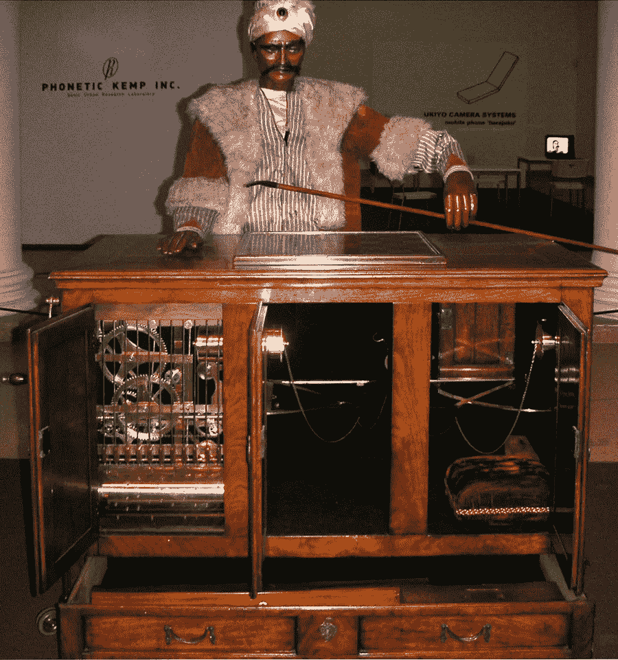
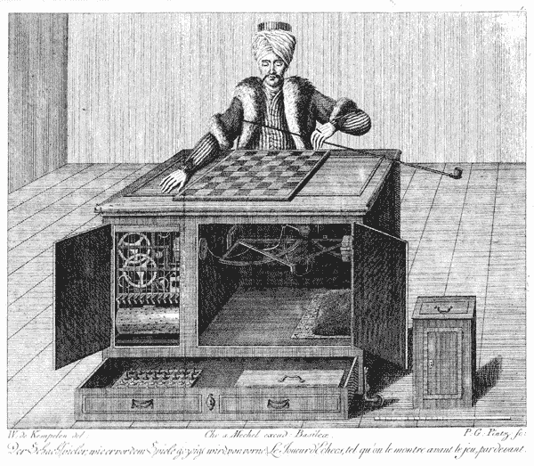
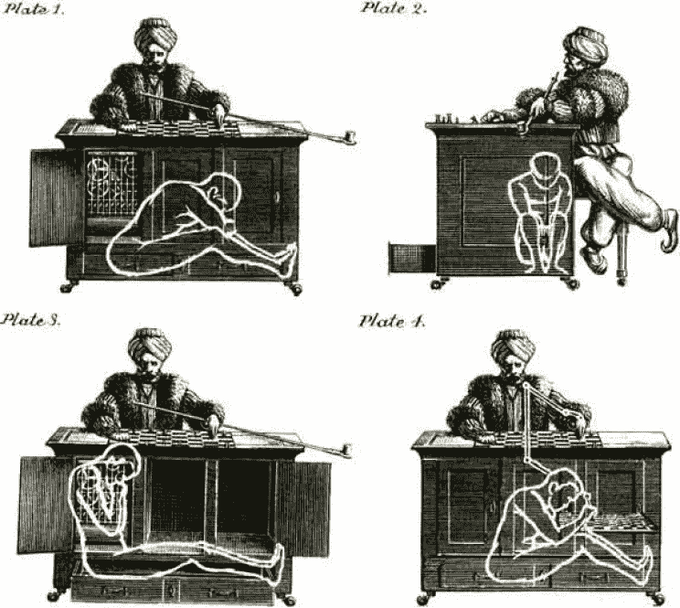
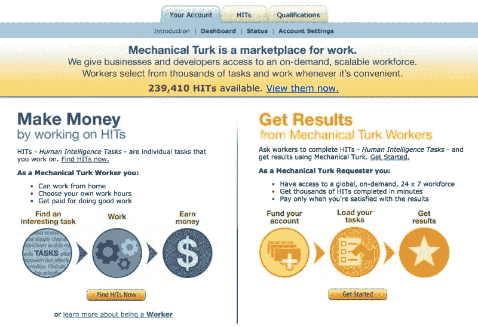

# 训练数据，是什么？谁在做？

> 原文：<https://towardsdatascience.com/training-data-what-is-it-whos-doing-it-b1710eca4dfd?source=collection_archive---------29----------------------->

## 半魔法半机器半人类？这是什么？

最著名的是“土耳其人”，上面的两张照片展示了沃尔夫冈·冯·肯佩兰在 1770 年的创作。它是在他试图给当时的奥地利女皇留下深刻印象时亮相的， ***机器似乎有能力在那个时期下棋并击败一些最聪明的头脑。*** 它有会动的眼睛和手臂，如果对手拖得太久，它会敲击桌子。那些与这种机制对弈并输给它的对手包括*拿破仑·波拿巴、埃德加·爱伦·坡、本杰明·富兰克林*以及当时许多其他国际象棋大师。

土耳其人是那个时代的工程奇迹:一个人被机器打败了。这个想法本身扰乱了遇到这个神秘机器的群众，并引起了他们的惊奇。有数百本关于其功能的书籍和理论出版，激发了无数不同的发明。今天被认为是“计算之父”的查尔斯·巴贝奇在 1819 年伦敦比赛后，受到启发，开始思考机械计算机；这导致了他的数字可编程计算机的概念。

但是这个令人惊叹的机械奇观对于它的工作原理有许多怀疑者和不相信者，最著名的是埃德加·爱伦·坡。嗯…，埃德加没有错。

他提议，在为观众做开场演示时，桌子上有足够的空间让一个人隐藏和移动。

土耳其人仍然能够击败许多棋手的原因是，当时大多数有天赋的棋手无法仅靠下棋谋生，所以可以把它视为一种兼职骗局。

# **这与今天有什么关系？Mturk.com(MechanicalTurk)**

**Amazon Mechanical Turk** 是一个"*众包市场，让个人和企业更容易将他们的流程和工作外包给分散的员工，他们可以虚拟地执行这些任务。***它基本上是一个让人类修复或手动输入计算机程序难以完成的任务的平台。**这可以是任何事情，从插入收据中的数据，到找到度假租赁的地址。上图和下图显示了业务平台和员工对所有可用任务/工作的看法，以及工资。Mturk 对机器学习工作流和所有类型的业务处理外包都有很大的应用；想一想按需分配微任务。

# 等等，谁在做这项工作？人工智能还是人类？

关于这个平台，我想到了两个问题。难道人工智能程序不应该足够智能来计算这些看起来如此简单的任务吗？还是说 Mturk 更像是一个训练那些人工智能的平台？

# **更好地了解人工智能和培训数据**

在不深入了解人工智能的情况下，一个简单的理解是“*算法流水线*”。将人工智能周围的所有气泡视为输入系统的算法，这使它变得智能。

它从特定领域获取数据，执行一系列计算，并给出预测。传统算法和人工智能算法的一个关键区别是，一个是手动编程的，而另一个是自我学习的。所有这一切都是由于**训练数据**的缘故，它可以根据成千上万的例子区分输入和输出。

## **什么样的训练数据？**

与 Mturk 目的相关，干净且有标签的数据是非常理想的。来自真实世界的原始数据是杂乱的，通常需要人类对其进行分类，因此算法知道要“训练”什么，人工智能系统知道要“学习”什么。即使有一个好的系统，有时事情也不会像预期的那样完美，因为没有考虑到现实生活中的影响。所以当这种情况发生时，把任务交给更聪明的东西:人类。

科技公司有一条双向道，让公众了解他们的技术背后实际是什么。[谷歌的军用无人机 A.I.](https://theintercept.com/2019/02/04/google-ai-project-maven-figure-eight/) 公开了他们如何使用来自众包数据标签公司 CrowdFlower 的“低薪工人”，后者更名为“Figure Figure 8”。公司也可能走上欺骗的道路，就像软件公司 Expensify 所做的那样。Expensify 是一家自动化公司，致力于处理编写各种费用报告的繁琐任务，开发了他们的下一个“惊人的”SmartScan 技术来处理它。但在现实中，就像惊人的“土耳其人”欺骗一样，它在幕后秘密地只是人类:许多实际上是 Mturk 工人！

# **别再说 Mturk 了，你一直在帮助训练人工智能**

## **谷歌验证码:**

你知道那些小测试网站必须确保你是一个人，而不是像那些骗人的机器人一样撒谎？嗯，谷歌使用它的验证码作为收集有用数据的一个很好的方式。想想你不得不说出的那些奇怪而模糊的话；您的正确答案可以帮助使用 Google vision 和书籍进行字符识别。那些不均匀和歪斜的数字呢？这听起来像是谷歌街景和帮助确认地址的一个很好的应用程序。我觉得谷歌的验证码最近主要集中在那些小方块上，在那里你可以从选择的图像中挑选出汽车、交通灯或街道标志。我会发现谷歌不太可能不将这些数据用于他们的自动驾驶汽车项目 Waymo。

## **脸书:**

社交网络 goliath 拥有世界上最先进的面部识别系统之一。每个人都有许多照片，他们或他们的朋友会在里面贴上自己的标签。

*   他们拥有开发一个伟大的系统所需的所有数据，该系统可以在你发布图片时自动标记你朋友的脸。
*   数据积累与输入成本为 0 美元，因为用户已经这样做了。

## **我们是谷歌的试验品，还是任何人的？**

谷歌的深度传感研究团队需要大量的镜头，移动相机从多个角度观察静态空间。你从哪里得到的？当然，2016 年至 2017 年期间的病毒人体模型挑战。

*   该团队使用 2000 个 Youtube 挑战视频来训练他们的人工智能模型，以从运动视频中预测深度。

人工智能的神奇之处在于它是如何建立在人类智能的基础上的，但通常会设法超越它，超越人们认为可能的事情。训练数据是一个系统运行得如何的关键组成部分，可以通过互联网大量获得:这是今天人工智能繁荣的重要推动力。不要忘记，目前对你可以用作训练数据的内容没有“严格的”版权限制，…就目前而言。

**作品引用:**

 [## 谷歌雇佣零工经济工人来提高人工智能在有争议的…

### 世界各地数百万零工经济工作者现在在所谓的人群工作者网站上谋生——这些工作属于…

theintercept.com](https://theintercept.com/2019/02/04/google-ai-project-maven-figure-eight/)  [## 当人工智能需要人类助手时

### 多年来，亚马逊的机械土耳其人(mTurk)在科技界已经是一种公开的秘密，在这个地方，初出茅庐的…

www.theverge.com](https://www.theverge.com/2019/6/12/18661657/amazon-mturk-google-captcha-robot-ai-artificial-intelligence-mechanical-turk-humans)  [## 亚马逊土耳其机械公司

### 获得全球化、按需、24x7 的劳动力亚马逊土耳其机器人是一个众包市场，它使…

www.mturk.com](https://www.mturk.com/)  [## 清理人工智能周围的水。

### 大数据还是大炒作？

towardsdatascience.com](/clearing-the-water-around-a-i-5ca596dad1b9)  [## Expensify 的“智能”扫描技术得到了人类的秘密协助

### Expensify 是一家软件公司，它自动化了编写费用报告的痛苦任务。它使用…

qz.com](https://qz.com/1141695/startup-expensifys-smart-scanning-technology-used-humans-hired-on-amazon-mechanical-turk/)