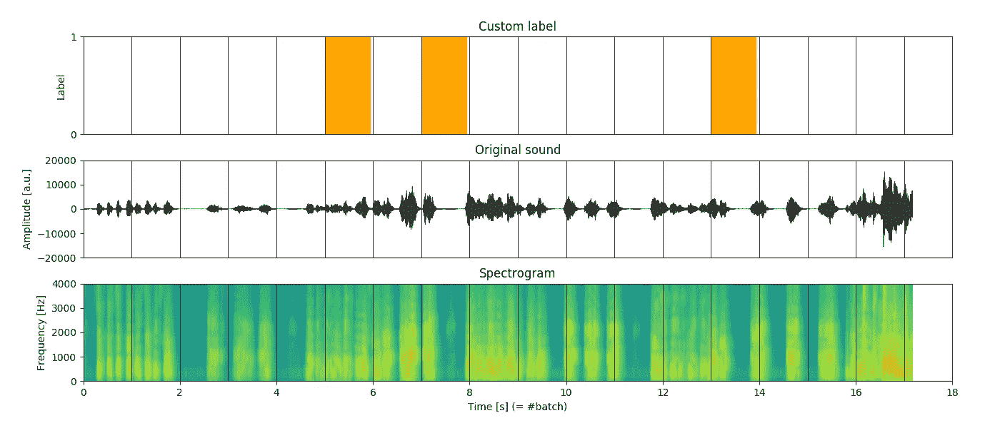
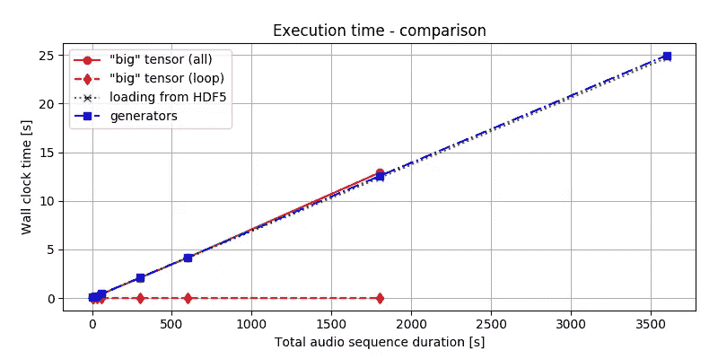
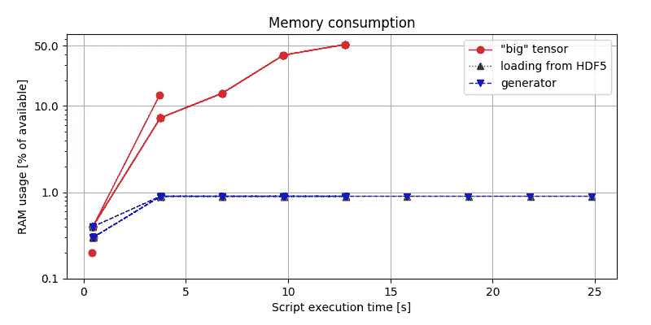

# 批量训练:如何拆分数据？

> 原文：<https://towardsdatascience.com/training-on-batch-how-to-split-data-effectively-3234f3918b07?source=collection_archive---------39----------------------->

*三种将你的数据分割成批的方法，比较时间&内存效率和代码质量。*

# 介绍

随着数据量的增加，训练机器学习模型的一种常见方法是对批处理应用所谓的*训练。这种方法包括将数据集分割成一系列较小的数据块，一次一个地传递给模型。*

在本帖中，我们将提出**三个想法**来拆分批量数据集:

*   创造了一个“大”张量，
*   用 HDF5 加载部分数据，
*   python 生成器。

出于说明的目的，我们将假设该模型是一个基于声音的检测器，但本文中的分析是通用的。尽管这个例子是作为一种特殊情况来设计的，但这里讨论的步骤本质上是对数据进行**分割、预处理**和**迭代**。它符合普通程序。不管图像文件、来自 SQL 查询的表或 HTTP 响应的数据是什么，我们主要关心的是过程。

具体来说，我们将从以下几个方面比较我们的方法:

*   代码质量，
*   内存占用，
*   时间效率。

# 什么是批？

形式上，批处理被理解为输入输出对`(X[i], y[i])`，是数据的子集。由于我们的模型是一个基于声音的检测器，它期望一个经过*处理的*音频序列作为输入，并返回某个事件发生的概率。很自然，在我们的例子中，该批次包括:

*   `X[t]` -表示在时间窗口内采样的处理过的音轨的矩阵，以及
*   `y[t]` -表示事件存在的二元标签，

其中`t`表示时间窗(图 1。).



Figure 1\. An example of data input. Top: simple binary label (random), middle: raw audio channel (mono), bottom: spectrogram represented as naural logarithm of the spectrum. The vertical lines represent slicing of the sequence into batches of 1 second length.

# 光谱图

至于声谱图，你可以把它看作是一种描述每首“曲子”在音轨中所占比重的方式。例如，当演奏低音吉他时，声谱图会显示更集中在频谱较低一侧的高强度。相反，对于女高音歌手，我们会观察到相反的情况。通过这种“编码”，谱图自然地代表了模型的有用特征。

# 比较想法

作为我们比较的一个共同前提，让我们简单定义以下导入和常量。

```
from scipy.signal import spectrogram
from os.path import join
from math import ceil
import numpy as np

FILENAME = 'test'
FILEPATH = 'data'
CHANNEL  = 0        # mono track only
SAMPLING = 8000     # sampling rate (audio at 8k samples per s)
NFREQS   = 512      # 512 frequencies for the spectrogram
NTIMES   = 400      # 400 time-points for the spectrogram
SLEN     = 1        # 1 second of audio for a batch

N = lambda x: (x - x.mean())/x.std() # normalization

filename = join(FILEPATH, FILENAME)
```

这里的数字有些随意。我们决定采用最低采样率(其他常见值为 16k 和 22.4k fps)，并让每个`X`组块成为 512 个频率通道的频谱图，该频谱图是使用沿时间轴的 400 个数据点从 1 的非重叠音频序列计算的。换句话说，每一批将是一对一个 **512 乘 400 的矩阵**，加上一个二进制标签。

# 想法 1——一个“大”张量

模型的输入是一个二维张量。由于最后一步涉及批次的迭代，因此*增加张量的秩*并为批次计数保留第三维是有意义的。因此，整个过程可以概括如下:

1.  加载`x`-数据。
2.  加载`y`标签。
3.  将`X`和`y`分批切片。
4.  提取每一批的特征(这里是谱图)。
5.  将`X[t]`和`y[t]`放在一起。

为什么这不是个好主意？让我们看一个实现的例子。

```
def create_X_tensor(audio, fs, slen=SLEN, bsize=(NFREQS, NTIMES)):
    X = np.zeros((n_batches, bsize[0], bsize[1]))

    for bn in range(n_batches):
        aslice = slice(bn*slen*fs, (bn + 1)*slen*fs)
        *_, spec = spectrogram(
                N(audio(aslice)), 
                fs       = fs, 
                nperseg  = int(fs/bsize[1]),
                noverlap = 0,
                nfft     = bsize[0])
        X[bn, :, :spec.shape[1]] = spec
    return np.log(X + 1e-6) # to avoid -Inf

def get_batch(X, y, bn):
    return X[bn, :, :], y[bn]

if __name__ == '__main__':
    audio = np.load(filename + '.npy')[:, CHANNEL]
    label = np.load(filename + '-lbl.npy')

    X = create_X_tensor(audio, SAMPLING)
    for t in range(X.shape[0]):
        batch = get_batch(X, y, t)
        print ('Batch #{}, shape={}, label={}'.format(
            t, X.shape, y[i]))
```

这种方法的本质可以被描述为**现在全部加载，以后再担心。**

虽然创建`X`一个自包含的数据块可以被视为一个优点，但这种方法也有*缺点*:

1.  我们将所有数据导入 RAM，不管 RAM 是否能存储这些数据。
2.  我们使用第一维度`X`进行批次计数。然而，这仅仅是基于一个*惯例*。如果下一次有人决定应该是最后一次呢？
3.  尽管`X.shape[0]`准确地告诉我们有多少批次，我们仍然需要创建一个辅助变量`t`来帮助我们跟踪批次。这个设计强制模型训练代码遵守这个决定。
4.  最后，它要求定义`get_batch`函数。其唯一目的是选择`X`和`y`的子集，并将它们整理在一起。它看起来充其量是不受欢迎的。

# 想法 2——使用 HDF5 加载批次

让我们从消除最可怕的问题开始，即将所有数据加载到 RAM 中。如果数据来自一个文件，那么只加载它的一部分并对这些部分进行操作是有意义的。

使用来自[熊猫的](https://pandas.pydata.org/pandas-docs/stable/reference/api/pandas.read_csv.html) `[read_csv](https://pandas.pydata.org/pandas-docs/stable/reference/api/pandas.read_csv.html)`的`skiprows`和`nrows`参数，可以加载. csv 文件的片段。然而，由于 CSV 格式对于存储声音数据来说相当不切实际，[分层数据格式(HDF5)](https://support.hdfgroup.org/HDF5/) 是更好的选择。这种格式允许我们存储多个类似 numpy 的数组，并以类似 numpy 的方式访问它们。

这里，我们假设文件包含名为`'audio'`和`'label'`的固有数据集。更多信息请查看 Python [h5py](https://docs.h5py.org/en/stable/) 库。

```
def get_batch(filepath, t, slen=SLEN, bsize=(NFREQS, NTIMES)):
    with h5.File(filepath + '.h5', 'r') as f:
        fs    = f['audio'].attrs['sampling_rate']
        audio = f['audio'][t*slen*fs:(t + 1)*slen*fs, CHANNEL]
        label = f['label'][t]

    *_, spec = spectrogram(
            N(audio),
            fs          = fs,
            nperseg     = int(fs/bsize[1]),
            noverlap    = 0,
            nfft        = bsize[0])
    X = np.zeros((bsize[0] // 2 + 1, bsize[1]))
    X[:, :spec.shape[1]] = spec
    return np.log(X + 1e-6), label

def get_number_of_batches(filepath):
    with h5.File(filepath + '.h5', 'r') as f:
        fs = f['audio'].attrs['sampling_rate']
        sp = f['audio'].shape[0]
    return ceil(sp/fs)

if __name__ == '__main__':
    n_batches = get_number_of_batches(filename)
    for t in range(n_batches):
        batch = get_batch(filename, t)
        print ('Batch #{}, shape={}, label={}'.format(
            i, batch[0].shape, batch[1]))
```

希望我们的数据现在是可管理的(如果以前不是的话)！此外，在整体质量方面，我们也取得了一些进步:

1.  我们去掉了之前的`get_batch`函数，用一个更有意义的函数取而代之。它计算什么是必要的，并传递数据。简单。
2.  我们的`X`张量不再需要人为修改。
3.  事实上，通过将`get_batch(X, y, t)`改为`get_batch(filename, t)`，我们抽象出了对数据集的访问，并从名称空间中移除了`X`和`y`。
4.  数据集也变成了一个单独的文件。我们不需要从两个不同的文件中获取数据和标签。
5.  我们不需要提供`fs`(采样率)参数。得益于 HDF5 中所谓的*属性*，它可以成为数据集文件的一部分。

尽管有这些优点，我们仍然有两个…不便之处。

因为新的`get_batch`不记得*状态*。我们必须像以前一样使用循环来控制`t`。然而，由于`get_batch`中没有机制来告诉循环需要多大(除了添加第三个输出参数，这很奇怪)，我们需要事先检查数据的大小。除了向`get_batch`添加第三个输出(这会使这个函数变得很奇怪)之外，它还要求我们创建第二个函数:`get_number_of_batches`。

不幸的是，它并没有使解决方案尽可能优雅。如果我们只是将`get_batch`转换成一种能够保持状态的形式，我们可以做得更好。

# 想法 3——发电机

让我们来识别模式。我们只对一个接一个地访问、处理和传递数据片段感兴趣。我们不需要一下子全部用完。

对于这些机会，Python 有一个特殊的构造，即*生成器*。生成器是返回*生成器迭代器*的函数，迭代器不是急切地执行计算，而是在那时传递一点结果，等待被要求继续。完美，对吧？

生成器迭代器可以通过三种方式构建:

*   通过类似于列表理解的表达:例如`(i for i in iterable)`，但是使用`()`而不是`[]`，
*   发电机功能——用`yield`代替`return`,或
*   来自定义自定义`__iter__`(或`__getitem__`)和`__next__`方法的类对象(见[文档](https://docs.python.org/3/library/stdtypes.html#generator-types))。

在这里，使用`yield`自然符合我们需要做的事情。

```
def get_batches(filepath, slen=SLEN, bsize=(NFREQS, NTIMES)):
    with h5.File(filepath + '.h5', 'r') as f:
        fs = f['audio'].attrs['sampling_rate']
        n_batches = ceil(f['audio'].shape[0]/fs)

        for t in range(n_batches):
            audio = f['audio'][t*slen*fs:(t + 1)*slen*fs, CHANNEL]
            label = f['label'][t]
            *_, spec = spectrogram(
                    N(audio),
                    fs          = fs,
                    nperseg     = int(fs/bsize[1]),
                    noverlap    = 0,
                    nfft        = bsize[0])
            X = np.zeros((bsize[0] // 2 + 1, bsize[1]))
            X[:, :spec.shape[1]] = spec
            yield np.log(X + 1e-6), label

if __name__ == '__main__':
    for b in get_batches(filename):
        print ('shape={}, label={}'.format(b[0].shape, b[1]))
```

该循环现在位于函数内部。由于有了`yield`语句，只有在`get_batches`被调用`t - 1`次后才会返回`(X[t], y[t])`对。模型训练代码不需要管理循环的状态。该函数会记住调用之间的状态，允许用户迭代批处理，而不是使用一些人工的批处理索引。

将生成器迭代器比作包含数据的容器是很有用的。随着每一次迭代中批次的删除，容器在某个时候变空了。因此，索引和停止条件都不是必需的。数据被消耗，直到不再有数据，过程停止。

# 性能:时间和记忆

我们有意从讨论代码质量开始，因为它与我们的解决方案的发展方式紧密相关。然而，考虑资源限制同样重要，尤其是当数据量增长时。

图二。显示使用上述三种不同方法交付批次所需的时间。如我们所见，处理和移交数据所需的时间几乎相同。无论我们是加载所有要处理的数据，然后对其进行切片，还是从头开始一点一点地加载和处理，获得解决方案的总时间几乎是相等的。当然，这可能是拥有 SSD 的结果，SSD 允许更快地访问数据。尽管如此，所选择的策略似乎对整体时间性能没有什么影响。



Figure 2\. Time performance comparison. The red-solid line refers to timing both loading the data to the memory and performing the computation. The red-dotted line times only the loop, where slices are delivered, assuming that data was precomputed. The green-dotted line refers to loading batches from HDF5 file and the blue-dashed-dotted line implements a generator. Comparing the red lines, we can see that just accessing of the data once it is in the RAM is almost for free. When data is local, the differences between the other cases are minimal, anyway.

当查看图 3 时，可以观察到更多的差异。考虑到第一种方法，它是所有方法中对内存需求最大的，会产生长达 1 小时的音频样本。相反，当分块加载数据时，分配的 RAM 由批处理大小决定，使我们安全地低于限制。



Figure 3\. Memory consumption comparison, expressed in terms of the percentage of the available RAM being consumed by the python script, evaluated using: `(env)$ python idea.py & top -b -n 10 > capture.log; cat capture.log | egrep python > analysis.log`, and post-processed.

令人惊讶的是(或者不是)，第二种和第三种方法之间没有明显的区别。该图告诉我们，选择或不选择实现生成器迭代器对我们的解决方案的内存占用没有影响。

这是很重要的一点。通常鼓励使用生成器作为更有效的解决方案，以节省时间和内存。相反，该图显示，就资源而言，生成器本身并不能提供更好的解决方案。重要的是我们访问资源的速度有多快，我们一次能处理多少数据。

使用 HDF5 文件被证明是有效的，因为我们可以非常快速地访问数据，并且足够灵活，我们不需要一次加载所有数据。同时，生成器的实现提高了代码的可读性和质量。虽然我们也可以将第一种方法构建成生成器的形式，但这没有任何意义，因为如果不能加载少量数据，生成器只会改进语法。因此，最好的方法似乎是同时使用加载部分数据和生成器，这由第三种方法表示。

# 结束语

在这篇文章中，我们介绍了三种不同的方法来分割和处理我们的数据。我们比较了每种方法的性能和整体代码质量。我们也说过，生成器本身并不能提高代码的效率。最终的性能由时间和内存约束决定，但是，生成器可以使解决方案更加优雅。

你觉得哪个解决方案最有吸引力？

# 还会有更多…

我计划把文章带到下一个层次，并提供简短的视频教程。

如果您想了解关于视频和未来文章的更新，**订阅我的** [**简讯**](https://landing.mailerlite.com/webforms/landing/j5y2q1) **。你也可以通过填写[表格](https://forms.gle/bNpf9aqZJGLgaU589)让我知道你的期望。回头见！**

*原载于*[*https://zerowithdot.com*](https://zerowithdot.com/splitting-to-batches/)*。*