# 使用员工的幸福指数预测工作场所的生产力

> 原文：<https://towardsdatascience.com/training-regression-models-bfd779a73a60?source=collection_archive---------17----------------------->

## 训练回归模型

Y 你已经观察到，在过去的几年里，快乐的员工是你公司的主要利润来源，在这些年里，你记下了所有员工的快乐指数和他们的工作效率。现在你有大量的员工数据躺在 excel 文件中，你最近听说 ***“数据是新的石油。将会胜出的公司正在使用数学。”***——*凯文·普兰克，安德玛创始人兼 CEO，2016。*

您想知道是否也可以通过某种方式匹配这些数据来预测新员工的生产力，这些数据基于他们的幸福指数。这样你就能更容易地找出效率最低的员工(然后假设解雇他们——只是假设)。如果是这样的话，干杯！🎉—因为这篇博文将向你介绍一种机器学习算法(回归)来构建这个 AI 应用！

# 这篇博文的目的是…📚

提供训练回归模型的完整见解

# 目标观众是… 🗣 🗣 🗣

任何人都在寻找回归背后的数学的深入而易懂的解释

# 本教程结束时…🔚

你将会对回归的本质有一个完整的了解😃你对 ML 的理解将会提高👍是的，你将能够识别出你效率最低的员工！

# 现在是路线图…..🚵

**里程碑# 1 :** [**什么是回归，它与分类有何不同？**](#fe1c)

**里程碑# 2.1 :** [**训练回归模型——决定损失函数作为回归模型的评价指标**](#f95d)

**里程碑# 2.2 :** [**训练回归模型——梯度下降**](#d1ed)

**里程碑# 2.3 :** [**训练回归模型——使用梯度下降**](#cd55) 完成简单回归模型的遍历

**里程碑# 3 :** [**利用训练好的回归模型进行智能预测！**](#858f)

**里程碑# 4:** [**最后是结束语……**](#a711)

# 让我们开始吧！

# **什么是回归，它与分类有何不同？**

在定义回归之前，让我们先定义连续变量和离散变量。

## 连续变量

连续变量是可以从它的无限可能值集中取任何值的变量——可能值的数量简直是数不清的。

## **离散变量**

离散变量是可以从其有限的可能值集中取任何值的变量，可能值的数量是可数的。

## 区分分类和回归

在上述讨论的背景下，我们现在可以清楚地区分分类和回归。分类是从一组有限的值(显然是我们在训练中得到的值)中预测一个值(即一个类)，而回归是从一组无限的可能值中预测一个值。例如，预测个人体重的模型是回归模型，因为其预测体重值有无限种可能性。一个人的体重可能是 12.0 千克或 12.01 千克或 12.21 千克，这种可能性是无限的，因此是一个回归模型。

**举几个例子来进一步阐明分类的区别&回归**

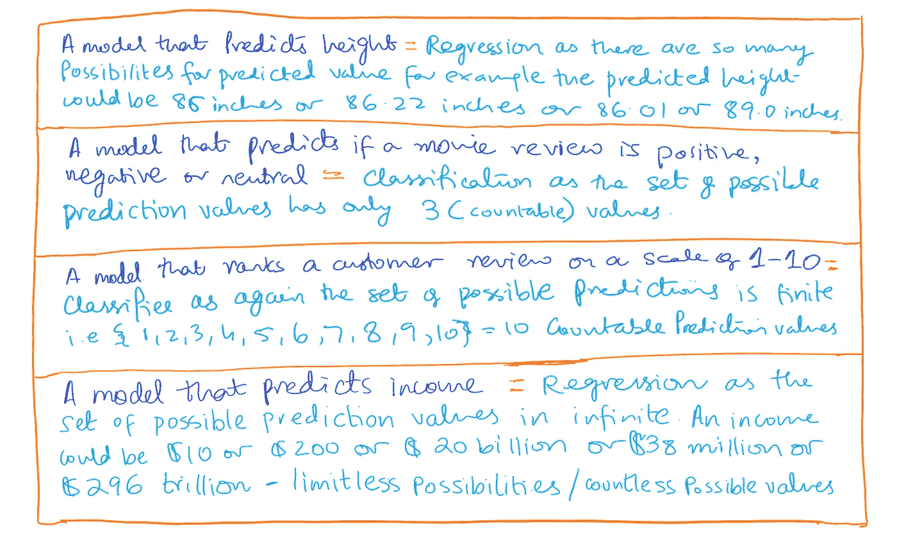

Classification & Regression Examples

> **里程碑 1 达成！*👍***

# **训练回归模型——决定损失函数作为回归模型的评估指标**

假设我们有一个员工幸福指数和员工生产力的训练数据集，将它们绘制成下图。

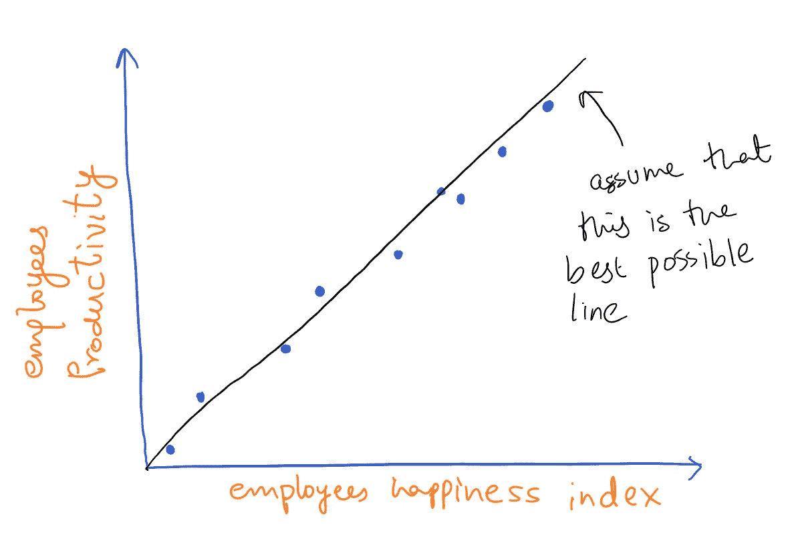

该图显示了训练数据的基本模式是两个变量之间的线性关系。因此，训练一个*广义*回归模型将对这个线性关系/函数建模，即*在许多可能的线*中找到一条最佳拟合线。在此之后，一个看不见的数据点(测试时间示例)将根据在训练阶段学习的线性函数/趋势预测其值。

## 训练回归模型的摘要概述

假设我们已经知道一条*线*将很好地适合给定的数据集。为了对给定数据集的直线建模，我们现在需要找到梯度(m)和 y 轴截距(c)的最佳值。因此，在培训期间，我们试图学习 m 和 c 的最佳可能值。一旦我们有了这些值，我们就可以简单地将给定幸福指数(即 x)的值代入学习的等式，并预测其对应的员工生产率，即 y。

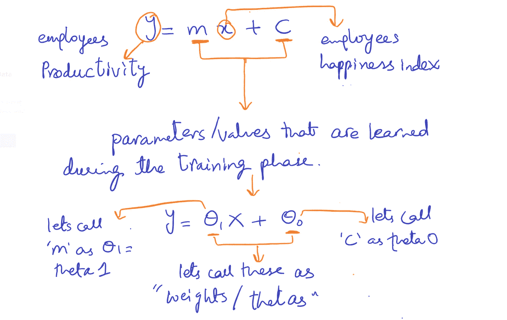

Weights/Thetas — Learning Parameters

## 如果我们简单地使用准确性作为评估标准来评估我们模型的性能会怎么样？

假设我们训练了一个回归模型，现在我们需要评估它在测试集(理想情况下是验证集)上有多好。因此，我们将所有验证集数据点(x 值)插入到线性函数中，并预测它们对应的 y 值。

使用准确性作为回归模型的评估标准将总是导致训练、验证和测试集的准确性为 0！为什么？因为实际上来说，预测值可以非常接近真实的连续值，但很难*与真实标签的*完全相等。因此，由于预测标签和真实标签不匹配，准确性将始终为零。

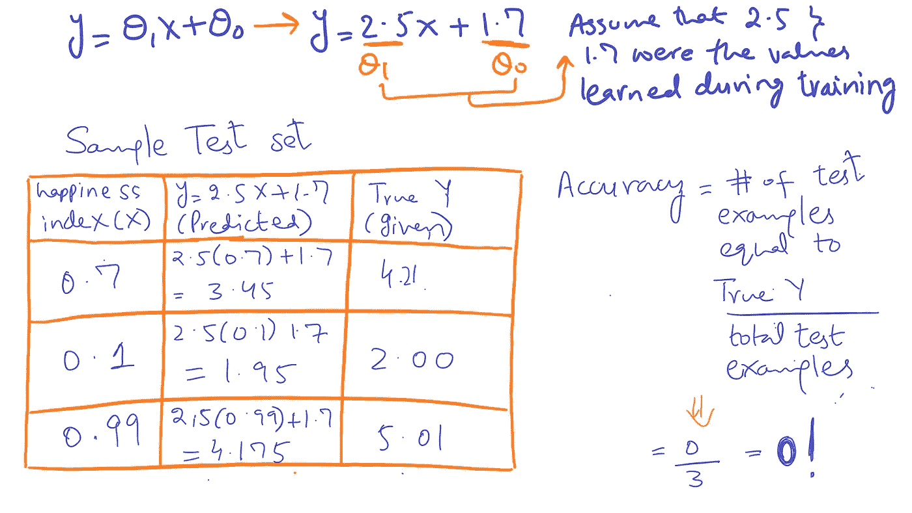

Using Accuracy as Evaluation Metric for Regression

上面的例子表明，虽然预测值接近实际值，但并不完全相等，精度完全为 0。因此，使用准确性作为评估回归模型的评估标准是不明智的。我们需要定义另一个评估指标来评估我们模型的性能。

## 决定回归模型的评估标准

我们需要一个评估指标，以反映我们的训练模型的有效性，即如何推广。它不应该仅仅因为预测值和实际值不完全匹配就输出零值。相反，它应该能够以某种方式证明我们的最佳可能模型与理想模型(一个具有所有理想θ/权重的函数，但这在现实生活场景中几乎不可能)相比有多好。

> 定义 L1- *损失函数*为评估度量

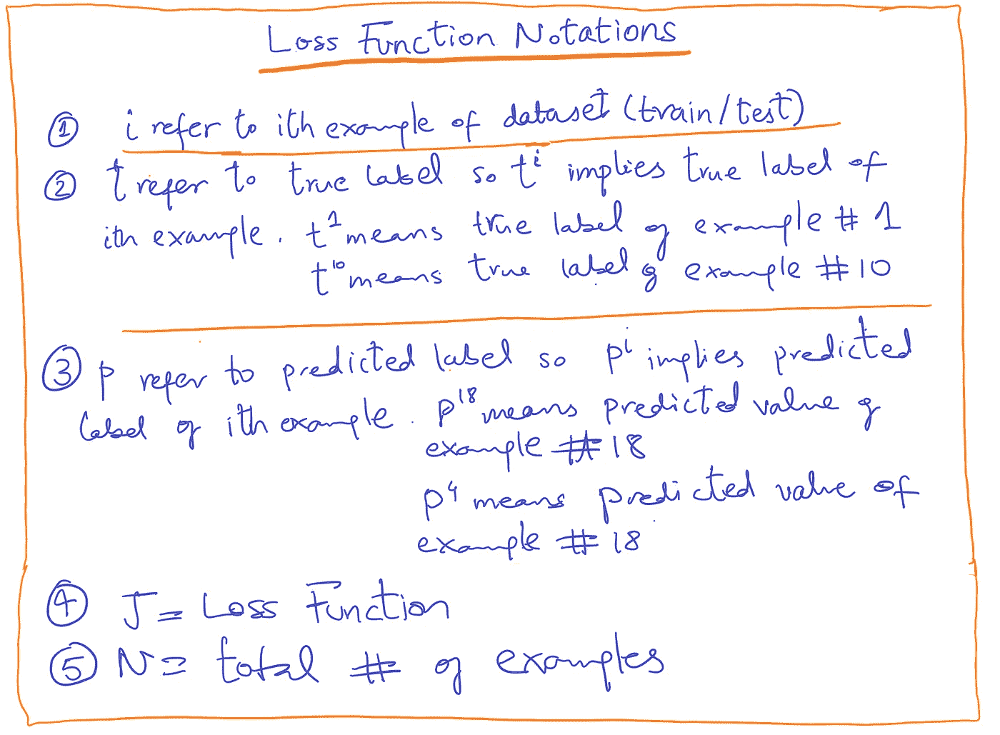

Notations for Loss Function

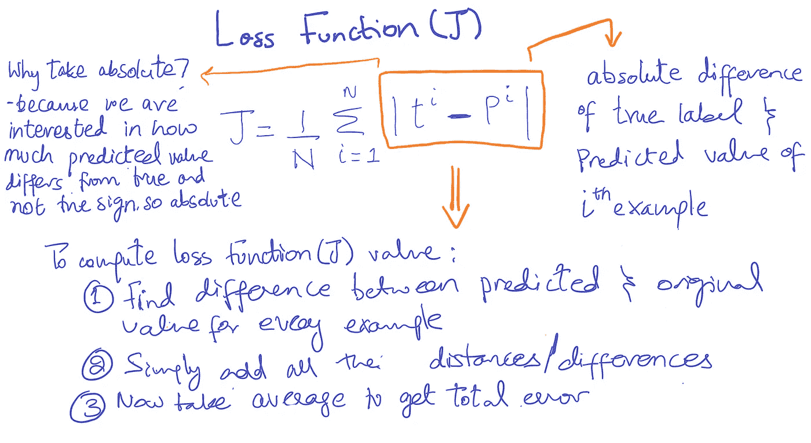

L1 — Loss Function

**更小的损失值**
如果预测值与实际值之间的总差值相对较小，则总误差/损失将是更小的值，因此表示模型良好。

**更大的损失值**
如果实际值和预测值之间的差异很大，损失函数的总误差/值也会相对较大，这也意味着模型没有被很好地训练。

**作为均方误差的损失函数**

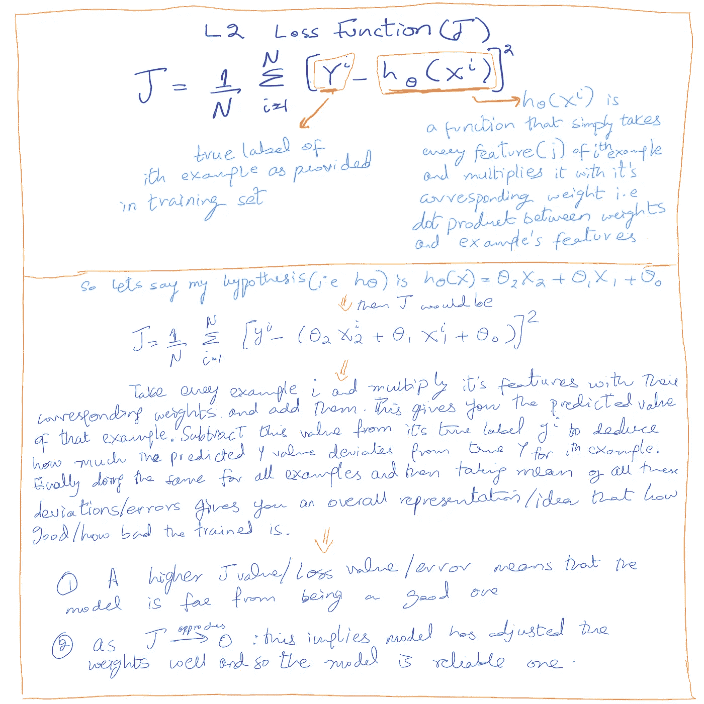

L2 Loss Function

> L2 损失/均方误差/二次损失—都是一样的

**训练回归模型的目标** 训练回归模型的目标是找到那些损失函数最小的权重值，即预测值和真实标签之间的差异尽可能最小。

**为什么预测标签和真实标签永远不会完全匹配？** 

> **达到里程碑 2.1！*👍 👍1️⃣***

# 很多吗？休息一下再回来！

# 梯度下降算法

到目前为止，我们假设我们已经有了回归模型的权重。但是，实际上是找到这些权重的最佳可能值的过程说明了损失值的最小化。这一发现过程就是众所周知的算法“梯度下降”发挥作用的地方，如下所述。

## **梯度下降——直觉**

假设你只是随机降落在一座山上，并且你是盲折叠。你的目标是尽快到达山脚。你会怎么做？一个可能的解决办法是向最陡的方向下降/移动，并在没有到达山脚时继续这样做。

**下降时，你特别注意一些事情，以确保你确实到达了基点**

1.  因为你的目标是尽可能快地到达基点，所以你决定在开始的几个下降步骤中迈出更大的步伐。
2.  因为你还想确保一旦你到达了更接近基地的地方，跳到任何上升点的机会就被最小化了。因此，你决定在后面的下降步骤中采取较小的跳跃，以确保在接近基点时不会偏离基点。

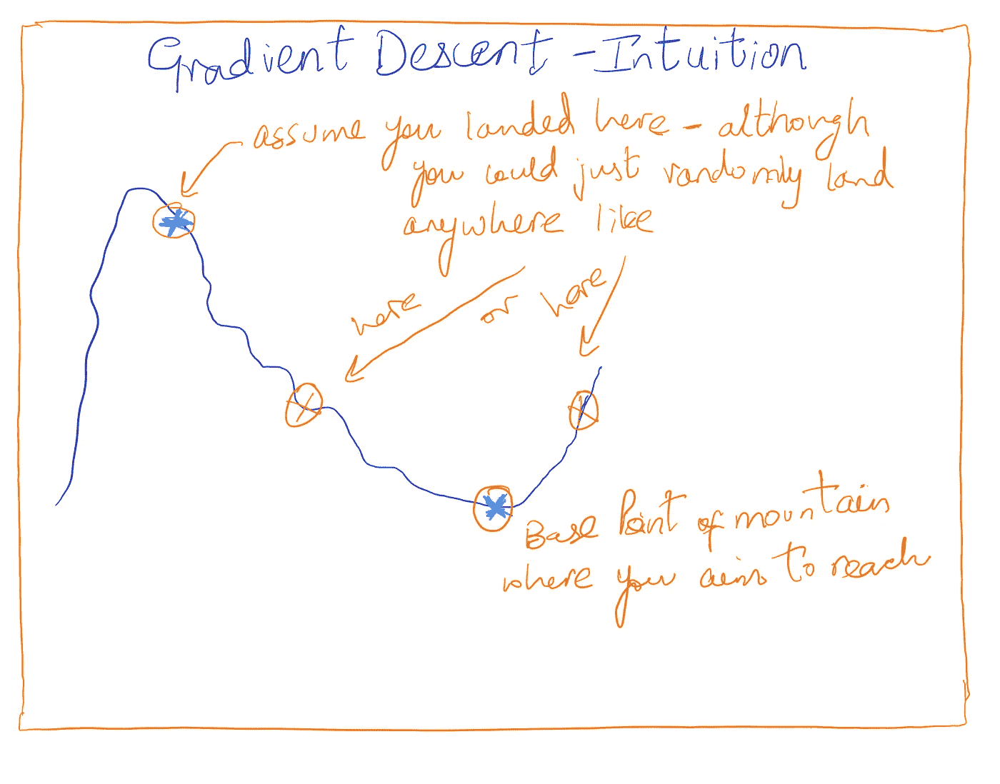

Gradient Descent — Intuition

## 梯度下降——数学观点

训练回归模型的目的是通过以与我们下降到山的底部时相同的方式收敛函数，找到/学习将最小化 L2 损失的权重。

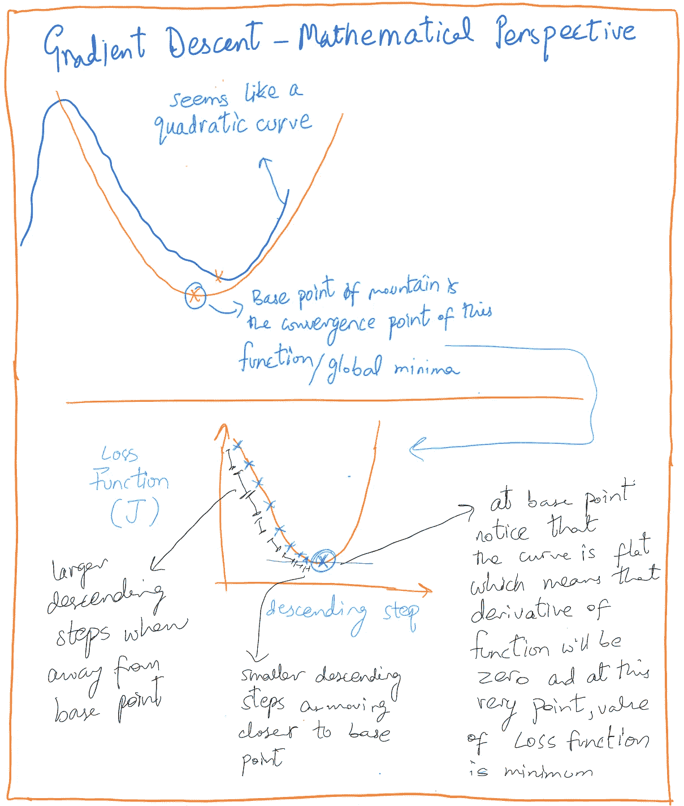

## **定义梯度下降**伪代码

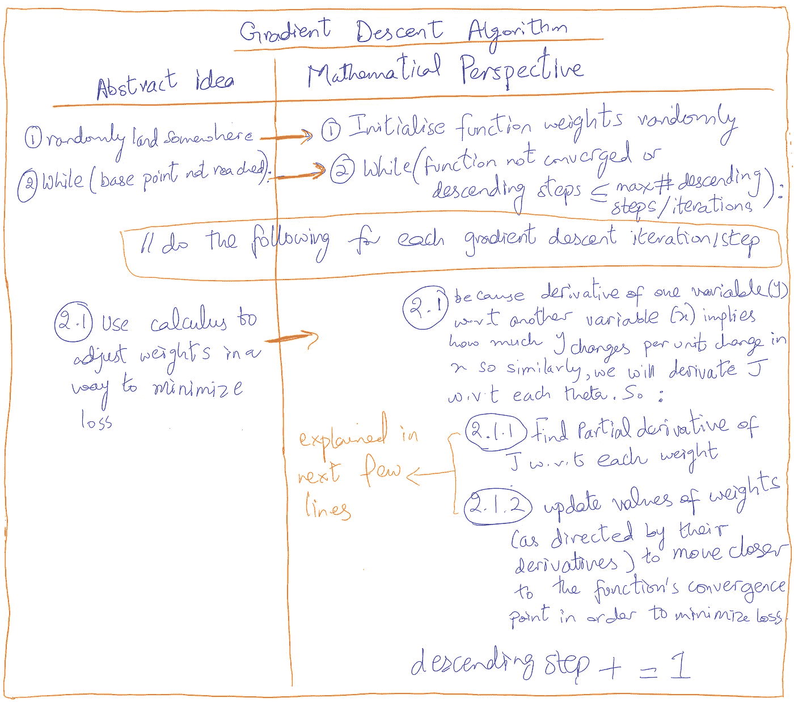

## **深入探究 L2 损失的偏导数— 2.1.1**

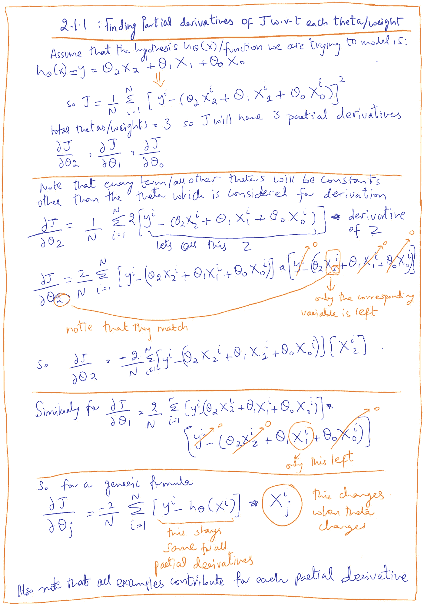

## **更新权重值— 2.1.2**

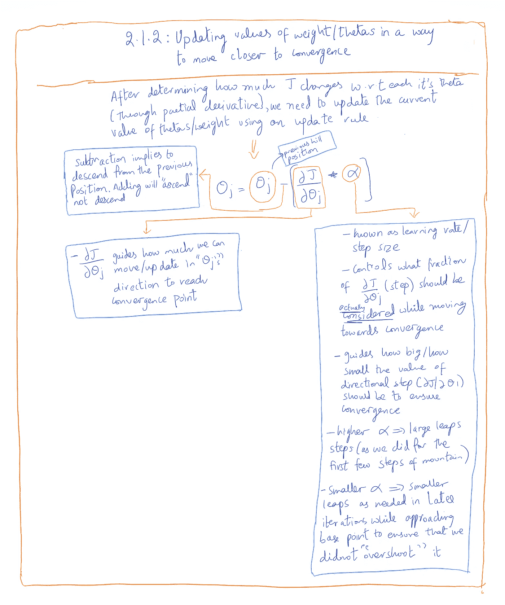

Updating Weights to Minimize Loss

> **里程碑 2.2 达成！*👍 👍2️⃣***

# **训练回归模型——对**梯度下降的完整遍历

现在我们已经熟悉了梯度下降的工作原理，让我们借助几个例子来进一步阐明它。

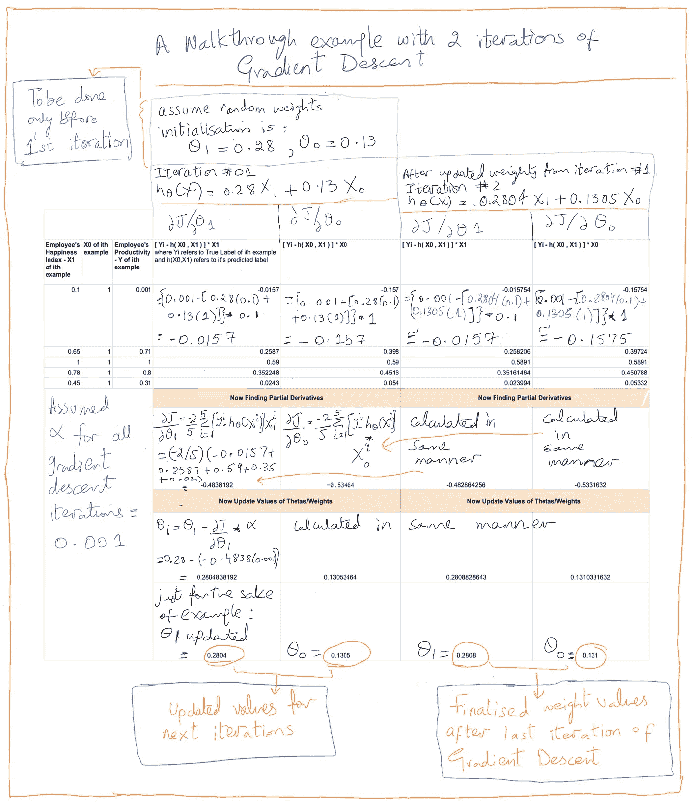

Gradient Descent Walk-through

## 上面例子中的一些假设

为了上面的例子，我们确实假设了一些事情。下图将这些假设与现实世界的情景进行了比较。

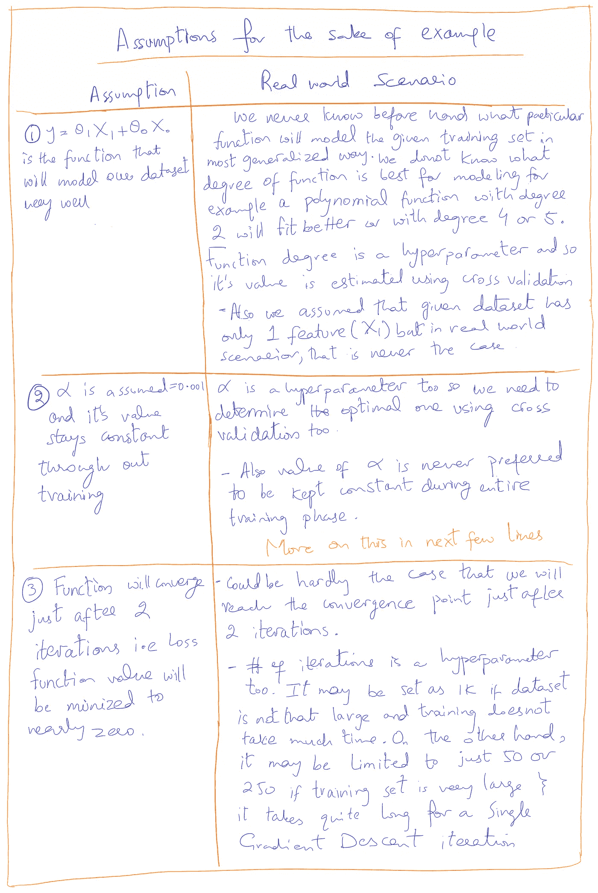

Example Assumptions

> **达到里程碑 2.3！*👍 👍3️⃣***

> **这标志着您的第二个里程碑已经完成！*👍 ️👍***

# 只要再多一点点，你就完成了！

# **使用训练好的回归模型进行智能预测！**

一旦我们在训练阶段训练/调整了权重，对给定测试示例的预测就非常简单了——只需计算训练权重和给定测试示例特征的点积。

下图进一步阐明了这一点…

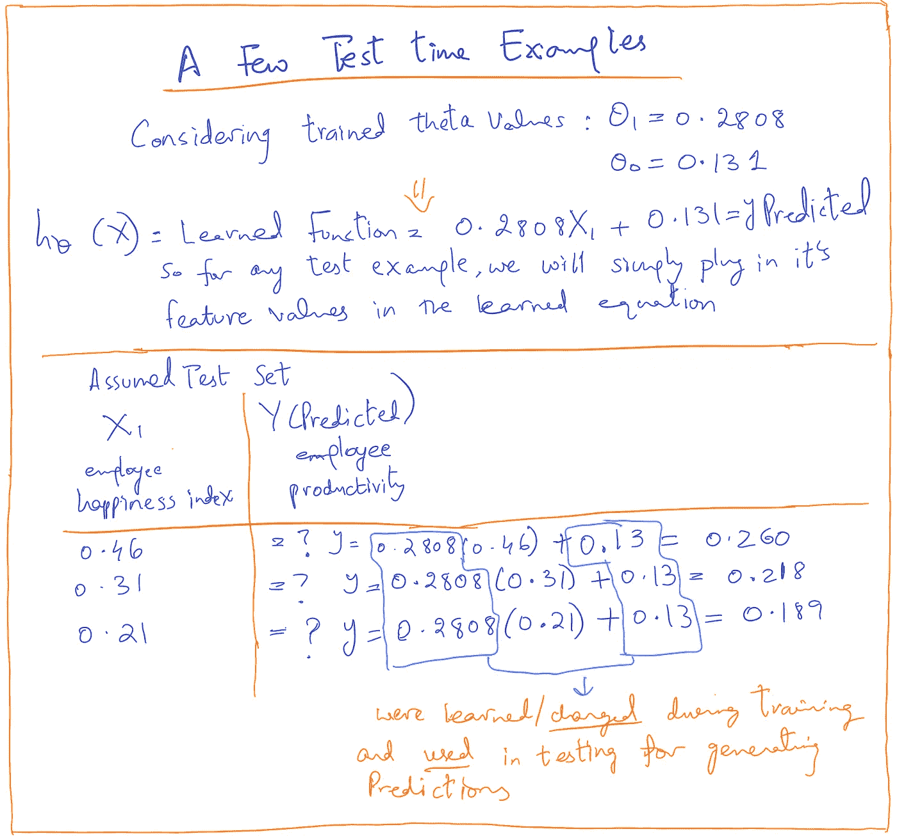

Generating Predictions at Run Time

> **里程碑 3 实现！*👍 ️👍👍️***

# 转到结论部分…..

## 1.调整学习率

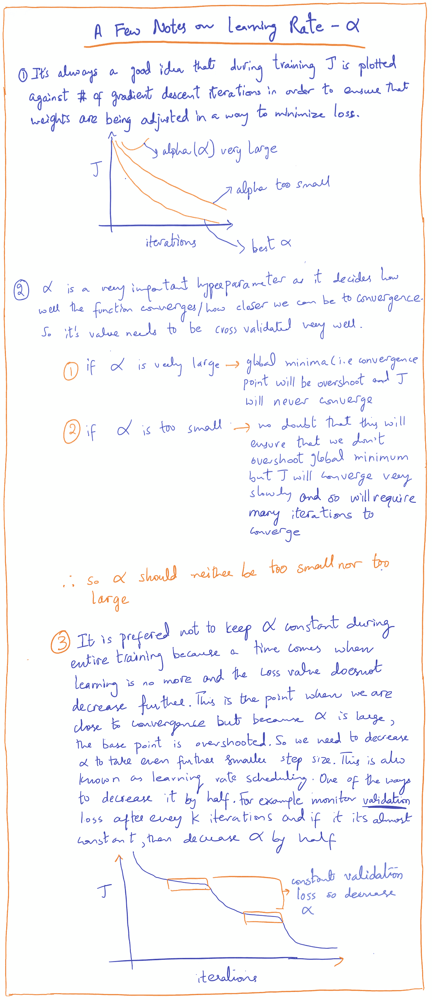

Learning Rate — Hyperparameter

## 2 **。为什么在培训中使用 1 的附加功能**

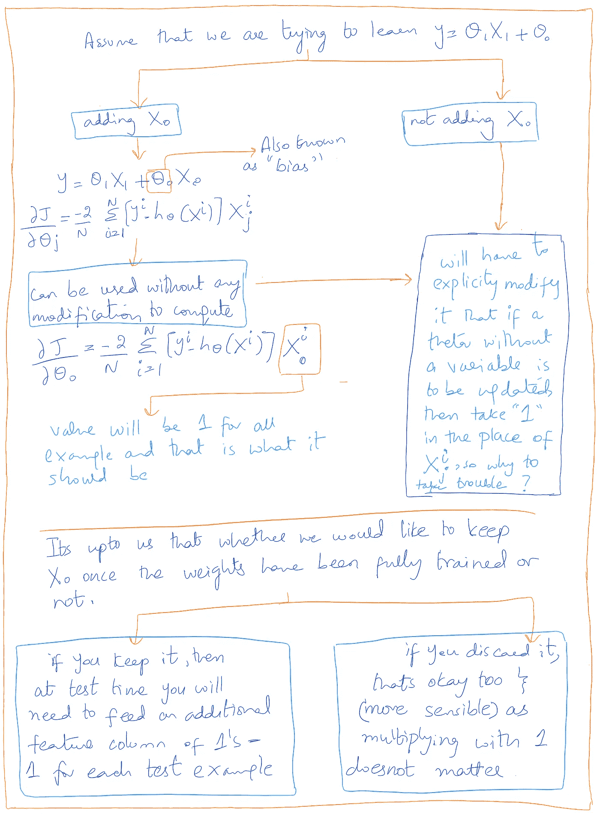

Additional Training Feature of 1's

## 3.**梯度下降需要特征归一化**

应在数据预处理步骤中对要素进行范围归一化。否则，训练预测很可能会受到具有极端正值/负值的特征的影响。由于特征值确实会影响其对应的导数，极值可能会使学习过程变得更长，或者函数可能不会很好地收敛到基点——学习变得困难。因此，将你的特征标准化通常是个好主意。

## 4.用 L2 损失代替 L1 损失

你可能会奇怪，为什么我们不利用 L1 损失，而不是 L2 损失。其原因是 L1 损失的导数在 X=0 处未定义，梯度下降假设损失函数在任何地方都可以微分。因此，我们通常不喜欢使用 L1 损失。

## 5.关于梯度下降收敛的一点注记

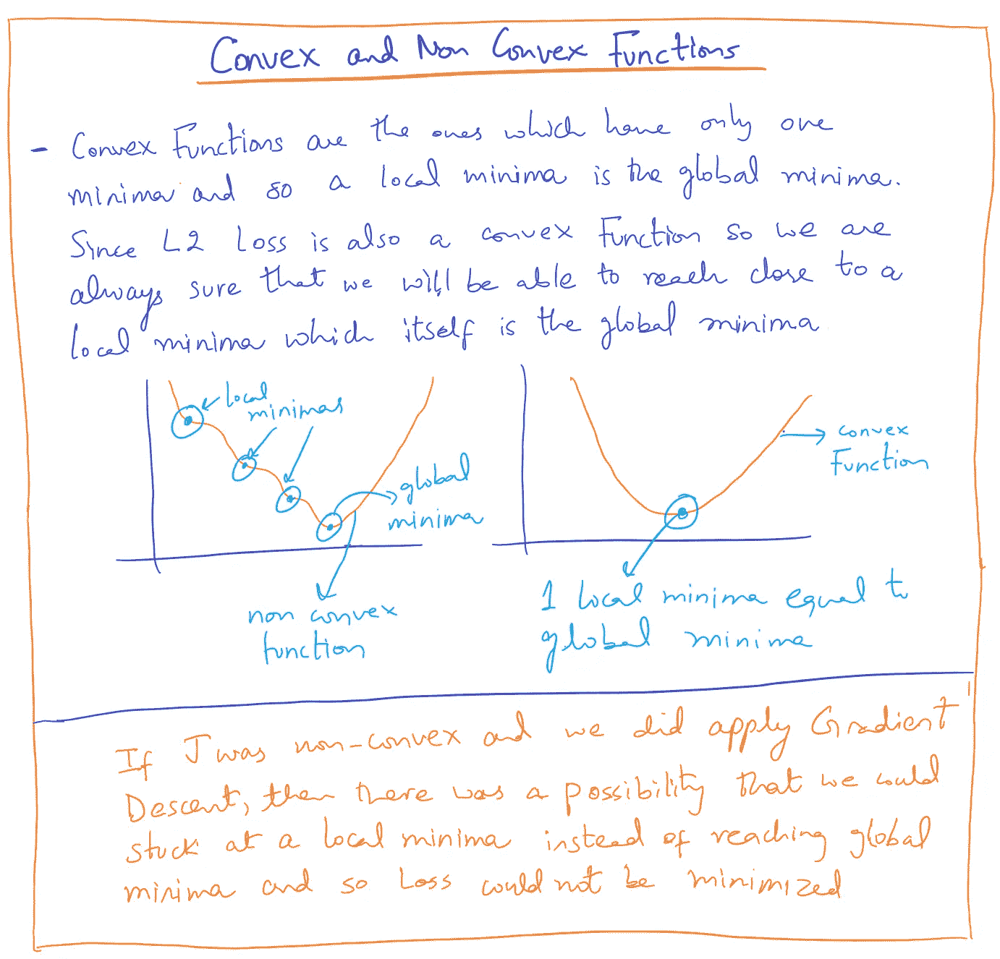

> **达到里程碑 4！*👍 👍 👍 👍***

# 不要再做什么聪明的事情了！

你现在可以着手建立你自己的人工智能模型来预测你的员工的生产力！

## 这篇博文到此为止！

如果您有任何想法、意见或问题，欢迎在下面评论或联系📞跟我上[LinkedIn](https://www.linkedin.com/in/aisha-javed/)