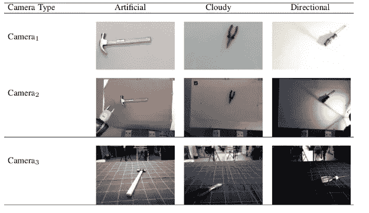
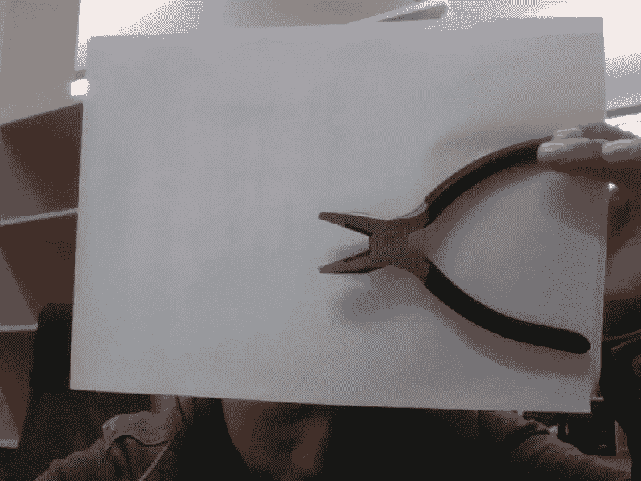
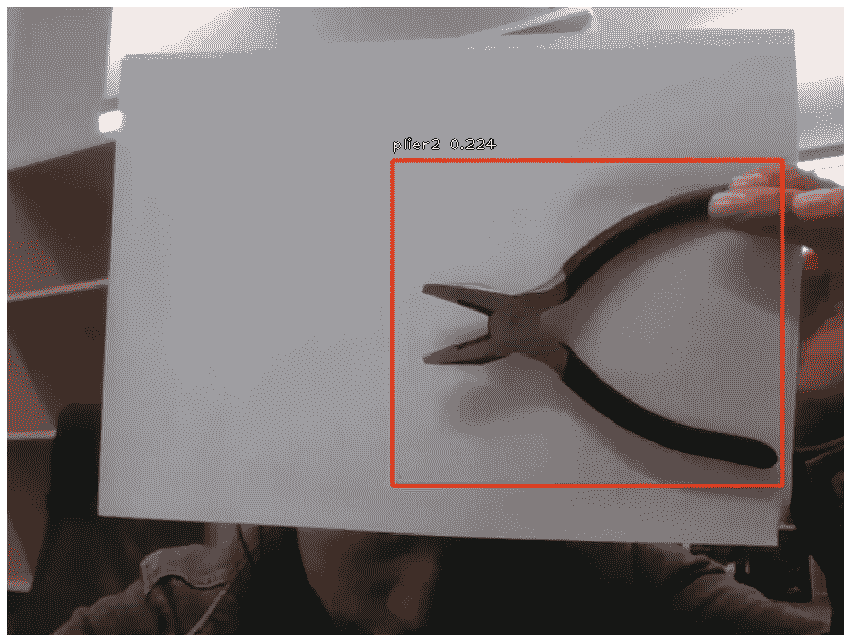

# 在 Google Colab 上训练 RetinaNet 从 KTH 手工工具数据集中检测钳子、锤子和螺丝刀。

> 原文：<https://towardsdatascience.com/training-retinanet-to-detect-pliers-4dd47eb8b226?source=collection_archive---------18----------------------->

在本文中，RetinaNet 在 Google Colab 中接受了检测钳子、锤子和螺丝刀工具的训练。该数据集取自一个名为 [KTH 手工工具数据集](https://www.nada.kth.se/cas/data/handtool/)的开放来源。它包括三种类型的手工具的图像:锤子，钳子和螺丝刀在不同的照明和不同的位置。



Example of images of KTH Handtool Dataset [[https://www.nada.kth.se/cas/data/handtool/](https://www.nada.kth.se/cas/data/handtool/)].

Jupyter 文章的笔记本代码可以在我的 github 中的[中找到。](https://github.com/yustiks/retina_transfer_learning/blob/master/retina_kth_dataset_training.ipynb)

首先在本地从[源](https://www.nada.kth.se/cas/data/handtool/)下载数据集(解压文件并重命名为 KTH _ 手工具 _ 数据集)，然后将文件夹下载到 google drive。之后，我们应该将 google disc 安装到 google colab:

```
**from** **google.colab** **import** drive
drive.mount('/content/drive')
```

其次，需要准备数据来训练 RetinaNet:初始数据集中的所有图像都应该保存在不同的文件夹中，每个图像都有相关的边界框。为了训练 RetinaNet，我们需要创建一个 CSV 文件:该文件中的每一行都应该包含来自数据集的图像文件的名称、每个对象的边界框坐标以及该对象的类名。下面的脚本解析所有的文件夹(有 3 个文件夹是蓝色、白色和棕色背景的图片)。

要解析的第一个文件夹是“Blue_background”。此文件夹与“棕色 _ 背景”或“白色 _ 背景”的区别在于，带有乐器的文件夹不包含“Kinect”和“网络摄像头”子文件夹。

```
**from** **bs4** **import** BeautifulSoup
**import** **os**
**import** **csv**

folder = '/content/drive/My Drive/KTH_Handtool_Dataset'
subfolder = ['Blue_background']
in_subfolder = ['Artificial', 'Cloudy', 'Directed']
instruments = ['hammer1', 'hammer2', 'hammer3', 'plier1', 'plier2', 'plier3', 'screw1', 'screw2', 'screw3']

**with** open('train.csv', mode='w') **as** file:
  writer = csv.writer(file, delimiter=',', quotechar='"', quoting=csv.QUOTE_MINIMAL)  
  **for** folder_name **in** subfolder:
    **for** in_folder_name **in** in_subfolder:
      **for** instrument **in** instruments:
        directory_name = os.path.join(folder, folder_name, 'rgb', in_folder_name, instrument)
        directory_name_xml = os.path.join(folder, folder_name, 'bboxes', in_folder_name, instrument)
        **for** filename **in** os.listdir(directory_name_xml):
          label = instrument
          filename_jpg = filename[:-4] + '.jpg'
          filename_str = os.path.join(directory_name, filename_jpg)
          handler = open(os.path.join(directory_name_xml, filename)).read()
          soup = BeautifulSoup(handler, "xml")
          xmin = int(soup.xmin.string)
          xmax = int(soup.xmax.string)
          ymin = int(soup.ymin.string)
          ymax = int(soup.ymax.string)
          row = [filename_str, xmin, ymin, xmax, ymax, label]
          writer.writerow(row)
```

> 参数文件夹-存储所有数据的目录(提取的 KTH _ 手工具 _ 数据集文件夹的父目录)。

对于“白色 _ 背景”和“棕色 _ 背景”，脚本应该不同，因为它们在乐器的文件夹中包含子文件夹“Kinect”和“网络摄像头”(“锤子 1”、“锤子 2”、“锤子 3”、“plier1”、“plier2”、“plier3”、“screw1”、“screw2”、“screw3”)。我添加了这一行来包含这些文件夹

```
**for** sub_instrument **in** sub_instruments:
```

另一个诀窍是，kinect 的“rgb”文件夹和“bbox”文件夹有不同的名称:在一些文件夹中是“Kinect”，在另一些文件夹中是“Kinect”，因此我决定用不同的方法来解析图像目录(“rgb”文件夹)和边框目录(“bbox”文件夹)。字典用于更改名称:

```
dict_instr = {'Kinect': 'kinect'}
```

下一步:如果名称“kinect”不在 xml path 文件夹中，则它会变成小写的“Kinect”:

```
dir_name_xml = os.path.join(folder, folder_name, 'bbox', in_folder_name, instrument)
          **if** sub_instrument **not** **in** os.listdir(dir_name_xml):
            sub_instrument = dict_instr[sub_instrument]
```

结果，“棕色背景”和“白色背景”的脚本如下:

```
subfolder = ['Brown_background', 'White_background']
sub_instruments = ['Kinect', 'webcam']
dict_instr = {'Kinect': 'kinect'}

*# open file to write to the end of a file*
**with** open('train.csv', mode='a') **as** file:
  writer = csv.writer(file, delimiter=',', quotechar='"', quoting=csv.QUOTE_MINIMAL)  
  **for** folder_name **in** subfolder:
    **for** in_folder_name **in** in_subfolder:
      **for** instrument **in** instruments:
        **for** sub_instrument **in** sub_instruments:
          directory_name = os.path.join(folder, folder_name, 'rgb', in_folder_name, instrument, sub_instrument)
          dir_name_xml = os.path.join(folder, folder_name, 'bbox', in_folder_name, instrument)
          **if** sub_instrument **not** **in** os.listdir(dir_name_xml):
            sub_instrument = dict_instr[sub_instrument]
          directory_name_xml = os.path.join(dir_name_xml, sub_instrument)
          **for** filename **in** os.listdir(directory_name_xml):
            label = instrument
            filename_jpg = filename[:-4] + '.jpg'
            filename_str = os.path.join(directory_name, filename_jpg)
            handler = open(os.path.join(directory_name_xml, filename)).read()
            soup = BeautifulSoup(handler, "xml")
            xmin = int(soup.xmin.string)
            xmax = int(soup.xmax.string)
            ymin = int(soup.ymin.string)
            ymax = int(soup.ymax.string)
            row = [filename_str, xmin, ymin, xmax, ymax, label]
            writer.writerow(row)
```

运行上面的代码后，我们应该进行预处理，因为一些 xml 文件没有相关的图像:

```
**import** **pandas** **as** **pd**
**import** **os.path**

list_indexes_to_drop = []
data = pd.read_csv("train.csv", header=**None**)
**with** open('train_new.csv', mode='a') **as** file:
  **for** i **in** range(len(data)):
    fname = data.iloc[i, 0]
    **if** **not** os.path.isfile(fname):
      list_indexes_to_drop.append(i)

data = data.drop(data.index[list_indexes_to_drop])
data.to_csv(path_or_buf='train.csv', index=**False**, header=**None**)
```

预处理后，数据应该被分割。CSV 文件中的所有元素都被随机打乱

```
data = pd.read_csv("train.csv", header=**None**)
data = data.sample(frac=1).reset_index(drop=**True**)
```

然后，通过下一个代码将数据分为训练集(80%)和测试集(20%)。

```
amount_80 = int(0.8*len(data))
train_data = data[:amount_80]
test_data = data[amount_80:]print(len(train_data))
print(len(test_data))
```

我们应该将 train_data 保存为 train_annotations.csv:

```
train_data.to_csv(path_or_buf='train_annotations', index=False)
```

下一步是从网站上下载用于训练神经网络的权重，并将其放入“权重”文件夹中:

```
!mkdir weights
!wget -O /content/weights/resnet50_coco_best_v2.h5 https://github.com/fizyr/keras-retinanet/releases/download/0.5.1/resnet50_coco_best_v2.1.0.h5
```

我们还应该创建文件夹“快照”, RetinaNet 将在训练期间保存重量，以及“tensorboard ”,其中将解决关于训练的信息:

```
!mkdir /content/drive/My\ Drive/kth_article/snapshots
!mkdir /content/drive/My\ Drive/kth_article/tensorboard
```

下一步是创建 csv 文件“classes.csv”(包含仪器名称):

```
dict_classes = {
    'hammer1': 0,
    'hammer2': 1,
    'hammer3': 2,
    'plier1': 3,
    'plier2': 4,
    'plier3': 5,
    'screw1': 6,
    'screw2': 7,
    'screw3': 8
}
**with** open('classes.csv', mode='w') **as** file:
  writer = csv.writer(file, delimiter=',', quotechar='"', quoting=csv.QUOTE_MINIMAL)
  **for** key, val **in** dict_classes.items():  
    row = [key, val]
    print(row)
    writer.writerow(row)
```

我们还需要安装 RetinaNet:

```
!cd ~!git clone [https://github.com/fizyr/keras-retinanet](https://github.com/fizyr/keras-retinanet)
%cd keras-retinanet!git checkout 42068ef9e406602d92a1afe2ee7d470f7e9860df!python setup.py install
!python setup.py build_ext --inplace
```

我们需要返回到父目录:

```
%cd ..
```

下一个脚本用于训练神经网络:

```
!retinanet-train --weights /weights/resnet50_coco_best_v2.h5 \
--batch-size 4 --steps 4001 --epochs 20 \
--snapshot-path snapshots --tensorboard-dir tensorboard \
csv train_annotations.csv classes.csv
```

**train_annotations.csv** :包含来自训练数据的所有图像的信息的文件，每个图像的格式应按照以下模板制作:< path_to_image >，< xmin >，< ymin >，< xmax >，< ymax >，< label >，其中 xmin，ymin，xmax，ymax 为以像素为单位的包围盒，label 为 a

**labels.csv** :带有类标签的文件，后面应该是模板:< class_name >，< id >

经过 3 个纪元的训练，我们会得到一些准确性。我们可以在训练数据上验证模型。另一种选择是在一些真实图像上测试准确性:



Image of real plier image (IKEA plier).

要在验证集上测试模型，我们需要将权重转换为测试格式:

```
!retinanet-convert-model snapshots/resnet50_csv_03.h5 weights/resnet50_csv_03.h5
```

要检查测试集的结果:

```
!retinanet-evaluate csv val_annotations.csv classes.csv weights/resnet50_csv_03.h5
```

我们可以看到，在测试集上，经过多次训练后的结果已经很好了，平均精度为 66%:

```
116 instances of class hammer1 with average precision: 0.7571
113 instances of class hammer2 with average precision: 0.6968
110 instances of class hammer3 with average precision: 0.8040
123 instances of class plier1 with average precision: 0.5229
119 instances of class plier2 with average precision: 0.5567
122 instances of class plier3 with average precision: 0.8953
126 instances of class screw1 with average precision: 0.4729
152 instances of class screw2 with average precision: 0.5130
131 instances of class screw3 with average precision: 0.7651
mAP: 0.6649
```

同时，在真实环境中也不太好:为了检查它，我们可以在我们的图像上运行 Retinanet 的预测。

```
*# show images inline*
%matplotlib inline

*# automatically reload modules when they have changed*
%load_ext autoreload
%autoreload 2

*# import keras*
**import** **keras**

*# import keras_retinanet*
**from** **keras_retinanet** **import** models
**from** **keras_retinanet.utils.image** **import** read_image_bgr, preprocess_image, resize_image
**from** **keras_retinanet.utils.visualization** **import** draw_box, draw_caption
**from** **keras_retinanet.utils.colors** **import** label_color
*#from keras_retinanet.keras_retinanet.utils.gpu import setup_gpu*

*# import miscellaneous modules*
**import** **matplotlib.pyplot** **as** **plt**
**import** **cv2**
**import** **os**
**import** **numpy** **as** **np**
**import** **time**

*# use this to change which GPU to use*
gpu = 0

*# set the modified tf session as backend in keras*
*#setup_gpu(gpu)*

*# adjust this to point to your downloaded/trained model*
*# models can be downloaded here: https://github.com/fizyr/keras-retinanet/releases*
model_path = os.path.join('..', 'weights', 'resnet50_csv_04.h5')

model = models.load_model(model_path, backbone_name='resnet50')

*# if the model is not converted to an inference model, use the line below*
*# see: https://github.com/fizyr/keras-retinanet#converting-a-training-model-to-inference-model*
*#model = models.convert_model(model)*

*#print(model.summary())*

*# load label to names mapping for visualization purposes*
labels_to_names = {
    0: 'hammer1', 
    1: 'hammer2',
    3: 'hammer3',
    4: 'plier1',
    5: 'plier2',
    6: 'plier3',
    7: 'screw1',
    8: 'screw2',
    9: 'screw3'}

*# load image*
image = read_image_bgr('/content/img.jpg')

*# copy to draw on*
draw = image.copy()
draw = cv2.cvtColor(draw, cv2.COLOR_BGR2RGB)

*# preprocess image for network*
image = preprocess_image(image)
image, scale = resize_image(image)

*# process image*
start = time.time()
boxes, scores, labels = model.predict_on_batch(np.expand_dims(image, axis=0))
print("processing time: ", time.time() - start)

*# correct for image scale*
boxes /= scale

*# visualize detections*
**for** box, score, label **in** zip(boxes[0], scores[0], labels[0]):
    *# scores are sorted so we can break*
    **if** score < 0.21:
        **break**

    color = label_color(label)

    b = box.astype(int)
    draw_box(draw, b, color=color)

    caption = "**{}** **{:.3f}**".format(labels_to_names[label], score)
    draw_caption(draw, b, caption)

plt.figure(figsize=(15, 15))
plt.axis('off')
plt.imshow(draw)
plt.show()
```

我取了 21%的阈值，所以模型预测仪器的准确率是 22%。



Retinanet prediction on a real photo after 4 epochs of training on KTH_Dataset.

我们可以进一步训练模型以改进模型，并且训练模型超过 4 个时期。

**结论。**

本文是研究的一部分，我们想要创建一个模型，它可以识别视频中的乐器。我们使用 KTH 手工工具数据集来提高模型的准确性。实验表明，额外的图像改善了对象检测。可以对模型进行一些改进(可以使用额外的数据集来改进仪器检测，可以进行更多的时期训练)。

**参考文献**

1.  [密集物体探测的焦点损失](https://arxiv.org/abs/1708.02002)
2.  [Keras-retinanet](https://github.com/fizyr/keras-retinanet)
3.  [介绍如何在 Keras 中实现 Retinanet，以便在自定义数据集上进行多目标检测](https://medium.com/@abdulwahabamin/an-introduction-to-implementing-retinanet-in-keras-for-multi-object-detection-on-custom-dataset-be746024c653)
4.  [h 手动工具数据集](https://www.nada.kth.se/cas/data/handtool/)