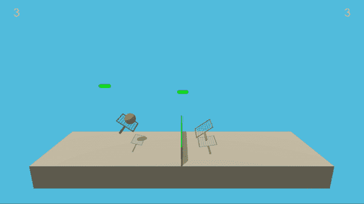

# 训练机器人打网球

> 原文：<https://towardsdatascience.com/training-two-agents-to-play-tennis-8285ebfaec5f?source=collection_archive---------9----------------------->

## 多智能体合作与竞争的深度强化学习

*2018 年 12 月 26 日由* [*托马斯·特雷西*](https://ttracey.com/) *，原载* [*发布于 Github*](https://github.com/tommytracey/DeepRL-P3-Collaboration-Competition/blob/master/README.md)


Photo credit: [Ulf Hoffmann](https://www.youtube.com/watch?v=imVNg9j7rvU)

这篇文章探索了我在 Udacity 的[深度强化学习纳米学位](https://www.udacity.com/course/deep-reinforcement-learning-nanodegree--nd893)的[最终项目](https://github.com/tommytracey/DeepRL-P3-Collaboration-Competition)中的工作。**我的目标是帮助其他机器学习(ML)学生和专业人士，他们正处于在强化学习(RL)中建立直觉的早期阶段。**

尽管如此，请记住，我的职业是产品经理(不是工程师或数据科学家)。因此，接下来的内容是对这个项目中 RL 概念和算法的半技术性但可接近的解释。如果下面提到的任何内容不准确，或者如果你有建设性的反馈，我很乐意听到。

我对这个项目的 Github 回购可以在这里找到。该项目的原始 Udacity 源回购位于[这里](https://github.com/udacity/deep-reinforcement-learning/tree/master/p3_collab-compet)。

# 大图:为什么 RL 很重要

为了让人工智能(AI)发挥其全部潜力， **AI 系统需要与人类和其他智能体进行有效的交互**。已经有这样的环境，其中这种类型的代理人-人和代理人-代理人的互动正在大规模发生，例如股票市场。更多的环境就在眼前，比如一旦完全自动驾驶汽车推出，我们的道路。

沿着这条道路的一步是训练人工智能代理在合作和竞争的环境中与其他代理交互。强化学习(RL)是人工智能的一个子领域，被证明是有前途的。RL 不同于其他类型的机器学习方法，因为 RL 代理是面向目标的。也就是说，RL 算法使用奖励函数(也称为目标函数)来“强化”某些行为。例如，一个吃豆人特工每吃一个小球可以获得+1 点的奖励，如果与鬼魂相撞可以获得-100 点的奖励。通过试图最大化其累积回报，吃豆人代理最终学会了——通过反复试错——如何区分好的行动和坏的行动。


Image credit: [pixelart.com](https://www.pixilart.com/art/pacman-gif-dae813cd8dfeede)

OpenAI 已经公开发布了一套[大型虚拟环境](https://gym.openai.com/envs/#atari)，用于训练和测试 RL 代理。这刺激了 RL 领域的大量研究和创新。然而，最初的进展大部分是在单代理领域，在那里没有必要建立预测其他行为者行为的模型。因此，传统的 RL 方法(如 Q-Learning)不太适合于复杂的环境，在这种环境中，多个代理不断地交互并进化它们的策略。

> 不幸的是，传统的强化学习方法，如 Q 学习或策略梯度，不适合多智能体环境。一个问题是，随着训练的进行，每个代理的策略都在变化，并且从任何单个代理的角度来看，环境变得不稳定，这种情况无法用代理自身策略的变化来解释。这提出了学习稳定性的挑战，并阻止了直接使用过去的经验重放，这对于稳定深度 Q 学习是至关重要的。另一方面，当需要多个代理的协调时，策略梯度方法通常表现出非常高的方差。或者，可以使用基于模型的策略优化，它可以通过反向传播学习最优策略，但这需要世界动力学的可微分模型和关于代理之间交互的假设。从优化的角度来看，将这些方法应用于竞争环境也是具有挑战性的，众所周知的对抗性训练方法的不稳定性就证明了这一点。
> 
> ——Lowe 和 Wu 等，【多主体行动者】混合合作竞争环境

哇，那是一口。本质上，我们需要的(也是本项目所探索的)是一个通用框架，允许多个代理在合作和竞争环境中从他们自己的观察中学习。代理之间没有任何通信，也没有对其他代理的行为建模。然而，这个项目中的每个代理都通过观察自己的行为和其他代理的行为来学习。每个观察包括:之前的游戏状态，代理的动作，奖励，以及之后的游戏状态`(s, a, r, sʹ)`。

合作和竞争环境的新方法正在迅速发展。我不会在这篇文章中进一步探索它们，但我建议查看一下 [OpenAI Five](https://openai.com/five/) 和 [DeepMind AlphaStar](https://deepmind.com/blog/alphastar-mastering-real-time-strategy-game-starcraft-ii/) 。

# 该项目的目标

这个项目的目标是训练两个 RL 特工打网球。在真正的网球比赛中，每个球员的目标都是保持球在比赛中。而且，当你有两个势均力敌的对手时，你往往会看到球员在网上来回击球的相当长的交换。

# 环境

我们将使用与 Unity ML-Agents GitHub 页面上的[网球环境](https://github.com/Unity-Technologies/ml-agents/blob/master/docs/Learning-Environment-Examples.md#tennis)相似但不相同的环境。

在这个环境中，两个代理人控制球拍将球拍过球网。如果代理人将球击过网，则获得+0.1 的奖励。如果一个代理人让一个球落地，或者把球打到界外，就得到-0.01 的奖励。因此，每个代理的目标是保持球在比赛中。

观察空间由对应于球和球拍的位置和速度的 8 个变量组成。每个代理接收它自己的本地观察。两个连续的动作是可用的，对应于移向(或远离)网，和跳跃。

任务是情节性的，为了解决环境问题，代理人必须获得+0.5 的平均分数(超过 100 个连续情节，在两个代理人身上取最大值后)。

具体来说，

*   每集之后，我们将每个代理人收到的奖励相加(不打折)，得到每个代理人的分数。这产生了两个可能不同的分数。然后我们取这两个分数中的最大值。
*   这为每集产生一个单一的分数。
*   当这些分数的平均值(超过 100 集)至少为+0.5 时，环境被视为已解决。

这是两个半训练有素的代理在这种环境中交互的例子。



# 方法

以下是在构建解决这种环境的代理时所采取的高级步骤。

1.  使用随机行动策略建立性能基线。
2.  选择一个合适的算法并开始实现它。
3.  运行实验，进行修改，并重新训练代理，直到达到性能阈值。

声明:我*最终*达成了一个很好的解决方案；然而，结果并不一致。我的“最佳”结果只有在我多次重新运行模型时才是可重复的。如果你只运行模型一次(甚至 3-5 次)，它可能不会收敛。而且，在最初的实现过程中，我在搜索一组可靠的超参数时，至少运行了 30 次模型。如果您想尝试不同的方法，我强烈建议实现一个更加[系统化的方法来进行超参数调优](https://en.wikipedia.org/wiki/Hyperparameter_optimization#Approaches)(我没有这样做，但希望我做了)。

# 建立基线

在构建学习代理之前，我首先测试了在每个时间步随机选择动作(一致)的代理。

运行随机代理几次会得到从 0 到 0.02 的分数。显然，如果这些代理人需要达到连续 100 集以上 0.5 的平均分，那么随机选择动作是行不通的。然而，当您观察代理随机行动时，很明显这些类型的零星行动在培训过程的早期是有用的。也就是说，它们可以帮助代理探索动作空间，以找到一些好的与坏的动作的信号。当我们实现奥恩斯坦-乌伦贝克过程和ε噪声衰减时，这个观点将会发挥作用。

# 实现学习算法

首先，我们需要做出一些高层架构决策。首先，我们需要确定哪种类型的算法最适合网球环境。

## 基于策略的方法与基于价值的方法

与 Udacity 深度 RL 项目中的[第一个项目的“导航”环境相比，网球环境有两个关键区别:](https://github.com/tommytracey/DeepRL-P1-Navigation)

1.  **多重代理**。网球环境有两个不同的代理，而导航项目只有一个代理。
2.  **连续动作空间**。动作空间现在是*连续的*(而不是*离散的*)，这允许每个代理执行更复杂和精确的动作。尽管每个网球代理只能向前、向后或跳跃，但控制这些运动的可能动作值是无限的。然而，[导航项目](https://github.com/tommytracey/DeepRL-P1-Navigation)中的代理仅限于四个*离散的*动作:向左、向右、向前、向后。

鉴于这种环境的额外复杂性，我们用于导航项目的基于*值的方法*并不合适，即深度 Q 网络(DQN)算法。最重要的是，我们需要一种算法，让网球经纪人能够充分利用其运动范围和力量。为此，我们需要探索一种不同的算法，叫做*基于策略的方法*。

以下是基于策略的方法的一些优势:

*   **连续动作空间。**基于策略的方法非常适合连续的行动空间。
*   **随机政策**基于值和基于策略的方法都可以学习确定性策略。但是，基于策略的方法也可以学习真正的随机策略。
*   **简约**。基于策略的方法直接学习最优策略，而不必维护单独的价值函数估计。在基于价值的方法中，主体利用其对环境的经验来维持对最佳行动价值函数的估计，并由此导出最佳策略。这个中间步骤需要存储大量的附加数据，因为您需要考虑所有可能的动作值。即使你把动作空间离散化，可能的动作数量也会变得很大。并且，使用 DQN 来确定在连续或高维空间内最大化动作值函数的动作需要在每个时间步长进行复杂的优化过程。

## 多代理深度确定性策略梯度

谷歌 Deepmind 的研究人员在[本文](https://arxiv.org/pdf/1509.02971.pdf)、*深度强化学习的连续控制*中概述了最初的 DDPG 算法，我对其进行了扩展以创建 MADDPG 版本。在这篇论文中，作者提出了“一种使用深度函数逼近器的无模型、脱离策略的行动者-批评家算法，该算法可以在高维、连续的动作空间中学习策略。”他们强调，DDPG 可以被视为深度 Q 学习对连续任务的延伸。

对于 DDPG 基金会，我用这个普通的单一代理人 DDPG 作为模板。然后，为了使这个算法适用于网球环境中的多个竞争代理，我实现了由 Lowe 和 Wu 以及来自 OpenAI、加州大学伯克利分校和麦吉尔大学的其他研究人员在本文、中讨论的组件。最值得注意的是，我实现了他们的 actor-critic 方法的变体(见图 1)，我将在下一节中讨论它。

最后，我基于 Udacity 课堂和课程中涉及的其他概念，进一步试验了 DDPG 算法的组件。我的算法实现(包括各种定制)将在下面讨论。


**Figure 1**: Multi-agent decentralized actor with centralized critic ([Lowe and Wu et al](https://papers.nips.cc/paper/7217-multi-agent-actor-critic-for-mixed-cooperative-competitive-environments.pdf)).

## 演员-评论家方法

行动者-批评家方法利用了基于政策和基于价值的方法的优势。

使用基于政策的方法，代理人(行动者)通过直接估计最优政策和通过梯度上升最大化回报来学习如何行动。同时，采用基于价值的方法，代理人(评论家)学习如何估计不同状态-行为对的价值(即，未来累积报酬)。演员-评论家方法结合了这两种方法，以加速学习过程。演员-评论家代理也比基于价值的代理更稳定，同时比基于策略的代理需要更少的训练样本。

这个实现的独特之处在于 Lowe 和 Wu 的论文中的[中的*分散的参与者和集中的批评家*方法。传统的行动者-批评家方法对每个代理都有一个独立的批评家，而这种方法利用一个批评家来接收来自所有代理的动作和状态观察作为输入。这些额外的信息使培训变得更加容易，并允许集中培训和分散执行。每个代理仍然根据自己对环境的独特观察采取行动。](https://papers.nips.cc/paper/7217-multi-agent-actor-critic-for-mixed-cooperative-competitive-environments.pdf)

你可以在源代码的`maddpg_agent.py`中找到作为`Agent()`类[的一部分实现的演员-评论家逻辑。演员兼评论家的模型可以通过他们各自的`Actor()`和`Critic()`类](https://github.com/tommytracey/DeepRL-P3-Collaboration-Competition/blob/master/maddpg_agent.py#L110)[在这里](https://github.com/tommytracey/DeepRL-P3-Collaboration-Competition/blob/master/model.py#L12)在`models.py`找到。

注意:正如我们在上一个项目[连续控制:训练一组机械臂](https://github.com/tommytracey/DeepRL-P2-Continuous-Control)中使用双 Q 学习一样，我们再次利用本地和目标网络来提高稳定性。这里一组参数 *w* 用于选择最佳动作，另一组参数 *wʹ* 用于评估该动作。在这个项目中，本地和目标网络是为演员和评论家分别实现的。

## 探索与开发

一个挑战是在代理仍在学习最优策略时选择采取哪种行动。代理应该根据目前观察到的奖励选择行动吗？或者，代理人应该尝试新的行动，以期获得更高的报酬吗？这就是所谓的*探索与开发*的困境。

在之前的[导航项目](https://github.com/tommytracey/DeepRL-P1-Navigation)中，我通过实现 [𝛆-greedy 算法](https://github.com/tommytracey/DeepRL-P1-Navigation/blob/master/agent.py#L80)解决了这个问题。该算法允许代理系统地管理探索与开发的权衡。代理通过选择一个具有一定概率ε𝛜.的随机动作来“探索”与此同时，智能体继续“利用”它对环境的了解，根据概率确定性策略选择动作(1-𝛜).

然而，这种方法对控制网球经纪人不起作用。原因是动作不再是简单方向的离散集合(即，上、下、左、右)。驱动手臂运动的动作是不同大小和方向的力。如果我们将探索机制建立在随机均匀采样的基础上，方向作用的平均值将为零，从而相互抵消。这可能导致系统振荡，但没有取得太大进展。

相反，我们将使用奥恩斯坦-乌伦贝克过程，正如之前提到的谷歌 DeepMind 的论文[中所建议的那样(见第 4 页底部)。奥恩斯坦-乌伦贝克过程在每个时间步长向动作值添加一定量的噪声。这种噪声与先前的噪声相关，因此倾向于在相同的方向停留更长的时间，而不会自我抵消。这允许代理保持速度并以更大的连续性探索动作空间。](https://arxiv.org/pdf/1509.02971.pdf)

你可以在源代码的`maddpg_agent.py`中的`OUNoise()`类的[中找到实现的](https://github.com/tommytracey/DeepRL-P3-Collaboration-Competition/blob/master/maddpg_agent.py#L167)奥恩斯坦-乌伦贝克过程。

总共有五个超参数与这个噪声过程相关。

奥恩斯坦-乌伦贝克过程本身有三个决定噪声特性和幅度的超参数:

*   *:长期运行的意思*
*   ****θ***:均值回复的速度*
*   ****∑***:波动率参数*

*其中，我只调了 sigma。在运行了几个实验之后，我将 sigma 从 0.3 降低到 0.2。噪音波动性的降低似乎有助于模型收敛。*

*还要注意，有一个ε参数用于随时间衰减噪声水平。这种衰减机制确保在训练过程中更早地引入更多的噪声(即，更高的探索)，并且随着代理获得更多的经验(即，更高的开发)，噪声随着时间而降低。ε的初始值及其衰减率是在实验过程中调整的两个超参数。*

*你可以在源代码的`maddpg_agent.py`中的`Agent.act()` 方法中找到这里实现的[ε衰变过程。而ε衰减在这里作为学习步骤的一部分被执行](https://github.com/tommytracey/DeepRL-P3-Collaboration-Competition/blob/master/maddpg_agent.py#L79)。*

*最终噪声参数设置如下:*

```
*OU_SIGMA = 0.2   # Ornstein-Uhlenbeck noise parameter, volatility
OU_THETA = 0.15  # OU noise parameter, speed of mean reversion
EPS_START = 5.0  # initial value for epsilon in noise decay process
EPS_EP_END = 300 # episode to end the noise decay process
EPS_FINAL = 0    # final value for epsilon after decay*
```

***重要提示**:注意 EPS_START 参数设置为 5.0。在几十次实验中，我将这个参数设置为 1.0，就像我在以前的项目中一样。但是，我很难让这个模型收敛，即使收敛了，也收敛得很慢(> 1500 集)。经过多次反复试验，我意识到代理人在过程早期发现信号有些困难(例如，大多数情节得分等于零)。通过提高奥恩斯坦-乌伦贝克(OU)过程的噪声输出，它鼓励了对动作空间的积极探索，因此提高了信号被检测到的机会(即，与球接触)。一旦噪音衰减到零，这个额外的信号似乎可以提高以后训练中的学习。*

## *学习间隔*

*在我实现的最初几个版本中，代理每集只执行一次学习迭代。虽然最好的模型有这个设置，但这似乎是一种运气。总的来说，我发现每集进行多次学习会产生更快的收敛和更高的分数。这确实使训练变慢了，但这是一个值得的权衡。最后，我实现了一个间隔，在这个间隔中，每集都执行学习步骤。作为每个学习步骤的一部分，算法然后从缓冲器中采样经验，并运行`Agent.learn()`方法 10 次。*

```
*LEARN_EVERY = 1  # learning interval (no. of episodes)
LEARN_NUM = 5    # number of passes per learning step*
```

*你可以在源代码的`maddpg_agent.py`中的`Agent.step()`方法中找到这里实现的[学习区间。](https://github.com/tommytracey/DeepRL-P3-Collaboration-Competition/blob/master/maddpg_agent.py#L67)*

## *渐变剪辑*

*在我实现的早期版本中，我很难让我的代理学习。或者说，它会开始学习，但随后变得非常不稳定，要么停滞，要么崩溃。*

*我怀疑原因之一是过大的梯度。不幸的是，我无法找到一种简单的方法来研究这个问题，尽管我确信在 PyTorch 中有一些方法可以做到这一点。如果没有这项调查，我假设仅仅经过 50-100 集的训练，我的 critic 模型中的许多权重就变得相当大了。由于我每集都要运行多次学习过程，这只会让问题变得更糟。*

*杰森·布朗利在[这篇文章中用通俗的语言描述了渐变爆炸的问题。本质上，你的网的每一层都放大了它接收到的梯度。当网络的较低层积累了巨大的梯度时，这就成了一个问题，使得它们各自的权重更新太大，以至于模型无法学习任何东西。](https://machinelearningmastery.com/exploding-gradients-in-neural-networks)*

*为了解决这个问题，我使用[torch . nn . utils . clip _ grad _ norm](https://pytorch.org/docs/stable/_modules/torch/nn/utils/clip_grad.html)函数实现了渐变剪辑。我将函数设置为将梯度的范数“裁剪”为 1，因此对参数更新的大小设置了上限，并防止它们呈指数增长。一旦实现了这一改变，我的模型变得更加稳定，我的代理开始以更快的速度学习。*

*你可以在源代码的`ddpg_agent.py`中的`Agent.learn()`方法的“update critic”部分找到实现的[渐变。](https://github.com/tommytracey/DeepRL-P3-Collaboration-Competition/blob/master/maddpg_agent.py#L128)*

*请注意，该函数在反向传递之后、优化步骤之前应用。*

```
*# Compute critic loss
Q_expected = self.critic_local(states, actions)
critic_loss = F.mse_loss(Q_expected, Q_targets)# Minimize the loss
self.critic_optimizer.zero_grad()
critic_loss.backward()
torch.nn.utils.clip_grad_norm_(self.critic_local.parameters(), 1)
self.critic_optimizer.step()*
```

## *体验回放*

*经验重放允许 RL 代理从过去的经验中学习。*

*与[之前的项目](https://github.com/tommytracey/DeepRL-P2-Continuous-Control)一样，该算法使用一个重放缓冲区来收集经验。当每个代理与环境交互时，体验被存储在单个重放缓冲器中。这些经验然后被中心评论家利用，因此允许代理从彼此的经验中学习。*

*重放缓冲区包含一个带有状态、动作、奖励和下一个状态`(s, a, r, sʹ)`的经验元组集合。作为学习步骤的一部分，批评家从这个缓冲区中取样。经验是随机抽样的，所以数据是不相关的。这防止了动作值灾难性地振荡或发散，因为一个简单的算法可能由于连续经验元组之间的相关性而变得有偏差。*

*此外，经验重放通过重复提高学习。通过对数据进行多次传递，我们的代理有多次机会从单个经验元组中学习。这对于环境中不常出现的状态-动作对特别有用。*

*重放缓冲区的实现可以在源代码的`maddpg_agent.py`文件中找到[这里是](https://github.com/tommytracey/DeepRL-P3-Collaboration-Competition/blob/master/maddpg_agent.py#L196)。*

# *结果*

*一旦上述所有组件就绪，代理就能够解决网球环境问题。同样，绩效目标是在 100 集内至少+0.5 的平均奖励，在给定的一集内从任一代理处获得最好的分数。*

*[这里](https://youtu.be/jOWWzygOi1A)是一段视频，展示的是训练有素的特工打几分。*

*下图显示了最终的训练结果。表现最好的代理人能够在 607 集中解决环境问题，最高得分为 5.2，最高移动平均值为 0.927。完整的结果和步骤可以在 [Tennis.ipynb](https://github.com/tommytracey/DeepRL-P3-Collaboration-Competition/blob/master/Tennis.ipynb) Jupyter 笔记本中找到。*

**

## *未来的改进*

*   ***解决稳定性问题以产生更一致的结果**。我的“最佳”结果只有在您多次运行该模型时才能重现。如果只运行一次(甚至 3-5 次)，模型可能不会收敛。在搜索一组好的超参数时，我至少运行了 30 次模型，因此，实施一种更系统的方法(如网格搜索)可能会有所帮助。否则，需要更多的研究来找到更稳定的算法或对当前的 DDPG 算法进行修改。*
*   ***增加*优先*经验回放**。优先重放不是随机选择经验元组，而是基于与误差大小相关的优先级值来选择经验。这可以通过增加稀有或重要的经验向量被采样的概率来改进学习。*
*   ***批量正常化**。我没有在这个项目中使用批处理规范化，但我可能应该这样做。在过去构建卷积神经网络(CNN)时，我曾多次使用批量归一化来压缩像素值。但是，我没有想到会是这个项目。批处理规范化曾在 [Google DeepMind 论文](https://arxiv.org/pdf/1509.02971.pdf)中使用，并在我的其他项目实现中被证明非常有用。与上面提到的爆炸梯度问题类似，对大输入值和模型参数运行计算会抑制学习。批量标准化通过在整个模型中以及不同的环境和单元中将特征缩放到相同的范围内来解决这个问题。除了将每个维度标准化为具有单位均值和方差之外，值的范围通常要小得多，通常在 0 到 1 之间。在我的*之前的*项目[训练连续控制的机械臂](https://github.com/tommytracey/DeepRL-P2-Continuous-Control/)的源代码`model.py`内，你可以找到为演员实现的[这里](https://github.com/tommytracey/DeepRL-P2-Continuous-Control/blob/master/model.py#L41)和为评论家实现的[这里](https://github.com/tommytracey/DeepRL-P2-Continuous-Control/blob/master/model.py#L75)这里[。这大大提高了模型的性能和稳定性。](https://github.com/tommytracey/DeepRL-P2-Continuous-Control/blob/master/model.py#L75)*

# *接触*

*我希望你觉得这很有用。同样，如果你有任何反馈，我很想听听。欢迎在评论中发表。*

*如果你想讨论其他合作或职业机会，你可以在 LinkedIn 上找到我[或者在这里](https://linkedin.com/in/thomastracey)查看我的作品集。*