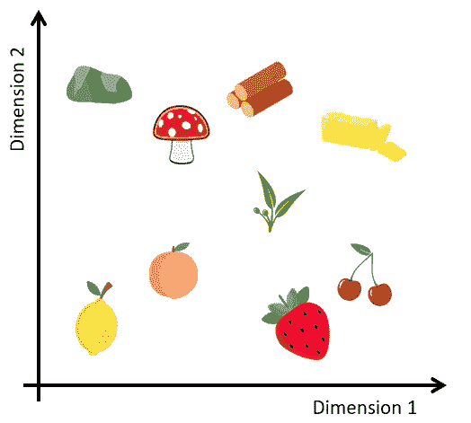
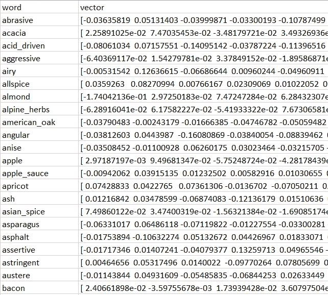

# 使用 BlazingText 在 AWS SageMaker 上训练单词嵌入

> 原文：<https://towardsdatascience.com/training-word-embeddings-on-aws-sagemaker-using-blazingtext-93d0a0838212?source=collection_archive---------21----------------------->



在最近的[文章](/robosomm-chapter-3-wine-embeddings-and-a-wine-recommender-9fc678f1041e)中，我们探索了如何创建专业葡萄酒评论中所含信息的数字表示。这样做的一个重要步骤是在专业葡萄酒评论的语料库上训练 Word2Vec 模型，以获得大约 1000 个独特和频繁出现的葡萄酒描述符的单词嵌入。

在本文中，我们将探索如何使用 BlazingText 算法在 AWS SageMaker 中训练 Word2Vec 模型，并随后在 S3 中创建一个包含训练好的描述符单词嵌入的 CSV 文件。

我们的起点是从官方[葡萄酒爱好者网站](https://www.winemag.com/)刮来的 18 万篇专业葡萄酒评论。这是我们的语料库。我们获取每篇葡萄酒评论中的文本描述，并经历几个文本规范化的步骤(将文本转换为小写，删除停用词和特殊字符，添加二元和三元组)。我们可以在 SageMaker 笔记本中完成所有必要的文本规范化步骤(代码见[这里](https://github.com/RoaldSchuring/wine_recommender/blob/master/wine_recommender.ipynb))。

现在，我们准备训练我们的 Word2Vec 模型。方便的是，SageMaker 提供了一个名为 [BlazingText](https://docs.aws.amazon.com/sagemaker/latest/dg/blazingtext.html) 的 Word2Vec 模型的内置优化实现。在我们构建 BlazingText 模型时，有很棒的[示例笔记本](https://github.com/awslabs/amazon-sagemaker-examples/blob/master/introduction_to_amazon_algorithms/blazingtext_text_classification_dbpedia/blazingtext_text_classification_dbpedia.ipynb)可供我们参考。

首先，我们需要确保我们的标准化训练数据已经作为一个 txt 文件保存在 S3，语料库中的每一句话都在一个新行上。这是 BlazingText 算法期望的输入格式。我们需要设置模型文件的输出位置，设置我们的训练作业将运行的区域，并创建一个将为我们启动训练作业的估计器对象。

现在，我们可以配置培训工作的细节。我们分两步来做:首先，我们设置培训资源的规格。对于我们的培训工作，ml.c4.2xl 实例类型已经足够了。每个实例类型的资源可以在[这里](https://aws.amazon.com/sagemaker/pricing/instance-types/)找到，t [他的链接](https://aws.amazon.com/sagemaker/pricing/)可以帮你找到相关的价格标签。

我们还需要设置 BlazingText 模型的超参数。我们只想保留语料库中出现至少 5 次的单词。出现频率低于这一频率的单词可能不够常见，无法以任何形式的准确度来计算单词嵌入。我们将单词嵌入的维度设置为 300，这是单词嵌入维度的一个相当常见的选择。我们还使用 batch_skipgram 方法，该方法支持跨多个 CPU 节点的分布式训练。虽然对于我们的目的来说，分布式训练可能有些矫枉过正(我们的语料库只有几百万个单词)，但如果您正在处理更大的语料库，这是一个值得指出的特性。

接下来，我们设置一个训练通道，以字典的形式将我们的训练数据填加到 BlazingText 算法中。剩下要做的就是通过运行。拟合方法。

SageMaker 将自动启动和关闭用于训练模型的实例。随后，我们还可以选择部署我们刚刚培训的模型。然而，这有必要吗？最终，我们只对完整语料库中相对较小的单词子集的单词嵌入感兴趣。我们真正关心的葡萄酒描述符大约有 1000 个。此外，我们将不会利用 BlazingText 算法提供的分类功能。因此，我们从训练好的模型中提取相关的葡萄酒描述词嵌入，并将其保存在 S3 桶中就足够了。

这种方法将允许我们在需要时访问这些单词嵌入，而不必承担在 SageMaker 端点中托管模型的成本。

我们可以运行下面的代码来访问我们的训练模型。

上面代码片段中的最后一行打开包含我们模型的 tarfile。我们看到它由三项组成:

```
vectors.bin
vectors.txt
eval.json
```

我们最感兴趣的是 vectors.txt 文件，这是一个带有经过训练的单词嵌入的文本文件。我们可以运行下面的代码从中提取相关的单词嵌入。txt 文件，并将它们保存在 CSV 文件中。

我们的 CSV 文件具有以下结构:



太好了！我们有我们需要的。