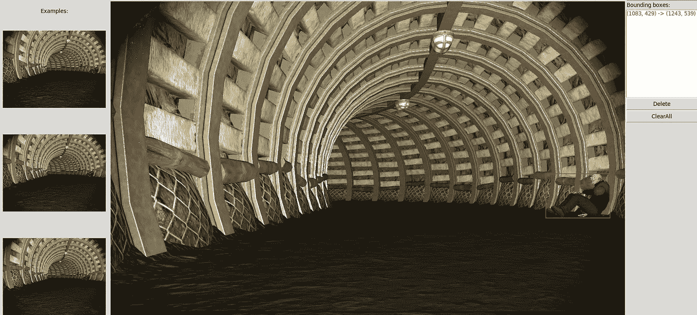

# 使用您的自定义数据集在 PyTorch 中训练 Yolo 进行对象检测——简单的方法

> 原文：<https://towardsdatascience.com/training-yolo-for-object-detection-in-pytorch-with-your-custom-dataset-the-simple-way-1aa6f56cf7d9?source=collection_archive---------2----------------------->

在之前的故事中，我展示了如何使用预先训练好的 Yolo 网络进行 [**物体检测和跟踪**](/object-detection-and-tracking-in-pytorch-b3cf1a696a98) 。现在，我想向您展示如何使用由您自己的图像组成的自定义数据集来重新训练 Yolo。

对于这个故事，我将使用我自己为 [DARPA SubT 挑战](http://www.cynet.ai/subt)训练物体探测器的例子。挑战包括在隧道网络中检测 9 个不同的对象——它们是非常具体的对象，而不是标准 Yolo 模型中包含的常规对象。对于这个例子，我假设只有 3 个对象类。

有几种方法可以做到这一点，根据官方规范，您可以在培训脚本中定义图像、配置、注释和其他数据文件的位置，但这里有一种更简单且组织良好的方法，仍然遵循 Yolo 的最佳实践。

**文件夹结构**

首先，您需要将所有的训练图像放在一起，使用这个文件夹结构(文件夹名称用*斜体*)来表示:

```
*Main Folder*
--- *data*
    --- *dataset name*
        --- *images*
            --- img1.jpg
            --- img2.jpg
            ..........
        --- *labels*
            --- img1.txt
            --- img2.txt
            ..........
        --- train.txt
        --- val.txt
```

现在让我们看看这些文件应该是什么样子的(除了那些显而易见的图像文件)。

首先，注释文件。你需要一个。每个图像的 txt 文件(相同的名称，不同的扩展名，单独的文件夹)。每个文件只包含一行，格式如下:

```
class x y width height
```

例如，一个文件(用于类 1)可以是:

```
1 0.351466 0.427083 0.367168 0.570486
```

请注意，坐标和大小是整个图像大小的一部分。例如，如果文件是 600x600px，坐标(200，300)将表示为(0.333333，0.5)。

***train.txt*** 和 ***val.txt*** 包含训练和验证图像列表，每行一个，路径完整。例如，在我的系统上，这样一个文件的前两行是:

```
/datadrive/Alphapilot/data/alpha/images/IMG_6723.JPG
/datadrive/Alphapilot/data/alpha/images/IMG_6682.JPG
```

我使用下面的[程序](https://github.com/cfotache/pytorch_custom_yolo_training/blob/master/createlist.py)生成 2 个文件，基于 90%训练/ 10%验证分割:

```
import glob
import os
import numpy as np
import syscurrent_dir = "./data/artifacts/images"
split_pct = 10  # 10% validation set
file_train = open("data/artifacts/train.txt", "w")  
file_val = open("data/artifacts/val.txt", "w")  
counter = 1  
index_test = round(100 / split_pct)  
for fullpath in glob.iglob(os.path.join(current_dir, "*.JPG")):  
  title, ext = os.path.splitext(os.path.basename(fullpath))
  if counter == index_test:
    counter = 1
    file_val.write(current_dir + "/" + title + '.JPG' + "\n")
  else:
    file_train.write(current_dir + "/" + title + '.JPG' + "\n")
    counter = counter + 1
file_train.close()
file_val.close()
```

**创建注释文件**

现在你会问如何得到？txt 注释文件。嗯，我使用的是修改版的 **BBOX** 工具，它包含在 [Github repo](https://github.com/cfotache/pytorch_custom_yolo_training/blob/master/bbox.py) 中。它的工作方式是这样的:你将训练图像放在每个班级的不同文件夹中。查看 LoadDir 函数下的文件夹结构(或者根据您的情况进行修改)——在我的示例中，我有两个文件夹，“forboxing”用于图像，而“newlabels”用于生成的注释，在“forboxing”下有每个类的子文件夹(“0”、“1”等)。您必须修改文件顶部的`self.imgclass`属性，并为每个类单独运行它。这一程序使一切都快了一点。使用工具本身是非常直观的——你只需在每一帧中的对象周围画一个方框，然后转到下一帧。



**配置文件**

现在来看看 *config/* 文件夹中的配置文件。首先， ***coco.data*** 会是这样的:

```
classes = 3
train=data/alpha/train.txt
valid=data/alpha/val.txt
names=config/coco.names
backup=backup/
```

我认为这是不言自明的。backup 参数没有使用，但似乎是必需的。这个 ***coco.names*** 文件非常简单，它应该列出类的名称，每行一个(对于注释文件，第一个对应于 0，第二个对应于 1，依此类推)。在我的例子中，文件包含三个类:

```
DRILL
EXTINGUISHER
RANDY
```

现在，配置文件中最重要的是 ***yolov3.cfg*** 。这是一个很大的文件，但以下是您必须更改的主要内容:

在第一个`[net]`部分，调整`batch`值和`subdivisions`以适合您的 GPU 内存。批量越大，训练越好，越快，但占用的内存也越多。对于一个 11Gb 内存的 Nvidia GPU 来说，一批 16 和 1 细分就不错了。也可以在这里调整`learning_rate`。

现在，最重要的是`classes`和最后一层`filters`的值(因为如果设置不正确，你的训练计划将会失败)。而且你要在**文件中的三个**不同的地方做。如果你搜索这个文件，你会发现 3 个`[yolo]`部分。在这个部分中，将`classes`设置为模型中的类的数量。您还必须更改[yolo]正上方的[卷积]部分中的`filters`值。该值等于:

```
filters = (classes + 5) x 3
```

所以对于我的 3 个类，有 24 个过滤器。注意，这只适用于 Yolo V3。V2 有一个不同的公式。

**运行培训脚本**

现在你已经为真正的训练做好了准备！训练程序(来自 [Github repo](https://github.com/cfotache/pytorch_custom_yolo_training/blob/master/train.py) )是标准的 Yolo 脚本。在 config 部分，设置所需的 epochs 数，确保文件夹路径正确，然后运行。根据训练图像的数量和您的硬件，这可能需要几个小时到一天以上的时间。

该脚本将在每个纪元后保存…抓取最后一个文件并将其放回您的配置文件夹中，然后它就可以在您的自定义数据集上进行对象检测了！关于如何运行检测功能的细节在前面的故事中有介绍，PyTorch 中的[对象检测和跟踪。](/object-detection-and-tracking-in-pytorch-b3cf1a696a98)

这个故事中引用的所有代码都可以在我的 [Github repo](https://github.com/cfotache/pytorch_custom_yolo_training) 中获得。

Chris Fotache 是一名人工智能研究员，在新泽西州工作。他涵盖了与我们生活中的人工智能、Python 编程、机器学习、计算机视觉、自然语言处理、机器人等相关的主题。