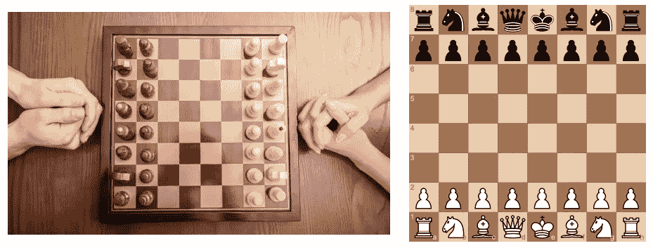
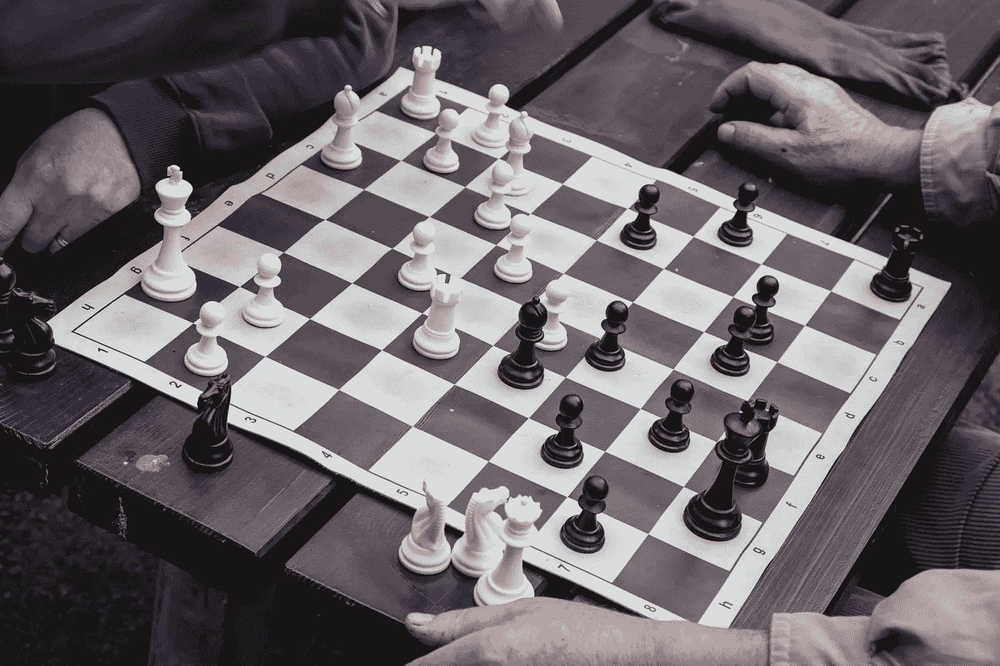
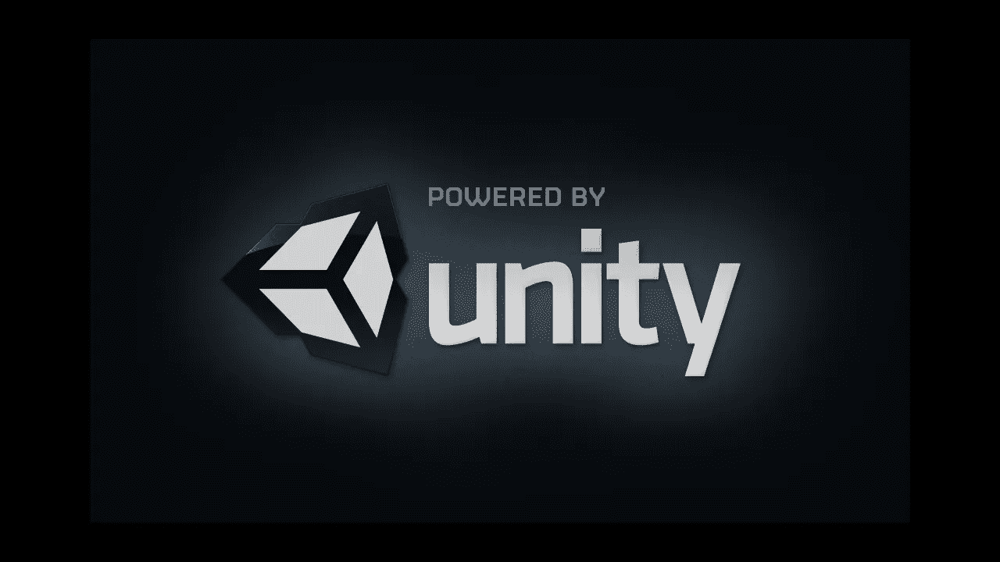
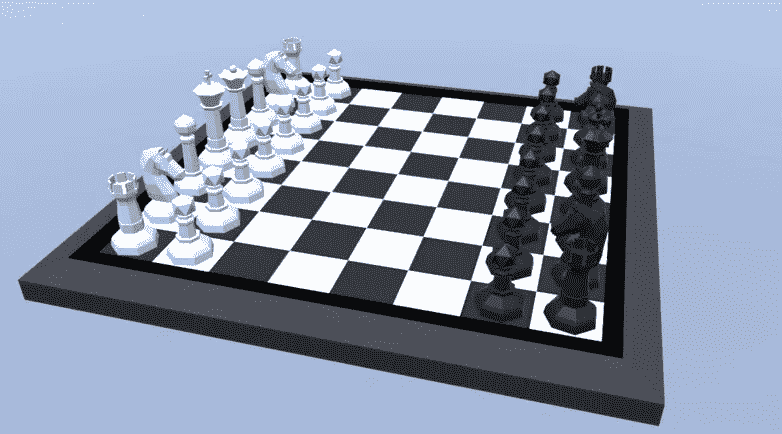
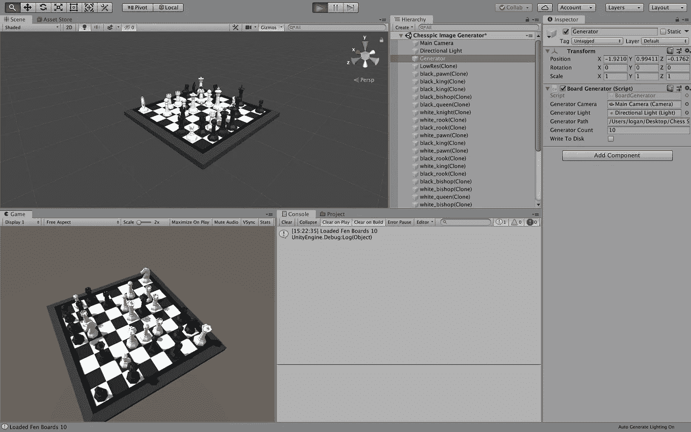
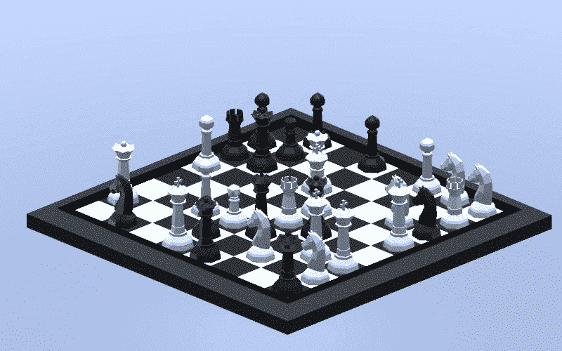
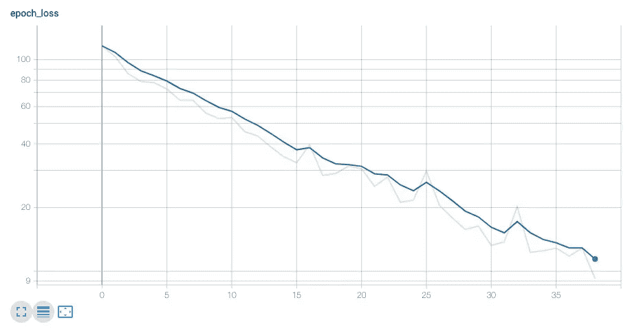
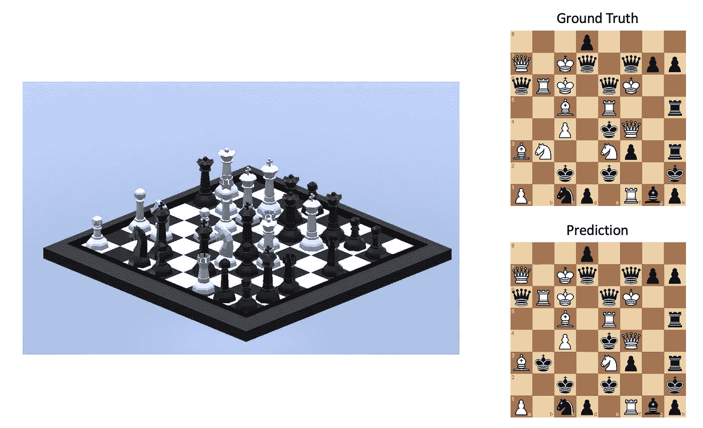

# 用机器学习转录活棋第 1 部分

> 原文：<https://towardsdatascience.com/transcribe-live-chess-with-machine-learning-part-1-928f73306e1f?source=collection_archive---------11----------------------->

## 在第 1 部分中，我们将在 Unity 中创建一个合成数据集，并在 Keras 中训练一个模型来转录象棋位置的图像。



Live and Digital Representations of the Staring Position

# 介绍

你玩过真人象棋吗？棋子的触感、检查的口头声明，以及对手偷偷瞄你的国王，最终形成一种在线游戏无法比拟的令人兴奋和身临其境的体验。然而，总的来说(OTB ),国际象棋对于严肃的棋手来说有一个明显的缺点:游戏不会自动转录。游戏必须用笔和纸或国际象棋应用程序手动转录或记录(比赛中不允许)。这种方法不仅乏味而且容易出错，最重要的是:它剥夺了游戏的乐趣。

正如您可能从标题中猜到的那样，我提出了一个替代解决方案。玩家可以使用计算机“观看”游戏，并从实时视频中自动转录移动序列，而不是手动转录游戏中的每个移动。在这个博客系列中，我将向您展示如何使用机器学习和计算机视觉中的常见和高级技术将这一想法转化为现实。每一篇后续文章都将着眼于这个问题更加困难的方面，并逐一解决它们。

# 入门指南

像任何机器学习问题一样，定义问题(从实时视频中自动转录移动序列)后的第一步是定义输入和输出。输入是视频数据，它由一系列随时间变化的图像和可选的音频组成。输出是通常以 PGN 格式记录的游戏的移动序列。从输入和输出中移除排序依赖性，我们留下了对应于一个国际象棋位置的图像(因为移动只是一系列国际象棋位置的[增量压缩](https://en.wikipedia.org/wiki/Delta_encoding))。虽然这种方法忽略了位置的状态成分，例如 castling 和 en passant，但它形成了一个更容易的学习目标，并且这些省略可以在以后计算。因此，简化的输入和输出分别是图像和位置。位置通常用 FEN 符号编码，这个项目将使用这种约定。



Image Input for the Model

```
FEN: r4rk1/2pp1p1p/p3p1p1/1p3b2/3P1R2/1BP1P3/PP4PP/R1B3K1
```

# 构建数据集

构建数据集的第一步是确定数据采集策略。该项目的战略选项包括:

*   使用现有的大量国际象棋视频
*   手动拍摄实况象棋视频
*   众包具有激励结构的现场视频拍摄
*   生成国际象棋位置的合成数据集

第四个选项有一个前三个选项所没有的独特属性:它不需要人工标记，因为我们可以同时生成输入和输出对。另一个微妙的好处是，它允许我们更有效地控制输入数据，并防止模型偏向典型的片段排列或位置模式。让我们使用 Unity 继续这个方法。



Branding Asset of [Unity](http://unity.com)

Unity 是一个 3D 游戏引擎和开发环境，可以创建逼真的 3D 环境。使用 C#脚本可以对环境进行编程访问。如果你不熟悉 Unity，使用他们优秀的教程很容易上手。在 Unity 中，我们需要完成以下任务:

*   创建一套国际象棋和棋盘
*   将摄像机置于一个良好的观察位置
*   生成随机板
*   使用相机的视图拍摄截图



[Free Chess Asset in Unity](https://assetstore.unity.com/packages/3d/props/low-poly-chess-set-104629)

第一个任务可以通过简单地从 [Unity 的资产商店](https://assetstore.unity.com/)下载预制资产来完成。使用 Unity 的编辑器，将摄像机定位在一个能很好地看到电路板的位置也是很简单的。生成随机板的代码如下所示。它的策略“HalfEmptyRandomDistribution”，给每个方块 1/2 的空概率和 1/2 的被随机棋子占据的概率(从黑王到白卒)。没有选择完全随机的分布，因为大量的大块会导致摄像机视角的高度视觉遮挡。在这种情况下，我们将避免使用 FIDE 象棋数据库分布，因为它会使我们的模型偏向典型位置。

生成随机棋盘后，下一步是以编程方式移动棋子。A1 和 H8 的位置是使用 Unity 编辑器手动记录的，其他正方形位置的计算如下所示:

以下是 Unity 编辑的观点:



现在，从相机的角度生成截图。下面是生成屏幕截图的代码。使用主板的 FEN 符号(用“/”替换“-”)将字节返回并写入文件。



在我们在一个目录中生成大约 10，000 张图像并将其压缩后，我们就有了一个预先标记的数据集。

# 设计模型

ImageNet 是大多数 CNN 架构接受训练的数据集，它有 1000 个分类作为可能的输出。然而，唯一国际象棋位置的数量为 13⁶⁴，这使得标准影像分类输出图层不可行。解决这个问题的方法是使用[对象检测](https://en.wikipedia.org/wiki/Object_detection)在图像中定位棋盘和棋子，然后使用 3D 透视变换计算它们在棋盘上的位置。虽然取得了一定的成功，但这种方法的主要缺点是它需要一种算法来解析模型的输出并构建棋位。更优雅的做法是让模型来做工作，直接学习位置。

首先，让我们简化这个问题:如何从一幅图像中预测哪块占据 A1 方块。正方形可以被十二个不同的棋子中的一个占据，也可以是空的，所以有十三种可能性。使用 Tensorflow 2.0 和 Keras，我们的模型伪代码如下所示:

这段代码利用了来自 [Tensorflow Hub](https://tfhub.dev/) 的 MobilenetV2 副本的迁移学习，并允许通过将变量“可训练”设置为 True 来微调这些层。此外，该代码对 MobilenetV2 进行了微调，因为它的上层过滤器被训练来检测与 ImageNet 分类相关的模式。例如，它有像人类、自行车和树木这样的分类，这些分类检测面部、轮胎和树枝的模式，这些在我们的数据集中都是不需要的。所以，我们可以用更有用的过滤器来代替它们。通过现在关注一个正方形，我们已经有效地将该问题转化为伴随着 softmax 激活和分类交叉熵损失函数的图像分类问题。最后，为了扩展我们的模型来检测多个方块，代码使用了 Keras 的 functional API，它指定了 64 个输出。我们预测所有方块的模型伪代码现在看起来像这样:

这种型号符合我们的要求。现在是时候训练它了。

# 训练模型

为了训练我们的模型，输入和输出数据必须以 Keras 接受的格式加载。因此，原始的国际象棋图像使用 MobileNet 的预处理器转换成张量。对于基本事实输出，我们从文件名中解析 FEN 编码，并将其格式化为 64 个输出。这是我们的 Keras 生成器类:

有了正确格式的数据，模型就可以开始训练。使用 Colab 的内置 GPU 进行培训需要几个小时。


Data Science Adaptation of [Famous xkcd Sketch](https://xkcd.com/303/)

使用 [Tensorboard](https://www.tensorflow.org/tensorboard) ，我们可以查看我们的学习曲线(蓝色的确认损失)。



损失函数持续下降(图像为对数标度)，这表明，至少在数学上，模型正在学习。评估模型真实性能的最好方法是用一个看不见的例子来测试它。



Model Prediction Visualized

该模型正确预测了 64 个方块中的 63 个，准确率约为 98%。这种精确度证明了我们的模型架构是合理的。虽然我们可以对我们的模型进行微调，使其更加精确，但是无论如何，我们将在第 2 部分中升级我们的模型，所以可以安全地继续了。(注意:你可能会注意到 A1 实际上应该是一个深色的正方形。Unity 资产被错误地旋转了 90 度，但我发现这个错误时已经来不及重做数据集了。我们将在第 2 部分讨论如何正确对齐电路板。)

# 结论

我们完成了什么？

*   使用统一的 10，000 张 3D 象棋位置的标记图像构建数据集
*   使用 Keras 功能 API 和 64 个输出层设计了一个模型来学习这些数据
*   训练模型，直到它达到人类水平的性能

在第 2 部分中，我们将解决我们在第 1 部分中跳过的一个问题，即:由于棋盘固有的对称性，它的位置是不明确的。我们还会用各种各样的物件、木板、灯光、背景和摄像机角度来扩充我们的数据集。最后，我们将向我们的数据集添加一些手动标记的真实世界数据，并在看不见的真实世界图像上尝试我们的模型。

**Colab 笔记本:**【http://bit.ly/2STzn0G】T2