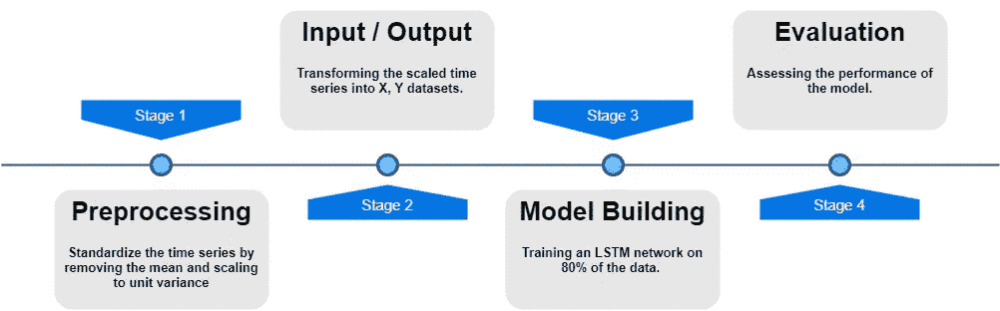
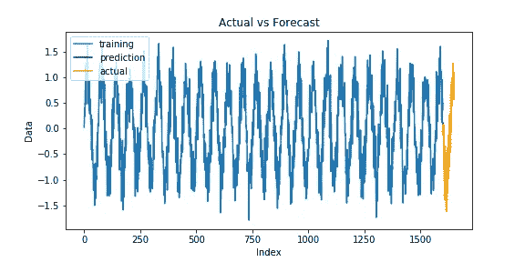

# 用于时间序列预测的迁移学习

> 原文：<https://towardsdatascience.com/transfer-learning-for-time-series-prediction-4697f061f000?source=collection_archive---------7----------------------->

**LSTM** 递归神经网络被证明是时间序列预测任务的一个很好的选择，然而该算法依赖于我们有足够的来自同一分布的训练和测试数据的假设。挑战在于时间序列数据通常表现出时变特征，这可能导致新旧数据之间的很大差异。在这篇博客中，我们想测试**迁移学习**和模型的一般领域训练在多大程度上有助于解决上述问题。

> *迁移学习(migration learning)是通过从相关任务中迁移已经学习过的知识来提高新任务中的学习。* 第十一章:迁移学习，[机器学习应用研究手册](http://amzn.to/2fgeVro)，2009。

学习迁移有几种方法，它们的区别在于可迁移的知识。在这篇博客中，我们将使用*参数传递*方法:

1.  我们将在基线数据集(作为源域)上建立一个模型，然后转移训练过的权重，作为要在目标域上训练的模型的初始化(标准转移学习)。
2.  我们将在来自两个源(源和目标域)的组合时间序列数据上构建一个模型到一个一般域中，在一般域数据上“预训练”该模型，仅在一个目标域上调整该模型，并将后一个模型的性能与仅在一般域和目标数据上训练的另外两个模型进行比较。

这里是 [GitHub 链接](https://github.com/NshanPotikyan/TransferLearningTimeSeries.git)到项目的仓库。

我们用下面显示的随机噪声生成 6 个合成时间序列。

The generated synthetic time series

现在我们有了我们的实验时间序列，让我们在第一个时间序列上训练一个模型，并把它作为一个源任务。这是代表模型拟合和评估流程的流程图。

因为 LSTM 网络期望输入/输出序列，在阶段 2 中，我们以如下方式将缩放的序列转换成 X(输入)和 Y(输出)序列:

为了找到模型的合适架构和超参数值，进行了网格搜索，结果得到了具有以下配置的模型:

**具有 100 和 50 个神经元的 2 个 LSTM 层(无脱落)**

**学习率=0.00004 的 Adam 优化器**

输入序列的长度是在自相关图(相关图)的帮助下确定的，因为它显示了相对于时间滞后的序列中的重复模式。

Correlogram of Sine Wave

在生成正弦波的情况下，所需的输入(滚动窗口)大小约为 70(因为模式从那里开始重复)，这一选择也通过在一些其他候选值上运行网格搜索来证明。以下是模型训练和评估结果:

Training and Validation Loss per Epoch

Baseline model prediction results

MSE = 0.1

图上的预测对应于模型的 50 倍预测，该预测是这样迭代完成的:

1.  X_test(用于测试的输入数据集)中的第一个可用序列用于预测序列的下一个值，例如 f(x1，…x10 )=x11
2.  预测值 x11 被附加到 x2，…，x9 序列以形成新的序列，并且我们使用 x2，…，x11 预测 x12。
3.  第二步重复用户定义的次数(n_ahead-1)

## 迁移学习

现在我们有了一个训练好的模型，我们可以开始试验知识转移是否有助于在目标领域(除了 Sine 之外的所有其他系列)获得更好的执行模型。我们进行了两项独立的试验:

1)在目标序列的最后 100 个数据点上训练 2 个模型(有和没有迁移学习),并预测 10 个超前值

2)在目标系列的整个数据集(2000 点)上训练 2 个模型，并预测 50 个提前值。

这背后的直觉是看迁移学习在数据稀缺的情况下是否有帮助。

以下是 RMSE 实验的结果:

RMSE results from the predictions

以下是一些结果的可视化。

Positive example of Transfer Learning on Cosine series

Negative example of Transfer Learning on Absolute Sine series

从 RMSE 的结果中，我们可以得出结论，一般来说，迁移学习有助于一半情况下的提高，但是如果我们仔细观察，我们可以注意到**在目标领域**缺乏数据时，它在 3/5 的情况下是有帮助的。

## 常规和域内调整

正如开头所解释的，这里我们将安装 3 个模型:

1.  预调优—基于通用域数据
2.  tuned——既在一般领域上，然后在目标领域上传递知识和拟合
3.  仅针对目标—顾名思义，此功能仅适用于目标域

时间序列被附加在一起形成一个通用的领域数据集。

以下是与上一节相似的实验结果:

RMSE results from the predictions

我们可以看到，在“调整”的情况下，所提出的方法只提高了一次性能。可以预料，目标领域的训练比其他两种情况表现更好，而“预调优”的情况在 10 种情况中有 3 种表现更好。

以下是一些结果的可视化。

Positive example of “Pre-tuned” case outperformance

Positive example of “Tuned” case outperformance.

**结论**

基于所获得的结果，迁移学习似乎在缺乏时间序列数据的情况下以及当我们对类似任务有微调的模型时是有用的。

至于模型的一般领域调优，需要进一步探索，以发现是否有其他组合技术可以提高“调优”模型的性能。