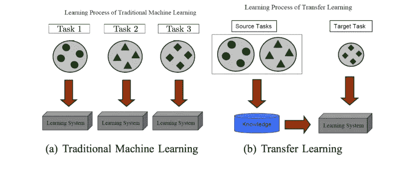
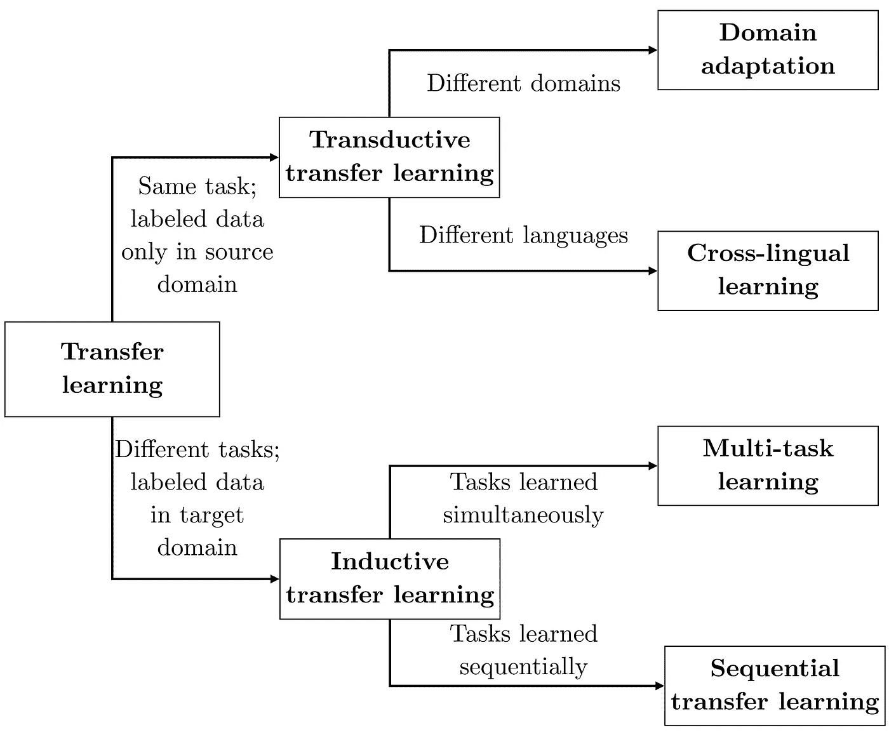
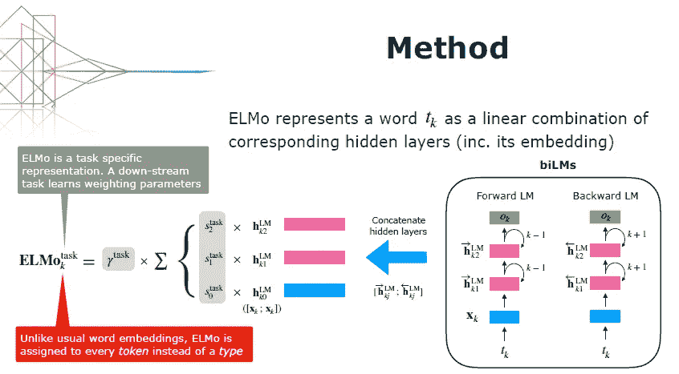
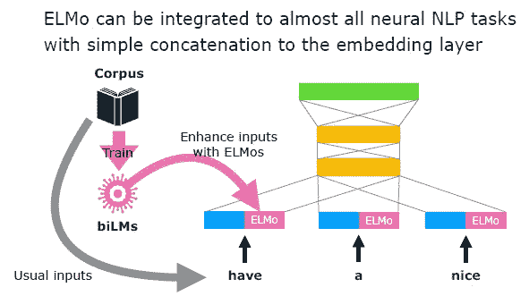
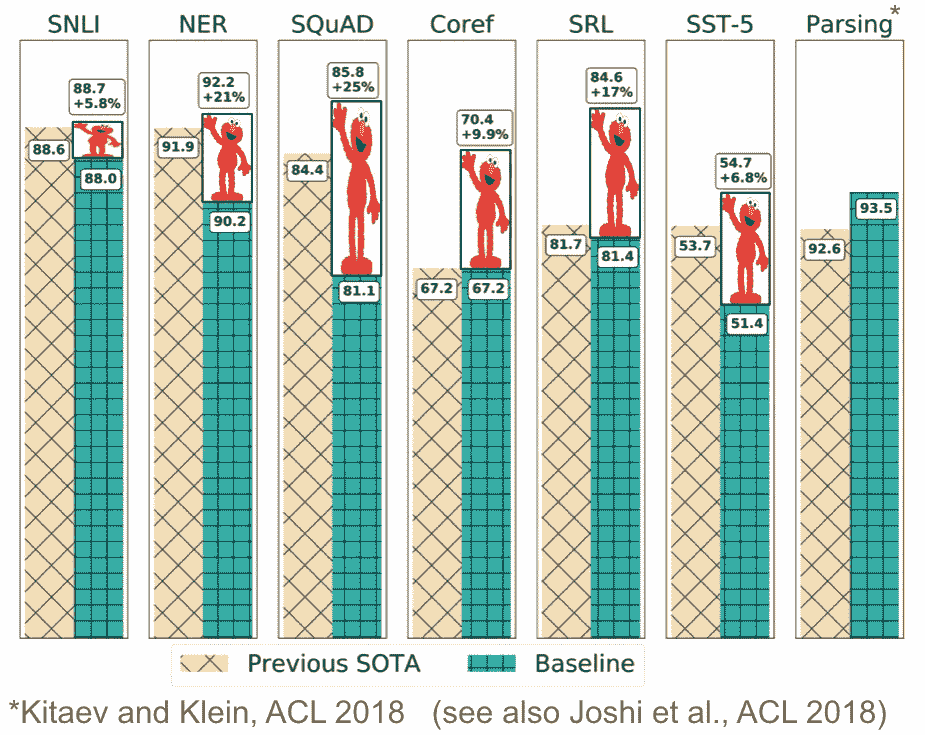
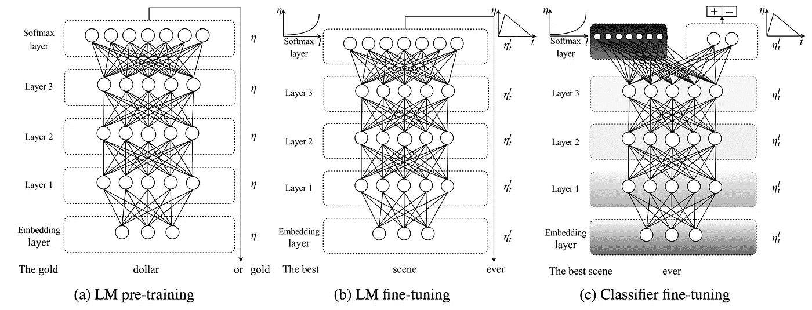
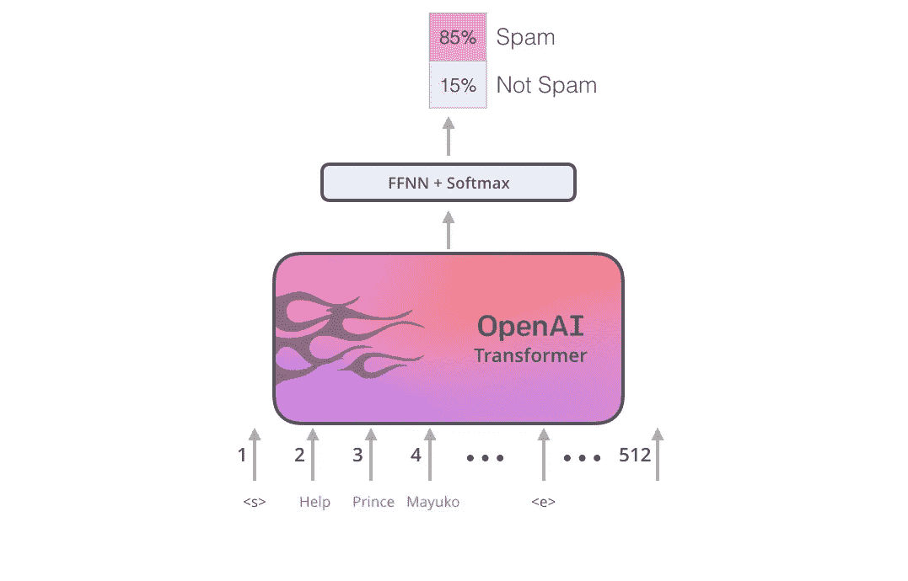
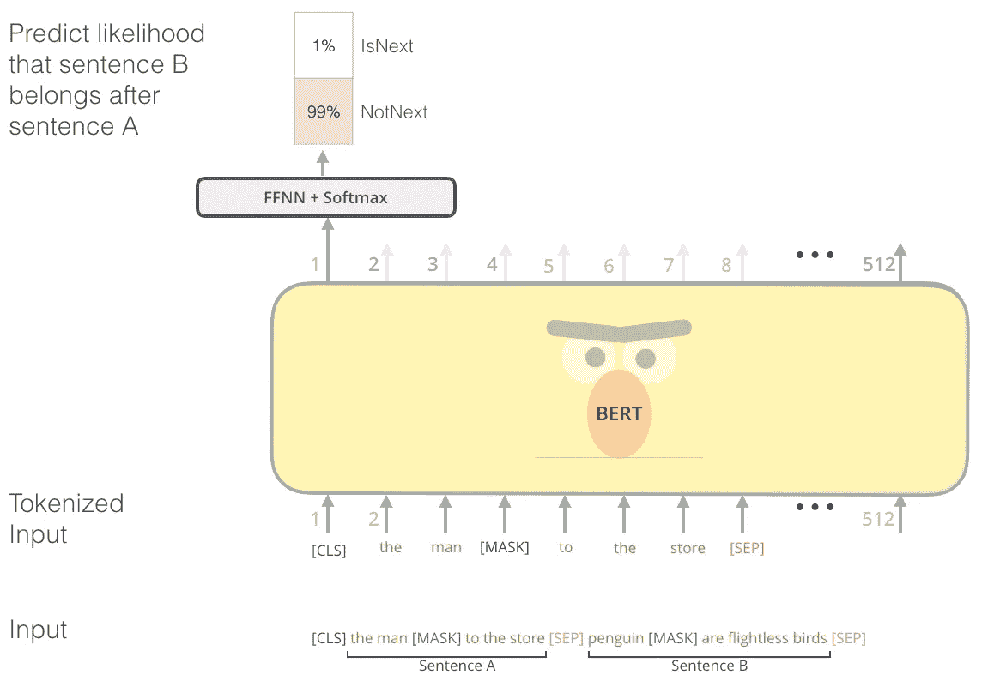

# 自然语言处理中的迁移学习

> 原文：<https://towardsdatascience.com/transfer-learning-in-nlp-fecc59f546e4?source=collection_archive---------12----------------------->

## 使用已经训练好的健壮模型在更短的时间内完成 NLP 任务，并使用更少的资源。

首先什么是迁移学习？最近，我们变得非常擅长用非常好的训练模型预测非常准确的结果。但是考虑到大多数机器学习任务都是特定领域的，经过训练的模型通常无法概括出它从未见过的条件。现实世界不像训练过的数据集，它包含大量杂乱的数据，在这种情况下模型会做出错误的预测。将预训练模型的知识转移到新条件中的能力通常被称为迁移学习。

迁移学习已经在计算机视觉中大量使用，主要是因为在大量数据中训练的非常好的预训练模型的可用性。

Pan and Yang (2010)

深度学习是训练数据密集型的。如果你没有超过 10，000 个例子，深度学习可能根本不在讨论范围内。类似的过程也存在于自然语言处理中。例如，一个简单的 word2vec 模型可以通过上下文(如用于语言学习的向量)通过序列预测单词，它可以通过来自其他输入的向量基于上下文产生这些模式。

对于这些类型的数据集，深度学习并不总是最好的方法。极端的训练要求、巨大的计算时间，以及最重要的是，费用使得这些深度学习输入对于许多环境来说遥不可及。

# 迁移学习如何解决这个问题？

每个人都有问题，但不是每个人都有数据。与小数据相比，大数据实际上不是什么大问题。迁移学习是从一种语境到另一种语境的应用。因此，应用来自一个模型的知识可以通过采用现有参数来解决“小”数据问题，从而帮助减少训练时间和深度学习问题。

例如，使用深度学习来教算法识别老虎对于这样一个小任务来说太耗费人力了。相反，转移现有的模型，例如输入的高级概念，如“多大？怎么条纹？什么颜色？”会给你很高的激活度，因为这些问题中的每一个都对应着一幅老虎的图像。输入特征和目标之间的关系变得更加直接，训练能力和总计算数据更少。

# 迁移学习的一般优势:

迁移学习然后以三种不同的方式解决深度学习问题。

*   使用预训练数据简化训练要求
*   更小的内存需求
*   大大缩短了目标模型培训时间——几秒钟而不是几天

# 用例中的优势:

对于计算机视觉，我们在数百万数据上有一套非常好的训练有素的模型，它们可以很容易地用于执行对象识别任务。我们可以用 20 行代码构建健壮且非常精确的模型。只需导入一个预训练的模型并微调几层就能得到我们想要的结果。

对于 NLP，过程更复杂。视觉数据输入往往更具体，组成视觉特征的组件更通用，而金融训练集不会转移到生物医学模型。总的来说，对于什么是好的源模型还没有达成一致。但是 NLP 中有许多地方可以利用迁移学习来优化深度学习的一般过程。

比如语言建模，简单来说就是预测序列中下一个单词的任务。给定部分句子“我原以为我会准时到达，但却在 5 分钟后到达”，对读者来说，下一个单词显然是“迟到”的同义词。有效地解决这一任务不仅需要理解语言结构(名词跟随形容词，动词有主语和宾语等)。)还包括根据广泛的上下文线索做出决定的能力(“late”在我们的例子中是填补空白的明智选择，因为前面的文本提供了说话者正在谈论时间的线索。)此外，语言建模具有不需要带标签的训练数据的期望属性。原始文本在每一个可以想象的领域都是丰富的。这两个特性使得语言建模非常适合学习可归纳的基本模型。

自然语言处理中的迁移学习可以分为三个方面。a)源和目标设置是否处理相同的任务；以及 b)源和目标域的性质；以及 c)学习任务的顺序。

A taxonomy for transfer learning in NLP ([Ruder, 2019](http://ruder.io/thesis/neural_transfer_learning_for_nlp.pdf#page=64)).

将知识转移到语义相似/相同但数据集不同的**任务。**

*   **源任务**-用于二元情感分类的大型数据集
*   **目标任务(T)**——用于二元情感分类的小数据集

将知识转移到语义不同但共享相同神经网络架构的任务，以便可以转移神经参数。

*   **源任务** -用于二元情感分类的大型数据集
*   **目标任务(T)** —用于 6 向问题分类的小数据集(例如，位置、时间和数量)

当我们处理不同的语言和用户需求时，自然语言处理中的迁移学习有一定的局限性。例如，大多数模型是为英语语言训练的，由于不同的语言语法结构，在不同的语言中使用相同的模型是相当困难的。对于自定义 NER 任务来说也很困难，因为我们需要提取非通用的自定义实体。

# 迁移学习的几种方法

## 参数初始化(INIT)。

INIT 方法首先**在 S** 上训练网络，然后直接使用调整后的参数**为 T** 初始化网络。转移后，我们可以固定目标域的参数，即**微调 t 的参数**

## 多任务学习(MULT)

另一方面，MULT 在两个领域同时训练**样本。**

Multi Task Learning

## 组合(MULT+初始)

我们首先在源域 S 上预训练**参数初始化**，然后**同时训练 S 和 T。**

# 一些受欢迎的型号有:

# 1.工程与后勤管理局

( **E** 嵌入来自 **L** 语言 **Mo** dels)

ELMo 的方法是使用 LSTM 来回学习语言模型。使用时间输入我们的文本在这个模型中，并删除不同层的隐藏状态，给出每一层应该有多重要的权重。这取决于我们使用的工作。ELMo 每一层中的隐藏状态就像每一层中的表示是不同的。

从右到左，从训练双向 LSTM 开始，实现 ELMo 的隐藏状态
(图片来自 ELMo 的[幻灯片](https://www.slideshare.net/shuntaroy/a-review-of-deep-contextualized-word-representations-peters-2018)

ELMo 的使用被认为是上下文嵌入，比单词嵌入要好。总的来说，ELMo 的表现也考虑到了背景。例如，在明文嵌入中，单词 bank 表示银行，bank 表示银行，这是一个向量。相同，但是因为 ELMo 是接收到 LSTM 的整个消息的模型，所以它的表示也根据传入的消息而变化。在使用中，在嵌入层中添加上下文嵌入作为输入，如下图所示

ELMo 在各种任务中的上下文嵌入
(图片来自 ELMo [幻灯片](https://www.slideshare.net/shuntaroy/a-review-of-deep-contextualized-word-representations-peters-2018)

当使用 ELMo 时，我们还发现它能够更好地帮助测试各种数据集中的结果

使用 ELMo
改进了测试结果(图片来自 [NLP 的 ImageNet](http://ruder.io/nlp-imagenet/) 博客[时刻已经到来](http://ruder.io/nlp-imagenet/))。

# 2.乌尔菲特

(**U**通用**L**语言**M**模型 **Fi，** Ne- **，t** Uning)。

这个 ULMFiT 基于 [AWD-LSTM，](https://arxiv.org/abs/1708.02182)是当今语言建模的最佳 LSTM。当 ULMFiT 了解到语言模型可以用于各种任务时，只需保留较低的部分并改变顶层，但实现可能需要两个以上的微调步骤。从训练语言模型开始，然后逐渐训练真实的工作，比如训练成为一个分类器。

在这个调整过程中，有一些建议是应该做的。区别性微调是不同层次的微调。因为每一层的模型是在不同级别上的表示，并且应该使用倾斜的三角形学习率，以便能够在开始时收敛到一个好的值，然后逐渐调整到后来的值，并且在最后的调整中，例如，训练成为分类器，应该逐个调整权重。未修改层中的权重将首先被冻结。(意思是保持原来的值)

a) ULMFiT training for general language models (b) and then training for a specific language model
© and then actually training for that work (Picture from [ULMFiT paper](https://arxiv.org/abs/1801.06146) )

# 开放式变压器

去年，推出了自我关注过程和变压器模型。今年，它被更广泛地使用，例如在[故事生成](https://arxiv.org/abs/1805.04833)或[萨根](https://arxiv.org/abs/1805.08318)以及我们将讨论的 OpenAI Transformer 和 BERT 中。为了自我关注和变形金刚的事。ThAIKeras 写了一篇文章，有兴趣的可以在这里阅读。

至于 OpenAI Transformer，Transformer 的解码器端是屏蔽了自我关注的。用于学习语言模型。然后，在其他应用中使用时，您可以按如下方式将前馈神经网络连接到顶部。

Examples of the use of OpenAI Transformer in text classification
( [The Illustrated BERT, ELMo, and co. (How NLP Cracked Transfer Learning)](https://jalammar.github.io/illustrated-bert/) blog ).

# 伯特

(**B**I 方向**E**n 编码器**R**表示来自**T**变压器)。

对于这个最新的伯特模型已经决定使用自我关注充分或者是变压器编码器。但是在过去的语言模型学习中，有一些限制阻止了它的使用。双向 LSTM 或完全自我关注，因为语言建模是对下一个单词的预测，该单词必须在一个方向上追逐传入的消息，如果从另一个方向追逐或使用所有消息将相当于看到正确的答案。在 BERT 的学习中，问题从语言模型变成了掩蔽语言模型，即随机关闭几个单词。然后给出预测这个单词的模型，比如完形填空或者允许我们猜测空格中单词的测试

用完形填空题进行伯特训练
(图片来自[插图伯特、埃尔莫等人(NLP 如何破解迁移学习)](https://jalammar.github.io/illustrated-bert/)博客)

此外，伯特还将学习句子之间的关系。为了更好地理解信息的含义，通过输入两个句子，然后 BERT 预测这两个句子是否相连。

Training with two sentences (picture from [The Illustrated BERT, ELMo, and co. (How NLP Cracked Transfer Learning)](https://jalammar.github.io/illustrated-bert/) blog ).

这四种模式可以总结如下:

*   ELMo:
    学习任务:语言建模
    架构:Bi-LSTM
*   学习任务:语言建模
    建筑:AWD-LSTM
*   OpenAI Transformer:
    学习任务:语言建模
    架构:Transformer(解码器)
*   BERT:
    学习任务:完形填空和句子预测
    架构:Transformer(解码器)

*这是迁移学习如何应用于自然语言处理领域的概述。自然语言处理中的迁移学习可以很好地解决某些领域中的某些问题，但是要在所有语言的所有一般自然语言处理任务中被认为是一个好的解决方案还有很长的路要走。随着 NLP 领域的大玩家引入新模型，我很高兴看到这如何应用于各种用例以及未来的发展。*