# 推文姿态分类的自然语言处理中的迁移学习

> 原文：<https://towardsdatascience.com/transfer-learning-in-nlp-for-tweet-stance-classification-8ab014da8dde?source=collection_archive---------6----------------------->

## 自然语言处理中两种迁移学习方法的比较:针对涉及 Twitter 数据的多类分类任务的:**ulm fit**和【OpenAI GPT】

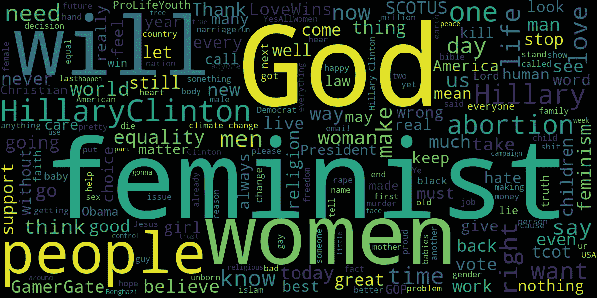

A [wordcloud](https://github.com/amueller/word_cloud) of an interesting Tweet dataset analyzed in this post

2018 年是自然语言处理(NLP)领域非常令人兴奋的一年，特别是对于*迁移学习*——一种不是从零开始训练模型的技术，我们使用在大型数据集上预先训练的模型，然后针对特定的自然语言任务对它们进行微调。 [Sebastian Ruder](http://ruder.io/) 在他的文章“ [NLP 的 ImageNet 时刻已经到来](http://ruder.io/nlp-imagenet/)”中提供了迁移学习的过去和当前状态的精彩描述，解释了为什么这是 NLP 中目前如此热门的领域——他的文章是必读的**。**

**最近，诸如 [ULMFiT](http://nlp.fast.ai/classification/2018/05/15/introducting-ulmfit.html) 、 [OpenAI GPT、](https://blog.openai.com/language-unsupervised/) [ELMo](https://allennlp.org/elmo) 和 Google AI 的 [BERT](https://arxiv.org/pdf/1810.04805.pdf) 等方法已经通过在预训练期间使用*语言建模*彻底改变了 NLP 中的迁移学习领域，这极大地改善了自然语言理解中各种任务的最新水平。可以说，语言建模的使用(并非没有局限性)是计算机在语言语义理解方面取得巨大进步的主要原因之一。**

**上面提到的迁移学习方法的一个有趣的方面是，它们使用在格式良好的大规模精选数据集上预先训练的语言模型，这些数据集包括具有清晰语法的完整句子(如[维基百科文章](https://blog.einstein.ai/the-wikitext-long-term-dependency-language-modeling-dataset/)和[10 亿字基准](https://ai.google/research/pubs/pub41880))。自然出现的问题是——这种预先训练的语言模型能在多大程度上推广到来自不同分布的自然语言任务，如推特？**

# **这篇文章的目标**

**在这篇文章中，我们将讨论和比较两种现代迁移学习方法——[ulm fit](http://nlp.fast.ai/classification/2018/05/15/introducting-ulmfit.html)和 [OpenAI 的**GPT**("**G**generative**P**re-**T**raining ")，并展示如何相对容易地对它们进行微调，以执行不同分布的分类任务——在这种情况下，对推文的立场进行分类。](https://blog.openai.com/language-unsupervised/)**

**我们的目标是开发一种建模方法，帮助回答以下问题:**

*   **我们微调过的语言模型(和分类器)是否概括了 Tweets 的非结构化和杂乱的语言语法？**
*   **我们能否通过*针对每个型号的最小特定任务定制*和*有限的计算资源*实现合理的准确性(与 2016 年的基准测试结果相当)？**
*   **基于所使用的模型架构，分类结果如何变化？**

**下面显示的结果的所有代码和数据都可以在[这个 GitHub repo](https://github.com/prrao87/tweet-stance-prediction) 中找到。**

## **为什么是乌尔姆菲特和开放 GPT？**

**这两种特定的迁移学习方法被选作这个项目，因为它们在如何使用语言建模来执行无监督的预训练，以及随后的监督微调步骤方面非常相似(它们都是*半监督*方法)。但是它们也不同，因为它们使用不同的网络架构来实现通用化。ULMFiT 使用 3 层双 LSTM 架构，而 OpenAI 方法使用变压器网络。**

**对 ULMFiT 和 OpenAI 的 GPT 的完整描述对于这篇文章来说太长了，但是[这篇文章](https://medium.com/explorations-in-language-and-learning/transfer-learning-in-nlp-2d09c3dfaeb6)很好地强调了这两种模型架构的技术细节以及它们的重要性，所以请务必阅读它！**

# **背景**

**在进入推文姿态分类的迁移学习的细节之前，让我们澄清一些术语，以理解*为什么*迁移学习在最近大幅提高了各种自然语言任务的最新水平。**

## **从经典的单词嵌入继续**

**历史上，预先训练的单词嵌入技术，如 [word2vec](http://papers.nips.cc/paper/5021-distributed-representations-of-words-andphrases) 和 [GloVe](https://nlp.stanford.edu/pubs/glove.pdf) ，在 NLP 中大量使用，以在训练新任务之前初始化神经网络的第一层。这些是*浅层*表示(单层权重，称为*嵌入*)。来自单词嵌入的任何先验知识只存在于网络的第一层——对于新的目标任务，整个网络仍然需要从头开始训练。**

**为了从*单词序列*(例如在自然语言中看到的那些)中获取含义，利用单词嵌入的模型仍然需要大量的数据来消除大量单词的歧义，并从全新的、看不见的词汇中“学习”。如本文稍后讨论的基准测试结果所示，通过单词嵌入传递知识所需的数据量可能*巨大，*这可能导致非常大的计算成本。在整个 2018 年，[强大的预训练语言模型](https://www.sysml.cc/doc/50.pdf)的出现表明，使用从大型文本语料库的预训练中获得的知识，可以更深入地理解新任务的语言语义和结构，特别是对于长序列。**

## **语言建模**

**语言模型试图通过分层表示来学习自然语言的结构，因此既包含低级特征(单词表示)，也包含高级特征(语义)。语言建模的一个关键特征是它是*生成性的*，这意味着它的目标是在给定前一个单词序列的情况下预测下一个单词。它能够做到这一点，因为语言模型通常是以无监督的方式在非常大的数据集上训练的，因此该模型可以以比单词嵌入更深入的方式“学习”语言的句法特征。**

**在他的文章中，Sebastian Ruder 做了一个非常优雅的工作，强调了为什么语言建模对于广泛的自然语言处理任务如此强大。未标记的语言数据相对容易获得(它可以以大型文本语料库的形式免费获得)，因此通过向语言模型提供足够大的数据集，现在可以对数十亿个单词进行无监督的预训练，同时融入更深入的语言语法知识。**

## **半监督学习**

**NLP 中的迁移学习现在通常是作为一个多步骤的过程来完成的——其中一个*整个网络*首先以一种无监督的方式进行预训练，目标是语言建模。在此之后，该模型然后使用监督方法(使用一些标记的数据)在新的任务上进行微调，然后可以用于文本分类等任务。这种无监督预训练(使用语言建模)和监督微调的结合被称为 [*半监督*学习](http://ruder.io/semi-supervised/)，也是我们在这篇文章中用来解决推文立场分类问题的方法。**

# **使用的数据集**

**本文中使用的推文数据集来自 [this SemEval 2016 共享任务](http://alt.qcri.org/semeval2016/task6/)，其中包含与以下五个主题相关的推文:**

*   **无神论**
*   **气候变化令人担忧**
*   **女权运动**
*   **希拉里·克林顿**
*   **堕胎合法化**

**提供的标签数据由目标主题、与之相关的推文以及推文对目标的姿态组成。这些数据已经分为一个训练集(包含 2914 条推文)和一个测试集(包含 1249 条推文)。立场可以是三个标签之一:“赞成”、“反对”和“都不是”，因此这是一个*多类*数据集。**

**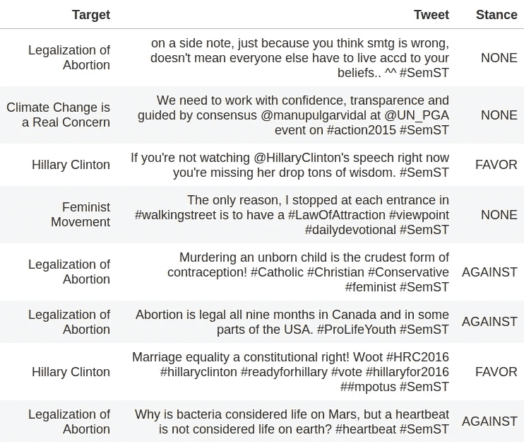**

**Example training data (randomly sampled)**

## **检测姿态的挑战**

**立场检测是*观点挖掘*的一个子类，其任务是自动确定一段文本的作者是支持*给定目标的*还是反对给定目标的*。考虑以下两条推文:***

> **我们不是从父母那里继承了地球，而是从我们的孩子那里借来的**
> 
> **据我所知，阿尔·戈尔是政治家，不是科学家。**

**对于人类观察者来说，很明显两条推特都与气候变化话题相关，并且都表达了对气候变化话题的特定立场。然而，对于机器来说，检测这种姿态是一个多方面的难题。推文的非正式和非结构化语法，加上机器缺乏人类拥有的适当的上下文意识和历史知识(例如，知道阿尔·戈尔是谁)，使这成为机器学习算法的一个挑战性问题。此外，为推特姿态收集大量标记数据以训练机器学习算法既昂贵又繁琐。开发深度学习方法变得越来越有必要，这些方法可以在有限的训练数据量下工作，但仍能产生有用的见解。**

## **立场和情绪是不一样的！**

**姿态检测与情感分析相关，但并不相同。在情感分析中，我们感兴趣的是一段文字是正面的、负面的还是中性的，这仅仅是基于所用语言的内容。典型地，对于情感分析，正面或负面语言的选择与文本的整体情感相关。**

**然而，一段文本的立场是相对于目标主题定义的*，并且可以独立于是否使用了肯定或否定的语言。目标(表达意见的主题)可能会或可能不会在实际文本中直接提及，文本中提及的任何实体可能会或可能不会是意见的实际目标。下面是来自[任务创建者论文的一个例子。](https://arxiv.org/pdf/1605.01655.pdf)***

> *****话题*** : *堕胎合法化***
> 
> *****推文*** :怀孕的不只是会走路的保温箱。他们也有权利！**
> 
> *****姿态*** : *恩宠***

**在上面的例子中，由于这个话题被称为“堕胎合法化”，这条推文可以被解释为对这个话题有利。如果它被称为“反堕胎运动”，它的立场将会是反对这个话题。从这个例子中可以清楚地看出，推文中使用的语言在情绪上只是大致积极的；然而，这种情绪与它是支持还是反对这个话题没有关系。**

## **阶级不平衡**

**下表显示了与数据集中的每个主题相关的推文数量。这 2，914 条推文在每个主题上的分布是不均衡的，每个主题的每个类别的推文数量也有很大差异。要探索分布情况并更详细地检查推文，请查看由任务创建者提供的[完全交互式可视化。](http://www.saifmohammad.com/WebPages/StanceDataset.htm)**

**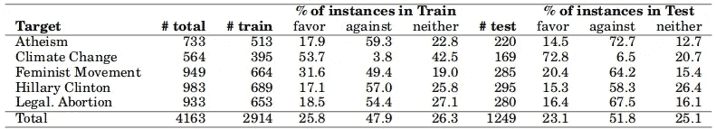****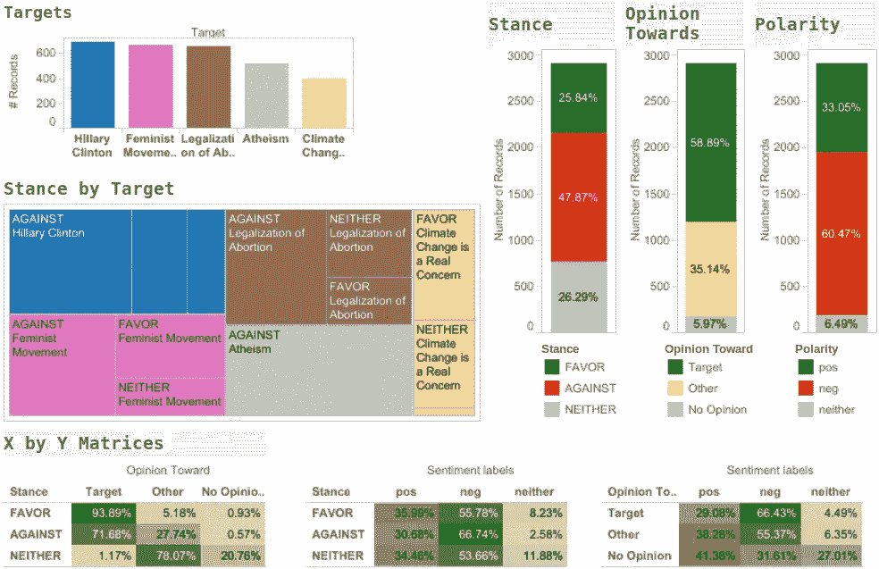**

**Source: [SemEval-2016 Stance Dataset](http://www.saifmohammad.com/WebPages/StanceDataset.htm)**

**观察这种分布，立场分类任务似乎非常具有挑战性——不仅数据集很小(总共有几千个训练样本，每个主题的最少 395 条到最多 689 条推文)，而且样本中还存在显著的类别不平衡。例如，主题“气候变化是一个问题”有较大比例的训练样本被分类为“赞成”，而有非常小的比例(不到 **4%** )被分类为“反对”。另一方面，主题“无神论”有很大一部分样本被归类为“反对”。**

**任何姿态分类的建模方法都必须能够捕捉到这种等级不平衡，包括目标等级内和*之间的*。****

## **使用的评估指标**

**为了评估分类性能，任务[的创建者使用一个宏观平均的 F 值](http://www.aclweb.org/anthology/S16-1003)**，这是两个主要类别“支持”和“反对”的精度和召回率的调和平均值*。这里的[给出了在情感分类中如何使用精确度和召回率的例子](https://streamhacker.com/2010/05/17/text-classification-sentiment-analysis-precision-recall/)。一般来说，精确度和召回率是不一致的，因此 F-score 提供了一个很好的方法来洞察分类器的性能。虽然我们在评估中不包括第三类“两者都不是”，但是它被隐含地考虑，因为系统必须正确地预测所有三类以避免在前两类中的任何一类中受到严重惩罚。*****

****为了评估 F 分数，任务创建者提供了一个 [perl 脚本](http://alt.qcri.org/semeval2016/task6/index.php?id=data-and-tools)(其用法将在后面的章节中描述)——我们需要做的就是以一种评估脚本可以读取的方式形成我们的姿态分类器的预测输出。然后可以将获得的宏观平均 F 值与其他模型的结果进行比较。****

# ****用于比较的基准结果:MITRE****

****2016 年这项任务的获奖作品来自 MITRE 团队，他们在本文中描述了他们的分类方法[。为了检测姿态，MITRE 使用了一个递归神经网络(RNN)模型，该模型分为 4 层，如下图所示。第一层包含一次性编码的标记(即文本中的单词)，这些标记通过称为“投影层”的 256 嵌入层进行投影。然后将输出序列输入到“循环层”(包含 128 个 LSTM 单元)，其输出连接到一个 128 维的整流线性单元(ReLUs)层，压降为 90%。最终的输出层是一个 3 维 softmax 层，代表每个输出类别:支持、反对和无。](https://arxiv.org/pdf/1606.03784.pdf)****

****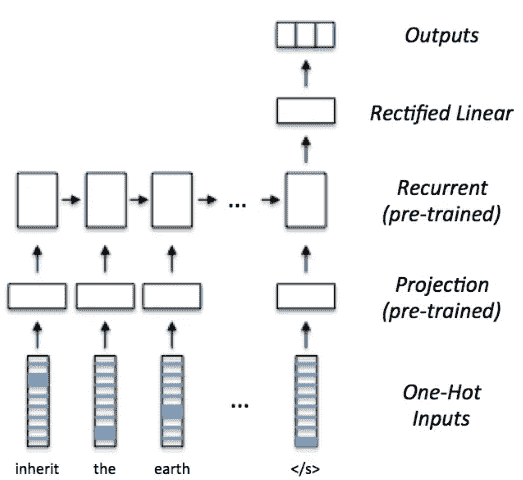****

****Image credit: [MITRE’s submission to SemEval 2016](https://arxiv.org/pdf/1606.03784.pdf)****

****MITRE 还应用了迁移学习(通过使用单词嵌入)来重用来自预训练模型的 Tweet 语法的先验知识。这是通过如下所述的多步骤预培训流程实现的:****

1.  ******预训练投影层**:使用 [word2vec 跳格法](https://arxiv.org/pdf/1301.3781.pdf)从 256 维单词嵌入中初始化投影层的权重。为了做到这一点， [MITRE 从 Twitter 的公共流媒体 API 中提取了 218，179，858 条英文推文](https://arxiv.org/pdf/1606.03784.pdf)，然后在这个未标记的数据集上执行弱监督学习(在清理推文并将其小写后)。为了了解复合短语的意思，他们然后应用[word 2 phase](https://papers.nips.cc/paper/5021-distributed-representations-of-words-and-phrases-and-their-compositionality.pdf)来识别由多达四个单词组成的短语。在抽样的 2.18 亿条推文中，使用了 537，366 个词汇项目(在语料库中出现了至少 100 次)。****
2.  ******预训练递归层**:MITRE 网络的第二层由 128 个 LSTM 单元组成，使用标签预测辅助任务的远程监控，用预训练的权重初始化。首先，自动识别了 197 个与所考虑的五个主题相关的标签(使用单词嵌入空间的最近邻搜索)。然后，从总共 2.18 亿条推文中提取了 298，973 条推文，其中至少包含这 197 个标签中的一个，并训练网络来调整单词嵌入和递归层。像以前一样，Tweets 是小写的，在标记化之前去掉了所有的标签和短语。****

## ****结果:MITRE****

****MITRE 获得的每个主题和班级的未公开测试数据的 F 分数如下所示。请注意，对于主题类“气候变化(反对)”，F 值为零，这意味着他们的模型没有预测到来自测试集的任何反对气候变化的推文。然而，来自气候变化主题的训练数据中，只有 **3.8%** 属于“反对”类(这相当于只有 **15 个**训练样本！)，因此，由于完全缺乏训练样本，该模型可能缺少该特定类的上下文是有意义的。****

****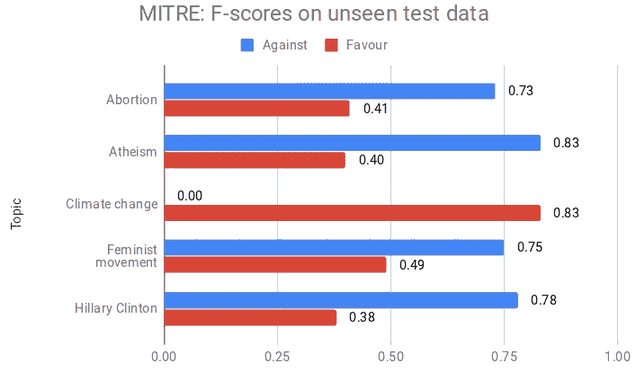****

****Data source: [MITRE’s paper submitted to SemEval 2016](https://arxiv.org/pdf/1606.03784.pdf)****

****正如[在他们的论文](https://arxiv.org/pdf/1606.03784.pdf)中提到的，MITRE 获得了(所有主题的平均值)0.68 的宏观 F 值。这是 2016 年向比赛提交结果的所有 19 名参赛者中的最好成绩。****

****MITRE 使用的方法是一个相当复杂的多步预训练过程，使用单词嵌入，需要使用非常大的未标记数据集(数亿个样本)，对原始数据进行大量清理，并为网络中的每一层单独进行预训练。大量手工制作的步骤主要是因为 word2vec 嵌入的限制(这是当时 NLP 中预先训练模型的主要方法)。****

# ****方法 1: ULMFiT****

****ULMFiT 已经完全在`fastai`库的 v1 中实现了(参见他们的 GitHub repo 上的`[fastai.text](https://github.com/fastai/fastai/tree/master/fastai/text)`)。`fastai`的版本 1 是建立在 [PyTorch v1](https://pytorch.org/) 之上的，所以对 PyTorch 对象有一些了解有利于入门。在这篇文章中，我们将介绍一些`fastai`开发的技术，这些技术使得迁移学习变得非常方便，即使对于深度学习经验相对较少的人来说也是如此。****

## ****培训步骤****

****如[原论文](https://arxiv.org/pdf/1801.06146.pdf)所述，ULMFiT 由三个阶段组成。****

1.  ****在捕捉高级自然语言特征的通用领域语料库上训练语言模型****
2.  ****在目标任务数据上微调预先训练的语言模型****
3.  ****在目标任务数据上微调分类器****

****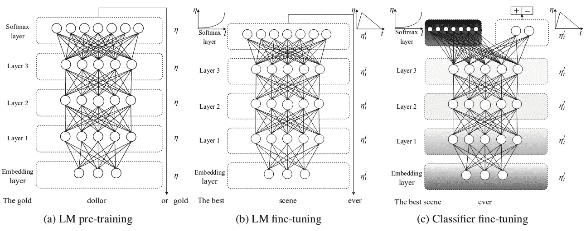****

****Image source: [ULMFiT paper by Jeremy Howard and Sebastian Ruder](https://arxiv.org/pdf/1801.06146.pdf)****

******在推文姿态分类过程中，我们只执行步骤 2 和 3** 。第一步是一个无人监督的预训练步骤，并且*真的*计算量很大——这就是为什么`fastai`将这些模型[公之于众](https://github.com/fastai/fastai/blob/master/fastai/datasets.py)，以便其他人可以从他们的工作中受益。我们依靠预先训练的语言模型的能力来捕捉我们可能遇到的任何目标文本(英语)中的长期依赖性。****

****这部分的所有代码都可以在 Jupyter 笔记本[【ul mfit . ipynb】](https://github.com/prrao87/tweet-stance-prediction/blob/master/ulmfit.ipynb)中找到。为了简洁起见，在这篇文章中只讨论了该方法的关键元素——请随意浏览完整的笔记本和这个项目的主 GitHub repo[以深入了解对 Tweet 立场进行分类的工作代码。](https://github.com/prrao87/tweet-stance-prediction)****

## ****ULMFiT 中的新学习技术****

****ULMFit 论文中的以下新技术使其即使在不同分布的看不见的数据上也能很好地推广。建议阅读[全文](https://arxiv.org/pdf/1801.06146.pdf)深入了解，但下面给出一个总结。****

*   ******判别微调:**模型的每一层捕捉*不同类型的信息*。因此，不同地微调每一层的学习率是有意义的，这是在 ULMFiT 中基于[广泛的经验测试和实施更新](https://github.com/cedrickchee/knowledge/blob/master/courses/fast.ai/deep-learning-part-2/2018-edition/lesson-10-transfer-learning-nlp.md)完成的。根据经验发现，首先只微调最后一层(其他层冻结)，然后解冻所有层，并在语言模型微调期间对所有其他层应用降低 2.6 倍的学习速率[，在大多数情况下效果良好](https://arxiv.org/pdf/1801.06146.pdf)。****
*   ******单周期学习率策略:**在微调阶段，我们应用单周期学习率，该策略来自 Leslie Smith 的[报告。这是对已经存在很长时间的循环学习率策略的修改，但是单周期策略允许更大的初始学习率(比如`max_LR = 1e-03`)，但是在最后一个时期将其降低几个数量级。这似乎提供了更高的最终精度。请注意，这并不意味着我们运行它一个时期—1-cycle 中的“1”意味着它只是在我们指定的最大时期之前的一个时期循环学习率。在 ULMFiT 实施中，这一单周期策略已被调整，并被称为*倾斜三角学习率*。](https://arxiv.org/abs/1803.09820)****
*   ******逐步解冻:**分类时，不是一次性微调所有图层，而是将图层“冻结”，先微调最后一层，再微调它之前的下一层，依此类推。这避免了被称为*灾难性遗忘*的现象(通过丢失从语言模型中获得的所有先验知识)。****
*   ******串联池:**池是神经网络的一个组件，用于聚合学习到的特征，并减少大型网络的整体计算负担。如果你好奇的话，本文中的[很好地介绍了 LSTMs 中应用的池技术。在 ULMFiT 中，由于输入文本可能包含数百或数千个单词，如果我们只考虑 LSTM 中的最后一个隐藏状态，信息可能会丢失。为了避免这种信息丢失，最后一个时间步的隐藏状态被**连接**和*两者*在 GPU 存储器中能够容纳的尽可能多的时间步上隐藏状态的最大池和平均池表示。](https://arxiv.org/pdf/1706.05157.pdf)****

## ****乌尔姆菲特语言模型****

****ULMFiT 的预训练语言模型是在 Stephen Merity 的 [Wikitext 103 数据集上训练的。](https://www.salesforce.com/products/einstein/ai-research/the-wikitext-dependency-language-modeling-dataset/) `fast.ai` [提供了一个 API](https://github.com/fastai/fastai/blob/master/fastai/datasets.py) ，在微调之前，可以方便轻松地为任何目标任务加载这个预训练模型(以及一些用于测试的标准数据集)。关于 Wikitext 103 需要注意的主要事情是，它由从维基百科中提取的 1.03 亿个标记的预处理子集组成。数据集保留了原始大小写(在为语言模型定型之前，它不是小写的)，并且包括所有标点符号和数字。该数据集中包含的文本数据类型包括来自完整维基百科文章的句子，因此希望语言模型能够从相对复杂的句子中捕获并保留一些长期依赖关系。****

## ****为 ULMFiT 预处理推文数据****

****原始 Tweets 可能包含一些任意的非英语字符，所以在加载到语言模型之前，我们会注意这一点。请注意，这仅删除了非英语字符，但**不会**做任何其他类型的积极预处理(如小写或删除整个单词或标签)。我们保留原始数据中的全部信息，并让语言模型来完成繁重的工作。****

****在`fast.ai`中实现的 ULMFiT 框架可以很好地处理 Pandas 数据帧，所以所有数据都使用`pandas.read_csv`读入并存储为一个数据帧。****

```
**train_orig = pd.read_csv(path/trainfile, delimiter='\t', header=0, encoding = "latin-1")**
```

****然后，我们通过应用一个简单的清理函数来确保 Tweets 只包含 ASCII 字符。****

```
**def clean_ascii(text):
    # function to remove non-ASCII chars from data
    return ''.join(i for i in text if ord(i) < 128)train_orig['Tweet'] = train_orig['Tweet'].apply(clean_ascii)**
```

****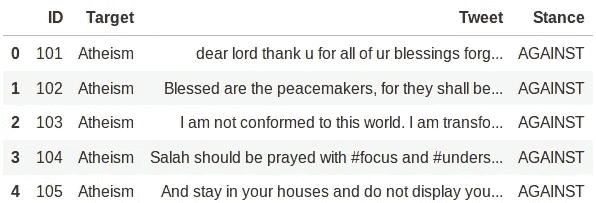****

****Training data stored in a Pandas DataFrame****

****ULMFiT 只需要姿态和文本数据(即 Tweets)用于语言模型微调和分类步骤，因此我们将它们存储在相关的数据帧中，并将干净的数据写出到一个`csv`文件中..****

```
**train = pd.concat([train_orig['Stance'], train_orig['Tweet']], axis=1)
# Write train to csv
train.to_csv(path/'train.csv', index=False, header=False))**
```

****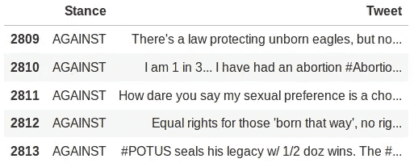****

****Clean training data ready to be loaded into ULMFiT****

## ****ULMFiT 中的语言模型微调****

****这是训练的第一阶段，我们使用预训练的语言模型权重(Wikitext 103)，并用提供的 2，914 条推文的训练数据对其进行微调。****

****公布的 Jupyter notebook([ulmfit . ipynb](https://github.com/prrao87/tweet-stance-prediction/blob/master/ulmfit.ipynb))详细描述了使用 ulm fit 时由`fastai`在幕后执行的预处理。读者可以在 Jupyter 的笔记本上找到更多的代码和 API 细节。****

****在我们的例子中，我们为我们的语言模型微调步骤指定了最小词频 1，这告诉 ULMFiT 只对 Tweets 中使用唯一标记出现多次的单词进行标记化——在标记化期间，所有出现一次的单词都被赋予标签`<unk>`。对于如何和为什么以这种方式完成标记化的非常详细的历史描述，这个 fastai 课程文档页面包含了一些非常有用的信息。****

```
**data_lm = TextLMDataBunch.from_csv(path, 'train.csv', min_freq=1)**
```

****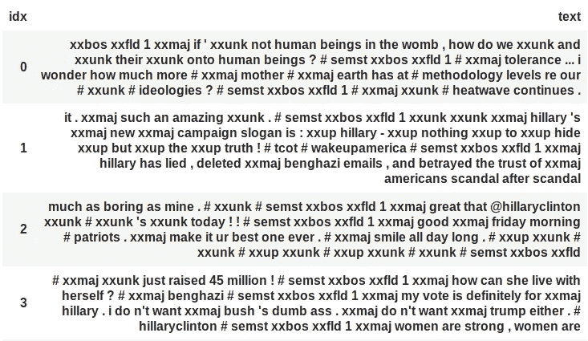****

****Tokenized and tagged Tweets using ULMFiT + spaCy****

****在查看标记化的推文时，我们可以看到它们看起来与原始形式明显不同。`fastai.text`使用的标记化技术相当先进，是杰瑞米·霍华德和 `[fastai](https://github.com/cedrickchee/knowledge/blob/master/courses/fast.ai/deep-learning-part-2/2018-edition/lesson-10-transfer-learning-nlp.md)` [团队](https://github.com/cedrickchee/knowledge/blob/master/courses/fast.ai/deep-learning-part-2/2018-edition/lesson-10-transfer-learning-nlp.md)经过[个月的开发获得的，因此使用了相当多的技巧从文本中捕捉语义。](https://github.com/cedrickchee/knowledge/blob/master/courses/fast.ai/deep-learning-part-2/2018-edition/lesson-10-transfer-learning-nlp.md)****

****注意，我们**而不是**将文本转换为小写并删除停用词(这是 NLP 中常见的预标记化方法，直到最近)，这将导致*大量*信息的丢失，而模型可以使用这些信息来收集对新任务词汇的理解。相反，如上所示，许多添加的标签被应用于每个单词，以便丢失最少的信息。所有标点符号、标签和特殊字符也会被保留。****

****比如`xxmaj`记号[【来源】](https://github.com/fastai/fastai/blob/1c5c007e10a187f4a048a3ee8137016534259768/fastai/text/transform.py#L71)表示单词有大写。“The”将被标记为“`xxmaj the`”。全大写的单词，如“我在喊”，被标记为“`xxup i xxup am xxup shouting`”。该方法仍然使用 [*spaCy* 的底层标记器](https://spacy.io/usage/spacy-101#annotations-token)(包括一个围绕 spaCy 的多线程包装器来加速)，但以一种非常智能的方式添加标签。这平衡了捕获语义含义和减少整体标记的数量——因此它既强大又高效。有关 ULMFiT 的`fastai`实现生成的所有令牌标签的完整列表，请参见这里的[源代码](https://github.com/fastai/fastai/blob/4cd2e454a735e208c60b2ff7f82bbb4b62e85725/fastai/text/transform.py#L19)。****

******找到最佳学习速率:**我们定义了一个学习者对象，该学习者对象使用了标记化的语言模型数据，这些数据被组织成用于 GPU 的批处理，并为其提供一个预训练的语言模型，如下所示。`fastai.train` [【来源](https://github.com/fastai/fastai/blob/050080be574cb1260462bbd03e9600e43e7a54b1/fastai/train.py#L23)】提供了一个方便的实用程序来搜索一系列学习率，以找到最适合我们数据集的学习率。这个想法是，我们的优化函数需要使用一个学习率，该学习率至少比损失开始发散的点低一个数量级。****

```
**learn = language_model_learner(data_lm, pretrained_model=URLs.WT103_1,
        drop_mult=0.1)learn.lr_find(start_lr=1e-8, end_lr=1e2)
learn.recorder.plot()**
```

****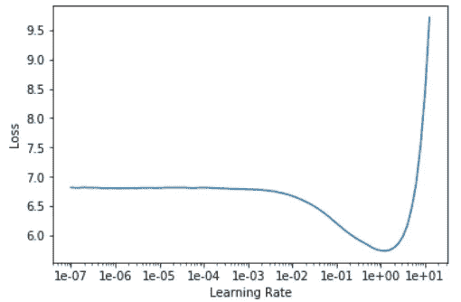****

****Result of the “learning rate finder” (lr_find) as implemented in fastai.train****

****根据 ULMFiT 论文应用区别性微调，我们运行语言模型微调步骤，直到确认损失下降到低值(接近 0.3)。****

```
**learn = language_model_learner(data_lm, pretrained_model=URLs.WT103_1, 
                               drop_mult=0.5)
# Run one epoch with lower layers 
learn.fit_one_cycle(cyc_len=1, max_lr=1e-3, moms=(0.8, 0.7))# Run for many epochs with all layers unfrozen
learn.unfreeze()
learn.fit_one_cycle(cyc_len=20, max_lr=1e-3, moms=(0.8, 0.7))**
```

****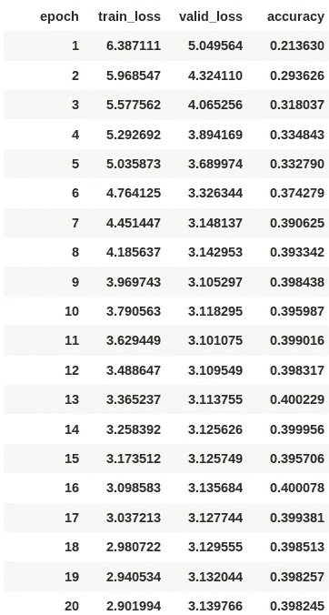****

****然后，该微调的编码器层的权重被保存以在分类阶段使用。****

```
**# Save the fine-tuned encoder
learn.save_encoder('ft_enc')**
```

## ****微调分类器****

****这一步包括创建一个分类器对象[ [source](https://github.com/fastai/fastai/blob/4cd2e454a735e208c60b2ff7f82bbb4b62e85725/fastai/text/learner.py#L146) ]，一旦我们将模型重新训练为分类器，它就可以预测一个类标签。此任务仍使用相同的网络结构-输出图层的定义方式考虑了我们希望在数据中预测的类的数量。****

******找到分类器的最佳学习速率**:和之前一样，像之前一样运行`lr_find`方法来找到分类器的最佳学习速率。****

```
**# Classifier databunch
data_clas = TextClasDataBunch.from_csv(path, 'train_topic.csv',
            vocab=data_lm.train_ds.vocab, min_freq=1, bs=32)# Classifier learner 
learn = text_classifier_learner(data_clas, drop_mult=0.5)
learn.load_encoder('ft_enc')
learn.freeze()learn.lr_find(start_lr=1e-8, end_lr=1e2)
learn.recorder.plot()**
```

********

****Result of the “learning rate finder” (lr_find) as implemented in fastai.train****

******精心训练分类器**:在分类过程中，我们首先定义一个分类器学习器对象，按照 ULMFiT 论文的建议*每次运行一个历元，逐步*解冻层。这有助于我们获得比一次训练所有层更好的分类精度。****

```
**learn = text_classifier_learner(data_clas, drop_mult=0.5)
learn.load_encoder('ft_enc')
learn.freeze()learn.fit_one_cycle(cyc_len=1, max_lr=1e-3, moms=(0.8, 0.7))**
```

****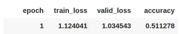****

```
**learn.freeze_to(-2)
learn.fit_one_cycle(1, slice(1e-4,1e-2), moms=(0.8,0.7))**
```

****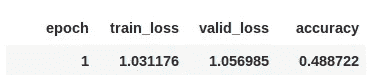****

```
**learn.freeze_to(-3)
learn.fit_one_cycle(1, slice(1e-5,5e-3), moms=(0.8,0.7))**
```

****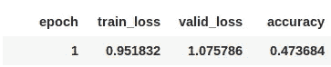****

```
**learn.unfreeze()
learn.fit_one_cycle(4, slice(1e-5,1e-3), moms=(0.8,0.7))**
```

****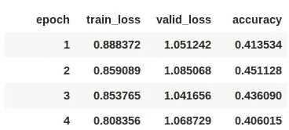****

****分类器的确认损失比语言模型高得多，语言模型可能与数据集相关联。因为存在显著的类别不平衡，所以在训练期间大量的标签预计会被错误地预测。具体到这个 Twitter 数据集，这个问题可能比我们在最先进的例子(如 IMDb)中看到的更严重。****

## ****使用分类器预测姿态****

****我们读入测试集，并将其存储在 Pandas 数据帧中，如图所示。****

```
**test = pd.read_csv(path/testfile, delimiter='\t', header=0,
       encoding="latin-1")
test = test.drop(['ID'], axis=1)**
```

****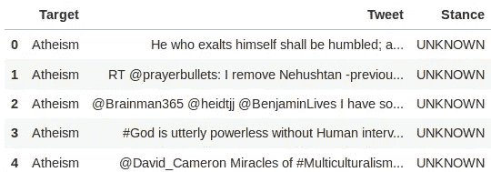****

****然后，我们可以应用我们的分类器学习者的`predict`方法来预测姿态。****

```
**test_pred['Stance'] = test_pred['Tweet'].apply(lambda row: str(learn.predict(row)[0]))# Output to a text file for comparison with the gold reference
test_pred.to_csv(path/'eval'/'predicted.txt', sep='\t', index=True,
                 header=['Target', 'Tweet', 'Stance'], index_label='ID')**
```

****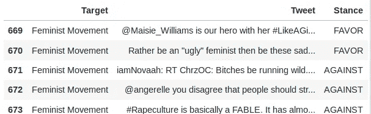****

## ****评估我们来自 ULMFiT 的预测****

****由任务创建者提供的`perl`脚本[在输出和黄金参考文件(也由创建者提供)上运行，以产生一个**宏 F 值**，然后我们可以将它与 MITRE 的基准结果进行比较。](http://alt.qcri.org/semeval2016/task6/data/uploads/eval_semeval16_task6_v2.zip)****

```
**cd eval/
perl eval.pl gold.txt predicted.txt**
```

****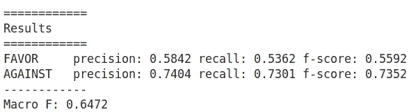****

****Best obtained result using ULMFiT****

## ****使用 ULMFiT 的最佳模型参数****

****使用 ULMFiT 在所有主题中获得的最佳**平均宏观 F 值为 0.65** ，使用以下方法和参数获得:****

*   ****在*扩充的* Twitter 词汇上微调语言模型:这是通过从 Kaggle 下载[Twitter sensing 140 数据集，并将其词汇的子集(200，000 个单词)提供给语言模型微调步骤来完成的。这个步骤在 Jupyter](https://www.kaggle.com/kazanova/sentiment140) [笔记本](https://github.com/prrao87/tweet-stance-prediction/blob/master/ulmfit.ipynb) `[ulmfit.ipynb](https://github.com/prrao87/tweet-stance-prediction/blob/master/ulmfit.ipynb)`中有详细说明。完整的 Kaggle Twitter 数据集有 160 万条推文，这可能需要几个小时来微调语言模型(即使是在英伟达 P100 GPU 上)——所以只有 20 万个单词的子集被用于增强语言模型微调步骤。****
*   ****训练 5 个*不同的*分类器(即在分类过程中为每个主题执行单独的训练任务)，然后将输出结果与黄金参考进行比较——这是一种类似于 MITRE 在 2016 年的最佳结果中使用的技术，并在他们的论文中[进行了解释。](https://arxiv.org/pdf/1606.03784.pdf)****
*   ****语言模型微调步骤的最佳学习速率`1e-03`****
*   ****分类器在`1e-05`到`1e-03`范围内的最佳学习速率，逐渐解冻****

# ****方法二:开放 GPT****

****OpenAI GPT，正如[在他们的论文](https://s3-us-west-2.amazonaws.com/openai-assets/research-covers/language-unsupervised/language_understanding_paper.pdf)中所描述的，是对谷歌大脑 2017 年论文《注意力是你所需要的全部》中著名变形金刚的改编。****

****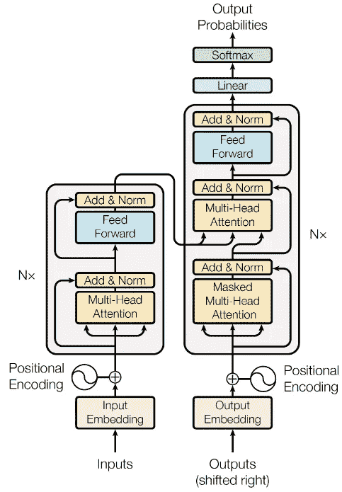****

****Image credit: Google Brain’s [“Attention is All You Need” paper](https://arxiv.org/pdf/1706.03762.pdf)****

****谷歌大脑的原始版本使用了相同的编码器-解码器 6 层堆栈，而 GPT 使用的是 12 层解码器专用堆栈。每层有两个子层，由多头自注意机制和全连接(位置式)前馈网络组成。OpenAI 用于迁移学习的 transformer 架构的完整描述在他们的论文中给出。****

****这一节的所有代码都可以在 Jupyter 笔记本[【transformer . ipynb】](https://github.com/prrao87/tweet-stance-prediction/blob/master/transformer.ipynb)中找到。和以前一样，为了简洁起见，在这篇文章中只讨论了模型的关键元素——请随意浏览完整的笔记本和这个项目的[主 GitHub repo](https://github.com/prrao87/tweet-stance-prediction) 以深入了解分类推文的工作代码。****

## ****培训步骤****

****以下步骤用于训练 OpenAI 变压器:****

1.  ******无监督的预训练**:transformer 语言模型以无监督的方式在谷歌图书语料库的几千本图书上进行训练，预训练的权重在 OpenAI GitHub repo 上公开[以供他人使用。](https://github.com/openai/finetune-transformer-lm/tree/master/model)****
2.  ******监督微调**:我们可以根据监督的目标任务调整参数。输入通过预先训练的模型传递，以获得最终变压器块的激活。****

****第一步(无监督的预训练)是*非常*昂贵的，由 OpenAI(他在 8 个 GPU 上训练了一个月的模型！)—幸运的是，我们可以使用下载的预训练模型权重，并直接进行监督微调步骤。****

## ****开放 GPT 的 PyTorch 实现****

******注意**:虽然最初的 OpenAI transformer 是在 tensor flow[[GitHub source](https://github.com/openai/finetune-transformer-lm)]中实现的，但是为了这个项目，我们使用了[open ai GPT](https://github.com/huggingface/pytorch-openai-transformer-lm)的 PyTorch 端口，这要感谢 [HuggingFace](https://github.com/huggingface) 的人们所做的惊人工作。这是为了让我们能够与 ULMFiT 的`fastai`实现(也是基于 PyTorch 的)进行更一致的比较，更不用说使用单一框架维护和分发代码的便利性了。****

## ****OpenAI GPT 论文中介绍的新技术****

****为了执行领域外的目标任务，GPT 将语言建模作为微调的附加目标，这有助于广义学习，正如[在他们的论文](https://s3-us-west-2.amazonaws.com/openai-assets/research-covers/language-unsupervised/language_understanding_paper.pdf)中所描述的。该辅助语言建模目标由如下所示的加权参数指定。****

****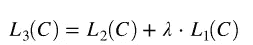****

****其中，L1、L2 和 L3 分别是语言建模目标、特定任务目标和组合目标的可能性。****

****转换器[已经被证明是一个非常强大的语言建模工具](https://arxiv.org/pdf/1706.03762.pdf)，特别是在机器翻译中，这要归功于它的“自我关注机制”。这篇文章非常直观和形象地解释了转换器如何适用于捕获更长范围的语言结构(使用掩蔽的自我注意)[。需要注意的一个关键点是，OpenAI GPT 使用了 12 层的纯解码器结构，有 12 个注意头和一个 **768-** 维度状态。另一个关键点是，每个迷你批次能够采样最多 **512** 个连续令牌，根据 OpenAI 作者的说法，这允许转换器](http://jalammar.github.io/illustrated-transformer/)[实现比基于 LSTM 的方法](https://s3-us-west-2.amazonaws.com/openai-assets/research-covers/language-unsupervised/language_understanding_paper.pdf)更长范围的上下文。****

******特定于任务的输入转换**:****

****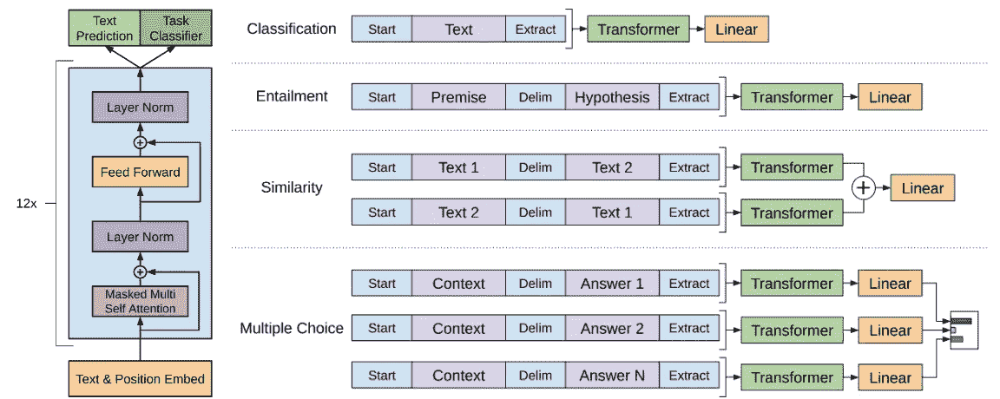****

****OpenAI 将他们的转换器设计成*任务不可知的*，并且能够推广到一系列自然语言任务。为了实现这一点，他们允许自定义“特定任务的头部”的定义，如上图所示。特定于任务的 head 作用于基本 transformer 语言模型之上，并在`model_pytorch.py`中的`DoubleHeadModel`类中定义(参见 GitHub repo )。****

****HuggingFace 最初写的 GPT[py torch port](https://github.com/huggingface/pytorch-openai-transformer-lm)是为了一个选择题分类问题(ROCStories)。对于这个 Tweet stance detection 任务，我们使用 OpenAI 论文中提到的准则为分类任务头编写一个自定义输入转换，这样我们就可以用一个开始符号填充每个文本(在我们的例子中表示每个 Tweet ),并对它们进行令牌化，以便输入到编码器层。这是按如下方式完成的。****

****注意，在上面的分类输入转换函数中，我们需要做的就是为编码器指定开始标记，然后将文本附加到这个开始标记上。对于其他变量，我们保持与原始 PyTorch 代码相同的张量维数。****

## ****为 OpenAI GPT 预处理推文数据****

****训练脚本的数据加载器定义如下。就像 ULMFiT 的情况一样，我们清理数据以删除任何非 ASCII 字符(以避免编码步骤中的问题)。然后，数据存储为 Numpy 数组。****

****为了将数据提供给分类转换，我们使用`scikit-learn`的`train_test_split`实用程序将数据分成训练集、验证集和测试集。****

****使用上面的代码，我们将训练 Tweet ( `trX`)存储在它的数字化姿态(`trY`)旁边。我们将数据作为 Numpy 数组(不是 DataFrame 列)输入到`train_stance.py`的 PyTorch 数据加载器中。下面是输入数据的一个例子，它是按照转换器的要求进行整形的。立场“0”对应“反对”，1 对应“赞成”，2 对应“都不赞成”。就像在 ULMFiT 中一样，原始数据中的任何信息都不会被删除——我们依赖语言模型目标来识别看不见的单词之间的句法关系(一旦模型进行了微调)。****

```
**Plenty of stem cells without baby smashing, by the way. #SemST 0Is there a breeze i can catch Lakefront or will I die of a heat stroke there as well? #heatstroke #SemST 1Road to #Paris2015 "#ADP2015 co-chairs' new tool will be presented on July 24th" @manupulgarvidal at @UN_PGA event on #SemST 2Are the same people who are red faced and frothing over abortion also against the death penalty? Just wondering... #deathpenalty #SemST 1DID YOU KNOW: The 2nd Amendment is in place 'cause politicians ignore the #CONSTITUTION. #PJNET #SOT #tcot #bcot #ccot #2ndAmendment #SemST 0I Appreciate almighty God for waking me up diz beautiful day + giving me brilliant ideas to grow my #Hustle #SemST 0Speaking from the heart is rarely wise especially if you have a retarded heart like most feminists.   #GamerGate #SemST 0@Shy_Buffy welcome little sister! Love you! #SemST 2@GregAbbott_TX which god? Yours? not mine. oh wait i don't have one. #LoveWins #SemST 1**
```

## ****微调语言模型和分类器****

****在 OpenAI GPT 中，语言模型和分类器微调都是同时进行的，这要归功于它使用多头注意力的并行化架构。这使得运行训练循环非常容易，因此许多实验是可能的。****

****下面的命令用于运行 3 个时期的训练循环，这是我们所有实验中使用的。请参阅 Jupyter 笔记本( [transformer.ipynb](https://github.com/prrao87/tweet-stance-prediction/blob/master/transformer.ipynb) )和文件`[train_stance.py](https://github.com/prrao87/tweet-stance-prediction/blob/master/transformer-openai/train_stance.py)`了解关于默认参数和各种实验运行的更多详细信息。****

```
**python3 train_stance.py --dataset stance --desc stance --submit --data_dir ../data --submission_dir default --n_iter 3**
```

****训练脚本的输出被提供给另一个脚本`parse_output.py`，它以一种可以被`perl`脚本评估为由任务创建者提供的[的方式形成输出。](http://alt.qcri.org/semeval2016/task6/data/uploads/eval_semeval16_task6_v2.zip)****

## ****评估我们的 GPT 模型的预测****

****评估`perl`脚本在输出和黄金参考文件(也由创建者提供)上运行，以生成一个**宏 F 值**，然后我们可以将它与 MITRE 的基准测试结果进行比较。****

```
**cd eval/
perl eval.pl gold.txt predicted.txt**
```

****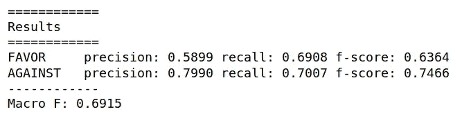****

****Best obtained result using the OpenAI Transformer****

## ****使用 OpenAI GPT 的最佳模型参数****

****从 GPT 获得的所有主题的最佳**宏观 F 值 0.69** 是使用以下方法和参数获得的:****

*   ****微调语言模型只是提供了训练推文(其中 2914 条)。transformer 模型能够在 3 个时期内快速推广到 Tweet 数据，并且能够获得良好的宏观 F 值，而无需以任何方式增加输入数据。****
*   ****一次为所有主题训练*一个* *单个*分类器(即，在整个训练数据集上运行训练循环)——人们注意到，当试图仅在单个主题(其具有< 500 个训练样本)上训练转换器时，存在显著的过度拟合，其中验证准确度下降到远低于 70%。这可能是因为转换器具有高维嵌入层(768 维),需要足够的训练数据量来避免过度拟合。****
*   ****根据 OpenAI 论文，语言建模加权函数(lambda)为 0.5。****
*   ****所有层(包括分类层)的漏失为 0.1，再次按照 OpenAI 论文。****

****总的来说，微调 dropout、语言建模目标的权重和更改一些其他默认参数(如随机种子)对提高宏观 F 分数没有什么帮助。一般来说，transformer 很快就能产生好的结果，并且只需要对任务头输入转换进行一些基本的定制。****

# ****结果分析****

****在这一节中，我们将通过我们的两种方法:乌尔菲特和 GPT 获得的 F 分数与 MITRE 的基准结果进行比较。****

## ****总体 F 分数****

****当我们同时考虑所有五个主题的宏观 F 值时，OpenAI GPT 显示出产生了最好的结果。****

****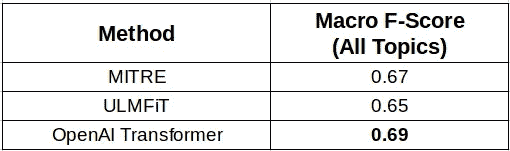****

****Best results compared with the benchmark from MITRE****

****这个结果值得注意的是，ULMFiT 和 OpenAI GPT 都利用了在非常不同的发行版(分别是维基百科和谷歌图书)上训练的预训练语言模型，而 MITRE 使用了在大规模 Twitter 数据集上预训练的嵌入(类似发行版)。****

****很明显，在预训练和微调期间利用语言模型作为训练信号有其优势。尽管推文在语法上要非正式得多，序列长度也比书籍语料库中的平均句子短，但在这两种情况下，预先训练的模型都能够根据对目标数据的一些语法理解进行归纳和预测。****

## ****主题方面的 F 分数****

****下图比较了我们两种方法与 MITRE 方法的 F 值(支持)和 F 值(反对),这次是基于每个主题。查看这些结果，可以再次清楚地看到，OpenAI GPT 在大多数主题上明显优于 ULMFiT，这解释了为什么总体 F 分数较高。****

****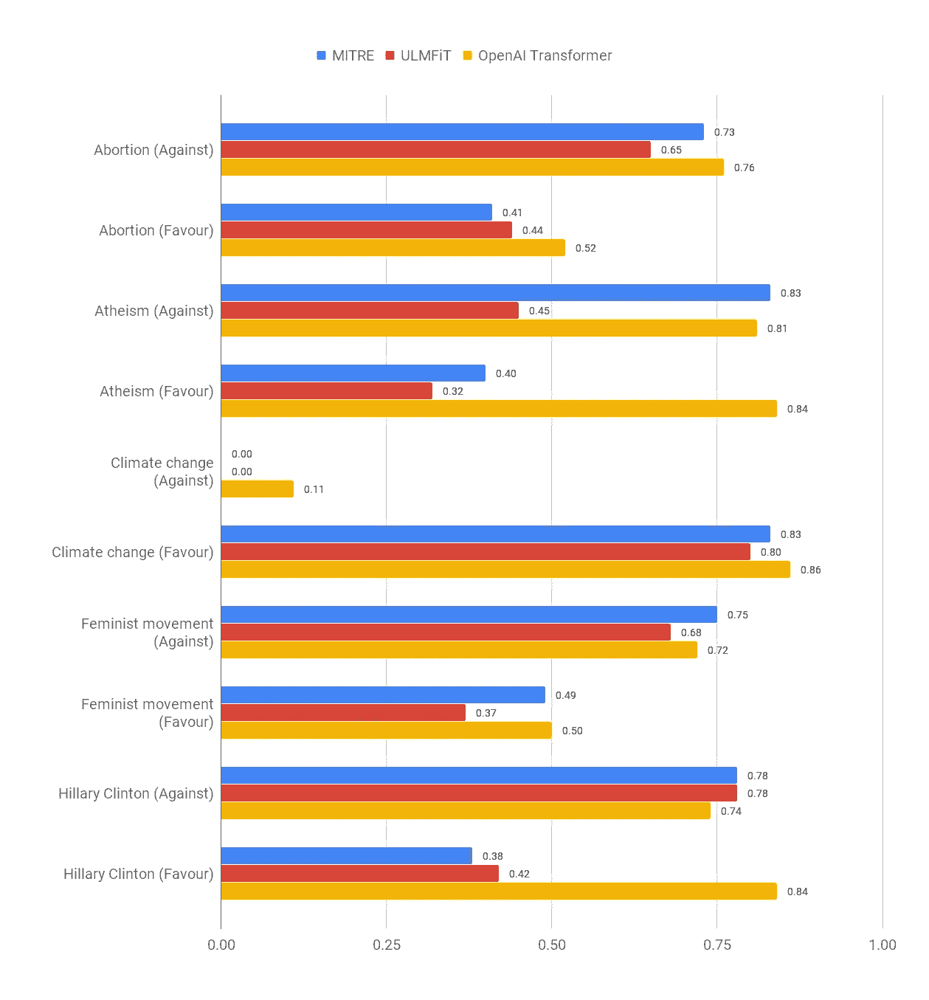****

****Comparison of topic-wise F-scores from ULMFiT and the OpenAI transformer vs. MITRE’s****

****transformer 在所有主题上都做得很好，不管它是预测“赞成”还是“反对”类。****

****一个非常有趣的观察是，乌尔菲特和米特都对“气候变化是一个问题(反对)”做出了零*零*的预测，而 GPT 却能够对这种情况做出一些正确的预测。进一步检查训练数据(如本文前面所示)，这是同一个班级，我们有*很少*个训练样本(只有 **15 个**)。).值得注意的是，在如此少的训练示例下，transformer 能够获得一些上下文，并且仍然将一些预测分配给该类。从它在许多其他差异很大的类中的良好表现来看，这不像是侥幸！****

## ****交叉列表结果:我们的与黄金参考****

****我们统计两个模型在每个类别中做出的总预测，并将其与任务创建者提供的黄金参考集(即“绝对真理”)[中的标签进行交叉制表。](http://alt.qcri.org/semeval2016/task6/index.php?id=data-and-tools)****

****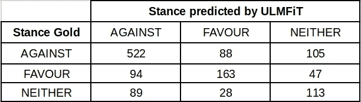********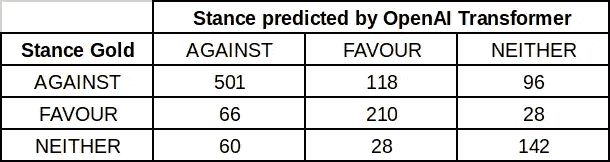****

****在这些表中，沿主对角线的元素表示正确预测的标签，非对角线元素表示分类器误入歧途的位置。很明显，这两种方法都相当好地预测了大多数类别，ULMFiT 在“反对”类别中做出了更全面的正确预测，而 transformer 在“支持”和“都不支持”类别中做出了更正确的预测。****

****我们可以看看训练数据分布，看看是否可以得出额外的推论。在训练数据中，属于“反对”类的推文要多得多(下图)。即使每个主题只有很少的训练样本，transformer 似乎也能够在少数类中实现更广泛的整体上下文。****

****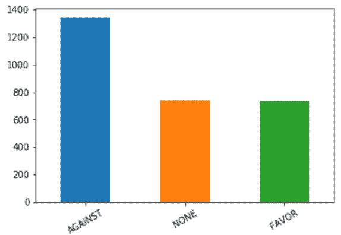****

****Distribution of classes (overall) from original training data****

## ****词汇扩充的效果****

****当我们仅在原始训练集(2914 条推文)上微调语言模型时，ULMFiT 产生了相对较差的总体平均 F 分数(低于 **0.55** )。*只有*当我们用来自[ka ggle sensition 140 数据集](https://www.kaggle.com/kazanova/sentiment140)的 200，000 条推文扩充语言模型时，ULMFiT 才产生了与 MITRE 基准测试结果相当的总体 F 值。ULMFiT 中 bi-lstm 的语言模型微调似乎需要比 transformer 更多的数据来概括*。*****

****我们的 GPT 模型在微调阶段不需要扩充词汇。事实上，它甚至能够在少数类中实现良好的推广，这似乎表明它在有限的训练样本中实现了对 Twitter 语法的更好的总体理解。所有这些看起来非常有趣，值得在更多样化的数据集上进一步研究。****

## ****序列长度的影响****

****众所周知，ULMFiT [在各种文本分类基准数据集(如 IMDb 和 AG News](https://github.com/sebastianruder/NLP-progress/blob/master/english/text_classification.md) )上产生了一流的准确度。所有这些基准数据集的共同主题是，它们具有真正*长*的序列长度(一些评论/新闻文章长达数百字)，因此很明显，ULMFiT 使用的语言模型对长序列进行了很好的微调。另一方面，推文有 140 个字符的硬性限制，与电影评论或新闻文章的完整句子相比，这是相当小的序列。****

****正如在 [ULMFiT 论文](https://arxiv.org/pdf/1801.06146.pdf)中所描述的，当一个文档包含数百或数千个单词时，分类器使用“级联池”来帮助识别长序列中的上下文。为了避免在真正长的序列的情况下丢失信息，最后一个时间步的隐藏状态与隐藏状态的最大池和平均池表示相连接，如下所示。****

****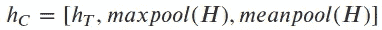****

****Concatenated pooling: H is the vector of all hidden states****

****在这项研究中，这两种方法的模型架构都没有改变，但是，使用两种(最大值或平均值)表示中的一种来改变隐藏状态的表示可能有助于 ULMFiT 更好地推广到更小的序列，如 Tweets 的这种情况。****

****原始形式的 GPT(带有分类任务头)似乎没有推广到推特语法的问题，即使它是在也可能有长序列的书籍语料库上预先训练的。可能是变压器的自我注意机制和高维自我注意层能够适应变化的序列长度，同时学习 Tweet 语法的方面比隐藏层中具有 concat pooling 的 LSTMs 更好。这些是深刻的概念，可以更详细地研究。****

## ****语言模型调整的效果****

****在 ULMFiT 中，语言模型微调是训练分类器之前的必要步骤。在语言模型微调步骤中包含一个扩充的 Tweet 词汇表似乎可以让模型更好地理解 Tweet 语法，这似乎可以提高它的性能。在微调过程中，改变学习率、动力和辍学确实对 F 分数有微小但可忽略的总体影响。****

****在 OpenAI GPT 中，语言模型与使用加权参数的分类器同时被微调，通过按照下面的等式指定的辅助语言模型目标。****

********

****在 transformer 的情况下，当语言模型微调目标关闭(即`lambda=0`)时，平均宏观 F 值明显变得**更差**(低于 0.6)。因此，我们可以推断，预训练模型的权重本身不足以捕捉推特的语法，语言模型的微调确实有助于我们的模型更好地推广到推特数据。在我们的实验中，将`lambda`增加到非常高的值(5)或非常低的值(0.1)也没有提高 F 分数，所以我们的 Twitter 数据可能有一些特定的东西使`lambda`值 0.5 成为最佳值。有趣的是，当应用于完全不同的数据集时，LM 系数的其他值(`lambda`)是否有利。****

## ****训练数据大小的影响****

****ULMFiT 能够在*每个*单个主题上产生良好的分类性能(为此我们只有不到 500 个样本进行训练)。事实上，我们使用 ULMFiT 的最佳结果是通过在每个主题的基础上训练*五个不同的* *分类器*获得的(尽管有一些数据扩充)。这是有意义的，因为 ULMFiT 已经被证明在非常有限的训练样本上产生了[优秀的迁移学习性能](http://nlp.fast.ai/classification/2018/05/15/introducting-ulmfit.html)(少至 100！).因此，在我们有非常少量的标记训练样本的情况下，ULMFiT 将是尝试迁移学习的一个好选择，至少对于分类任务来说是这样。****

****另一方面，transformer 需要至少几千个训练样本才能很好地进行归纳，避免过度拟合。OpenAI 论文显示了从**5000**到**550000**训练样本的一系列任务的良好结果。变压器在自注意头中有 786 维，在前馈网络中有 3072 维内部状态；因此，当我们的训练样本少于 1，000 个时，具有高维数的模型似乎会记住训练数据，并大量过度拟合数据(验证准确率降至 70%以下)。****

## ****预训练语言模型和架构的效果****

****两种语言模型都在不同的文本语料库(Wikitext 103 和 Google Books)上进行了预训练。此外，ULMFiT 使用 3 层双 LSTM 架构，而 OpenAI 使用变压器网络。Yoav Goldberg 关于这个话题的推文提供了一些思考。****

****根据我们的 Tweet 立场分类结果，当从相对少量的训练样本中学习有限上下文的特定情况语法时，transformer 似乎有好处——这可能更多地与 transformer 架构有关，而不是使用预训练的语言模型。然而，在两种架构上都有更一致的语言模型之前，很难说哪一种对结果的影响更大。****

# ****结论****

****在这个项目中，我们研究了两种强大的迁移学习方法(ULMFiT 和 OpenAI GPT)中使用的技术，用于一个来自不同分布的新任务(Tweets 的姿态检测)。我们为两个独立的基于 PyTorch 的框架开发了一个训练和分类管道，并将姿态评估的宏观 F 分数与 2016 年 MITRE 的最佳结果进行了比较。****

****这两种方法都实现了良好的性能和良好的通用性，只需对模型进行最少的定制，并且可以在合理的时间内进行微调(在单个特斯拉 P100 GPU 上，这两种方法总共需要大约一个小时)。这两种方法都被证明可以使迁移学习变得非常容易，并且可以用相对较小的学习曲线和相对较少的额外代码行来实现。****

****虽然在这种情况下，我们能够使用 OpenAI GPT 在几乎所有主题上获得更好的 F 分数，但这并不意味着基于 transformer 的模型对于这种分类任务来说总是更好的工具。这在很大程度上取决于数据的性质和所使用的语言模型，以及模型架构。 ***可以有许多更好的方法来微调模型*** 进行分类，更好的超参数选择(或模型定制)可以帮助进一步改善结果——只是不可能在这个项目中尝试所有的方法。****

****看起来，GPT transformer 的任务不可知和高度并行化的架构使其能够在针对该 Tweet stance 任务的 2-3 个训练周期内轻松实现快速泛化；然而，GPT 容易过度拟合，尤其是当我们的训练样本少于 1000 个时。ULMFiT 在使用非常小的数据集(少于 500 个训练样本)实现良好性能方面肯定要好得多；然而，它似乎需要在语言模型微调阶段增加训练数据的词汇(考虑到这个特定的 Tweet 分类任务包含与预训练语言模型*非常*不同的数据)。****

****总的来说，在 NLP 中研究深度学习是一个非常令人兴奋的时刻，像这样强大的迁移学习技术的出现将有望在不久的将来为更广泛的实践者群体打开深度学习的应用！****

******2019 年 3 月 24 日编辑**:自从 2019 年 2 月 OpenAI 发布 [GPT-2](https://openai.com/blog/better-language-models/) 后，区分各种版本的变形金刚模型变得更加重要，所以之前提到的“OpenAI 变形金刚”现在更新为“GPT”，这是他们 2018 年论文中的变形金刚模型。****

## ****承认****

****这项工作是作为最终课程项目的一部分完成的，在这个项目中，我的同事[安德鲁](https://www.linkedin.com/in/andrew-wesson-7079728b/)和[阿布舍克](https://www.linkedin.com/in/abhisheksunnak/)为想法的产生以及数据清理和实验代码做出了重大贡献。他们(包括我自己)欢迎任何反馈/评论。****

****另外，如果你喜欢这篇文章，请在 LinkedIn 和 Twitter 上联系我！****

## ******关于所用硬件的说明******

****GitHub repo 中显示的所有笔记本和代码都是在一台配备了 NVIDIA GPU 的机器上运行的，整个培训过程大约需要 1 个小时(针对 ULMFiT ),在 P100 GPU 上不到一个小时(针对 transformer)——在一台纯 CPU 机器上运行相同的代码可能需要更长的时间！****