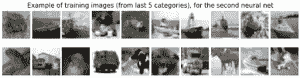
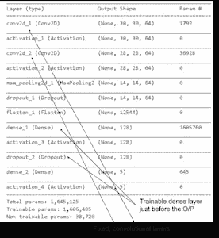
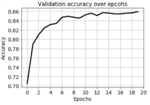
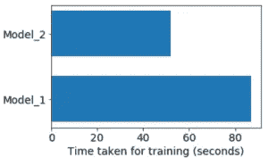

# 迁移学习变得容易:编码一种强大的技术— Exxact

> 原文：<https://towardsdatascience.com/transfer-learning-made-easy-coding-a-powerful-technique-exxact-f0f92baf4fb2?source=collection_archive---------36----------------------->

**图**:仅由第一个神经网络看到的前 5 类图像。

但我们实际上感兴趣的是为最后 5 类图像建立一个神经网络——**狗、青蛙、马、羊、**或**卡车**。



**图**:最后 5 类图像，仅由第二神经网络看到。

接下来，我们定义两组/两种类型的层:特征(卷积)和分类(密集)。

同样，不要担心这些代码片段的实现细节。你可以从 Keras 包的任何标准教程中了解细节。想法是理解概念。

要素图层:

```
feature_layers = [ Conv2D(filters, kernel_size, padding='valid', input_shape=input_shape), Activation('relu'), Conv2D(filters, kernel_size), Activation('relu'), MaxPooling2D(pool_size=pool_size), Dropout(0.25), Flatten(), ]
```

密集分类层:

```
classification_layers = [ Dense(128), Activation('relu'), Dropout(0.25), Dense(num_classes), Activation('softmax') ]
```

接下来，我们通过将**特征 _ 层**和**分类 _ 层**堆叠在一起来创建完整的模型。

```
model_1 = Sequential(feature_layers + classification_layers)
```

然后，我们定义一个用于训练模型的函数(未示出),并且只训练模型一定数量的时期，以达到足够好的性能:

```
train_model(model_1, (x_train_lt5, y_train_lt5), (x_test_lt5, y_test_lt5), num_classes)
```

我们可以展示网络的准确性是如何随着训练时期而发展的:


**图**:训练第一个网络时，验证各代的集合精度。

接下来，我们**冻结特征层并重建模型**。

这种特征层的冻结是迁移学习的核心。这允许重新使用预训练的模型进行分类任务，因为用户可以在预训练的要素图层之上堆叠新的全连接图层，并获得良好的性能。

我们将创建一个名为 **model_2** 的全新模型，其中**不可训练** **特征 _ 图层**和**可训练**如下图所示:**分类 _ 图层**。

```
for l in feature_layers: l.trainable = False model_2 = Sequential(feature_layers + classification_layers)
```



**图**:第二网络的模型概要，显示了固定的和可训练的权重。固定权重直接从第一网络传输。

现在，我们训练第二个模型，观察**它如何花费更少的总时间，仍然获得相同或更高的性能**。

```
train_model(model_2, (x_train_gte5, y_train_gte5),(x_test_gte5, y_test_gte5), num_classes)
```

第二个模型的准确性甚至高于第一个模型，尽管情况可能并非总是如此，并且取决于模型架构和数据集。



**图**:在训练第二网络时，验证各时期的集合精度。

训练两个模型所需的时间如下所示:



**图**:两个网络的训练时间。

# 我们取得了什么成就？

**model_2** 不仅比 **model_1** 训练得更快，它还以更高的基线精度开始，并在相同的时期数和相同的超参数(学习率、优化器、批量等)下实现了更好的最终精度。).并且在 **model_1** 没有看到的图像上实现了这种训练。

这意味着，尽管 **model_1** 是在**飞机、汽车、鸟、猫、**或**鹿**的图像上训练的，但它学习到的权重在转移到 **model_2** 时，帮助 **model_2** 在完全不同类别的图像上实现了出色的分类性能——狗、青蛙、马、羊、或**卡车**。

是不是很神奇？你现在可以用这么少的代码来构建这种迁移学习。同样，整个代码是开源的，在这里可以找到[](https://github.com/tirthajyoti/Deep-learning-with-Python/blob/master/Notebooks/Transfer_learning_CIFAR.ipynb)**。**

***原载于 2019 年 10 月 23 日*[*https://blog.exxactcorp.com*](https://blog.exxactcorp.com/transfer-learning-made-easy/)*。***