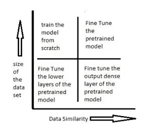
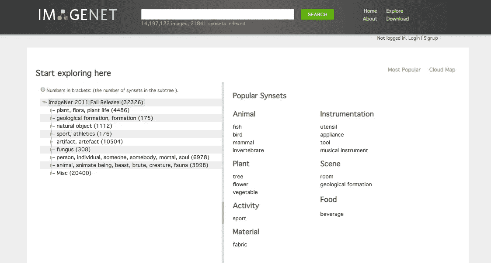
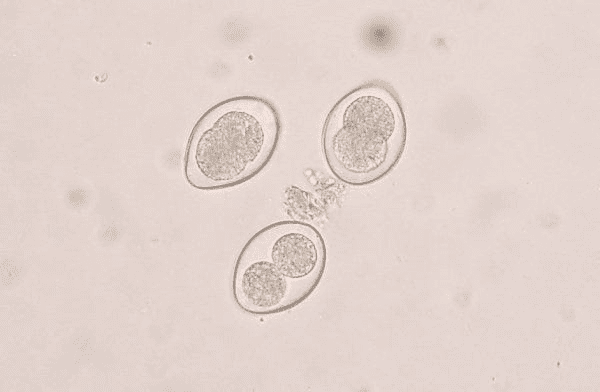

# 迁移学习:当你可以微调时为什么要训练？

> 原文：<https://towardsdatascience.com/transfer-learning-picking-the-right-pre-trained-model-for-your-problem-bac69b488d16?source=collection_archive---------5----------------------->

## PyTorch 迁移学习概述

在本帖中，我们将简要了解什么是迁移学习，以及如何最好地利用它提供的巨大潜力。让我们先从第一个问题开始。

# 什么是迁移学习？

迁移学习是使用预先训练好的模型来解决深度学习问题的艺术。预训练模型只不过是别人根据一些数据建立和训练的深度学习模型，以解决一些问题。

迁移学习是一种机器学习技术，在这种技术中，您使用预先训练的神经网络来解决与网络最初被训练来解决的问题类似的问题。例如，你可以重新利用为识别狗的品种而建立的深度学习模型来对狗和猫进行分类，而不是建立自己的模型。这可以省去你寻找有效的神经网络结构的痛苦、你花在训练上的时间、建立大量训练数据的麻烦，并保证良好的结果。你可以花很长时间想出一个 50 层的 CNN 来完美地区分你的猫和你的狗，或者你可以简单地重新利用在线提供的许多预先训练好的图像分类模型中的一个。现在，让我们看看这种重新定位到底包括什么。

## 使用预训练模型的三种不同方式

主要有三种不同的方式可以重新调整预训练模型。他们是，

1.  特征提取。
2.  复制预训练网络的架构。
3.  冻结一些层，训练其他层。

**特征提取**:我们在这里需要做的就是改变输出层，给出猫和狗的概率(或者你的模型试图分类的类别数量)，而不是最初训练的数千个类别。当我们尝试训练模型的数据与预训练模型最初训练的数据非常相似，并且我们的数据集很小时，这是理想的使用方法。这种机制被称为固定特征提取。我们仅重新训练我们添加的新输出层，并保留所有其他层的权重。

**复制预训练网络的架构**:在这里，我们定义一个与预训练模型具有相同架构的模型，该模型在执行与我们试图实现的任务相似的任务时表现出优异的结果，并从头开始训练它。我们丢弃预训练模型中每一层的权重，并根据我们的数据重新训练整个模型。当我们有大量数据要训练，但它与预训练模型训练的数据不太相似时，我们会采用这种方法。

**冻结一些层，训练其他层**:我们可以选择冻结预训练模型的最初 k 层，只训练最上面的 n-k 层。我们保持初始模型的权重与预训练模型的权重相同且不变，并在我们的数据上重新训练更高层。当我们的数据集很小并且数据相似性也很低时，采用这种方法。较低层关注可以从数据中提取的最基本的信息，因此这可以用于另一个问题，因为基本级别的信息通常是相同的。例如，构成一只狗的图片的相同曲线和边缘可以构成一个微小的癌细胞。

另一种常见的情况是数据相似性很高，数据集也很大。在这种情况下，我们保留模型的架构和模型的初始权重。然后，我们重新训练整个模型，以更新预训练模型的权重，从而更好地适应我们的具体问题。这是使用迁移学习的理想情况。

下图显示了随着数据集的大小和数据相似性的变化，应遵循的方法。



# PyTorch 中的迁移学习

PyTorch 简单来说就是 Numpy 和 Keras 的私生子。即使您不熟悉 PyTorch，理解下面的代码也不会有问题。

PyTorch 中 torchvision.models 模块下有八种不同的预训练模型。它们是:

1.  **Alex net**
2.  ***VGG***
3.  **ResNet**
4.  ***挤压网***
5.  ***丹塞尼***
6.  **盗梦空间 v3**
7.  ***谷歌网***
8.  ***洗牌网 v2***

这些都是为图像分类而构建的卷积神经网络，在 ImageNet 数据集上进行训练。ImageNet 是一个根据 WordNet 层次结构组织的图像数据库，包含 14，197，122 幅图像，分属 21841 个类别。



由于 PyTorch 中所有预训练的模型都是在相同的数据集上为相同的任务训练的，所以我们选择哪一个都没有关系。让我们挑选 ResNet 网络，看看如何在我们前面讨论的不同场景中使用它。

用于图像识别的 ResNet 或深度残差学习在 pytorch、resnet-18、resnet-34、resnet-50、resnet-101 和 resnet-152 上有五个版本。

让我们从火炬视觉下载 ResNet-18。

```
**import** torchvision.models **as** models
model **=** models**.**resnet18(pretrained=True)
```

这是我们刚刚下载的模型的样子。

```
ResNet(
  (conv1): Conv2d(3, 64, kernel_size=(7, 7), stride=(2, 2), padding=(3, 3), bias=False)
  (bn1): BatchNorm2d(64, eps=1e-05, momentum=0.1, affine=True, track_running_stats=True)
  (relu): ReLU(inplace)
  (maxpool): MaxPool2d(kernel_size=3, stride=2, padding=1, dilation=1, ceil_mode=False)
  (layer1): Sequential(
    (0): BasicBlock(
      (conv1): Conv2d(64, 64, kernel_size=(3, 3), stride=(1, 1), padding=(1, 1), bias=False)
      (bn1): BatchNorm2d(64, eps=1e-05, momentum=0.1, affine=True, track_running_stats=True)
      (relu): ReLU(inplace)
      (conv2): Conv2d(64, 64, kernel_size=(3, 3), stride=(1, 1), padding=(1, 1), bias=False)
      (bn2): BatchNorm2d(64, eps=1e-05, momentum=0.1, affine=True, track_running_stats=True)
    )
    (1): BasicBlock(
      (conv1): Conv2d(64, 64, kernel_size=(3, 3), stride=(1, 1), padding=(1, 1), bias=False)
      (bn1): BatchNorm2d(64, eps=1e-05, momentum=0.1, affine=True, track_running_stats=True)
      (relu): ReLU(inplace)
      (conv2): Conv2d(64, 64, kernel_size=(3, 3), stride=(1, 1), padding=(1, 1), bias=False)
      (bn2): BatchNorm2d(64, eps=1e-05, momentum=0.1, affine=True, track_running_stats=True)
    )
  )
  (layer2): Sequential(
    (0): BasicBlock(
      (conv1): Conv2d(64, 128, kernel_size=(3, 3), stride=(2, 2), padding=(1, 1), bias=False)
      (bn1): BatchNorm2d(128, eps=1e-05, momentum=0.1, affine=True, track_running_stats=True)
      (relu): ReLU(inplace)
      (conv2): Conv2d(128, 128, kernel_size=(3, 3), stride=(1, 1), padding=(1, 1), bias=False)
      (bn2): BatchNorm2d(128, eps=1e-05, momentum=0.1, affine=True, track_running_stats=True)
      (downsample): Sequential(
        (0): Conv2d(64, 128, kernel_size=(1, 1), stride=(2, 2), bias=False)
        (1): BatchNorm2d(128, eps=1e-05, momentum=0.1, affine=True, track_running_stats=True)
      )
    )
    (1): BasicBlock(
      (conv1): Conv2d(128, 128, kernel_size=(3, 3), stride=(1, 1), padding=(1, 1), bias=False)
      (bn1): BatchNorm2d(128, eps=1e-05, momentum=0.1, affine=True, track_running_stats=True)
      (relu): ReLU(inplace)
      (conv2): Conv2d(128, 128, kernel_size=(3, 3), stride=(1, 1), padding=(1, 1), bias=False)
      (bn2): BatchNorm2d(128, eps=1e-05, momentum=0.1, affine=True, track_running_stats=True)
    )
  )
  (layer3): Sequential(
    (0): BasicBlock(
      (conv1): Conv2d(128, 256, kernel_size=(3, 3), stride=(2, 2), padding=(1, 1), bias=False)
      (bn1): BatchNorm2d(256, eps=1e-05, momentum=0.1, affine=True, track_running_stats=True)
      (relu): ReLU(inplace)
      (conv2): Conv2d(256, 256, kernel_size=(3, 3), stride=(1, 1), padding=(1, 1), bias=False)
      (bn2): BatchNorm2d(256, eps=1e-05, momentum=0.1, affine=True, track_running_stats=True)
      (downsample): Sequential(
        (0): Conv2d(128, 256, kernel_size=(1, 1), stride=(2, 2), bias=False)
        (1): BatchNorm2d(256, eps=1e-05, momentum=0.1, affine=True, track_running_stats=True)
      )
    )
    (1): BasicBlock(
      (conv1): Conv2d(256, 256, kernel_size=(3, 3), stride=(1, 1), padding=(1, 1), bias=False)
      (bn1): BatchNorm2d(256, eps=1e-05, momentum=0.1, affine=True, track_running_stats=True)
      (relu): ReLU(inplace)
      (conv2): Conv2d(256, 256, kernel_size=(3, 3), stride=(1, 1), padding=(1, 1), bias=False)
      (bn2): BatchNorm2d(256, eps=1e-05, momentum=0.1, affine=True, track_running_stats=True)
    )
  )
  (layer4): Sequential(
    (0): BasicBlock(
      (conv1): Conv2d(256, 512, kernel_size=(3, 3), stride=(2, 2), padding=(1, 1), bias=False)
      (bn1): BatchNorm2d(512, eps=1e-05, momentum=0.1, affine=True, track_running_stats=True)
      (relu): ReLU(inplace)
      (conv2): Conv2d(512, 512, kernel_size=(3, 3), stride=(1, 1), padding=(1, 1), bias=False)
      (bn2): BatchNorm2d(512, eps=1e-05, momentum=0.1, affine=True, track_running_stats=True)
      (downsample): Sequential(
        (0): Conv2d(256, 512, kernel_size=(1, 1), stride=(2, 2), bias=False)
        (1): BatchNorm2d(512, eps=1e-05, momentum=0.1, affine=True, track_running_stats=True)
      )
    )
    (1): BasicBlock(
      (conv1): Conv2d(512, 512, kernel_size=(3, 3), stride=(1, 1), padding=(1, 1), bias=False)
      (bn1): BatchNorm2d(512, eps=1e-05, momentum=0.1, affine=True, track_running_stats=True)
      (relu): ReLU(inplace)
      (conv2): Conv2d(512, 512, kernel_size=(3, 3), stride=(1, 1), padding=(1, 1), bias=False)
      (bn2): BatchNorm2d(512, eps=1e-05, momentum=0.1, affine=True, track_running_stats=True)
    )
  )
  (avgpool): AdaptiveAvgPool2d(output_size=(1, 1))
  (fc): Linear(in_features=512, out_features=1000, bias=True)
)
```

现在，让我们看看如何针对四个不同的问题训练这个模型。

# 数据集很小，数据相似度很高

考虑[这个 kaggle 数据集](https://www.kaggle.com/mriganksingh/cat-images-dataset)。这包括猫的图像和其他非猫的图像。它有 209 个训练和 50 个像素为 64*64*3 的测试图像。这显然是一个非常小的数据集来建立一个可靠的图像分类模型，但我们知道 ResNet 是在大量的动物和猫图像上训练的，所以我们可以使用 ResNet 作为固定的特征提取器来解决我们的猫与非猫问题。

```
num_ftrs = model.fc.in_features
num_ftrs
```

出局:512

```
model.fc.out_features
```

出局:1000

我们需要冻结所有网络，除了最后一层。我们需要设置 requires_grad = False 来冻结参数，这样梯度就不会反向计算()。默认情况下，新构造的模块的参数 requires_grad=True。

```
**for** param **in** model.parameters(): param.requires_grad = **False**
```

因为我们只需要最后一层给出两个概率，即图像是猫还是不是猫，所以让我们重新定义最后一层中输出特征的数量。

```
model.fc = nn.Linear(num_ftrs, 2)
```

这是我们模型的新架构。

```
ResNet(
  (conv1): Conv2d(3, 64, kernel_size=(7, 7), stride=(2, 2), padding=(3, 3), bias=False)
  (bn1): BatchNorm2d(64, eps=1e-05, momentum=0.1, affine=True, track_running_stats=True)
  (relu): ReLU(inplace)
  (maxpool): MaxPool2d(kernel_size=3, stride=2, padding=1, dilation=1, ceil_mode=False)
  (layer1): Sequential(
    (0): BasicBlock(
      (conv1): Conv2d(64, 64, kernel_size=(3, 3), stride=(1, 1), padding=(1, 1), bias=False)
      (bn1): BatchNorm2d(64, eps=1e-05, momentum=0.1, affine=True, track_running_stats=True)
      (relu): ReLU(inplace)
      (conv2): Conv2d(64, 64, kernel_size=(3, 3), stride=(1, 1), padding=(1, 1), bias=False)
      (bn2): BatchNorm2d(64, eps=1e-05, momentum=0.1, affine=True, track_running_stats=True)
    )
    (1): BasicBlock(
      (conv1): Conv2d(64, 64, kernel_size=(3, 3), stride=(1, 1), padding=(1, 1), bias=False)
      (bn1): BatchNorm2d(64, eps=1e-05, momentum=0.1, affine=True, track_running_stats=True)
      (relu): ReLU(inplace)
      (conv2): Conv2d(64, 64, kernel_size=(3, 3), stride=(1, 1), padding=(1, 1), bias=False)
      (bn2): BatchNorm2d(64, eps=1e-05, momentum=0.1, affine=True, track_running_stats=True)
    )
  )
  (layer2): Sequential(
    (0): BasicBlock(
      (conv1): Conv2d(64, 128, kernel_size=(3, 3), stride=(2, 2), padding=(1, 1), bias=False)
      (bn1): BatchNorm2d(128, eps=1e-05, momentum=0.1, affine=True, track_running_stats=True)
      (relu): ReLU(inplace)
      (conv2): Conv2d(128, 128, kernel_size=(3, 3), stride=(1, 1), padding=(1, 1), bias=False)
      (bn2): BatchNorm2d(128, eps=1e-05, momentum=0.1, affine=True, track_running_stats=True)
      (downsample): Sequential(
        (0): Conv2d(64, 128, kernel_size=(1, 1), stride=(2, 2), bias=False)
        (1): BatchNorm2d(128, eps=1e-05, momentum=0.1, affine=True, track_running_stats=True)
      )
    )
    (1): BasicBlock(
      (conv1): Conv2d(128, 128, kernel_size=(3, 3), stride=(1, 1), padding=(1, 1), bias=False)
      (bn1): BatchNorm2d(128, eps=1e-05, momentum=0.1, affine=True, track_running_stats=True)
      (relu): ReLU(inplace)
      (conv2): Conv2d(128, 128, kernel_size=(3, 3), stride=(1, 1), padding=(1, 1), bias=False)
      (bn2): BatchNorm2d(128, eps=1e-05, momentum=0.1, affine=True, track_running_stats=True)
    )
  )
  (layer3): Sequential(
    (0): BasicBlock(
      (conv1): Conv2d(128, 256, kernel_size=(3, 3), stride=(2, 2), padding=(1, 1), bias=False)
      (bn1): BatchNorm2d(256, eps=1e-05, momentum=0.1, affine=True, track_running_stats=True)
      (relu): ReLU(inplace)
      (conv2): Conv2d(256, 256, kernel_size=(3, 3), stride=(1, 1), padding=(1, 1), bias=False)
      (bn2): BatchNorm2d(256, eps=1e-05, momentum=0.1, affine=True, track_running_stats=True)
      (downsample): Sequential(
        (0): Conv2d(128, 256, kernel_size=(1, 1), stride=(2, 2), bias=False)
        (1): BatchNorm2d(256, eps=1e-05, momentum=0.1, affine=True, track_running_stats=True)
      )
    )
    (1): BasicBlock(
      (conv1): Conv2d(256, 256, kernel_size=(3, 3), stride=(1, 1), padding=(1, 1), bias=False)
      (bn1): BatchNorm2d(256, eps=1e-05, momentum=0.1, affine=True, track_running_stats=True)
      (relu): ReLU(inplace)
      (conv2): Conv2d(256, 256, kernel_size=(3, 3), stride=(1, 1), padding=(1, 1), bias=False)
      (bn2): BatchNorm2d(256, eps=1e-05, momentum=0.1, affine=True, track_running_stats=True)
    )
  )
  (layer4): Sequential(
    (0): BasicBlock(
      (conv1): Conv2d(256, 512, kernel_size=(3, 3), stride=(2, 2), padding=(1, 1), bias=False)
      (bn1): BatchNorm2d(512, eps=1e-05, momentum=0.1, affine=True, track_running_stats=True)
      (relu): ReLU(inplace)
      (conv2): Conv2d(512, 512, kernel_size=(3, 3), stride=(1, 1), padding=(1, 1), bias=False)
      (bn2): BatchNorm2d(512, eps=1e-05, momentum=0.1, affine=True, track_running_stats=True)
      (downsample): Sequential(
        (0): Conv2d(256, 512, kernel_size=(1, 1), stride=(2, 2), bias=False)
        (1): BatchNorm2d(512, eps=1e-05, momentum=0.1, affine=True, track_running_stats=True)
      )
    )
    (1): BasicBlock(
      (conv1): Conv2d(512, 512, kernel_size=(3, 3), stride=(1, 1), padding=(1, 1), bias=False)
      (bn1): BatchNorm2d(512, eps=1e-05, momentum=0.1, affine=True, track_running_stats=True)
      (relu): ReLU(inplace)
      (conv2): Conv2d(512, 512, kernel_size=(3, 3), stride=(1, 1), padding=(1, 1), bias=False)
      (bn2): BatchNorm2d(512, eps=1e-05, momentum=0.1, affine=True, track_running_stats=True)
    )
  )
  (avgpool): AdaptiveAvgPool2d(output_size=(1, 1))
  (fc): Linear(in_features=512, out_features=2, bias=True)
)
```

我们现在要做的就是训练模型的最后一层，我们将能够使用我们重新设计的 vgg16 来预测一幅图像是否是一只猫，只需要很少的数据和训练时间。

# **数据量小，数据相似度很低**

考虑这个来自 kaggle 的[数据集，犬球虫病寄生虫的图像。该数据集包含犬等孢菌和等孢菌的图像和标签。卵囊，一种感染狗肠道的球虫寄生虫。它是由萨格勒布兽医学院发明的。它包含了总共 341 张这两种寄生虫的图片。](https://www.kaggle.com/kvinicki/canine-coccidiosis)



Coccidiosis in Dogs

这个数据集很小，并且不属于 Imagenet 中的类别，VGG16 就是在 Imagenet 上训练的。在这种情况下，我们保留预训练模型的架构，冻结较低层并保留其权重，然后训练较低层更新其权重以适应我们的问题。

```
count = 0**for** child **in** model.children(): count+=1print(count)
```

出局:10

ResNet18 总共有 10 层。让我们冻结前 6 层。

```
count = 0**for** child **in** model.children(): count+=1
  **if** count **<** 7: **for** param **in** child.parameters():
        param.requires_grad = **False**
```

现在我们已经冻结了前 6 层，让我们重新定义最终的输出层，只给出 2 个输出而不是 1000。

```
model.fc = nn.Linear(num_ftrs, 2)
```

这是更新后的架构。

```
ResNet(
  (conv1): Conv2d(3, 64, kernel_size=(7, 7), stride=(2, 2), padding=(3, 3), bias=False)
  (bn1): BatchNorm2d(64, eps=1e-05, momentum=0.1, affine=True, track_running_stats=True)
  (relu): ReLU(inplace)
  (maxpool): MaxPool2d(kernel_size=3, stride=2, padding=1, dilation=1, ceil_mode=False)
  (layer1): Sequential(
    (0): BasicBlock(
      (conv1): Conv2d(64, 64, kernel_size=(3, 3), stride=(1, 1), padding=(1, 1), bias=False)
      (bn1): BatchNorm2d(64, eps=1e-05, momentum=0.1, affine=True, track_running_stats=True)
      (relu): ReLU(inplace)
      (conv2): Conv2d(64, 64, kernel_size=(3, 3), stride=(1, 1), padding=(1, 1), bias=False)
      (bn2): BatchNorm2d(64, eps=1e-05, momentum=0.1, affine=True, track_running_stats=True)
    )
    (1): BasicBlock(
      (conv1): Conv2d(64, 64, kernel_size=(3, 3), stride=(1, 1), padding=(1, 1), bias=False)
      (bn1): BatchNorm2d(64, eps=1e-05, momentum=0.1, affine=True, track_running_stats=True)
      (relu): ReLU(inplace)
      (conv2): Conv2d(64, 64, kernel_size=(3, 3), stride=(1, 1), padding=(1, 1), bias=False)
      (bn2): BatchNorm2d(64, eps=1e-05, momentum=0.1, affine=True, track_running_stats=True)
    )
  )
  (layer2): Sequential(
    (0): BasicBlock(
      (conv1): Conv2d(64, 128, kernel_size=(3, 3), stride=(2, 2), padding=(1, 1), bias=False)
      (bn1): BatchNorm2d(128, eps=1e-05, momentum=0.1, affine=True, track_running_stats=True)
      (relu): ReLU(inplace)
      (conv2): Conv2d(128, 128, kernel_size=(3, 3), stride=(1, 1), padding=(1, 1), bias=False)
      (bn2): BatchNorm2d(128, eps=1e-05, momentum=0.1, affine=True, track_running_stats=True)
      (downsample): Sequential(
        (0): Conv2d(64, 128, kernel_size=(1, 1), stride=(2, 2), bias=False)
        (1): BatchNorm2d(128, eps=1e-05, momentum=0.1, affine=True, track_running_stats=True)
      )
    )
    (1): BasicBlock(
      (conv1): Conv2d(128, 128, kernel_size=(3, 3), stride=(1, 1), padding=(1, 1), bias=False)
      (bn1): BatchNorm2d(128, eps=1e-05, momentum=0.1, affine=True, track_running_stats=True)
      (relu): ReLU(inplace)
      (conv2): Conv2d(128, 128, kernel_size=(3, 3), stride=(1, 1), padding=(1, 1), bias=False)
      (bn2): BatchNorm2d(128, eps=1e-05, momentum=0.1, affine=True, track_running_stats=True)
    )
  )
  (layer3): Sequential(
    (0): BasicBlock(
      (conv1): Conv2d(128, 256, kernel_size=(3, 3), stride=(2, 2), padding=(1, 1), bias=False)
      (bn1): BatchNorm2d(256, eps=1e-05, momentum=0.1, affine=True, track_running_stats=True)
      (relu): ReLU(inplace)
      (conv2): Conv2d(256, 256, kernel_size=(3, 3), stride=(1, 1), padding=(1, 1), bias=False)
      (bn2): BatchNorm2d(256, eps=1e-05, momentum=0.1, affine=True, track_running_stats=True)
      (downsample): Sequential(
        (0): Conv2d(128, 256, kernel_size=(1, 1), stride=(2, 2), bias=False)
        (1): BatchNorm2d(256, eps=1e-05, momentum=0.1, affine=True, track_running_stats=True)
      )
    )
    (1): BasicBlock(
      (conv1): Conv2d(256, 256, kernel_size=(3, 3), stride=(1, 1), padding=(1, 1), bias=False)
      (bn1): BatchNorm2d(256, eps=1e-05, momentum=0.1, affine=True, track_running_stats=True)
      (relu): ReLU(inplace)
      (conv2): Conv2d(256, 256, kernel_size=(3, 3), stride=(1, 1), padding=(1, 1), bias=False)
      (bn2): BatchNorm2d(256, eps=1e-05, momentum=0.1, affine=True, track_running_stats=True)
    )
  )
  (layer4): Sequential(
    (0): BasicBlock(
      (conv1): Conv2d(256, 512, kernel_size=(3, 3), stride=(2, 2), padding=(1, 1), bias=False)
      (bn1): BatchNorm2d(512, eps=1e-05, momentum=0.1, affine=True, track_running_stats=True)
      (relu): ReLU(inplace)
      (conv2): Conv2d(512, 512, kernel_size=(3, 3), stride=(1, 1), padding=(1, 1), bias=False)
      (bn2): BatchNorm2d(512, eps=1e-05, momentum=0.1, affine=True, track_running_stats=True)
      (downsample): Sequential(
        (0): Conv2d(256, 512, kernel_size=(1, 1), stride=(2, 2), bias=False)
        (1): BatchNorm2d(512, eps=1e-05, momentum=0.1, affine=True, track_running_stats=True)
      )
    )
    (1): BasicBlock(
      (conv1): Conv2d(512, 512, kernel_size=(3, 3), stride=(1, 1), padding=(1, 1), bias=False)
      (bn1): BatchNorm2d(512, eps=1e-05, momentum=0.1, affine=True, track_running_stats=True)
      (relu): ReLU(inplace)
      (conv2): Conv2d(512, 512, kernel_size=(3, 3), stride=(1, 1), padding=(1, 1), bias=False)
      (bn2): BatchNorm2d(512, eps=1e-05, momentum=0.1, affine=True, track_running_stats=True)
    )
  )
  (avgpool): AdaptiveAvgPool2d(output_size=(1, 1))
  (fc): Linear(in_features=512, out_features=2, bias=True)
)
```

现在，训练该模型将更新最后 4 层的权重，以正确区分犬等孢菌和等孢菌。卵囊寄生虫。

# **数据集规模很大，但数据相似度很低**

考虑来自 kaggle，皮肤癌 MNIST: HAM10000
的这个数据集，其是色素性病变的多源皮肤镜图像的大集合，其具有属于 7 个不同类别的超过 10015 个皮肤镜图像，即光化性角化病和上皮内癌/鲍恩氏病( **akiec** )、基底细胞癌( **bcc** )、良性角化病样病变( **bkl** )、皮肤纤维瘤( **df** )、黑色素瘤( **mel 【T10 这不是我们能在 Imagenet 中找到的那种数据。**

在这里，我们只保留模型架构，而不保留预训练模型的权重。让我们重新定义输出层，将项目分为 7 个类别。

```
model.fc = nn.Linear(num_ftrs, 7)
```

在没有 GPU 的机器上训练这个模型需要几个小时，但是如果你运行它足够长的时间，你仍然会得到好的结果，而不需要定义你自己的模型架构。

# **数据量大，数据相似度高**

考虑来自 kaggle 的 [flowers 数据集](https://www.kaggle.com/alxmamaev/flowers-recognition)。它包含了从 data flicr、google images、yandex images 等网站收集的 4242 幅花卉图片。图片分为五类:洋甘菊、郁金香、玫瑰、向日葵、蒲公英。每个班级大约有 800 张照片。动植物图像是 ImageNet 的一大部分。

这是应用迁移学习的理想情况。我们保留预训练模型的架构和每层的权重，并训练模型更新权重以匹配我们的特定问题。

```
model.fc = nn.Linear(num_ftrs, 5)
best_model_wts = copy.deepcopy(model.state_dict())
```

我们复制预训练模型的权重，并初始化我们的模型。我们使用我们的训练和测试阶段来更新这些权重。

```
for epoch in range(num_epochs):

      print(‘Epoch {}/{}’.format(epoch, num_epochs — 1))
      print(‘-’ * 10) for phase in [‘train’, ‘test’]:

      if phase == 'train':
         scheduler.step()
         model.train()  
      else:
         model.eval() running_loss = 0.0
      running_corrects = 0 for inputs, labels in dataloaders[phase]:

         inputs = inputs.to(device)
         labels = labels.to(device)
         optimizer.zero_grad() with torch.set_grad_enabled(phase == ‘train’):

               outputs = model(inputs)
               _, preds = torch.max(outputs, 1)
              loss = criterion(outputs, labels)

              if phase == ‘train’:
                  loss.backward()
                  optimizer.step() running_loss += loss.item() * inputs.size(0)
         running_corrects += torch.sum(preds == labels.data)

      epoch_loss = running_loss / dataset_sizes[phase]
      epoch_acc = running_corrects.double() / dataset_sizes[phase] print(‘{} Loss: {:.4f} Acc: {:.4f}’.format(
                            phase, epoch_loss, epoch_acc))

      if phase == ‘test’ and epoch_acc > best_acc:
          best_acc = epoch_acc
          best_model_wts = copy.deepcopy(model.state_dict())print(‘Best val Acc: {:4f}’.format(best_acc))
model.load_state_dict(best_model_wts)
```

这种模型也需要几个小时来训练，但即使只训练一个时期，也会产生很好的效果。

遵循相同的原则，您可以使用任何其他平台中的任何其他预训练网络来执行迁移学习。Resnet 和 pytorch 是为本文随机挑选的。任何其他 CNN 都会给出类似的结果。希望这能让你在用计算机视觉解决现实世界的问题时省下几个小时的痛苦。