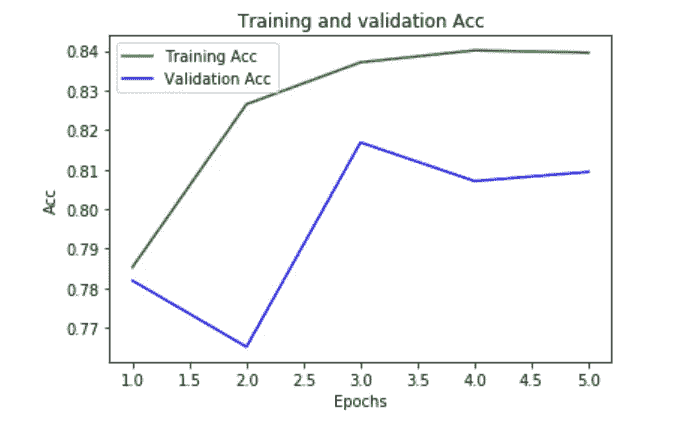

# 使用 ELMO 嵌入的迁移学习

> 原文：<https://towardsdatascience.com/transfer-learning-using-elmo-embedding-c4a7e415103c?source=collection_archive---------8----------------------->

去年，“自然语言处理”的主要发展是关于迁移学习的。基本上，迁移学习是在大规模数据集上训练模型，然后使用预训练的模型来处理另一个目标任务的学习的过程。迁移学习在自然语言处理领域变得很流行，这要归功于不同算法的最新性能，如 ULMFiT、Skip-Gram、Elmo、BERT 等。

由 Allen NLP 开发的 Elmo embedding 是 Tensorflow Hub 上提供的最先进的预训练模型。Elmo 嵌入从双向 LSTM 的内部状态中学习，并表示输入文本的上下文特征。在各种各样的 NLP 任务中，它已经被证明优于先前存在的预训练单词嵌入，如 word2vec 和 glove。这些任务中的一些是**问题回答**、**命名实体提取**和**情感分析**。

# **使用 Tensorflow-hub 的 Elmo 嵌入**

[](https://github.com/sambit9238/Deep-Learning/blob/master/elmo_embedding_tfhub.ipynb) [## sambit 9238/深度学习

### 深度学习技术在自然语言处理、计算机视觉等领域的实现。-sambit 9238/深度学习

github.com](https://github.com/sambit9238/Deep-Learning/blob/master/elmo_embedding_tfhub.ipynb) 

tensorflow-hub 中有一个预先训练好的 Elmo 嵌入模块。该模块支持原始文本字符串或标记化文本字符串作为输入。该模块输出每个 LSTM 层的固定嵌入、3 个层的可学习集合以及输入的固定平均汇集向量表示(对于句子)。要先使用这个模块，让我们把它下载到本地。

```
#download the model to local so it can be used again and again
!mkdir module/module_elmo2
# Download the module, and uncompress it to the destination folder. 
!curl -L "https://tfhub.dev/google/elmo/2?tf-hub-format=compressed" | tar -zxvC module/module_elmo2
```

该模块展示了用于层聚合的 4 个可训练标量权重。输出字典包含:

*   `**word_emb**`:基于字符的具有形状的单词表示`**[batch_size, max_length, 512]**`。
*   `**lstm_outputs1**`:第一个 LSTM 潜州用形`**[batch_size, max_length, 1024]**`。
*   `**lstm_outputs2**`:形状`**[batch_size, max_length, 1024]**`的第二个 LSTM 潜州。
*   `**elmo**`:3 层的加权和，其中权重是可训练的。这个张量有形状`**[batch_size, max_length, 1024]**`
*   `**default**`:形状`**[batch_size, 1024]**`的所有语境化单词表示的固定均值池。

要传递原始字符串作为输入:

```
elmo = hub.Module("module/module_elmo2/", trainable=**False**)
embeddings = elmo(
["the cat is on the mat", "what are you doing in evening"],
signature="default",
as_dict=**True**)["elmo"]
**with** tf.Session() **as** session:
    session.run([tf.global_variables_initializer(), tf.tables_initializer()])
    message_embeddings = session.run(embeddings)
```

输出消息嵌入的形状为(2，6，1024)，因为有两个最大长度为 6 个单词的句子，并且为每个单词生成长度为 1024 的 1D 向量。它在内部根据空格对其进行标记。如果提供了一个少于 6 个单词的字符串，它会在内部向其追加空格。

我们还可以向模块提供标记化的字符串，如下所示:

```
elmo = hub.Module("sentence_wise_email/module/module_elmo2/", trainable=**False**)
tokens_input = [["the", "cat", "is", "on", "the", "mat"],
["what", "are", "you", "doing", "in", "evening"]]
tokens_length = [6, 5]
embeddings = elmo(
inputs={
"tokens": tokens_input,
"sequence_len": tokens_length
},
signature="tokens",
as_dict=**True**)["elmo"]
**with** tf.Session() **as** session:
    session.run([tf.global_variables_initializer(), tf.tables_initializer()])
    message_embeddings = session.run(embeddings)
```

输出将是相似的。

当对多个输入使用 in REST API 或 backend，而不是为每个调用初始化会话(这是一种开销)时，一种有效的方法是:

```
**def** embed_elmo2(module):
    **with** tf.Graph().as_default():
        sentences = tf.placeholder(tf.string)
        embed = hub.Module(module)
        embeddings = embed(sentences)
        session = tf.train.MonitoredSession()
    **return** **lambda** x: session.run(embeddings, {sentences: x})

embed_fn = embed_elmo2('module/module_elmo2')
embed_fn(["i am sambit"]).shape
```

这里，默认情况下，它为每个句子输出大小为 1024 的向量，这是所有上下文化单词表示的固定均值池。通常在分类器中使用它时，我们可以使用这个输出。

# **ELMO 嵌入一个简单的神经网络分类器**

**数据输入**

我们将使用[首次共和党辩论 Twitter 情绪](https://www.kaggle.com/crowdflower/first-gop-debate-twitter-sentiment#Sentiment.csv)数据，其中包含 2016 年首次共和党总统辩论的约 14K 条推文。我们正在制作一个二元分类器，因此将忽略带有中性情绪的推文。

```
df =  pd.read_csv("sentence_wise_email/Sentiment.csv",encoding="latin")
df = df[df["sentiment"]!="Neutral"]
df.loc[df["sentiment"]=='Negative',"sentiment"]=0
df.loc[df["sentiment"]=='Positive',"sentiment"]=1
```

**数据处理**

我们将对数据进行一些清理，比如处理像“I'll”、“It's”等缩写。我们还将删除数字、链接、标点符号和电子邮件地址。(名字也应该被删除，但在这里没有这样做，因为这个模型实际上是为其他目的开发的，在这种情况下我懒得更改:-))

```
**import** **re**
**def** cleanText(text):
    text = text.strip().replace("**\n**", " ").replace("**\r**", " ")
    text = replace_contraction(text)
    text = replace_links(text, "link")
    text = remove_numbers(text)
    text = re.sub(r'[,!@#$%^&*)(|/><";:.?**\'\\**}{]',"",text)
    text = text.lower()
    **return** text
X = np.array(df["text"].apply(cleanText))
y = np.array(df["sentiment"])
```

**分类器模型构建**

首先，需要为此导入必要的模块。然后，我们需要创建一个函数，对输入执行预训练的 Elmo 嵌入。

```
embed = hub.Module("module/module_elmo2")
**def** ELMoEmbedding(x):
    **return** embed(tf.squeeze(tf.cast(x, tf.string)), signature="default", as_dict=**True**)["default"]
```

然后，我们需要构建架构。这里我们使用[高级 keras api](/an-intro-to-high-level-keras-api-in-tensorflow-c50f6f5272de) 来构建它，因为它更容易使用。我们使用函数方法来建立一个简单的前馈神经网络以及正则化来避免过度拟合。

```
**def** build_model(): 
    input_text = Input(shape=(1,), dtype="string")
    embedding = Lambda(ELMoEmbedding, output_shape=(1024, ))(input_text)
    dense = Dense(256, activation='relu', kernel_regularizer=keras.regularizers.l2(0.001))(embedding)
    pred = Dense(1, activation='sigmoid')(dense)
    model = Model(inputs=[input_text], outputs=pred)
    model.compile(loss='binary_crossentropy', optimizer='rmsprop', metrics=['accuracy'])
    **return** model
model_elmo = build_model()
```

模型总结为:

```
_________________________________________________________________
Layer (type)                 Output Shape              Param #   
=================================================================
input_2 (InputLayer)         (None, 1)                 0         
_________________________________________________________________
lambda_2 (Lambda)            (None, 1024)              0         
_________________________________________________________________
dense_3 (Dense)              (None, 256)               262400    
_________________________________________________________________
dense_4 (Dense)              (None, 1)                 257       
=================================================================
Total params: 262,657
Trainable params: 262,657
Non-trainable params: 0
_________________________________________________________________
```

现在，既然模型架构(已编译)和数据都准备好了，是时候开始训练和保存已训练的权重了。

```
**with** tf.Session() **as** session:
    K.set_session(session)
    session.run(tf.global_variables_initializer())  
    session.run(tf.tables_initializer())
    history = model_elmo.fit(X, y, epochs=5, batch_size=256, validation_split = 0.2)
    model_elmo.save_weights('./model_elmo_weights.h5')
```

为了查看在训练时关于准确度和损失函数的学习是如何进行的，我们可以画一个图:

```
**import** **matplotlib.pyplot** **as** **plt**
%matplotlib inline

acc = history.history['acc']
val_acc = history.history['val_acc']
loss = history.history['loss']
val_loss = history.history['val_loss']

epochs = range(1, len(acc) + 1)

plt.plot(epochs, acc, 'g', label='Training Acc')
plt.plot(epochs, val_acc, 'b', label='Validation Acc')
plt.title('Training and validation Acc')
plt.xlabel('Epochs')
plt.ylabel('Acc')
plt.legend()

plt.show()
```



似乎在第四纪元后，精确度没有太大的变化。你也可以画出同样的损失值。为了更好地了解模型何时达到其目的地，它必须接受更多时期的训练(这意味着增加成本，因为它是非常计算密集型的，需要 GPU :-)。

**用训练好的模型进行预测**

现在，为了使用训练好的模型进行预测，我们需要首先处理文本并对其进行排列。

```
new_text =  ['RT @FrankLuntz: Before the #GOPDebate, 14 focus groupers said they did not have favorable view of Trump.',
             'Chris Wallace(D) to be the 2nd worst partisan pontificating asshole "moderating" #GOPDebate @megynkelly'
            ]
#the texts should go through clean text also
new_text_pr = np.array(new_text, dtype=object)[:, np.newaxis]
```

现在我们可以开始一个 tensorflow 会话，我们将首先调用模型架构，然后从保存的文件中加载权重。调用 predict API 调用，会给我们每个文本的情感概率。分数越少，句子中嵌入的负面情绪越多。

```
**with** tf.Session() **as** session:
    K.set_session(session)
    session.run(tf.global_variables_initializer())  
    session.run(tf.tables_initializer())
    model_elmo = build_model() 
    model_elmo.load_weights('./model_elmo_weights.h5')
    **import** **time**
    t = time.time()
    predicts = model_elmo.predict(new_text_pr)
    print("time: ", time.time() - t)
    print(predicts)
```

输出是:

```
time:  0.6370120048522949
[[0.17122008]
 [0.3037635 ]]
```

我打印了时间只是为了显示需要多少时间，在特斯拉 k80 gpu 中两句话用了 0.63 秒。在 i5 处理器 cpu 中，耗时 14.3 秒。由于这是一个计算非常密集的过程，尤其是由于 Elmo 嵌入的高度复杂的架构，因此需要实时使用加速器。

如果你在上面的训练中看到，我们在 Elmo 嵌入上实现了 0.8094 的准确度，而使用预训练的 word2vec、glove 和在线嵌入，准确度分别为 0.7821、0.7432 和 0.7213。这些是 5 个时期后相同数据处理的结果。

```
Train on 8583 samples, validate on 2146 samples
Epoch 1/5
8583/8583 [==============================] - 63s 7ms/step - loss: 0.8087 - acc: 0.7853 - val_loss: 0.6919 - val_acc: 0.7819
Epoch 2/5
8583/8583 [==============================] - 62s 7ms/step - loss: 0.6015 - acc: 0.8265 - val_loss: 0.6359 - val_acc: 0.7651
Epoch 3/5
8583/8583 [==============================] - 62s 7ms/step - loss: 0.5377 - acc: 0.8371 - val_loss: 0.5407 - val_acc: 0.8169
Epoch 4/5
8583/8583 [==============================] - 62s 7ms/step - loss: 0.4946 - acc: 0.8401 - val_loss: 0.5016 - val_acc: 0.8071
Epoch 5/5
8583/8583 [==============================] - 63s 7ms/step - loss: 0.4836 - acc: 0.8396 - val_loss: 0.4995 - val_acc: 0.8094
```

[https://tfhub.dev/google/elmo/2](https://tfhub.dev/google/elmo/2)

 [## 深层语境化的词汇表征

### 我们介绍了一种新的深度上下文化的单词表示，它模拟了(1)单词的复杂特征…

arxiv.org](https://arxiv.org/abs/1802.05365)  [## 下游和语言探测任务中句子嵌入的评估

### 尽管新的句子嵌入方法发展速度很快，但要找到全面的句子嵌入方法仍然具有挑战性

arxiv.org](https://arxiv.org/abs/1806.06259)