# 用一个小数据集进行迁移学习——“nanos gigantum humeris insidentes”

> 原文：<https://towardsdatascience.com/transfer-learning-with-a-small-data-set-nanos-gigantum-humeris-insidentes-e1a7ed6404a7?source=collection_archive---------19----------------------->

## 尝试不同的架构— VGG16、Resnet50 和 InceptionV3 —以增强您的模型(使用 TensorFlow 和 Keras)

Image by [Myriam Zilles](https://pixabay.com/users/Myriams-Fotos-1627417/?utm_source=link-attribution&utm_medium=referral&utm_campaign=image&utm_content=1433025) from [Pixabay](https://pixabay.com/?utm_source=link-attribution&utm_medium=referral&utm_campaign=image&utm_content=1433025)

*一个常见的 TL 场景是使用一个在大型数据集上训练的 ConvNet 来对一个具有* ***相似但更小的*** *数据集的域进行分类(其他场景的一个很好的总结可以在* [*这里*](http://cs231n.github.io/transfer-learning/) *找到)。这种情况下，可接受的方法是将 ConvNet 用作固定特征提取器，或者对 ConvNet 进行微调。在实践中，这不是一个“非此即彼”的情况，而是一个范围，可以从最“严格”的即插即用方法(只有最后一个 FC 层从 ConvNet(顶部)中删除，并由适合新任务的线性分类器替换)到一些更“宽松”的方法(我们训练一些 ConvNet 层或冻结它们或两者的任何其他组合)变化。*

有多篇文章详细描述了上述内容，但当我尝试实施这些原则时，我总是会产生以下问题:

1.  **我应该选择哪种 ConvNet 我如何将架构与我的具体任务相匹配？在大多数情况下，架构似乎是从框架可用选项中任意选择的。**
2.  **什么是*小*什么是*相似****——这两个都是相对名词。与 *ImageNet* 相比，我的数据集可能总是很小，或者说*小与我选择的架构的大小有关？相似性也是一样， *ImageNet* 有一千个类别，如果我想只对人类进行分类，这些域有多相似？**

*如果你想直接进入代码和实验文档，它们就在这里。*

# *手头的任务*

*在我之前的一个项目中，我使用了一个简单的 CNN 模型进行二进制图像分类。这项任务是对 2 张特定的人脸进行分类，因此数据集很小(大约 1350 张图片)。结果很好，但不是很好，大约 0.9 的精确度。我没有选择通过扩大数据集来改进它，因为它是从[有限的信息资源](/creating-your-unique-image-data-set-90f7d58d3a4d)建立的。我将尝试使用这个测试用例来回答上面的问题。使用三个预先训练好的 conv net—[vgg 16](https://arxiv.org/pdf/1409.1556.pdf)、 [ResNet50](/an-overview-of-resnet-and-its-variants-5281e2f56035) 和 [InceptionV3](/a-simple-guide-to-the-versions-of-the-inception-network-7fc52b863202) —让我们检查案例，并在实施*迁移学习*时建立一些实践的基本规则，提出一些见解。*

*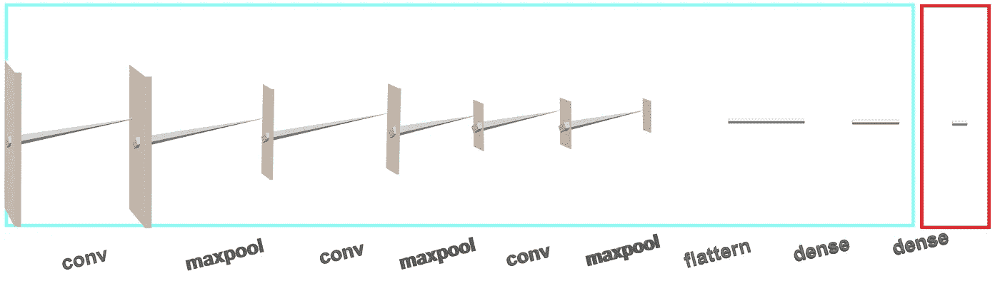*

*Freeze all layers, replace top.*

# *VGG16 —纯真年代*

*VGG16 基本上是一堆 Conv 层堆叠在另一个之上——这是最类似于我的简单的 CNN。让我们首先尝试最简单的方法:我们将按原样使用它， *ImageNet 的所有预训练权重，*冻结所有层，删除最后一个 FC 层( *ImageNet* 有一个 1000 类别分类器)，并用二进制分类器替换它。*

*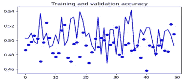*

*Freeze all layer — accuracy*

*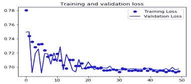*

*Freeze all layers — loss*

*我的假设是，由于我的领域——人脸图像——与 ImageNet 领域——各种物体的图像——非常相似，所以即使是最高层的特征也与我的任务相关。但是，唉，我们看到了一些损失的趋同，但还不足以帮助准确性有意义。这是为什么呢？在我们试图回答这个问题之前，让我们做另一个实验。这次我们将重新训练整个网络，没有预先训练的重量。*

**

*Train all layers — loss*

*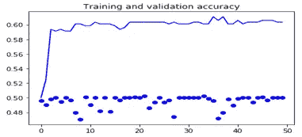*

*Train all layers — accuracy*

*尽管如此，损耗在某个点上停滞不前，精度也停滞不前。好了，现在让我们试着理解为什么。我能想到的可能原因:*

1.  *数据集**太小***
2.  *数据集与 ImageNet 不相似*
3.  *建筑不适合。*

*我不认为我的数据太小(1 ),因为在这个架构中没有比我的简单 CNN 更多的可训练参数。可能是数据域不相似(2)，至少在上层是如此，这需要测试。或者可能是建筑(3)。这是类似于我的，但它堆栈更多的 Conv 层，这可能会导致不同的问题。*

*让我们试着决定关于解释(2)。我将冻结一些较低的图层，试图保留低级别特征，并训练较高的图层，试图使它们适合我的数据。*

*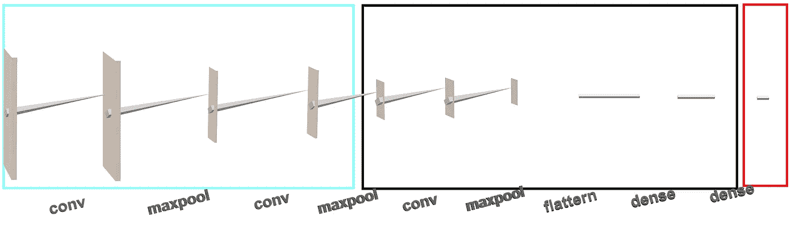*

*Freeze lower, train higher, replace top.*

*让我们冻结前六层(前两层)并训练其余部分。请注意，微调的[方法是只训练顶部，然后解冻所需的层并重新训练。](https://keras.io/applications/#fine-tune-inceptionv3-on-a-new-set-of-classes)*

*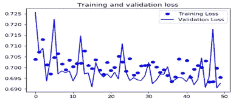*

*Freeze 6 first, train the rest — loss*

*嗯，这并没有改善事情。我也尝试了其他层，但没有改善，你可以在这里找到我所有的实验。*

*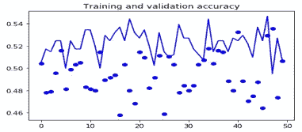*

*Freeze 6 first, train the rest — accuracy*

*好吧，所以不是大小(1)，不是相似(2)，一定是架构(3)。我仍然不能解释为什么，但我可以试着证明它。让我们试试另一个，比较一下结果。*

# *ResNet50 —残值*

*剩余网络是为了解决可能影响我的 VGG 模型的深层网络问题而创建的。我们将经历我们在 VGG 使用的相同过程，我们将从冻结所有层开始，并根据结果继续。*

*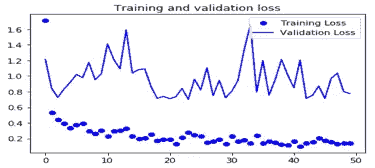*

*Freeze all layers — loss*

*终于有些进展了。训练精度约为 0.97，看起来模型终于学到了一些东西。验证精度为 0.5*

*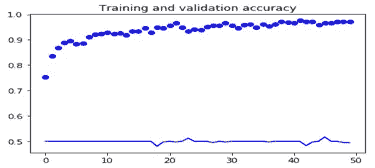*

*Freeze all layers — accuracy*

*看起来，因为我只训练顶部，我可能非常适合我的训练设置。让我们继续解冻所有图层，就像我们对 VGG 做的那样，看看是否有帮助。*

*我将重新初始化模型，这次我不会冻结任何东西。*

*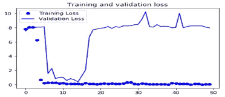**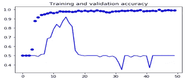*

*Train all layers — accuracy*

*这里发生了什么？在大约 21 个时期后的某个时间点，验证损失下降，准确性跃升至 0.91，这与我用简单的 CNN 得到的结果大致相同，比 VGG 好得多。要指出的另一个要点是，尽管网络被完全重新训练，但初始权重是“ *ImageNet* ”权重，而不是随机的。这一点很重要，也可能是这个模型得以提升的原因。*

*在所有这些实验之后，我想在这里说明的一点是:*

> *选择正确的架构是利用迁移学习的关键部分*

*我现在和我原来的 CNN 模式有分歧，但是迁移学习的好处在哪里？我能从 ResNet 中挤出更多的果汁吗，或者我应该尝试另一种架构？我试着只冻结模型的一部分，甚至移除一些上层，但是还没有太大进展。我想我会继续关注盗梦空间架构，看看事情会不会变得更顺利*

# *InceptionV3 —分而治之*

*[Inception](/a-simple-guide-to-the-versions-of-the-inception-network-7fc52b863202) 是 CNN 分类器的又一次进化。这里我将使用 V3，它不是最新的版本，但仍然是非常先进的。*

**

*Freeze all layers — accuracy*

*我很快运行了两个实验，就像我对前两个架构所做的那样——冻结所有层和释放所有层——在这两个实验中，我在验证集上得到了大约 0.7，与 ResNet 结果非常相似，但趋势仍然不乐观。*

*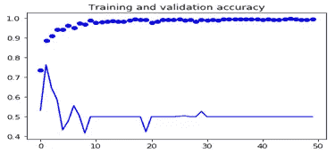*

*Train all layers — accuracy*

*我想尝试一些新的东西:Inception 是一个非常大的网络，让我们尝试删除部分层，只使用网络的一部分——具体来说，我将删除 Conv 层的较高堆栈，并训练较低的层。*

*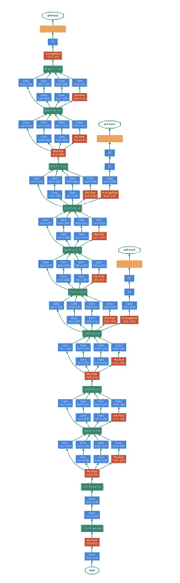*

*[Inception v1](https://arxiv.org/pdf/1409.4842v1.pdf)*

*动机现在很清楚了——使用网络的底层功能，并针对我的问题进行微调。我不得不说这是一个反复试验的游戏，但是有一些逻辑。如果你看左边的初始架构，你会看到它是由连接的块构成的。因此，在这些点之一“剖析”网络并插入分类器是有意义的。甚至好像是专门为它设计的。意识到这一点使得试错游戏变得容易多了。因此，我要做的是找到分割网络的最佳模块，并尝试从该点进行微调。*

*经过一些试验后，我发现使用“***_ 5***”——这是级联层的名称，您可以看到，当使用 *model.summary()* 方法时——会给出最好的结果。一些更多的参数优化，我得到了大约 0.97 的验证精度。*

*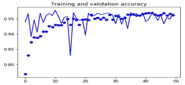*

*这是一个很大的改进，似乎盗梦空间架构最适合我的任务，或者可能是我迄今为止使用的最先进的，我还不能排除这个结论。在我总结之前，让我们尝试另一个调整:上次实验的最佳纪元是 50 个中的第 11 个。从那里开始，验证慢慢下降，这是过度拟合的迹象。假设我们已经尝试了所有的参数调整，让我们尝试解冻一些层。我们用 ResNet 试过，效果不太好，也许盗梦空间架构会更宽容一些。我将解冻从“混合 _4”到“混合 _5”的所有层，这意味着一个级联堆栈。这将使新模型的上层能够根据新数据进行训练，并有望提高准确性。*

*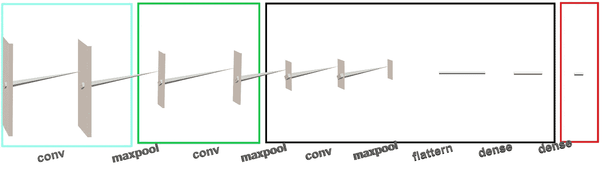*

*Freeze lower, unfreeze middle, remove higher, replace top.*

*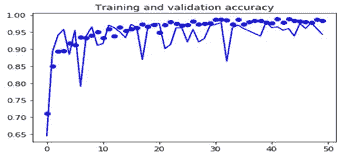*

*验证准确率目前最高~0.98。*

*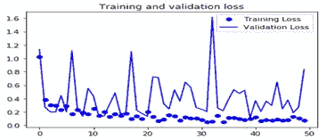*

*我们设法改进了我们需要的部分，去掉了其他部分。TL 已经证明了自己是有用的，但是上面所有的实验都花费了大量的时间。*

*让我们想想下一个项目有什么可以改进的。有什么可以抵扣的？*

1.  ***根据您的需求选择正确的架构**—下次我会从最新最好的开始，它可能有最好的机会。*
2.  ***只拿你需要的** —试着理解架构——至少是高层次的知识——你不需要阅读每一篇文章，但要确保你理解它的优点，尤其是它的缺点。*
3.  ***优化参数作为最后一步** —节省大量时间和迭代*
4.  ***记录你的实验** — 这是一个节省时间和跟踪工作的好方法，你可以通过下面的代码找到我所有的实验。*

*请分享你的想法，代码和文档都在这里。在 [Medium](https://medium.com/@lavian.alon) 或 [Twitter](https://twitter.com/alonlavian) 上关注我的博客文章更新！*