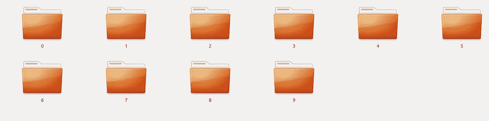
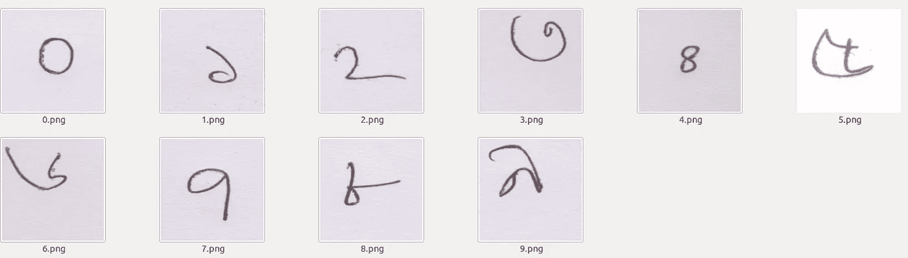
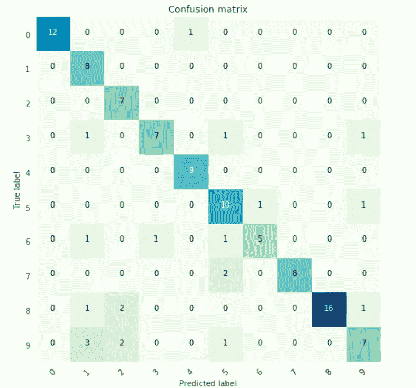

# PySpark 中基于迁移学习的多类图像分类

> 原文：<https://towardsdatascience.com/transfer-learning-with-pyspark-729d49604d45?source=collection_archive---------4----------------------->


src: Photo by [Pixabay](https://www.pexels.com/@pixabay?utm_content=attributionCopyText&utm_medium=referral&utm_source=pexels) from [Pexels](https://www.pexels.com/photo/close-up-of-a-book-over-white-background-256424/?utm_content=attributionCopyText&utm_medium=referral&utm_source=pexels)

## Apache Spark 深度学习管道的计算机视觉问题的简短演示。

# 介绍

在本文中，我们将使用 Keras (TensorFlow 后端)、PySpark 和**深度学习管道**库来构建一个端到端的深度学习计算机视觉解决方案，用于在 Spark 集群上运行的多类图像分类问题。Spark 是一个强大的开源分布式分析引擎，可以高速处理大量数据。PySpark 是用于 Spark 的 Python API，它允许我们使用 Python 编程语言并利用 Apache Spark 的强大功能。

在本文中，我们将主要使用[**深度学习管道**](https://docs.databricks.com/applications/deep-learning/single-node-training/deep-learning-pipelines.html) **(DLP)** ，这是一个高级深度学习框架，通过 [**Spark MLlib**](https://spark.apache.org/mllib/) 管道 API 来促进常见的深度学习工作流。它目前通过 TensorFlow 后端支持 TensorFlow 和 Keras。在本文中，我们将使用这个 **DLP** 构建一个将在 Spark 集群上运行的多类图像分类器。要设置好一切，请遵循本 [**安装说明**](https://gist.github.com/innat/b0ab252c954eb2a28a984774e3ee1f2d) **。**

 [## 深度学习管道—数据块文档

### 深度学习管道库包含在 Databricks Runtime ML 中，这是一个机器学习运行时，它提供了一个…

docs.databricks.com](https://docs.databricks.com/applications/deep-learning/single-node-training/deep-learning-pipelines.html) 

该库来自 **Databricks** ，并利用 Spark 的两个最强方面:

1.  本着 Spark 和 [**Spark MLlib**](https://spark.apache.org/mllib/) 的精神，它提供了易于使用的 API，可以在非常少的几行代码中实现深度学习。
2.  它使用 Spark 强大的分布式引擎在海量数据集上扩展深度学习。

我的目标是用 **DLP** 将深度学习整合到 PySpark 管道中。我在本地机器上使用 Jupyter Notebook 运行整个项目来构建原型。然而，我发现把这个原型放在一起有点困难，所以我希望其他人会发现这篇文章很有用。我将把这个项目分成几个步骤。有些步骤是不言自明的，但对于其他步骤，我会尽可能解释清楚，让它变得不那么痛苦。如果你只想看有解释和代码的笔记本，你可以直接去 [GitHub](https://github.com/innat/Transfer-Learning-PySpark) 。

## 计划

*   **迁移学习**:深度学习管道的简短直觉(来自**数据块**
*   **数据集**:引入多类图像数据。
*   **建模**:建立模型，训练。
*   **评估**:使用各种评估指标评估模型性能。

# 迁移学习

迁移学习是机器学习中的一种技术，通常专注于保存在解决一个问题时获得的知识(权重和偏差)，并进一步将其应用于不同但相关的问题。

**深度学习管道**提供对图像执行迁移学习的实用程序，这是开始使用深度学习的最快方法之一。借助 ***特征器的概念，*** 深度学习管道能够在 Spark-Cluster 上实现快速迁移学习。目前，它为迁移学习提供了以下神经网络:

*   InceptionV3
*   例外
*   ResNet50
*   VGG16
*   VGG19

出于演示的目的，我们将只研究 **InceptionV3** 模型。你可以在这里阅读这款[的技术细节。](https://arxiv.org/abs/1512.00567)

以下示例结合了 Spark 中的 **InceptionV3** 模型和**多项式逻辑回归**。来自深度学习管道的一个名为 **DeepImageFeaturizer** 的实用函数自动剥离预训练神经网络的最后一层，并使用所有先前层的输出作为逻辑回归算法的**特征**。

# 数据集

孟加拉文字有十个[数字](https://en.wikipedia.org/wiki/Numerical_digit)(表示从 0 到 9 的数字的字母或符号)。大于 9 的数字用孟加拉语书写，使用基数为 10 的位置数字系统。

我们选择**[**numtab**](https://arxiv.org/abs/1806.02452)作为我们数据集的来源。这是孟加拉手写数字数据的集合。该数据集包含来自 2，700 多个贡献者的 85，000 多个数字。但是这里我们不打算处理整个数据集，而是随机选择每一类的 50 张图片。**

****

**Fig 1: Each Folder Contains 50 Images [ Classes (0 to 9) ]**

**让我们看看上面十个文件夹里都有什么。出于演示目的，我将下面显示的每个图像重命名为其对应的类标签。**

****

**Fig 2: Bengali Handwritten Digit**

**首先，我们将所有图像加载到 SparkData Frame。然后我们建立模型并训练它。之后，我们将评估我们训练好的模型的性能。**

## **加载图像**

**数据集(从 0 到 9)包含近 500 个手写孟加拉数字(每类 50 个图像)。这里，我们手动将每个图像加载到带有目标列的 **spark 数据帧**中。在加载了整个数据集之后，我们将训练集和最终测试集随机分成 8:2 的比例。**

**我们的目标是用训练数据集训练模型，最后用测试数据集评估模型的性能。**

```
# necessary import 
from pyspark.sql import SparkSession
from pyspark.ml.image import ImageSchema
from pyspark.sql.functions import lit
from functools import reduce
# create a spark session
spark = SparkSession.builder.appName('DigitRecog').getOrCreate()
# loaded image
zero = ImageSchema.readImages("0").withColumn("label", lit(0))
one = ImageSchema.readImages("1").withColumn("label", lit(1))
two = ImageSchema.readImages("2").withColumn("label", lit(2))
three = ImageSchema.readImages("3").withColumn("label", lit(3))
four = ImageSchema.readImages("4").withColumn("label", lit(4))
five = ImageSchema.readImages("5").withColumn("label", lit(5))
six = ImageSchema.readImages("6").withColumn("label", lit(6))
seven = ImageSchema.readImages("7").withColumn("label", lit(7))
eight = ImageSchema.readImages("8").withColumn("label", lit(8))
nine = ImageSchema.readImages("9").withColumn("label", lit(9))
dataframes = [zero, one, two, three,four,
             five, six, seven, eight, nine]
# merge data frame
df = reduce(lambda first, second: first.union(second), dataframes)
# repartition dataframe 
df = df.repartition(200)
# split the data-frame
train, test = df.randomSplit([0.8, 0.2], 42)
```

**在这里，我们可以对火花数据帧进行各种探索性的数据分析。我们还可以查看数据框的模式。**

```
df.printSchema()
root
 |-- image: struct (nullable = true)
 |    |-- origin: string (nullable = true)
 |    |-- height: integer (nullable = false)
 |    |-- width: integer (nullable = false)
 |    |-- nChannels: integer (nullable = false)
 |    |-- mode: integer (nullable = false)
 |    |-- data: binary (nullable = false)
 |-- label: integer (nullable = false)
```

**我们也可以使用**将 Spark-DataFrame 转换成 Pandas-DataFrame。托潘达斯()。****

# **模特培训**

**这里我们结合 Spark 中的 **InceptionV3** 模型和 **logistic 回归**。**deepimagefeaturezer**自动剥离预训练神经网络的最后一层，并使用所有先前层的输出作为逻辑回归算法的特征。**

**由于 **logistic 回归**是一种简单快速的算法，所以这种迁移学习训练能够快速收敛。**

```
from pyspark.ml.evaluation import MulticlassClassificationEvaluator
from pyspark.ml.classification import LogisticRegression
from pyspark.ml import Pipeline
from sparkdl import DeepImageFeaturizer
# model: InceptionV3
# extracting feature from images
featurizer = DeepImageFeaturizer(inputCol="image",
                                 outputCol="features",
                                 modelName="InceptionV3")
# used as a multi class classifier
lr = LogisticRegression(maxIter=5, regParam=0.03, 
                        elasticNetParam=0.5, labelCol="label")
# define a pipeline model
sparkdn = Pipeline(stages=[featurizer, lr])
spark_model = sparkdn.fit(train) # start fitting or training
```

# **估价**

**现在，是时候评估模型性能了。我们现在要评估四个评估指标，比如测试数据集上的得分、精确度、召回率和准确度。**

```
from pyspark.ml.evaluation import MulticlassClassificationEvaluator
# evaluate the model with test set
evaluator = MulticlassClassificationEvaluator() 
tx_test = spark_model.transform(test)
print('F1-Score ', evaluator.evaluate(
                          tx_test, 
                          {evaluator.metricName: 'f1'})
)
print('Precision ', evaluator.evaluate(
                          tx_test,
                          {evaluator.metricName: 'weightedPrecision'})
)
print('Recall ', evaluator.evaluate(
                          tx_test, 
                          {evaluator.metricName: 'weightedRecall'})
)
print('Accuracy ', evaluator.evaluate(
                          tx_test, 
                          {evaluator.metricName: 'accuracy'})
)
```

**这里我们得到了结果。到现在都很有希望。**

```
F1-Score  0.8111782234361806
Precision  0.8422058244785519
Recall  0.8090909090909091
Accuracy  0.8090909090909091
```

## **混乱矩阵**

**这里，我们将使用[混淆矩阵](https://en.wikipedia.org/wiki/Confusion_matrix)总结分类模型的性能。**

```
import matplotlib.pyplot as plt
import numpy as np
import itertools
def plot_confusion_matrix(cm, classes,
                          normalize=False,
                          title='Confusion matrix',
                          cmap=plt.cm.GnBu):
      plt.imshow(cm, interpolation='nearest', cmap=cmap)
      plt.title(title)
      tick_marks = np.arange(len(classes))
      plt.xticks(tick_marks, classes, rotation=45)
      plt.yticks(tick_marks, classes)
      fmt = '.2f' if normalize else 'd'
      thresh = cm.max() / 2.

      for i, j in itertools.product(
          range(cm.shape[0]), range(cm.shape[1])
      ):
        plt.text(j, i, format(cm[i, j], fmt),
                 horizontalalignment="center",
                 color="white" if cm[i, j] > thresh else "black")

      plt.tight_layout()
      plt.ylabel('True label')
      plt.xlabel('Predicted label')
```

**为此，我们需要将 **Spark-DataFrame** 转换为 **Pandas-DataFrame** 首先是和然后是调用带有**真**和**预测**标签的混淆矩阵。**

```
from sklearn.metrics import confusion_matrix

y_true = tx_test.select("label")
y_true = y_true.toPandas()

y_pred = tx_test.select("prediction")
y_pred = y_pred.toPandas()

cnf_matrix = confusion_matrix(y_true, y_pred,labels=range(10))
```

**让我们来想象一下**混淆矩阵****

```
import seaborn as sns
%matplotlib inline

sns.set_style("darkgrid")
plt.figure(figsize=(7,7))
plt.grid(False)

# call pre defined function
plot_confusion_matrix(cnf_matrix, classes=range(10))
```

****

**Fig 3: Confusion Matrix for 10 Bengali Digits (0 to 9)**

## **分类报告**

**在这里我们还可以通过评估矩阵得到每个类的分类报告。**

```
from sklearn.metrics import classification_report

target_names = ["Class {}".format(i) for i in range(10)]
print(classification_report(y_true, y_pred, target_names = target_names))
```

**它将更好地展示每个类别标签预测的模型性能。**

```
precision  recall   f1-score   support Class 0       1.00      0.92      0.96        13
     Class 1       0.57      1.00      0.73         8
     Class 2       0.64      1.00      0.78         7
     Class 3       0.88      0.70      0.78        10
     Class 4       0.90      1.00      0.95         9
     Class 5       0.67      0.83      0.74        12
     Class 6       0.83      0.62      0.71         8
     Class 7       1.00      0.80      0.89        10
     Class 8       1.00      0.80      0.89        20
     Class 9       0.70      0.54      0.61        13 micro avg       0.81      0.81      0.81       110
   macro avg       0.82      0.82      0.80       110
weighted avg       0.84      0.81      0.81       110
```

## **ROC AUC 得分**

**我们也来找一下这个模型的 ROC AUC 评分点。我在这里找到了下面这段来自 [h](https://medium.com/@plog397/auc-roc-curve-scoring-function-for-multi-class-classification-9822871a6659) 的代码。**

```
from sklearn.metrics import roc_curve, auc, roc_auc_score
from sklearn.preprocessing import LabelBinarizer

def multiclass_roc_auc_score(y_test, y_pred, average="macro"):
    lb = LabelBinarizer()
    lb.fit(y_test)
    y_test = lb.transform(y_test)
    y_pred = lb.transform(y_pred)
    return roc_auc_score(y_test, y_pred, average=average)

print('ROC AUC score:', multiclass_roc_auc_score(y_true,y_pred))
```

**它的得分**为 0.901。****

## **预测样本**

**让我们来看看它的一些预测，与真正的标签相比较。**

```
# all columns after transformations
print(tx_test.columns)

# see some predicted output
tx_test.select('image', "prediction", "label").show()
```

**并且，结果将如下所示**

```
['image', 'label', 'features', 'rawPrediction', 'probability', 'prediction']
+------------------+----------+--------+
|       image      |prediction|  label |
+------------------+----------+--------+
|[file:/home/i...|       1.0|    1|
|[file:/home/i...|       8.0|    8|
|[file:/home/i...|       9.0|    9|
|[file:/home/i...|       1.0|    8|
|[file:/home/i...|       1.0|    1|
|[file:/home/i...|       1.0|    9|
|[file:/home/i...|       0.0|    0|
|[file:/home/i...|       2.0|    9|
|[file:/home/i...|       8.0|    8|
|[file:/home/i...|       9.0|    9|
|[file:/home/i...|       0.0|    0|
|[file:/home/i...|       4.0|    0|
|[file:/home/i...|       5.0|    9|
|[file:/home/i...|       1.0|    1|
|[file:/home/i...|       9.0|    9|
|[file:/home/i...|       9.0|    9|
|[file:/home/i...|       1.0|    1|
|[file:/home/i...|       1.0|    1|
|[file:/home/i...|       9.0|    9|
|[file:/home/i...|       3.0|    6|
+--------------------+----------+-----+
only showing top 20 rows
```

# **尾注**

**虽然我们已经使用了一个**[**ImageNet**](http://www.image-net.org/)权重，但是我们的模型在识别手写数字方面表现得非常好。此外，为了更好的泛化，我们也没有执行任何**图像处理**任务。此外，与 ImageNet 数据集相比，该模型是在非常少量的数据上训练的。****

****在一个非常高的层次上，每个 Spark 应用程序都由一个驱动程序组成，该程序在一个集群上启动各种并行操作。驱动程序包含我们的应用程序的主要功能，定义集群上的分布式数据集，然后对它们应用操作。****

****这是一个独立的应用程序，我们首先将应用程序链接到 Spark，然后在我们的程序中导入 Spark 包，并使用 **SparkSession** 创建一个 **SparkContext** 。虽然我们在单台机器上工作，但是我们可以将同一个 shell 连接到一个集群，并行训练数据。****

****但是，您可以从下面的链接获得今天演示的源代码，也可以关注我的 [**GitHub**](https://github.com/innat) 以获取未来的代码更新。:)****

****[](https://github.com/innat/Transfer-Learning-PySpark) [## innat/迁移-学习-PySpark

### 计算机视觉问题的一个有前途的解决方案，结合了最先进的技术:深度…

github.com](https://github.com/innat/Transfer-Learning-PySpark)**** 

# ****下一步是什么？****

****接下来，我们将使用 Spark 进行**分布式超参数调整** **，并将尝试自定义 **Keras** 模型和一些新的具有挑战性的示例。取得联系:)******

****打招呼上:** [**邮箱**](http://innat1994@gmail.com)**|**[**LinkedIn**](https://www.linkedin.com/in/innat2k14/)**|**[**Quora**](https://www.quora.com/profile/Mohammed-Innat#)**|**[**GitHub**](https://github.com/innat)**|**[**推特**](https://twitter.com/innat_2k14)**|**[**insta gram**](https://www.instagram.com/i_innat/)**

## ****相关技术****

*   ****配有 Keras & PySpark 的分布式 DL—[Elephas](https://github.com/maxpumperla/elephas?source=post_page---------------------------)****
*   ****Apache Spark 的分布式深度学习库— [BigDL](https://github.com/intel-analytics/BigDL)****
*   ****到阿帕奇火花星团的张量流— [张量流 OnSpark](https://github.com/yahoo/TensorFlowOnSpark)****

## ****参考****

*   ****Databricks: [深度学习指南](https://docs.databricks.com/applications/deep-learning/index.html)****
*   ****Apache Spark: [PySpark 机器学习](https://spark.apache.org/docs/latest/api/python/index.html)****