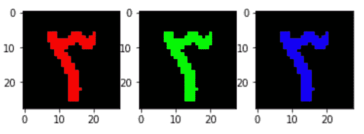
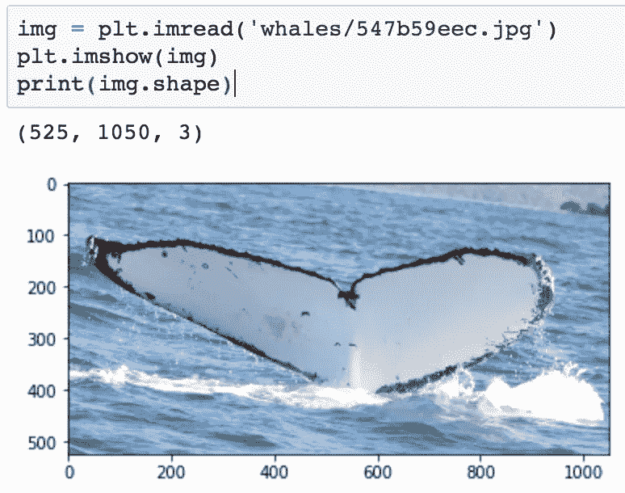
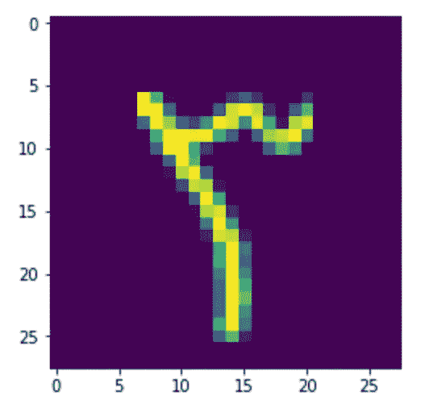
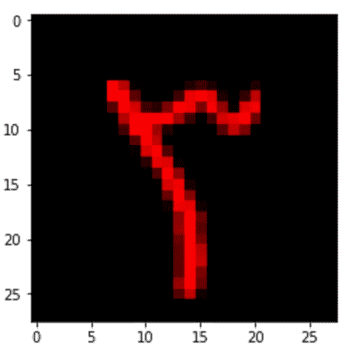
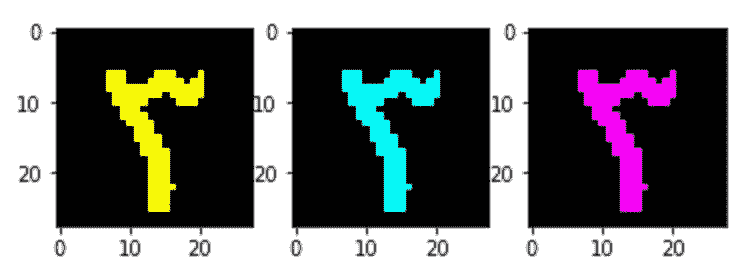
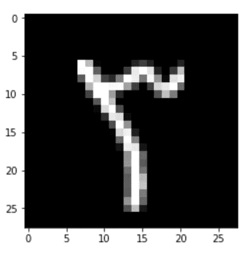

# 使用 Python 的 Matplotlib 将灰度图像转换为 RGB

> 原文：<https://towardsdatascience.com/transform-grayscale-images-to-rgb-using-pythons-matplotlib-6a0625d992dd?source=collection_archive---------12----------------------->

## 了解图像数据结构，同时为计算机视觉和深度学习管道添加两个维度



R, G, & B — Arabic numeral ‘3’

数据预处理对于计算机视觉应用至关重要，将灰度图像正确转换为当前深度学习框架所期望的 RGB 格式是一项必不可少的技术。那是什么意思？

## 理解彩色图像结构

大多数彩色照片由三个互锁的数组组成，每个数组负责红色、绿色或蓝色值(因此是 RGB ),每个数组中的整数值代表一个像素值。同时，黑白或灰度照片只有一个通道，从一个阵列中读取。

使用 matplotlib 库，我们来看一幅彩色(RGB)图像:

```
img = plt.imread('whales/547b59eec.jpg')
plt.imshow(img)
print(img.shape)
(525, 1050, 3)
```

matplotlib.plot.shape 调用的输出告诉我们，图像的高度为 525 像素，宽度为 1050 像素，有三个这样大小的数组(通道)。



A whale image, from a recent kaggle competition

`img`对象是<类‘numpy . ndarray’>，所以让我们看看每一层的形状和值:

```
#values
print(img[524][1049][2])
198print(img[524][1049])
[155 177 198]print(img[524])
[[ 68 107 140]
 [ 76 115 148]
 [ 76 115 148]
 [ 75 114 147]
 ...
 [171 196 216]
 [171 193 214]
 [171 193 214]
 [155 177 198]]
```

好了，上面的打印命令告诉我们这个由 1050 列(宽)和 525 行(高)组成的图像是什么？

首先，我们看最后一个像素的值，在最后一列的最后一行和最后一个通道:198。这告诉我们该文件很可能使用 0 到 255 之间的值。

接下来，我们查看所有三个通道中该像素的值:[155，177，198]。这些是该像素的红色、绿色和蓝色值。

为了好玩，我们可以跨所有层和所有行查看最后一行的值。

## 了解灰度图像结构

灰度图像只有一个通道！就是这样！

## 问题是

引用 Pytorch 文档:*所有预训练的模型都期望输入图像以相同的方式标准化，即小批量的 3 通道 RGB 形状图像(3 x H x W)...*

因此，试图通过许多依赖于从标准商品模型(如 Resnet18 或-34)进行转移学习的计算机视觉/深度学习管道来摄取灰度将导致各种错误。

## 解决方案

给灰度添加两个额外的通道！有很多方法可以做到这一点，所以我的方法如下:将第一层复制到一个新的 3D 阵列的新层中，从而生成一个彩色图像(黑白的，所以它仍然是 B&W)。

我将使用来自*阿拉伯手写数字数据集*的一个正方形图像作为例子。形状为`(28, 28)`，确认为单通道图像。



matplotlib defaults grayscales as above

因为我想把它输入到一个基于 Resnet34 的模型中，所以我需要三个通道。

显而易见(但不太正确)的方法是添加两个相同大小的零数组:

```
dim = np.zeros((28,28))R = np.stack((O,dim, dim), axis=2)
```

`O`是我们最初的阵列。我们可以很容易地将两个相同形状的零阵列相加，但我们将得到一个红色为主的图像:



three channels, all values in channel 1

哎呦！我们希望在所有渠道中填充相同的值。不过，在此之前，让我们看看，如果我们将原始数组滚动通过每种非完全 RGB 的可能性，会发生什么:


R, G, B



RG, RB, GB

好了，这是 RGB:



Finally!

仅此而已。

## 也

附加代码在我的 github 上:[www.github.com/matthewarthur](http://www.github.com/matthewarthur)。我的 LinkedIn 是 https://www.linkedin.com/in/matt-a-8208aaa/的。打个招呼。

## 笔记

[1]https://pytorch.org/docs/stable/torchvision/models.html

[2][https://www . cs . Virginia . edu/~ Vicente/recognition/notebooks/image _ processing _ lab . html](https://www.cs.virginia.edu/~vicente/recognition/notebooks/image_processing_lab.html)

[3]numpy 中的索引在这里详细介绍:[https://docs . scipy . org/doc/numpy-1 . 10 . 0/user/basics . Indexing . html](https://docs.scipy.org/doc/numpy-1.10.0/user/basics.indexing.html)