# 变形金刚——你需要的只是关注

> 原文：<https://towardsdatascience.com/transformer-attention-is-all-you-need-1e455701fdd9?source=collection_archive---------5----------------------->

## 通过自我注意和位置编码改进 Seq2Seq 建模的方法

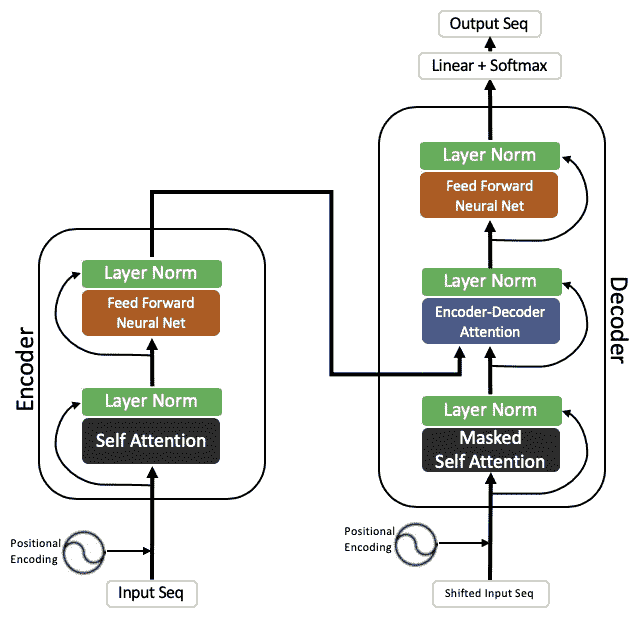

在之前的[帖子](https://medium.com/@catchpranay/day-1-2-attention-seq2seq-models-65df3f49e263)中，我们讨论了基于注意力的 seq2seq 模型以及它们诞生背后的逻辑。计划是创建一个差不多的 PyTorch 实现故事，但是结果是，PyTorch 文档提供了一个极好的过程[这里](https://pytorch.org/tutorials/intermediate/seq2seq_translation_tutorial.html)。所以在这里，我开始我计划中的下一个项目——*变压器——*,它的工作原理是*自我关注*。

让我们对基于注意力的模型做一个两行的回顾。它的主要思想是，它接受一个输入序列和与之相关的所有隐藏状态，在输出的每个实例中，它决定输入的哪一部分是有用的，并随后基于此决定输出。通过在编码器和解码器中使用 RNNs 或 LSTMs 中的任一个来捕获顺序性质。

在[注意力是你所需要的全部](https://papers.nips.cc/paper/7181-attention-is-all-you-need.pdf)论文中，作者已经表明，这种顺序性质可以通过仅使用注意力机制来捕捉——而不使用 LSTMs 或 RNNs。

在这篇文章中，我们将遵循与上一篇文章相似的结构，从黑盒开始，慢慢地一个接一个地理解每个组件，从而增加整个架构的清晰度。学完本课程后，您将会很好地掌握变压器网络的每个组件，以及它们如何帮助您获得想要的结果。

*先修课程:关于注意力网络和其他基于编解码器的模型的基础知识。神经网络和标准化技术。*

# 变压器黑匣子:

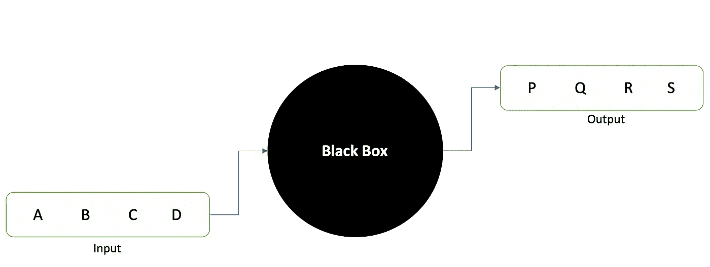

Seq2Seq Model

让我们首先了解注意力模型和变压器模型之间的基本异同。两者都旨在使用编码器-解码器方法实现相同的结果。编码器将原始输入序列转换成隐藏状态向量形式的潜在表示。解码器试图使用这个潜在表示来预测输出序列。但是基于 RNN 的方法有一个固有的缺陷。由于顺序计算的基本限制，不可能并行化网络，这使得难以在长序列上训练。这反过来限制了训练时可以使用的批量大小。这已经被变形金刚缓解了，我们很快就会知道怎么做。所以让我们开始吧。

(我想指出，这篇文章有一点额外的阅读和较少的图片，但我会确保阅读尽可能简单。)

# 背景

transformer 架构继续使用编码器-解码器框架，这是原始注意力网络的一部分——给定一个输入序列，基于上下文创建它的编码，并将基于上下文的编码解码为输出序列。

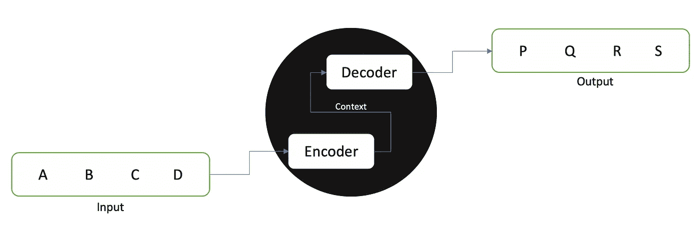

除了不能并行化的问题之外，致力于改进的另一个重要原因是基于注意力的模型会无意中给序列中更靠近位置的元素更高的权重。虽然这在理解句子各部分的语法结构的意义上可能是有意义的，但是很难找到句子中相距很远的单词之间的关系。

# 变压器架构

像上一篇文章一样，我们将逐步达到自我关注模型，从基本架构开始，慢慢达到完整的转换器。

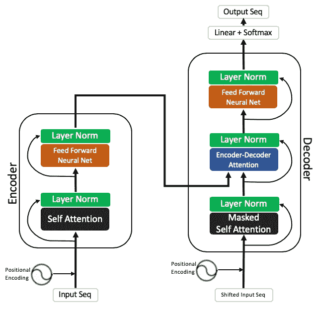

如所见，它遵循编码器-解码器设计，同时用自关注层替换 LSTMs，并且使用位置编码来识别顺序性质。需要记住的重要一点是，所有这些组件都是由全连接(FC)层构成的。由于整个架构都是 FC 层，因此很容易将其并行化。

因此，我们现在有以下疑问:

1.  输入序列是如何设计的？
2.  使用位置编码是如何处理顺序性质的？
3.  什么是自我关注？
4.  什么是图层规范化？
5.  前馈神经网络的设计是怎样的？
6.  自我注意层和被掩盖的自我注意层有什么区别？
7.  Enc-Dec 关注层是什么？

随着我们对每个问题的澄清，这个模型将变得更加清晰。

# 输入序列

给定一系列记号 *x1* 、 *x2* 、 *x3* 、 *…* ，输入序列对应于这些记号中的每一个的嵌入。这种嵌入可以像一键编码一样简单。例如，在句子的情况下， *x1* 、 *x2* 、 *x3* 、 *…* 将对应于句子中的单词。输入的 seq 可以是这些单词中每一个的一键 enc。

# 位置编码

由于这种新的编码器-解码器架构中没有解释数据顺序性质的组件，因此我们需要注入一些关于序列中令牌的相对或绝对位置的信息。这是位置编码模块的任务。

忽略数学公式，给定标记 *x* 在位置 *i* 的嵌入，第*I*位置的位置编码被添加到该嵌入中。这种位置的注入是这样完成的，使得每个位置编码都不同于任何其他的位置编码。位置 enc 的每个维度对应于一个正弦波长，最终 enc 是这些正弦波在第*个*点的值。

# 自我关注

正如《你所需要的只是关注》一书的作者所描述的那样，

> 自我注意，有时称为内部注意，是一种为了计算序列的表示而将单个序列的不同位置相关联的注意机制。

*这一层的目的是根据序列中的所有其他单词对一个单词进行编码。它将一个单词的编码与另一个单词的编码进行比较，并给出一个新的编码。完成这项工作的方法有点复杂，我将尽量把它分解开来。*

*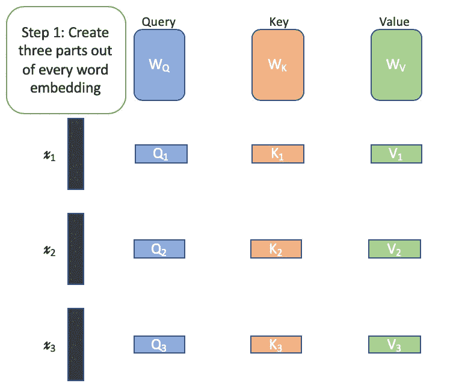*

*给定一个嵌入 *x* ，它*从中学习*三个独立的更小的嵌入——查询、键和值。它们有相同的维数。我所说的*学习*是指在训练阶段*、*、 *Wq、Wk、*和 *Wv* 矩阵是基于反向传播的损失来学习的。 *x* 与这三个矩阵相乘得到查询、键和值嵌入。*

*为了理解这些术语，让我们把这些词看作有生命的实体。每个单词都想知道其他每个单词对它的重视程度，然后创建一个更好的自身版本来代表这种重视程度。*

*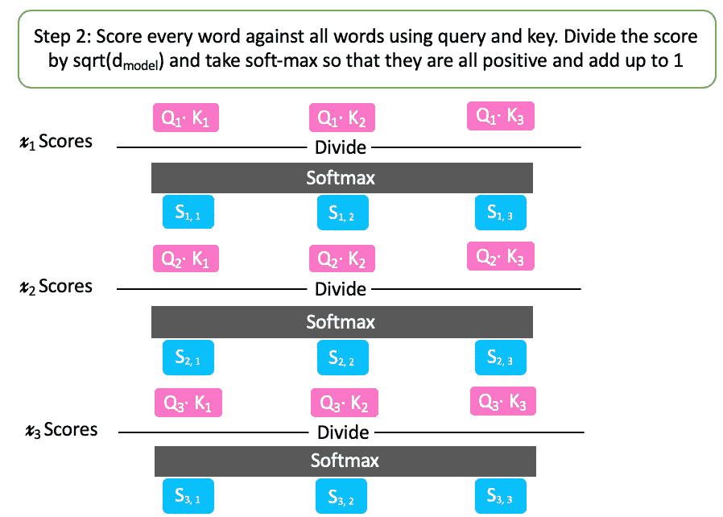*

*假设 *x1* 想知道它相对于 *x2 的值。*所以就要'*查询* ' *x2* 。 *x2* 将以其自身的“*关键字*”的形式提供答案，然后通过与*查询*进行点积，该答案可用于获得表示其对 *x1* 的重视程度的分数。因为两者大小相同，所以这将是一个单一的数字。这一步将对每个单词执行。*

*现在， *x1* 将获取所有这些分数并执行 softmax，以确保分数有界，同时还确保分数之间的相对差异得以保持。(还有将 softmax 之前的分数除以 d_model 的平方根的步骤——嵌入维度——以确保在 d_model 是大数的情况下分数太大的情况下梯度稳定。)*

*这个评分和 softmax 任务由每个单词对照所有其他单词来执行。上图描绘了整个解释的画面，现在会更容易理解。*

*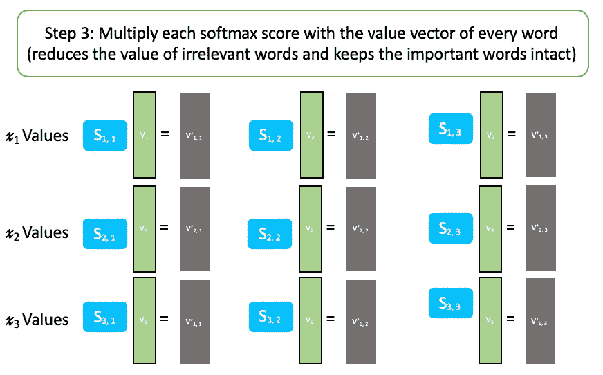*

**x1* 现在将使用该分数和相应单词的“*值*”来获得其自身相对于该单词的新值。如果单词与 *x1* 不相关，那么分数将会很小，并且相应的*值*将会作为该分数的一个因子而减少，并且类似地，重要单词将会得到其*值*的分数支持。*

*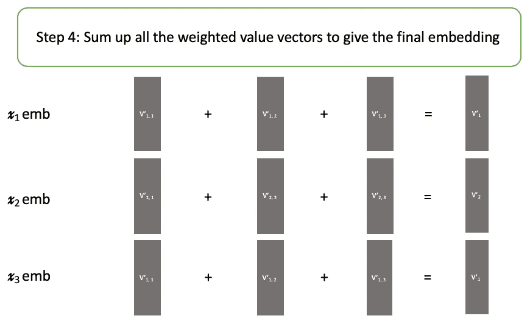*

*最后，字 *x1* 将通过对接收到的值求和来为自己创建新的*值*。这将是这个词的新嵌入。*

*但是自我关注层比这要复杂一点。transformer 架构为这一层增加了多头关注。一旦这个概念清晰了，我们将会更接近最终的变压器设计。*

## *多头注意力*

*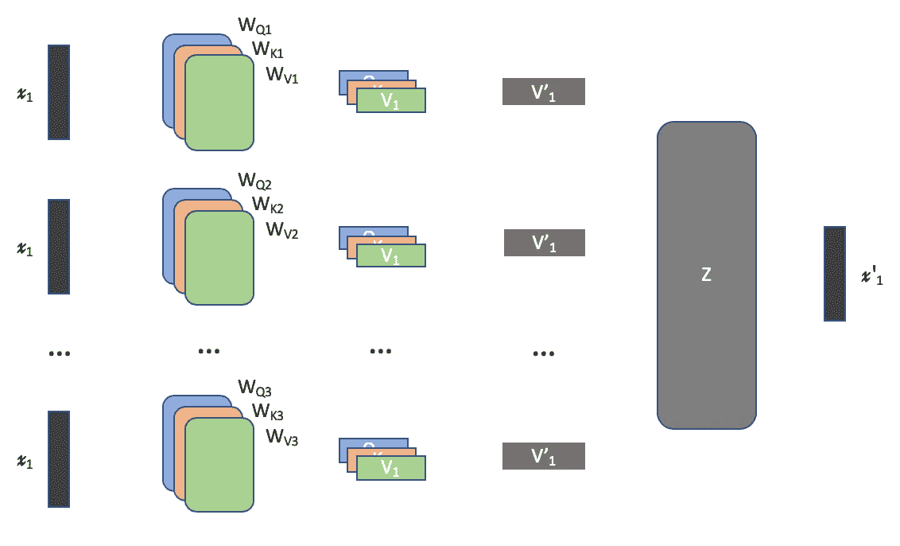*

*使用相同的原始 *x1* 、 *x2* 等来*学习多个这样的查询、关键字和值集合*。嵌入。自关注步骤分别在每个集合上执行，新嵌入*v’1*、*v’2*等。为每个集合创建。然后将这些连接起来，并与另一个学习矩阵 *Z* (其被联合训练)相乘，这将这些多个嵌入减少为针对*x’1*、*x’2*等的单个嵌入。这就是为什么这被称为多头注意力，每个 v '代表自我注意力模型的一个头。*

*这种设计的直观原因是每个头在不同的上下文中查看原始嵌入，因为每个 Q、K、V 矩阵在开始时被随机初始化，然后基于训练期间反向传播的损失被修改。因此最终的嵌入是在同时考虑各种上下文的情况下学习的。*

*因此，在自我关注这一节的最后，我们看到自我关注层将位置注入的原始嵌入形式作为输入，并输出更多的上下文感知嵌入。这样，我们就解决了上述问题中最困难的部分。*

# *图层规范化*

*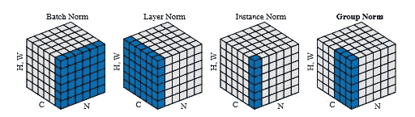*

*Normalization Techniques[[2]](https://arxiv.org/abs/1803.08494)*

*图层归一化的关键特征是它**对所有特征的输入进行归一化，**不同于批量归一化，批量归一化对所有特征进行归一化。批量定额的缺陷在于它对批量大小施加了一个下限。在层规范中，统计数据是跨每个特征计算的*，并且**独立于其他示例**。实验证明，它的性能更好。**

*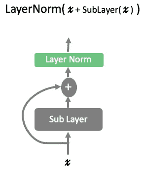*

*在变形金刚中，层标准化是通过残差完成的，允许它保留来自前一层的某种形式的信息。*

# *前馈神经网络*

*每个编码器和解码器模块包含一个前馈神经网络。它由两个线性层组成，其间有一个 relu 激活。它被分别且相同地应用于每个位置。因此，它的输入是一组嵌入*x’1*、*x’2*等等。并且输出是另一组嵌入 *x''1* 、 *x''2* 等。映射到整个语言共有的另一个潜在空间。*

*这样，网络的编码器端就应该清楚了。现在，我们只剩下两个问题，我们开始时的问题——掩盖的自我注意和编码注意。*

*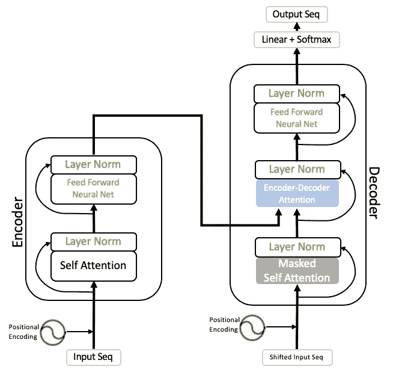*

# *伪装的自我关注*

*在任何位置，一个词可能既依赖于它前面的词，也依赖于它后面的词。在《我看见 ______ 在追一只老鼠》中。我们会直观地填写 cat，因为这是最有可能的一个。因此，在对一个单词进行编码时，它需要知道整个句子中的所有内容。这就是为什么在自我关注层中，查询是用所有单词对所有单词进行的。但是**在解码**时，当试图预测句子中的下一个单词时(这就是为什么我们对解码器输入使用移位的输入序列)，逻辑上，它不应该知道在我们试图预测的单词之后出现的单词是什么。因此，所有这些嵌入都通过乘以 0 来屏蔽，使它们中的任何值都变成 0，并且仅基于使用它之前的单词创建的嵌入来进行预测。*

> *这种屏蔽与输出嵌入偏移一个位置的事实相结合，确保了位置 I 的预测只能依赖于小于 I 的位置处的已知输出。*

# *编码器-解码器注意*

*如果你仔细观察上面的网络，来自编码器模块的输入来自这一层的编码器。在此之前，解码器已经使用了从先前的预测中可以获得的任何信息，并且学习了那些单词的新嵌入。在这一层，它使用编码器来更好地理解上下文和原始序列中的完整句子。它是怎么做到的？*

*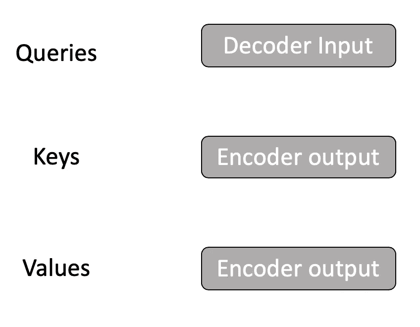*

*解码器利用原始序列中单词的编码嵌入来查询所有现有单词，这些单词携带位置信息以及上下文信息。新的嵌入现在被注入该信息，并且输出序列现在基于该信息被预测。*

*至此，我们已经弄清楚了 transformer 架构，但是还有一个部分我还没有指定。*

# *编码器-解码器堆栈*

*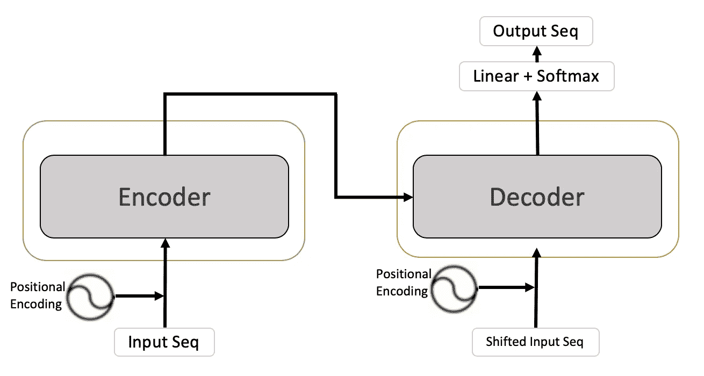*

*这是我们到目前为止拥有的变压器的架构。我们需要注意的是，编码器的输出是原始嵌入的改进版本。因此，我们应该能够通过添加更多来进一步改进它。这是变压器网络最终设计中要考虑的一点。*

*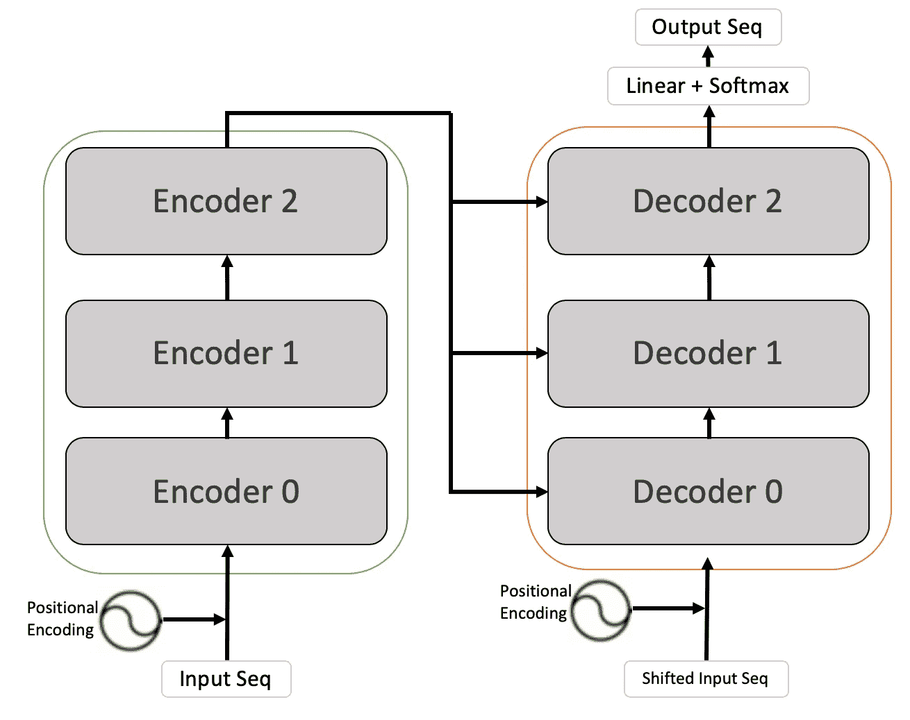*

*最初的架构有 4 个这样的编码器和解码器。只有最终编码器的输出被用作解码器输入。*

# *结论*

*我们从变压器的基本设计开始，在单个编码器和解码器集中包含不同的层。然后，我们了解了每一层如何工作的细节。在此期间，我们还讨论了自我关注层的多头架构。一旦编码器和解码器都清楚了，我们就进入架构的最后一部分，编码器-解码器堆栈。*

*这就完成了变压器架构的详细设计。我希望这有所有的细节，需要理解完整的图片。基于变换器的网络的最普遍的例子之一是用于自然语言处理任务的 BERT 模型。*

*我还没有涉及网络的训练和预测细节，因为这将需要另一个完整的帖子，这对我来说很容易是更有趣和复杂的部分。在下一篇文章中，我将讲述我们如何使用变形金刚来处理图像和无监督学习的任务。*

*我希望你觉得这很有用并且容易理解。如果有任何更正或任何形式的反馈，我希望收到您的来信。请在这里评论，让我知道或发电子邮件给我@ catchpranay@gmail.com*

# *参考资料:*

*[1]瓦斯瓦尼、阿希什等人，“你所需要的只是注意力。”(2017)，*神经信息处理系统进展*。2017.*

*[2]吴，庾信，，何。“分组规范化。”(2018)，*《欧洲计算机视觉会议论文集(ECCV)* 。2018.*

* [## 第 1 天和第 2 天:注意— Seq2Seq 型号

### 序列对序列(abrv。Seq2Seq)模型是深度学习模型，已经在一些任务中取得了很大的成功，比如…

medium.com](https://medium.com/@catchpranay/day-1-2-attention-seq2seq-models-65df3f49e263)  [## 翻译与序列到序列网络和注意力- PyTorch 教程 1.1.0…

### 类似于字符级 RNN 教程中使用的字符编码，我们将用一个…

pytorch.org](https://pytorch.org/tutorials/intermediate/seq2seq_translation_tutorial.html)  [## 什么是变压器？

### 机器学习中的变压器和序列对序列学习介绍

medium.com](https://medium.com/inside-machine-learning/what-is-a-transformer-d07dd1fbec04)  [## 图示的变压器

### 讨论:黑客新闻(65 分，4 条评论)，Reddit r/MachineLearning (29 分，3 条评论)翻译…

jalammar.github.io](https://jalammar.github.io/illustrated-transformer/)  [## 深度学习中的规范化方法综述

### 深度学习中的规范化一直是热门话题。获得正确的标准化可能是…

mlexplained.com](https://mlexplained.com/2018/11/30/an-overview-of-normalization-methods-in-deep-learning/)*