# 变压器如何工作

> 原文：<https://towardsdatascience.com/transformers-141e32e69591?source=collection_archive---------0----------------------->

## Open AI 和 DeepMind 使用的神经网络

如果你喜欢这篇文章，并想了解机器学习算法是如何工作的，它们是如何产生的，它们将走向何方，我推荐以下内容:

 [## 让事物思考:人工智能和深度学习如何为我们使用的产品提供动力

### 这是显而易见的，但大多数时候却很难看到。人们说‘这和你脸上的鼻子一样明显。’…

www.holloway.com](https://www.holloway.com/g/making-things-think) 

变压器是一种越来越受欢迎的神经网络架构。变形金刚最近被 OpenAI 用于他们的语言[模型](https://blog.openai.com/better-language-models/)，最近也被 DeepMind 用于[阿尔法星](https://deepmind.com/blog/alphastar-mastering-real-time-strategy-game-starcraft-ii/)——他们击败顶级职业星际玩家的程序。

变形金刚是为了解决 [**序列转导**](https://arxiv.org/abs/1211.3711)**或**神经机器翻译的问题而开发的。**这意味着将输入序列转换成输出序列的任何任务。这包括语音识别、文本到语音转换等..**

****

**Sequence transduction. The input is represented in green, the model is represented in blue, and the output is represented in purple. GIF from [3](https://jalammar.github.io/visualizing-neural-machine-translation-mechanics-of-seq2seq-models-with-attention/)**

**对于执行**序列转导的模型来说，**有某种记忆是必要的。例如，假设我们将下面的句子翻译成另一种语言(法语):**

> **“变形金刚”是一支日本[[硬核朋克]]乐队。该乐队成立于 1968 年，正值日本音乐史上的鼎盛时期**

**在本例中，第二句中的单词“the band”指的是第一句中介绍的乐队“The Transformers”。当你读到第二句中的乐队时，你知道它指的是“变形金刚”乐队。这对翻译可能很重要。有很多例子，有些句子中的词引用了前面句子中的词。**

**为了翻译这样的句子，模型需要找出这种依赖和联系。由于递归神经网络(RNNs)和卷积神经网络(CNN)的特性，它们已经被用来处理这个问题。让我们回顾一下这两种架构及其缺点。**

# ****递归神经网络****

**递归神经网络中有环路，允许信息持续存在。**

**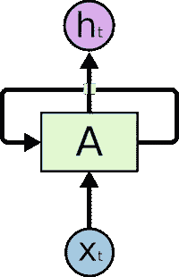**

**The input is represented as x_t**

**在上图中，我们看到神经网络的一部分， **A，**处理一些输入 x_t 和输出 h_t，一个循环允许信息从一个步骤传递到下一个步骤。**

**这些循环可以用不同的方式来思考。一个递归神经网络可以被认为是同一个网络的多个副本，**一个**，每个网络传递一个信息给下一个。考虑一下如果我们展开循环会发生什么:**

****

**An unrolled recurrent neural network**

**这种链状性质表明，递归神经网络与序列和列表明显相关。这样，如果我们想要翻译一些文本，我们可以将每个输入设置为该文本中的单词。递归神经网络将前面单词的信息传递给下一个可以使用和处理该信息的网络。**

**下图显示了序列到序列模型通常如何使用递归神经网络工作。每个单词被单独处理，通过将隐藏状态传递给解码阶段来生成结果句子，然后解码阶段生成输出。**

**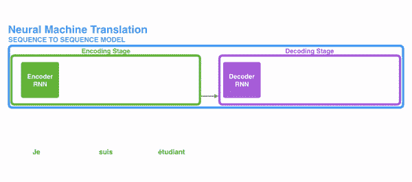**

**GIF from [3](https://jalammar.github.io/visualizing-neural-machine-translation-mechanics-of-seq2seq-models-with-attention/)**

## **长期依赖的问题**

**考虑一个语言模型，它试图根据前面的单词预测下一个单词。如果我们试图预测句子**“天空中的云”**的下一个单词，我们不需要进一步的上下文。很明显，下一个词将会是**天空。****

**在这种情况下，相关信息和需要的地方之间的差异很小，RNNs 可以学习使用过去的信息，并找出这个句子的下一个单词是什么。**

**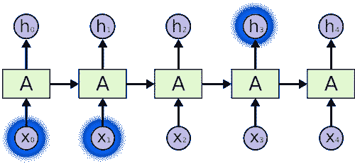**

**Image from [6](http://colah.github.io/posts/2015-08-Understanding-LSTMs/)**

**但是有些情况下我们需要更多的上下文。比如说你在试着预测课文的最后一个单词:**“我在法国长大…我说得很流利…”。**最近的信息表明，下一个单词可能是一种语言，但如果我们想缩小哪种语言的范围，我们需要法国的上下文，那是在文本的更后面。**

**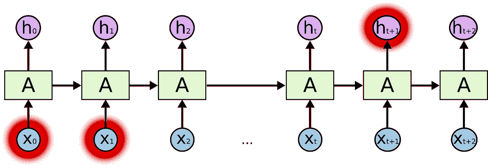**

**Image from [6](http://colah.github.io/posts/2015-08-Understanding-LSTMs/)**

**当相关信息和需要信息的点之间的差距变得非常大时，rnn 变得非常无效。这是因为信息是在每一步传递的，链越长，信息就越有可能沿着链丢失。**

**理论上，RNNs 可以学习这种长期依赖性。在实践中，他们似乎不学[他们](http://ai.dinfo.unifi.it/paolo//ps/tnn-94-gradient.pdf)。LSTM，一种特殊类型的 RNN，试图解决这种问题。**

# **长短期记忆(LSTM)**

**当安排一天的日程时，我们会优先安排我们的约会。如果有什么重要的事情，我们可以取消一些会议，把重要的事情放在一边。**

**RNNs 不会这么做的。每当它添加新信息时，它通过应用一个函数来完全转换现有信息。整个信息都被修改，没有考虑什么重要什么不重要。**

**LSTMs 通过乘法和加法对信息进行小的修改。在 LSTMs 中，信息通过一种称为单元状态的机制流动。通过这种方式，LSTMs 可以选择性地记住或忘记重要的和不那么重要的事情。**

**在内部，LSTM 看起来如下:**

****

**Image from [6](http://colah.github.io/posts/2015-08-Understanding-LSTMs/)**

**每个单元将输入 **x_t** (在句子到句子翻译的情况下是一个单词)、**前一个单元状态**和前一个单元的**输出** **作为输入。它处理这些输入，并基于它们生成新的细胞状态和输出。我不会详细讨论每个细胞的结构。如果你想了解每个细胞是如何工作的，我推荐克里斯托弗的博文:****

 **[## 了解 LSTM 网络——colah 的博客

### 这些循环使得循环神经网络看起来有点神秘。然而，如果你想得更多一点，事实证明…

colah.github.io](http://colah.github.io/posts/2015-08-Understanding-LSTMs/)** 

**利用单元状态，在翻译时，句子中对于翻译单词来说重要的信息可以从一个单词传递到另一个单词。**

## **LSTMs 的问题是**

**通常发生在 rnn 上的同样的问题也会发生在 lstm 上，也就是说，当句子太长时，lstm 仍然做得不太好。其原因是，保持远离当前正在处理的单词的单词的上下文的概率随着离它的距离而指数下降。**

**这意味着当句子很长时，模型经常会忘记序列中远处位置的内容。RNNs 和 LSTMs 的另一个问题是很难并行处理句子，因为你必须一个字一个字地处理。不仅如此，也没有长期和短期依赖关系的模型。总之，LSTMs 和 RNNs 存在 3 个问题:**

*   **顺序计算抑制了并行化**
*   **没有长短期依赖关系的显式建模**
*   **位置之间的“距离”是线性的**

# **注意力**

**为了解决其中的一些问题，研究人员创造了一种关注特定单词的技术。**

**翻译句子时，我会特别注意我正在翻译的单词。当我转录一段录音时，我会仔细听我主动写下的片段。如果你让我描述我正坐的房间，我会一边描述一边扫视周围的物体。**

**神经网络可以使用 ***注意力*** 实现同样的行为，专注于它们被给予的信息子集的一部分。例如，一个 RNN 可以参与另一个 RNN 的输出。在每一个时间步，它聚焦于另一个 RNN 的不同位置。**

**为了解决这些问题，**注意力**是一种在神经网络中使用的技术。对于 RNNs 来说，每个单词都有一个相应的隐藏状态，并一直传递到解码阶段，而不是仅以隐藏状态对整个句子进行编码。然后，在 RNN 的每一步使用隐藏状态进行解码。下面的 gif 展示了这是如何发生的。**

**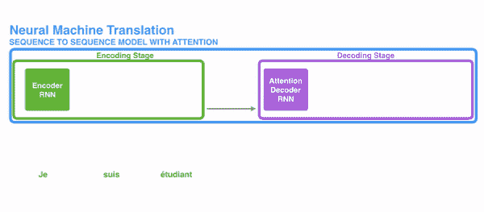**

**The **green** step is called the **encoding stage** and the purple step is the **decoding stage.** GIF from[3](http://3)**

**其背后的想法是，一个句子中的每个单词都可能有相关的信息。所以为了解码精确，它需要考虑输入的每个单词，使用**注意力。****

**为了在序列转导中引起对 RNNs 的注意，我们将编码和解码分成两个主要步骤。一步用绿色的**表示，另一步用紫色的**表示。**绿色的**步骤被称为**编码阶段**，紫色的步骤是**解码阶段。********

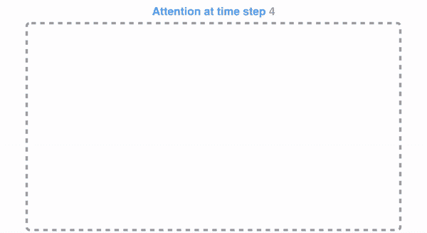

GIF from [3](https://jalammar.github.io/visualizing-neural-machine-translation-mechanics-of-seq2seq-models-with-attention/)

绿色部分负责从输入中创建隐藏状态。我们不是像使用 **attention** 之前那样只将一个隐藏状态传递给解码器，而是将句子的每个“单词”生成的所有隐藏状态传递给解码阶段。每个隐藏状态在解码阶段使用，以计算出网络应该注意的地方。

例如，当将句子“**Je suisétudiant”**翻译成英语时，要求解码步骤在翻译时查看不同的单词。

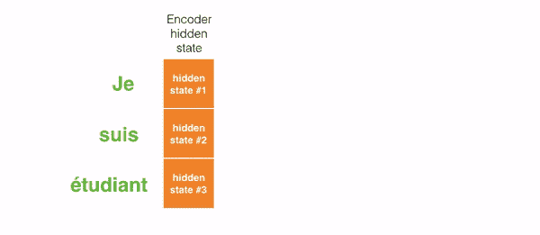

This gif shows how the weight that is given to each hidden state when translating the sentence “Je suis étudiant” to English. The darker the color is, the more weight is associated to each word. GIF from [3](https://jalammar.github.io/visualizing-neural-machine-translation-mechanics-of-seq2seq-models-with-attention/)

例如，当你翻译句子“1992 年 8 月欧洲经济区协议”从法语到英语，以及对每个输入的重视程度。

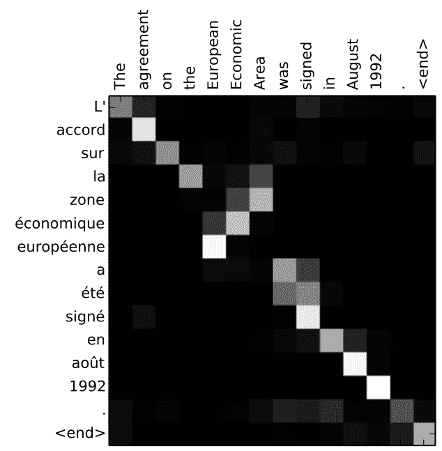

Translating the sentence “L’accord sur la zone économique européenne a été signé en août 1992.” to English. Image from [3](https://jalammar.github.io/visualizing-neural-machine-translation-mechanics-of-seq2seq-models-with-attention/)

但是我们讨论过的一些问题，仍然没有通过使用**注意力的 RNNs 得到解决。例如，并行处理输入(单词)是不可能的。对于大型文本语料库，这增加了翻译文本所花费的时间。**

# 卷积神经网络

卷积神经网络有助于解决这些问题。有了他们，我们可以

*   并行化很简单(每层)
*   利用本地依赖性
*   位置之间的距离是对数的

一些最流行的用于序列转导的神经网络 Wavenet 和 Bytenet 是卷积神经网络。

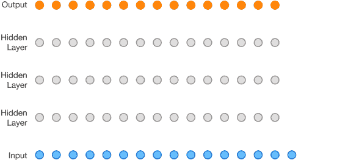

Wavenet, model is a Convolutional Neural Network (CNN). Image from [10](https://deepmind.com/blog/wavenet-generative-model-raw-audio/)

卷积神经网络可以并行工作的原因是输入的每个单词可以同时处理，而不一定依赖于要翻译的前面的单词。不仅如此，对于一个 CNN 来说，输出单词与任何输入之间的“距离”依次为[**【log(N)**](https://www.youtube.com/watch?v=rBCqOTEfxvg&t=8m21s)——也就是从输出到输入生成的树的高度大小(你可以在上面的 GIF 上看到。这比一个 RNN 的输出和一个输入的距离要好得多，后者的数量级为[T5【N](https://www.youtube.com/watch?v=rBCqOTEfxvg&t=8m21s)**。**

问题是，卷积神经网络不一定有助于解决翻译句子时的依赖问题。这就是为什么**变形金刚**被创造出来，它们是两个 CNN 与关注的结合。

# 变形金刚(电影名)

为了解决并行化问题，Transformers 试图通过使用卷积神经网络和**注意力模型来解决问题。**注意力提高了模型从一个序列转换到另一个序列的速度。

我们来看看**变压器**是怎么工作的。Transformer 是一个利用**注意力**来提升速度的模型。更具体地说，它使用了**自我关注。**

The Transformer. Image from [4](http://jalammar.github.io/illustrated-transformer/)

从内部来看，Transformer 的体系结构与前面的模型类似。但是转换器由六个编码器和六个解码器组成。

Image from [4](http://jalammar.github.io/illustrated-transformer/)

每个编码器都非常相似。所有编码器都具有相同的架构。解码器共享相同的属性，即它们彼此也非常相似。每个编码器包括两层:**自关注**和一个前馈神经网络。

Image from [4](http://jalammar.github.io/illustrated-transformer/)

编码器的输入首先流经**自关注**层。它帮助编码器在对特定单词进行编码时查看输入句子中的其他单词。解码器有这两层，但在它们之间有一个注意力层，帮助解码器关注输入句子的相关部分。

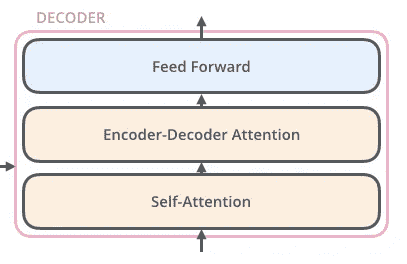

Image from [4](http://jalammar.github.io/illustrated-transformer/)

# 自我关注

**注:**此部分来自 Jay Allamar [博客文章](http://jalammar.github.io/illustrated-transformer/)

让我们开始看看各种向量/张量，以及它们如何在这些组件之间流动，以将训练模型的输入转化为输出。正如 NLP 应用程序中的一般情况一样，我们首先使用[嵌入算法](https://medium.com/deeper-learning/glossary-of-deep-learning-word-embedding-f90c3cec34ca)将每个输入单词转换成一个向量。

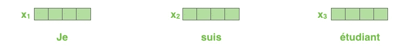

Image taken from [4](http://jalammar.github.io/illustrated-transformer/)

每个单词被嵌入到大小为 512 的向量中。我们将用这些简单的盒子来表示这些向量。

嵌入只发生在最底层的编码器中。所有编码器共有的抽象是它们接收每个大小为 512 的向量列表。

在底部的编码器中，这将是单词嵌入，但在其他编码器中，这将是直接在下面的编码器的输出。在我们的输入序列中嵌入单词后，它们中的每一个都流经编码器的两层中的每一层。

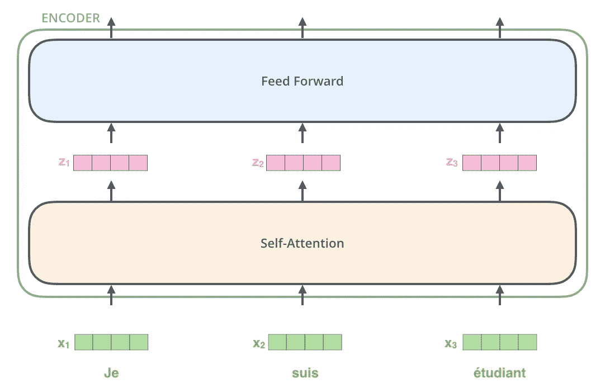

Image from [4](http://jalammar.github.io/illustrated-transformer/)

在这里，我们开始看到转换器的一个关键属性，即每个位置的字在编码器中通过自己的路径流动。在自我关注层，这些路径之间存在依赖关系。然而，前馈层没有这些依赖性，因此各种路径可以在流经前馈层时并行执行。

接下来，我们将把这个例子换成一个更短的句子，看看编码器的每个子层发生了什么。

## 自我关注

让我们首先看看如何使用向量来计算自我注意力，然后继续看看它实际上是如何实现的——使用矩阵。

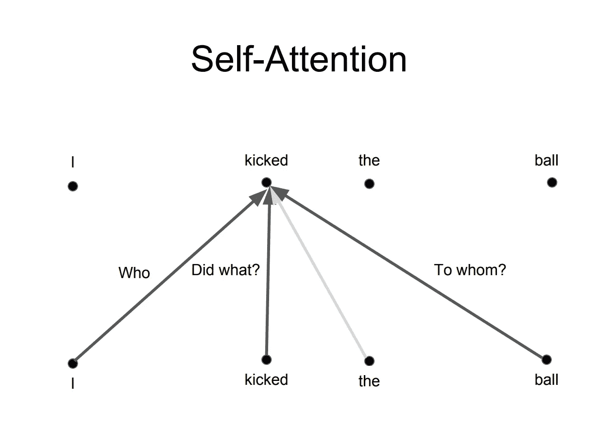

Figuring out relation of words within a sentence and giving the right **attention** to it. Image from [8](http://web.stanford.edu/class/cs224n/slides/cs224n-2019-lecture14-transformers.pdf)

计算自我注意力的第一步**是从编码器的每个输入向量中创建三个向量(在这种情况下，是每个单词的嵌入)。因此，对于每个单词，我们创建一个查询向量、一个键向量和一个值向量。这些向量是通过将嵌入乘以我们在训练过程中训练的三个矩阵而创建的。**

请注意，这些新向量的维数小于嵌入向量。它们的维数是 64，而嵌入和编码器输入/输出向量的维数是 512。它们不一定要更小，这是一种架构选择，以使多头注意力的计算(大部分)保持不变。

Image taken from [4](http://jalammar.github.io/illustrated-transformer/)

将 x1 乘以 WQ 权重矩阵产生 q1，即与该单词相关联的“查询”向量。我们最终创建了输入句子中每个单词的“查询”、“键”和“值”投影。

什么是“查询”、“键”和“值”向量？

它们是对计算和思考注意力有用的抽象概念。一旦你开始阅读下面的注意力是如何计算的，你就会知道你所需要知道的关于这些向量所扮演的角色。

计算自我关注度的**第二步**是计算一个分数。假设我们在计算这个例子中第一个词“思考”的自我关注度。我们需要将输入句子中的每个单词与这个单词进行比较。分数决定了当我们在某个位置对一个单词进行编码时，对输入句子的其他部分的关注程度。

分数是通过查询向量与我们正在评分的相应单词的关键向量的点积来计算的。因此，如果我们正在处理位置#1 的单词的自我注意，第一个分数将是 q1 和 k1 的点积。第二个分数是 q1 和 k2 的点积。

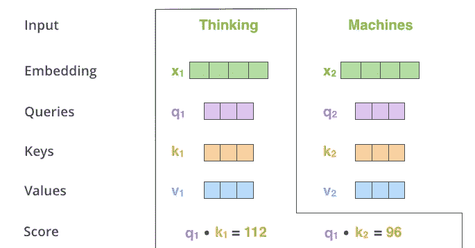

Image from [4](http://jalammar.github.io/illustrated-transformer/)

**第三和第四步**是将分数除以 8(文中使用的关键向量的维数的平方根— 64。这导致具有更稳定的梯度。这里可能有其他可能的值，但这是默认值)，然后通过 softmax 操作传递结果。Softmax 将分数标准化，因此它们都是正数，加起来等于 1。

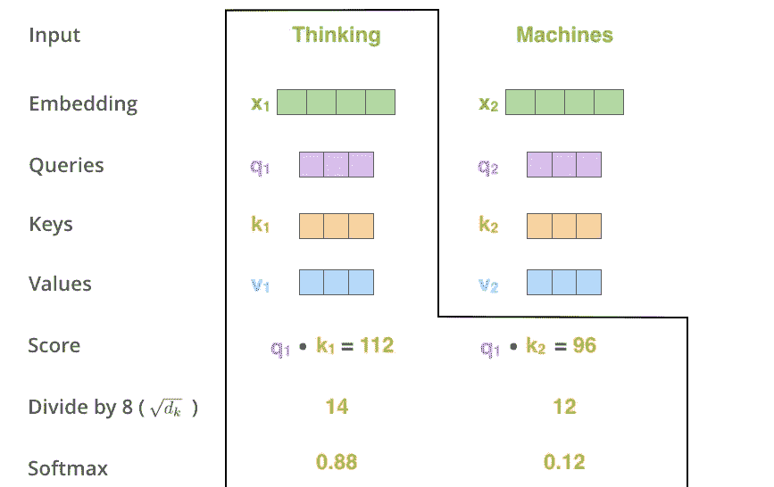

Image from [4](http://jalammar.github.io/illustrated-transformer/)

这个 softmax 分数决定了每个单词在这个位置将被表达多少。显然，在这个位置的单词将具有最高的 softmax 分数，但是有时关注与当前单词相关的另一个单词是有用的。

**第五步**是将每个值向量乘以 softmax 分数(准备将它们相加)。这里的直觉是保持我们想要关注的单词的值不变，并淹没不相关的单词(例如，通过将它们乘以像 0.001 这样的小数字)。

**第六步**是对加权值向量求和。这就在这个位置产生了自我关注层的输出(针对第一个单词)。

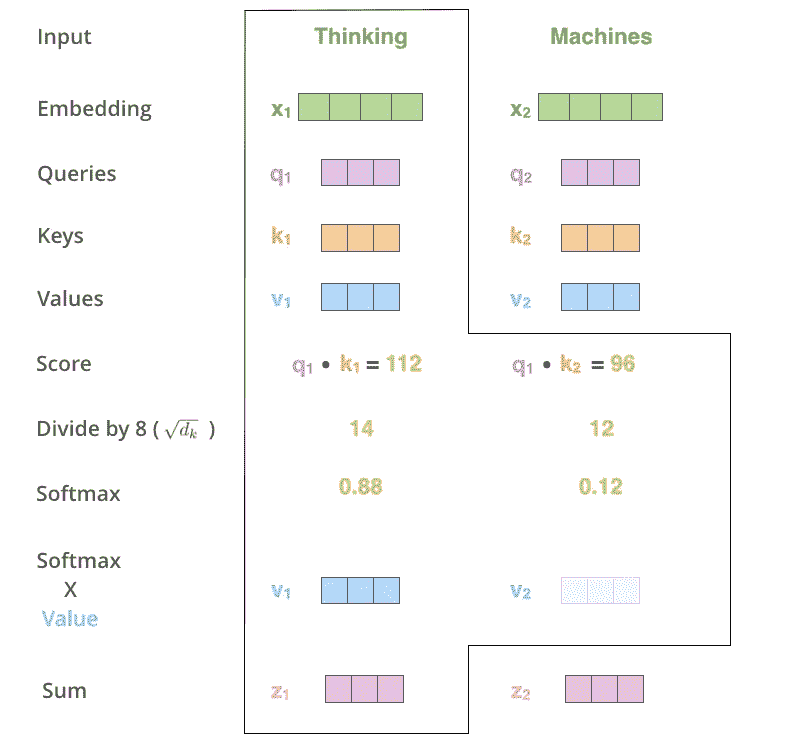

Image from [4](http://jalammar.github.io/illustrated-transformer/)

自我关注的计算到此结束。得到的向量是我们可以发送给前馈神经网络的向量。然而，在实际实现中，这种计算是以矩阵形式进行的，以便更快地处理。现在让我们来看看，我们已经看到了单词级别的计算的直觉。

## 多头注意力

变形金刚基本就是这样工作的。还有一些其他细节使它们工作得更好。例如，变形金刚不是只在一个维度上关注彼此，而是使用了多头关注的概念。

其背后的想法是，每当你翻译一个单词时，你可能会根据你所提问题的类型对每个单词给予不同的关注。下图显示了这意味着什么。例如，每当你在翻译“我踢了球”这句话中的“kicked”时，你可能会问“谁踢了”。根据不同的答案，这个词的另一种语言的翻译会有所不同。或者问其他问题，比如“做了什么？”等等…

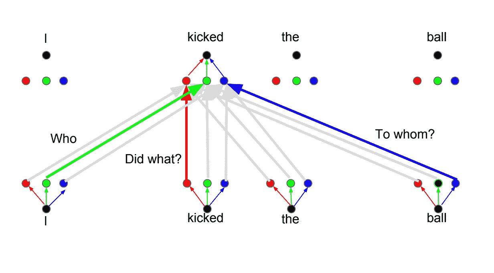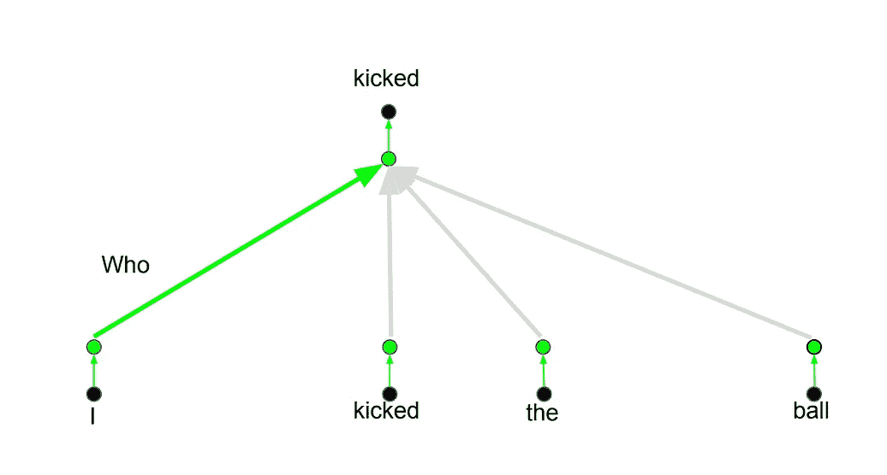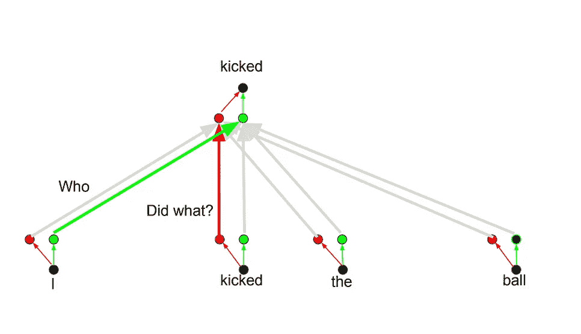

Images from [8](http://web.stanford.edu/class/cs224n/slides/cs224n-2019-lecture14-transformers.pdf)

## 位置编码

转换器的另一个重要步骤是在对每个单词进行编码时添加位置编码。编码每个单词的位置是相关的，因为每个单词的位置与翻译相关。

# 概观

我概述了变压器是如何工作的，以及为什么这是用于序列转导的技术。如果你想深入了解这个模型的工作原理及其所有的细微差别，我推荐下面的帖子、文章和视频，我把它们作为总结这个技术的基础

1.  [递归神经网络的不合理有效性](http://karpathy.github.io/2015/05/21/rnn-effectiveness/)
2.  [了解 LSTM 网络](http://colah.github.io/posts/2015-08-Understanding-LSTMs/)
3.  [可视化神经机器翻译模型](https://jalammar.github.io/visualizing-neural-machine-translation-mechanics-of-seq2seq-models-with-attention/)
4.  [图示变压器](http://jalammar.github.io/illustrated-transformer/)
5.  [变压器——你只需要关注](https://mchromiak.github.io/articles/2017/Sep/12/Transformer-Attention-is-all-you-need/#.XIWlzBNKjOR)
6.  [带注释的变压器](http://nlp.seas.harvard.edu/2018/04/03/attention.html)
7.  [注意力是你所需要的全部注意力神经网络模型](https://www.youtube.com/watch?v=rBCqOTEfxvg)
8.  [生成模型的自我关注](http://web.stanford.edu/class/cs224n/slides/cs224n-2019-lecture14-transformers.pdf)
9.  [OpenAI GPT-2:通过可视化理解语言生成](/openai-gpt-2-understanding-language-generation-through-visualization-8252f683b2f8)
10.  [WaveNet:原始音频的生成模型](https://deepmind.com/blog/wavenet-generative-model-raw-audio/)