# 为机器学习预测中的可用性转换分类数据

> 原文：<https://towardsdatascience.com/transforming-categorical-data-for-usability-in-machine-learning-predictions-90459c3fc967?source=collection_archive---------17----------------------->

## 使用邮政编码、纬度和经度的快速示例

凯文·维拉斯科&亚历克斯·什罗普郡

给定华盛顿州金县 2014 年至 2015 年(【https://www.kaggle.com/harlfoxem/housesalesprediction】T2)的房屋销售数据集，我们的任务是创建一个模型来准确预测房屋销售价格。经过最初的数据探索和清理，我们发现了大量描述房屋质量的有用信息，但没有多少关于位置的有用信息。

Aerial photo of Seattle by Thatcher Kelley

## 为什么位置对我们的数据集很重要

我们都听说过被过度使用的短语“位置，位置，位置”作为房地产市场评估的中心主题。人们普遍认为这是决定一个人应该住在哪里的最重要的因素。价格和位置往往与买家密切相关。任何房屋的条件、价格和大小都可能改变。唯一不变的是房子的位置。

以我们数据集的邮政编码特征为例:

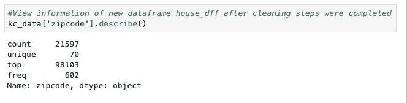

在其当前形式中，在“邮政编码”列中有 70 个唯一的分类值，机器学习模型无法提取每个邮政编码中包含的任何有用信息来评估与价格的关系。在每一个类别中都存在一个有意义的房地产因素的独特选择，如公园、学校、咖啡馆、商店、杂货店、公共交通和主要道路。所有这些都是主要因素，可以表明西雅图的沃灵福社区与亚基马山谷中部的住宅之间的内在差异。揭示邮政编码在价格方面的内在品质对于纳入我们的价格预测模型非常重要，因此我们必须适应以保持类别的力量。

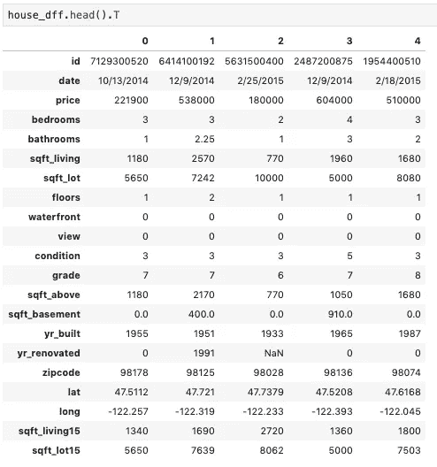

快速浏览一下上面的信息，很明显我们需要设计新的功能来理解邮政编码，以及经度和纬度！

## 转换和理解分类数据

我们以独特的方式正确应用纬度和经度信息的方法包括创建一个功能来测量到贝尔维尤和西雅图这两个主要经济中心的距离，以便改进我们的价格预测。我们没有通过创建一个数学函数来重新发明轮子，而是决定通过下图所示的哈弗辛公式来计算距离:

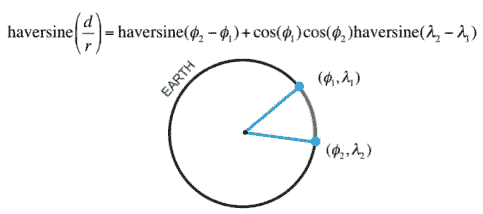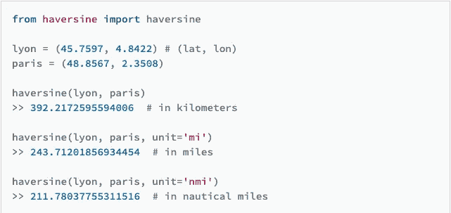

Example of the Haversine function

哈弗辛模块([https://pypi.org/project/haversine/](https://pypi.org/project/haversine/))为我们节省了大量时间。Haversine 接受两个纬度和经度元组，并计算特定单元中两个地理点之间的地理距离。我们假设房价与西雅图市中心和贝尔维尤市中心地区之间存在显著关系，选择这两个地区是因为它们是该地区最大的就业中心&和经济活动中心。我们认为缩短通勤时间和方便获取大城市的资源通常会增加需求，从而提高价格。

对于这个公式，我们需要转换每栋房子的坐标。给定单独列中的纬度和经度，我们应用 zip 函数创建一个新的坐标元组列:

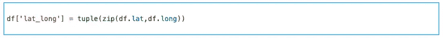

利用数据集中每个家庭的单点，以及两个参考点，哈弗辛公式的所有变量都被创建。事实证明，将函数直接应用到现有数据框架的新列中是很棘手的。为了创建一个指示距离的新列，我们必须从列表数据类型创建一个 Pandas 系列，然后将其添加到现有的 Dataframe 中。

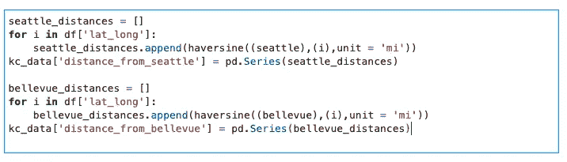

最后，我们创建了另一个列，它选择两点之间的最小距离作为“距离震中”列的输入。这一步对于获取这两个城市的邻近信息非常重要，以确保我们对到经济中心的最短距离的解释为我们的模型解释做好准备。

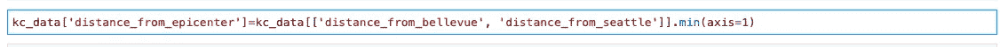

对于邮政编码，我们实现了 one hot encoding pd.get_dummies()方法，通过该方法，分类变量被转换成可以提供给 ML 算法的形式，以便更准确地预测价格。就我们的数据而言，我们希望获得邮政编码的一个类别，并将其转换为二进制 yes[1]，这一行是该邮政编码的成员，或者 no[0]，它不是。邮政编码的庞大数量起初似乎令人担忧，给我们的数据框架增加了许多列:

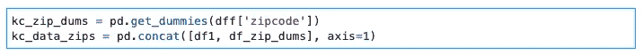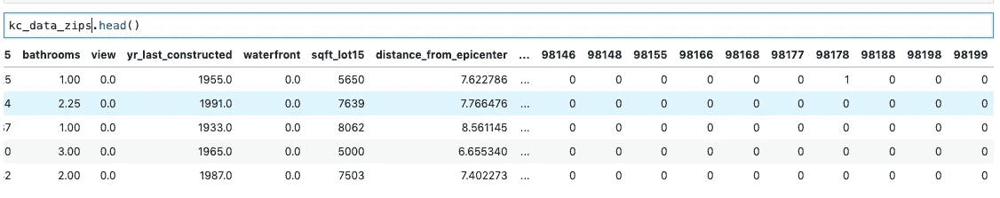

但是，通过将 zipcode 特性转换为包含二进制信息的多个列，我们就可以将它作为训练模型的一个特性。为了正确解释我们的模型将为所有列生成的系数，我们首先必须在 pd.get_dummies()方法之后选择一个不同的邮政编码来删除冗余信息。换句话说，我们删除了一个邮政编码列，因为每隔一个邮政编码列出现零表示该行是我们删除的邮政编码的一个成员。该信息是剩余的 n-1 列的二进制形式所固有的。我们选择放弃 98103 的邮政编码，它包括沃灵福德、格林莱克、菲尼岭、格林伍德和弗里蒙特地区。我们选择这个邮政编码是因为它代表了西雅图市中心的一个热门区域，我们希望它能被更广泛的西雅图观众理解为一个价格基准。我们想选择一个既不是比尔·盖茨的邮政编码，也不是更接近相反极端的邮政编码的邮政编码，这样很多其他邮政编码的房屋价格就会高于或低于 98103。最重要的是，整个过程确保了我们得到的系数可以用 98103 个邻域来解释。

## 我们模型改进工作的结果

经过仔细的数据清理和特征工程，我们的模型包含 10 个预测因子，包括一个初始的“距离西雅图”预测因子。在通过 statsmodels 的普通最小二乘线性回归模型运行数据集后，我们的汇总输出得出了相当不错的 R 平方(一种快速、简便的初始评估模型质量的方法):

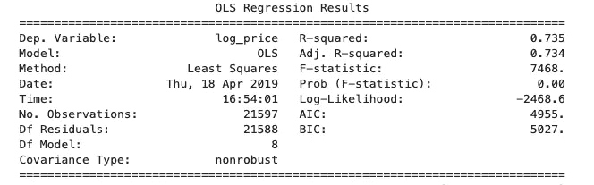

Initial OLS Results

在 0.735，我们的情况还不错，但还有改进的空间。意识到 R 平方作为模型质量度量的局限性，为了说明基本模型迭代之前和之后的场景，它可以发挥作用。也就是说，在整合了我们的“距离震中的距离”功能(整合了距离经济中心西雅图市中心和贝尔维尤市中心的距离)后:

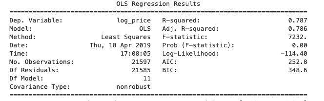

adding distance_from_epicenter

令人尊敬的进步！最后，通过使用 one-hot 编码将格式混乱的邮政编码类别转换为有用的数字格式:

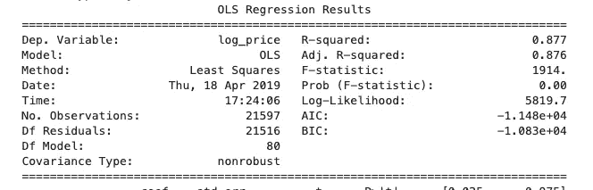

adding zipcode

有了这样一个显著的推动，并且取决于业务案例的潜在上下文，我们可能准备好部署我们的预测器或者引入新数据、设计新特性，或者简单地继续在现有数据集内迭代。我们的模型现在得出调整后的 R 平方为 0.876。换句话说，我们的线性模型可以解释 86.7%的响应变量变化。

## 最后的想法

回顾原始数据集和所提供的信息，最初看起来非常少的关于位置的可操作信息实际上包含了强大的分类邮政编码数据和可转换的纬度和经度数据，一旦每个数据的潜力被释放出来，它们就会对我们的机器学习算法产生巨大的改进。“位置，位置，位置”这句古老的格言在理解一个住宅的市场价格时，似乎仍然具有真正的力量。从这里开始，可以考虑时间、更大的地理界限和来自其他需求影响模式的数据等变量，特别是当房地产/物业技术领域的高增长公司进入分析军备竞赛以成为最有知识的公司时。我知道你们是好人，但我们是为你们而来的。

**如需了解项目详情、我们最准确的价格预测代码以及相关幻灯片，请查看我们的 GitHub repos:**

亚历克斯·什罗普希尔:

 [## as 6140/king county wa _ home _ price _ predictor

### 通过在 GitHub 上创建一个帐户，为 as 6140/kingcountyWA _ home _ price _ predictor 开发做出贡献。

github.com](https://github.com/as6140/kingcountyWA_home_price_predictor) 

凯文·维拉斯科:

 [## kevinthedou/DSC-1-final-project-Seattle-ds-career-040119

### 通过在 GitHub 上创建一个帐户，为 kevinthedou/DSC-1-final-project-Seattle-ds-career-040119 开发做贡献。

github.com](https://github.com/kevintheduu/dsc-1-final-project-seattle-ds-career-040119) 

**在 Linkedin 上保持联系！**

凯文:https://www.linkedin.com/in/kevinrexisvelasco/

亚历克斯:[https://www.linkedin.com/in/alexshropshire/](https://www.linkedin.com/in/alexshropshire/)