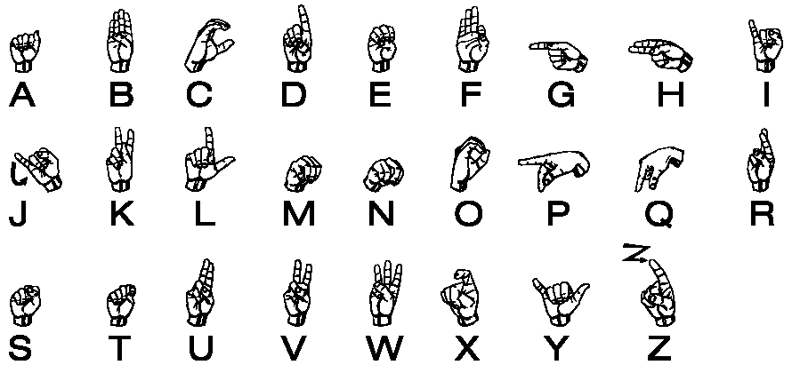
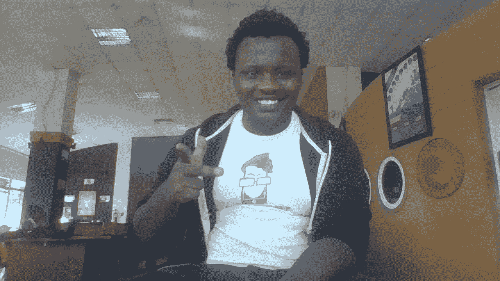
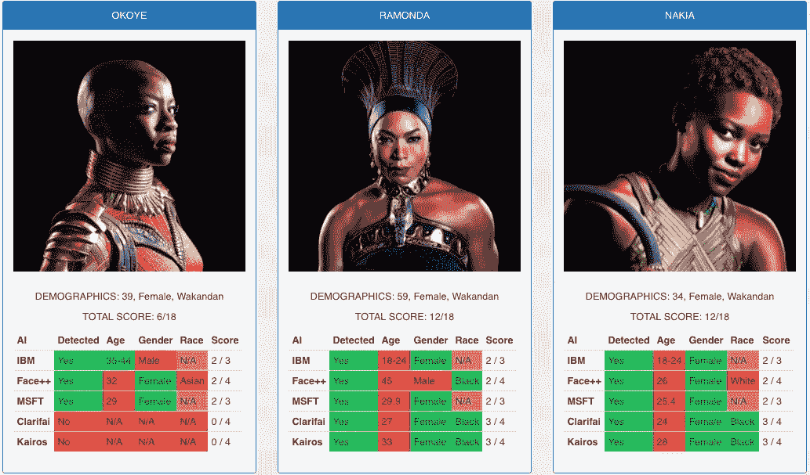
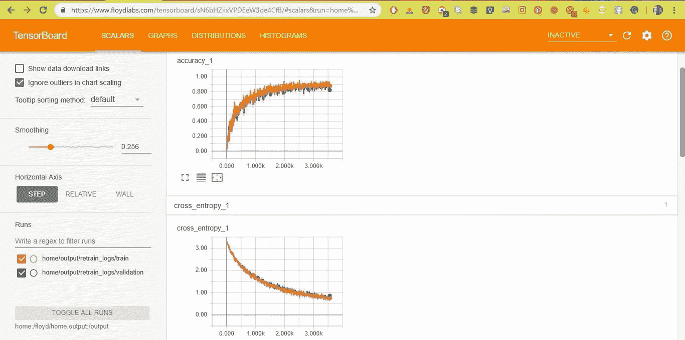

# 用深度学习翻译肯尼亚手语

> 原文：<https://towardsdatascience.com/translating-the-kenyan-sign-language-with-deep-learning-e58792f1b27a?source=collection_archive---------18----------------------->



Chart showing the Kenyan Sign Language Alphabet

2016 年 7 月，我遇到了 Hudson——一位才华横溢的聋人开发者，他刚刚开发了一款应用，向他的聋人社区教授性健康。我们成了忠实的朋友。从那以后，我的聋人朋友和熟人圈子越来越大。

我甚至有了一个标志名。在聋人社区，从一个独特的特征中给某人分配一个符号比每次用手指拼写他们的名字更容易。但有一个问题，很长一段时间，我无法与这个日益壮大的聋人朋友和熟人圈子很好地沟通，因为我没有学过手语。

与哈德逊和他同样失聪的共同创始人阿尔弗雷德的对话，首先由他们为会议指定的手语翻译进行调解。Hudson 的应用程序和 Sophie bot 是由同一个项目资助的，所以我们有很多这样的项目。

我们的对话变成了在我们每个人的手机笔记或信息应用程序上输入文本。在几次会议和活动中，我让他无法专心听他的翻译，这是我的过错。很快，我们就制定了一个我们都能理解的粗略的手势清单。这些在聋人群体中被称为“乡村手语”。

从那以后，与聋人群体的互动才开始增加。去年 5 月，在微软的 Build 大会上，在一个特别的主题演讲队列边上，一群失聪的开发人员加入了我们，我要求介绍我自己并展示我的签名。幸运的是他们有一个翻译，他帮了忙。去年六月，在肯尼亚海岸的一次活动后，Hudson 让我跟着去参加他朋友的选美比赛。她是选美皇后，也是个聋子。后来我们都出去喝酒了，但我不能完全参与谈话。我只知道如何用手指拼写“GIF ”,我的手语名字，以及如何说“嗨”。

去年 10 月，在我帮助组织的一次会议上，肯尼亚 Droidcon，我们有两个聋人开发者参加，他们带来了两个手语翻译。很明显，宇宙希望我学习手语。

我很自豪地说，我现在可以流利地用手指拼写肯尼亚手语字母，并且我有意每天学一个单词。

我知道这种学习曲线并不是每个人都想与失聪的朋友、家人、同事和熟人更好地交流的解决方案。我们可以利用人工智能技术给我们带来的进步来建立一个工具，让这变得更容易。去年年底，才华横溢的开发人员 Hudson 发布了一个应用程序来教听力正常的人手语，这让我对合适的工具有了直觉。

如果我们能建立一个图像分类器手语翻译器会怎么样？如果我们可以建立一个端到端的手语翻译模型，仅仅使用人们手语的照片，会怎么样？本博客对此进行了调查。

**肯尼亚手语翻译的图像分类器**

让我们回顾一下我们的目标。我们正试图建立一个应用程序，它使用图像分类器来识别手语，不仅通过看手指的照片，还通过现实生活中的网络摄像头或手机摄像头。这样，我们的应用程序将像人眼一样工作。

这是一个循序渐进的指南，解释了我解决问题的过程。

**数据收集和数据标注**

**Kaggle 数据集**

我的第一反应是去 Kaggle 看看是否有数据集存在。

我找到了一个，但都是白色的手指，这是我手指的样子



Physics Gangster sign

哎呦。这可能是行不通的。这是许多数据科学数据集的常见问题。例如，《黑豹》中的角色和演员会得到像[这样的面部识别记分卡:](https://medium.com/@Joy.Buolamwini/response-racial-and-gender-bias-in-amazon-rekognition-commercial-ai-system-for-analyzing-faces-a289222eeced)



Wakanda Foreeeva!!!!

许多研究人员和现在的政治家都指出了数据集的这些固有偏见，这可能导致在这些数据集上训练的模型和算法的偏见。

回到我们的 Kaggle 发现——更糟糕的是，数据集使用的是美国手语。

图像已经矢量化和扁平化，以消除 RGB 层。它不适合我的问题案例。我想要一个端到端的模型，像真实世界的数据一样拍摄半个身体的图像，而不是必须建立一个对象检测层来检测手。

**众包深度学习数据集**

第二个本能是在我的社交媒体账户上发帖，让我的朋友发送他们用不同字母签名的图片。要么是我的网络圈子里没有人像我一样不热衷于手语，要么是我没有发挥我自认为的那么大的影响力。

**自己构建数据集**

我不得不自己去工作，自己收集数据。给我拍照，用不同的衬衫和背景签署整个 KSL 字母表。当我每个字母有十张照片时，我不断地在每张照片上添加微小的变换，直到我有了 100 多张照片。快点。

给我的数据集加标签是最简单的部分。把每一个字母放在它自己的目录中，目录的名字会被选作标签

```
```~/data~/data/A/A (1).jpg~/data/A/A (2).jpg...~/data/Z/Z (1).jpg~/data/Z/Z (2).jpg```
```

我已经将数据作为 floydhub 数据集[上传到这里](https://www.floydhub.com/iamukasa/datasets/ksl/1)

**选择神经网络**

和往常一样，数据集创建和数据标记过程比我预期的要长得多。但是现在我有了一个合适的数据集，是时候开始考虑我可能用于这个项目的神经网络架构和深度学习框架了。

这个社区在快速人工智能和 ResNet 上很大，但我学习了 tensorflow 和 Keras 学习曲线，并在其上加倍下注。

卷积网络是计算机视觉问题的首选网络，但从头训练一个需要大量的数据和时间。所以让我们停止在 keras code labs 上这样做。

我们可以重新训练已经预先训练好的 CNN 的最后一层来进行我们的图像分类。我选择两个预训练的卷积神经网络。Inception，更大、更慢但精度更高的卷积神经网络和 Mobilenets，一种更轻、更快、精度更低的神经网络，旨在运行在移动电话上。

我作为一名移动开发者的背景让我本能地尝试首先开发移动产品。对我来说，我有两个模型的经验，甚至有来自早期[“热狗，不是热狗”代码实验室](https://github.com/iamukasa/hot_not)的预定义脚本

预定义的脚本不仅仅是训练模型。他们有代码自动下载预训练重量的计算图表。编写用于评估和调试模型的 tensorboard 摘要日志，将训练好的模型输出为冻结的计算图形。

最后，他们还对我的训练数据进行预处理，对图像进行矢量化，并将矢量值存储在一个文本文件中，该文件的目录结构与训练数据类似。这在用调整的超参数重新训练模型时节省了大量时间。

脚本是由 tensorflow 团队编写的，该团队随后激发了他们的[“tensor flow for poets code lab](https://github.com/iamukasa/hot_not/blob/master/mobilenets/retrain.py)

**训练模特**

tensorflow 团队精心编写的预定义脚本的额外好处是，我们只需使用适当的超参数运行脚本。对于这个代码实验室，我们将在 floydhub 上进行训练。

使用超参数运行样本

**开始**

我们对初始模型做同样的事情

首先，我们在本地环境中初始化一个 floydhub 项目:

```
```bashfloyd init iamukasa/ksl_translator```
```

然后我们训练这个模型:

```
```bashfloyd run — env tensorflow-1.9 \ — follow \ — data iamukasa/datasets/ksl/1: data \“python retrain.py — model_dir ./inception — image_dir=/data”```
```

**移动网络**

```
```bashfloyd init iamukasa/ksl_translator_mobilenets```
```

然后我们训练这个模型

```
```bashfloyd run — env tensorflow-1.9 \ — follow \ — data iamukasa/datasets/ksl/1:data \“python retrain.py — bottleneck_dir= [path to bottleneck directory] — how_many_training_steps= [number of trainnig steps you want] — output_graph= [path and name of file you want to save .pb file] — output_labels= [ path and name of file you want to save as a .txt file] — image_dir=data”```
```

为了解释不同的超参数，与 mobilenets 脚本相比，inception 脚本在脚本中定义了更多的默认值。一旦一切都设置好了，瓶颈代码已经如上所示运行，您应该会在终端上看到这样的输出。

***评估我们训练好的模型**

预定义的脚本写得非常好，它们会自动在 tensorboard 上写 tensorboard 摘要。您只需在 floydhub 作业仪表板上点击一个按钮，即可直观显示训练迭代的准确性和损失。Floydhub 会生成一个指向您的 tensorboard 摘要的链接:



对于 AI 开发人员来说，没有什么比这两个绘制的图形更令人满意的了，每次训练迭代的准确度趋向于 1，而损失(熵)趋向于 0。这是你做事正确的第一个标志。

有两个不同颜色的图，橙色的是用我们用来训练模型的数据评估损失和准确性的图，蓝色的是用没有用来训练模型的数据评估模型的图。

你可以在 floydhub [这里](https://www.floydhub.com/iamukasa/projects/ksl_translator/10)重现同样的结果

**调试我们的模型**

1500 次迭代之后，Inception 模型交付了 99.6 %的最终准确性总结。一个非常高的精确度，我怀疑这个模型确实过拟合了。

这是当人工智能模型从你的训练数据中学习得太好时，它不能推广到现实世界的数据。今天，我将保持特定模型不变，并根据现场演示的不同数据进行改进。

企业家所说的 MVP，用更好的现实生活数据不断改进。

初始阶段最终总结:

然而，mobilenets 的实现提出了一个不同的挑战。与初始模型相同的超参数交付了 100%的最终准确性总结

该模型明显过拟合，并且在迭代 22 时过早过拟合

在这种情况下，大多数人工智能研究人员会提高数据质量，引入更多的变异。引入一个丢弃层，每当模型过拟合时，就删除一半的突触。

在那个时候，这两种选择对我来说都不可行，所以我做了一些我不鼓励你做的事情。我用更少的迭代重新训练了模型。

而不是让我的训练迭代达到 100%准确的总结。

黑客攻击后的最终总结

**部署到现实世界**

如果我不把模型放在现实生活的用例中，所有这些工作和准确性都将是浪费。我开始使用分类器来翻译来自我的网络摄像头的直播。

将图像标签 python 脚本重写为模块化方法，简单地从我的网络摄像头获取一个帧对象到一张照片，并返回预测和预测的置信度得分。下一步是以编程方式从我的前置摄像头流式传输一张实时照片，并将每一帧作为一个帧对象，这样我就可以在模型中运行它进行预测。然后在屏幕上显示预测和置信度得分。

如果你用的是我的 GitHub repo，下面是运行的代码:

```
import tensorflow as tfimport cv2import base64import  timecap = cv2.VideoCapture(-1)count =0if cap.isOpened():rval,frame=cap.read()else :rval=False# Loads label file, strips off carriage returnlabel_lines = [line.rstrip() for linein tf.gfile.GFile("inception/output_labels.txt")]# Unpersists graph from filef = tf.gfile.FastGFile("inception/output_graph.pb", 'rb')graph_def = tf.GraphDef()graph_def.ParseFromString(f.read())_ = tf.import_graph_def(graph_def, name='')with tf.Session() as sess:while True:cv2.imshow("Inception Classifier", frame)# true or false for ret if the capture is there or notret, frame = cap.read()  # read frame from the ]buffer= cv2.imencode('.jpg',frame)[1].tostring()image_data=buffer# Feed the image_data as input to the graph and get first predictionsoftmax_tensor = sess.graph.get_tensor_by_name('final_result:0')predictions = sess.run(softmax_tensor,{'DecodeJpeg/contents:0': image_data})# Sort to show labels of first prediction in order of confidencetop_k = predictions[0].argsort()[-1:][::-1]for node_id in top_k:human_string = label_lines[node_id]score = predictions[0][node_id]#Only add label to feed if confidence is more than 40 %if score > 0.4:text_color = (255, 0, 0)cv2.putText(frame, s, (33, 455),cv2.QT_FONT_NORMAL, 1.0, text_color, thickness=2)name_of_file="frames/"+str(human_string)+str(score)+".jpg"cv2.imwrite(name_of_file,frame)print(name_of_file)count= count+1key = cv2.waitKey(20)if key == 27:breakcv2.destroyWindow("Inception Classifier")
```

结果是这样的:

Signing letter D

Signing the letter O

我将帧保存在一个目录中，以实时改进我的数据集，并最终使模型变得更好。很快我就有了足够的数据，mobilenets 实现并没有溢出。

然而这还不是结束。**接下来的步骤**

这个项目只是触及了所能实现的表面。

- **部署到 Android** :部署到 Android 应用程序有两种途径，第一种选择是将 tflite 应用程序添加到应用程序的源代码中，就像这个 tensorflow [示例应用程序](https://github.com/tensorflow/tensorflow/tree/master/tensorflow/examples/android)或使用本教程中的 Firebase ML 工具包。你可以在这里测试我的 Firebase ML 工具包实现。我们可以将获得的图形文件转换为 tensorflow lite 文件，并将其部署在 android 应用程序上。为此，运行以下命令

```
```bash
toco \ — input_file= [path to .pb file] \ — output*_file=output/output_*graph.tflite \ — input*_format=TENSORFLOW_*GRAPHDEF \ — output_format=TFLITE \ — input_shape=1,224,224,3 \ — input_array=input \ — output*_array=final_*result \ — inference_type=FLOAT \ — input*_data_*type=FLOAT\ — allow*_custom_*ops```
```

- **扩展到视频**:我看到这正在扩展到肯尼亚手语词的 gif，并利用视频字幕应用程序的收益。简单地说，视频是一系列照片，我们可以将一层冻结的卷积网络和一层 LSTM 层结合起来，从三帧视频中解读手语词。其灵感来自于 [Fchollet](https://youtu.be/5DknTFbcGVM?t=1541) 的 TensorFlow 开发峰会演示

直到下次: