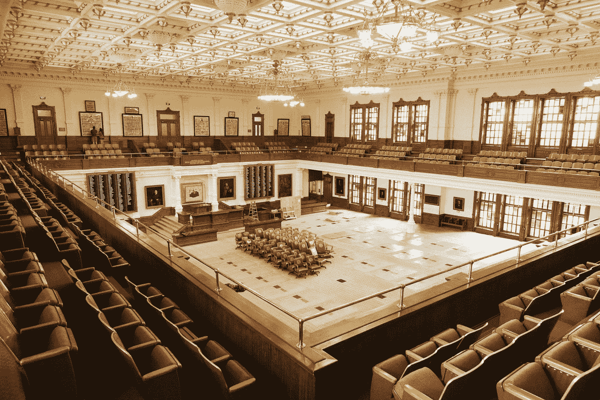

# 政府 AI 的透明度

> 原文：<https://towardsdatascience.com/transparency-in-government-ai-7c871a9cc219?source=collection_archive---------15----------------------->

## 给机器学习的黑盒子照一盏灯会保护我们吗？

Photo by [Kyle Glenn](https://unsplash.com/@kylejglenn?utm_source=medium&utm_medium=referral) on [Unsplash](https://unsplash.com?utm_source=medium&utm_medium=referral)

## 为什么我们希望政府 ML 透明？

媒体和公众有一种感觉，透明度是确保机器学习的潜在危害不会发生的理想方式。但这在现实中是什么样的呢？

思考机器学习和人工智能在政府手中的潜在危害或担忧，会让人想起奥威尔的《1984 年的 T1》或斯皮尔伯格的《T2 的少数派报告 T3》。

我相信这是因为人类对有人以任何准确度预测我们将做什么的想法感到不舒服。我认为，当一个对我们有权力根据这些预测做出决定的实体(比如政府)做出这种决定时，这种不安会明显加剧。

我[在](/predictive-analytics-in-government-decisions-8128ba019a77)之前写过关于潜在影响和危害的文章，但在其他文章和在线社区中也可以找到大量的故事和担忧。

## 什么是政府透明度？

透明是自由民主的标志。这是因为政府数据、政府决策和政府规则的透明度为公民和非政府组织质疑政府提供了一些必要的工具。它还赋予这些组织权力，作为对政府的制衡，建立游说和接触当选立法机构所需的知识基础，以改变现有法律或颁布新法律。

在美国，政府决策和规则制定的透明度不仅体现在第五和第十四修正案中，还体现在其他几项立法中。第五条和第十四条修正案一般规定了政府决策的正当程序，尤其是那些影响个人公民自由的决策。

美国还通过了[阳光政府法案](https://g.co/kgs/UMDGqV)、[信息自由法案](https://g.co/kgs/p2hWrJ)、[行政程序法](https://g.co/kgs/cuLPRL)和[文书工作减少法案](https://g.co/kgs/QY7wYp)。这些法案结合起来向公众提供有关政府推理、决策和内部程序的重要信息。

然而，透明度是有限的。法律学者已经表明，法院会篡改这些法律，在做出决定或实施项目时，不能完全理解政府机构的内部运作。例如,《信息自由法》有九项豁免，政府机构可以排除或拒绝所要求的信息。这些可以有相当宽泛的解释。

但是，尽管这些法律为政府提供了广泛的豁免和警告，从某些信息的发布，仍然有机制来[在许多问题上进行三角测量](https://www.ssrn.com/abstract=2937418)。

## 对机器学习透明度的错误乐观

在欧盟通过并实施《通用数据保护条例》(GDPR)后，通过对机器学习透明度的讨论，也出现了一种新的代理感。然而，正如[学者](http://dx.doi.org/10.2139/ssrn.2972855)所指出的,“解释权”的承诺过于乐观，原因有几个。

首先，有人担心政府将无法提供必要的服务水平，以允许关于每个 ML 预测实例的个人信息。

此外，这些算法将完全由政府机构控制的想法在世界范围内仍是一个公开的问题，因为许多政府机构依赖私营公司提供这些技能和技术。

第二，正如我们在 GDPR 所看到的——也很可能在其他法规中得到考虑——公民的个人同意可以免除数据处理器参与透明度的责任。

在私营部门，这被证明是近乎荒谬的控制手段。在公共部门，这还有待研究，但当个人知道政府将使用这些信息并对有影响的决策负责时，这可能会沿着私人路线或有所不同。

然而，人们担心，在没有对条款进行深入审查的情况下，便利会促使大多数个人同意，这种担心是真实的，我们可以预计，这在政府决策中也是无效的。

第三，我们知道机器学习并不总是能被个体公民所理解。这要么是因为公民通常不具备理解所需的知识和技能水平，要么是因为模型本身的性质不符合设计者和实践者的解释能力。

## 严格透明的替代方案

**有用的解释。**在一些研究中，出现了如何让机器学习对个人“可解释”的想法。如 [Edwards 和 Veale](https://dx.doi.org/10.2139/ssrn.2972855) 所述，有两种方法，以主题为中心的解释(SCE)或以模型为中心的解释(MCE)。

在 MCE 中，需要向个人解释经过训练的机器学习模型。这需要对输入、训练数据、参数和模型类型有深刻的理解。它还要求能够解释模型如何对单个预测进行排序和决策。这在团体层面上可能是有用的，但在个人层面上很难描述。

此外，MCE 可能需要机器学习算法、训练和测试数据以及输出的完整发布和透明。这将危及公司的私权，但也可能将游戏引入系统…在这种情况下，基本上抵消了机器学习的潜在好处。

另一方面，常设专家委员会可以帮助个人了解他们的情况将如何影响对他们作出的决定或产出，而不必打开“黑箱”。这也可以为他们提供了解他们的行为如何对他们的未来产生积极和消极影响的方法，并证明他们更好地理解关于未来的决策和机构。

SCE 的一个例子是信用评级公司允许用户操纵个人情况(工作、拖欠账户数量、家庭规模等)。)并查看基于这些变化的假设输出。

**合理的解释。** [另一种选择](https://www.ssrn.com/abstract=3293008)涉及通过合理的解释而不是鱼缸透明度来实现政府洗钱计划的透明度。鱼缸透明度是一个概念，类似于目前的“解释权”的理想，即政府在洗钱过程中所做的一切都将供公众消费和审查。

在一个合理的解释中，政府机构只需要提供 ML 模型背后的输入、输出和理论来描述它是如何设计的以及它的目标是什么。例如，它可以简单到解释数据输入以及观察犯罪行为和预测未来犯罪的目的。

这与目前美国政府法规的一些实例没有什么不同。在这些情况下，政府机构需要解释他们将如何作出裁决，他们的因果关系理论，考虑的因素，决定的法律标准，以及在这些决定中使用的推理。标准不是他们总是正确的，而是他们为公众提供了关于他们推理的深入信息。

**政府问责制。** [Cintron 和 Pasquale](https://ssrn.com/abstract=1599189) 提出了一个审计政府 ML 算法的流程，以帮助确保它们不包含对其目的和决策不可接受的偏差。

这种独立审计将通过提供第三方审查来确认合理解释的完整性。

它也可以作为一种机制和最大似然算法的储存库，可以防止担心或指控政府机构在没有公开通知的情况下修改甚至替换最大似然程序。

在公民诉讼或立法监督的情况下，可以将审计的算法与当前在特定情况下部署或使用的算法进行比较，以确认没有重大变化。

总之，公众对政府使用 ML 的谨慎或恐惧并不是没有根据的。但目前正在讨论的呼吁完全透明的提议，不太可能缓解或对这些担忧提供有意义的制衡。

与典型意义上的透明度不同，我同意一些研究人员的观点，他们试图确定政府洗钱项目中有意义的透明度类型，这将允许在政府裁决中采用和实施，但也不会限制政府的正当程序和监督。

允许政府对 ML 项目进行公告和审查，既不会提出不可实现的要求，也不会在第一步就降低其使用 ML 的能力。

考虑 SCE 可以为公民提供一个实际的方法来理解 ML 模型是如何对他们做出决策的，以及他们可以采取什么行动来影响未来的决策。

提供一个独立审计的平台可以建立在这些步骤上，以提供对洗钱项目的额外信任，并确保宪法规定的正当程序和监督。

我们应该仔细思考传统透明度和“解释权”背后的理念，作为减轻政府洗钱担忧的可行机制。