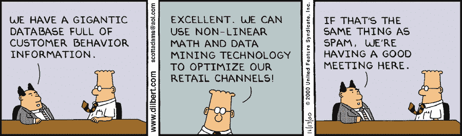
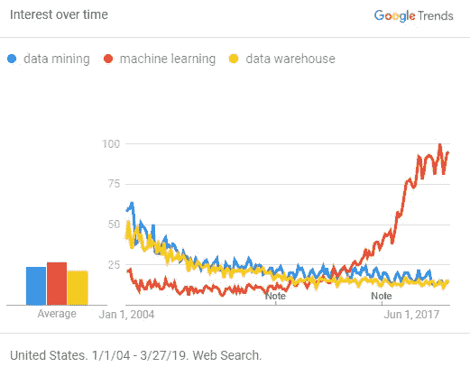

# 陷阱 DS 项目:当心“容易”的细分项目

> 原文：<https://towardsdatascience.com/trap-ds-projects-beware-of-easy-segmentation-projects-e52ffc12a395?source=collection_archive---------22----------------------->

## 99%的可能性你还没准备好

*TL；dr:依赖于一大堆其他东西的无界的、范围很小的项目和你想象的一样有趣。*

今天的某个地方，世界上有人在对一位数据科学家说这句话的某个版本:“我们有很多客户行为数据，让我们将它们聚集到一些有用的细分市场，看看我们可以从哪里了解我们的业务，**这有多难**？”

**剧透:很难，非常难，看似很难。大多数系统还没准备好。**

And you’re on the boat

在我十多年的创业生涯中，我自己或在不同人的指导下，已经开始了不少于 3 个这样的项目。他们都没有好的结局，基本上只有一个原因——我们没有准备好。

# 分段听起来很容易

[https://dilbert.com/strip/2000-11-13](https://dilbert.com/strip/2000-11-13)

在所有的机器学习算法中，聚类算法是最容易理解和实现的。像 k-means 这样的东西听起来很容易应用，大体上你只需要…

*   将活动数据放入算法中
*   串
*   对照现实观察输出
*   迭代？
*   利润！！！

除了，不。不是真的。

# “把数据扔进算法中”？真的吗？

当“把 X 扔进 Y”这个词被四处传播时，警钟应该总是响起。数据几乎从来没有处于可以被“扔”到任何地方的状态。一旦你开始弄清楚你在隐喻性地到处扔什么数据，这个阶段就可以扼杀你的项目。

首先是“你有数据吗”这个基本问题。仅仅因为你一直在收集东西到数据库中，并不能使它对机器学习有用。如果您在持续记录关键事件方面有所懈怠，或者拥有大量有偏见的样本，或者出于成本原因而丢弃数据，那么您将不得不重新考虑所有这些决策。

## —但是我有数据，以前甚至有人提到过数据仓库的事情？

很可能您有事务性数据，并且数据存储已经针对 OLTP 工作负载进行了优化，这是许多生产系统的自然状态。但是分析通常会问一些从侧面看数据的问题。这就是为什么在大约 15-20 年前“数据挖掘”成为行业热点时，“数据仓库”成为一个大话题。

Remember when “data mining” was a thing?

现在，如果您碰巧在某个地方有一个漂亮、干净、**维护的**数据仓库，其中有精选的度量标准和精心布局的数据立方体，那么您实际上就处于一个集群项目的相当好的开始位置。

我真的没见过多少员工少于 100 人的创业公司有这些东西。它们是需要维护的复杂系统，尤其是在其他系统发展和新数据产生的时候。大多数创业公司没有足够的资金来进行这种程度的分析。

## —我实际上有数据，所以我可以正确地使用它？

让我们假设您已经有了一些可以使用的、有组织的、相对来说没有错误的数据。我们准备好了，对吗？

没那么快！！

接下来，您需要进行某种形式的特征生成/选择。虽然算法本身并不关心你是否加入了随机数，但作为分析师和最终用户，你是关心的。除非你喜欢[虚假相关性](http://www.tylervigen.com/spurious-correlations)，否则你必须对什么特征重要，什么不重要有所了解(如果你愿意，可以称之为假设)。你有必要的领域知识来做出这种有根据的猜测吗？有人知道吗？

因此，你至少需要了解你的业务的一些基本驱动因素，或者知道什么与你所寻求的成功相关。这意味着你需要对谁是你的客户，他们通常做什么做基础研究，即使只是在高层次上。

## 让我们用一些具体的例子来巩固这一点

假设你认为用户浏览页面的顺序对于区分用户未来的行为很重要。一个序列有多长很重要？因为存储/处理无限长的序列是$$$。

那么多次会话的行为呢，你有会话吗？与其他用户的行为是否有足够的重叠，让你拥有有用的熵？你从哪里剪掉长尾？

他们是否使用优惠券，或通过平面广告链接注册，或在第一天购买了 5 个小工具呢？也许是他们的原籍国，或者他们是否有信用卡记录，或者他们的个人资料？所有这些东西都被正确地装备了吗，在时间和空间上与用户适当地联系起来了吗？

## —等等，我正要用所有的东西！为什么我不能现在就走？

因为两个大问题，各种形式的**信息泄露**，现有数据泄露了你的输出。想象一下，你发现有个人销售电话的用户很可能使用免费试用…因为销售团队为了“节省空间”而错误地从 CRM 中删除了旧的不成功的线索。或者你的系统中有一个“当前付费客户”标志(非常常见)，所以如果你盲目地包括它，相对于没有这个标志的人来说，这将是一个很好的收入预测。

另一个原因是**你想要使用的所有数据很可能不是普遍兼容和一致的**。所有数据都有一致的用户密钥吗？有些字段表示当前的当前状态，有些字段表示时间上的历史状态，还有一些隐含的状态(例如“’”用户在离开默认状态之前不会在此设置字段中获得一行，因为默认状态是假定的)。仅仅因为它的存在并不意味着它值得一起讲述一个关于世界的一致的故事。

## 好吧，所以我只是看看田地，打扫一下，这能有多难？

当然，所以你去写查询来收集数据，然后你马上开始发现错误，这些数字并不完全一致，所以你必须弄清楚那里发生了什么并修复它们，对吗？然后你会努力去修复各种系统，也许会实现新的系统来取代坏的系统。突然，这个为期两周的“有趣”项目进入了第三个月。

由于这些特性中有许多不是聚类算法可用的格式，所以您会希望将它们存放在某个地方。也许那里有一个临时表，这里有一个聚集表。然后，您会希望随着时间的推移跟踪这些信息，如果这些信息都在一个系统中就好了...等等，这听起来开始像一个数据仓库(另一个梦想破灭的项目，但是我离题了)…

# 串

## 这个过程中最简单的部分

如果你设法达到这一步，这一部分通常不会太糟糕。确定您的特定集群包所采用的数据的确切格式通常是一件痛苦的事情，因为有 1500 万种方法来创建和存储“距离矩阵”,每个人都认为他们的格式是不言自明的，并不真正需要文档…

但除此之外，只要按下按钮！

# “眼球簇对抗现实”

## 因为这是一个定义明确的问题，对吗？

假设您对 5 个集群运行 k-means 尝试。我们不确定 5 是否是正确的集群数量，除了我们从空气中提取的数字，我们盲目地进入这个项目，但我们有人类，我们可以检查看看“感觉”有多正确，对吗？

[https://xkcd.com/1838/](https://xkcd.com/1838/)

这在实践中如何运作？我们转储行的例子，并试图得出一些押韵或理由。我们的希望是，我们看着集群，它以一种不明确的方式有点“有意义”。本质上，你必须看看机器的分类，看看你过度创造的人类大脑是否能想出一个可信的解释来命名这个集群。

但是没有真正的保证你能找到对你有用的东西。不清楚这一大堆数据点是有用的一组还是我们选择的特征的哑工件。即使集群代表了一种“真实的现象”,我们也可能无法充分理解它并广泛使用它。在任何这种模棱两可的情况下，你会想知道你是应该继续你的发现，还是放弃它，再试一次。

哦，对了，我是不是忘了提到，根据您使用的聚类方法和您的数据属性，可能会有关于[在多次运行和一段时间内](https://people.eecs.berkeley.edu/~jordan/sail/readings/luxburg_ftml.pdf)[聚类](http://resources.mpi-inf.mpg.de/conferences/adfocs07/graphics/simon-adfocs1.pdf)的稳定性的问题？

# 重复

## ——因为第一次做起来很有趣，我们想再做几次，直到我们觉得做对了为止

帕尔塔伊。(顺便说一句，到现在过了几个月才走到这一步？)

# 利润？

如果你幸运的话。

整个聚类练习的最终目标是 1)了解关于用户的新的有趣的事情，或者 2)将新发现的组应用到其他事情上，这在以后会很有用。现在(大概)您已经有了一组集群用户，您会想要尝试做这些事情。希望它们能起作用，并开启各种洞见和神奇的独角兽。

# 那么是不是没有希望了？！？

有一些！

## 先做一些定性的作业

请注意，当您验证这些任意的无监督聚类时，您实际上是在使用您自己的数据心理模型作为参考点？如果你不能对是什么组成了一个集群有一个一致的理解，那么这个集群就不会感觉“正确”。既然你无论如何都需要这个作为参考点，**先做**！

然后你会对你要寻找的集群数量有一些先验的*假设，以及对什么潜在特征对模型有影响有一个更好的认识。所有这些都会对你的模型有所帮助*你甚至会发现这个作业已经足够好了*，甚至可能没有必要去做数据挖掘。*

## 尽可能的限制自己的范围！

关键是要认识到，你想要使用的数据越多，涉及的痛苦就越多，直到一切都变得不可能。

安全生存的方法是非常严格地控制范围。这意味着你应该有

*   一个非常确定和简短的列表列出了用户应该聚集起来反对的因素，假设是被鼓励的！
*   你的数据收集系统提前调试好了
*   您的数据访问/移动/管道基础设施处于可管理状态(您能否获得所有数据并将其复制到需要处理的地方？)
*   如果所有这些基本要素都不具备，他们会有强烈的抵制意愿

## 知道什么时候该停下来推回去

开放式问题会耗费你愿意投入的时间，所以如果你发现你做的数据工程工作比集群工作多，你应该重新评估整个项目。

数据工程部分可能实际上是你应该做的推动公司前进的必要工作，但是把所有这些工作放在一个单独的数据人员的权限下的“做集群项目”的保护伞下是错误的。这个工作量应该是使用不同资源并与管理层讨论的严肃工作。

重要的是，在你对事情投入太多之前，先往后推。