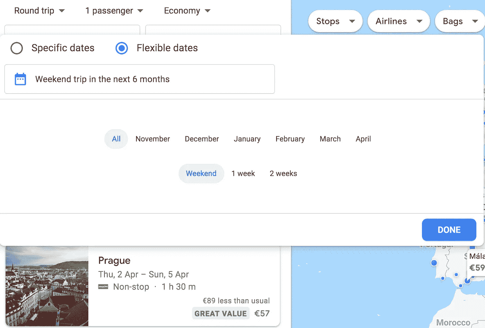
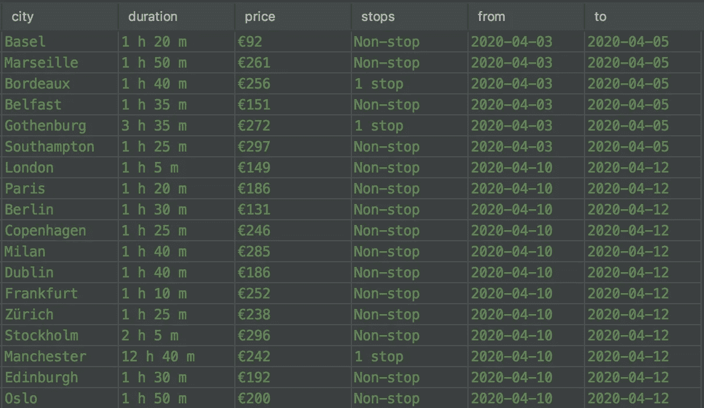
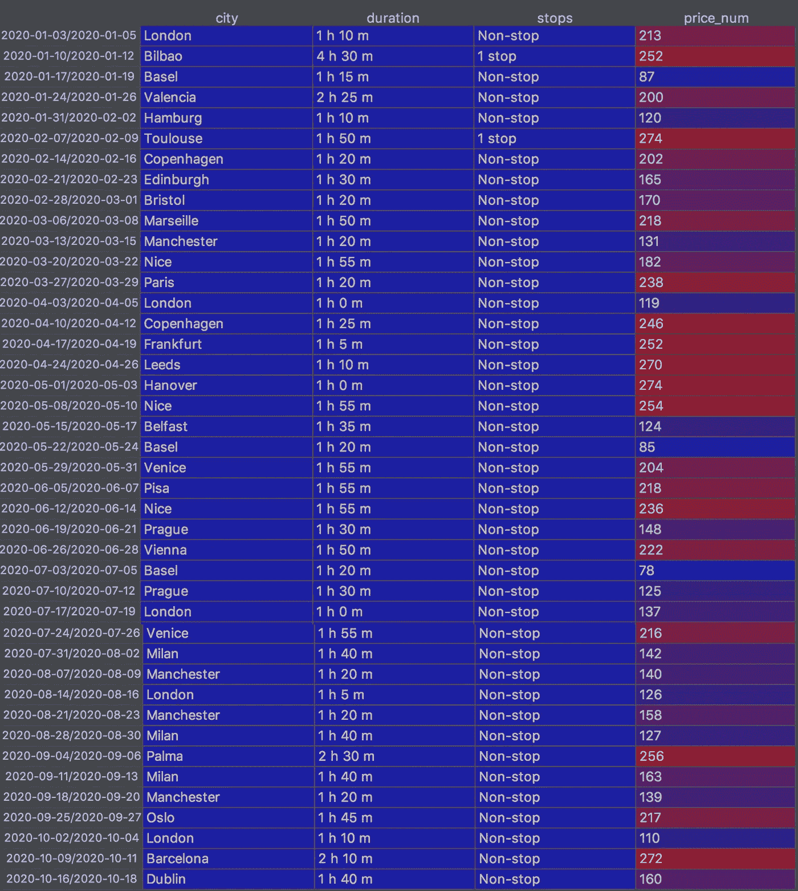
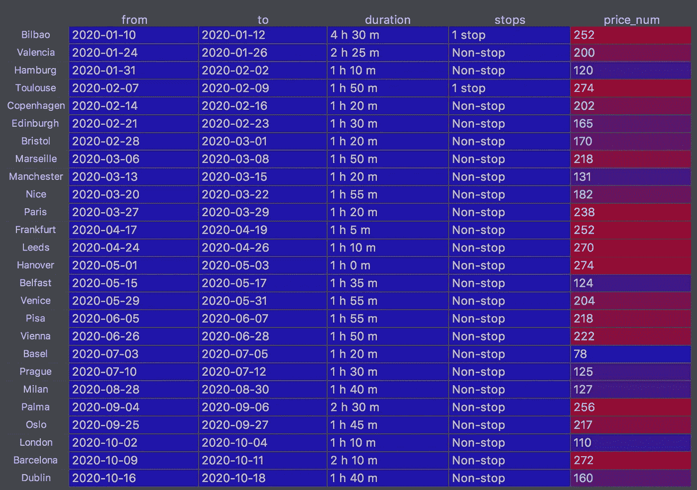

# 穿越欧洲旅行(以一种书呆子的方式)

> 原文：<https://towardsdatascience.com/travel-budget-optimization-5c97501babe0?source=collection_archive---------25----------------------->

## 通过使用 python 库抓取谷歌航班来创建最佳旅行路线


作为一个旅行爱好者，我明年的目标是尽可能多地旅行。我对目的地不是很挑剔；然而，我确实有一些限制。首先，我只能在周末旅行，因为我从周一到周五都在办公室工作。第二，我想用最少的预算尽可能多地游览不同的城市。第三，我不想在飞机上花太多时间。那么让我们来看看如何自动找到一个最优的旅行路线。

考虑到我的灵活性和局限性，我尝试了许多航班搜索工具，最终我选择了 https://www.google.com/flights 的 T2。在这里，您可以选择一个出发城市，将目的地留空以探索各种选项。您还可以选择灵活的旅行日期，例如，在未来 6 个月内的所有周末旅行，只需点击几下鼠标:



Google flights is flexible but not what I’m looking for

然而，我发现他们对周末*的定义毫无用处。例如，参见上面的截图。你可以看到 4 月 2 日周四飞往布拉格的航班*谢谢你，谷歌，给了我这个便宜的选择，但我周五必须去办公室*。同样，它为其他城市提供了一些其他选择，周六晚上出发，周日早上返回，*如果你只是对了解机场感兴趣*那就太好了。*

> *所以，谷歌，伴随着巨大的灵活性而来的是巨大的责任，你对周末旅行的假设是错误的。*

*好吧，让我们给谷歌更少的灵活性。让我们告诉谷歌，我想在 2019 年 12 月 13 日至 15 日的周末去欧洲任何地方旅行，从阿姆斯特丹往返，周五在 hs 的 *18.00* 和 *24.00* 之间出发，周日在 hs 的 *16.00* 和 *24.00* 之间返回。这是该搜索的链接:*

*[https://www.google.com/flights#flt=AMS..2019-12-13 * . AMS . 2019-12-15；c:欧元；e:1；dt:1800-2400 * 1600-2400；ls:1w；SD:1；t:e](https://www.google.com/flights#flt=/m/0k3p..2019-12-12*./m/0k3p.2019-12-16;c:EUR;e:1;dt:1800-2400*1600-2400;ls:1w;sd:1;t:e)*

*在该 URL 中，AMS 指的是阿姆斯特丹，您也可以在那里看到我们选择的日期和时间限制。*

*URL 中的搜索逻辑非常简单:*

```
*[https://www.google.com/flights?hl=en#flt={city_code}..{departure_date}*.{city_code}.{return_date};c:EUR;e:1;dt:{takeoff_after}-{takeoff_until}*{return_after}-{return_until};ls:1w;p:{max_budget}.0.EUR;px:1;sd:1;er:296254327.-269199219.671078146.490175781;t:e](https://www.google.com/flights?hl=en#flt=/m/0k3p..{departure_date}*./m/0k3p.{return_date};c:EUR;e:1;dt:{takeoff_after}-{takeoff_until}*{return_after}-{return_until};ls:1w;p:{max_budget}00.2.EUR;px:1;sd:1;er:296254327.-269199219.671078146.490175781;t:e)*
```

*其中*城市 _ 代码*为 IATA 机场代码，*出发 _ 日期*和*返回 _ 日期*格式为***yyyy-mm-DD****；起飞 _ 之后，起飞 _ 直到，返回 _ 之后，*和*返回 _ 直到*格式为**HHMM**；而 *max_budget* 格式是一个整数，以欧元为单位定义最高价格。 *er* 参数定义了寻找目的地的区域。您可以使用缩放功能，将这些数字更改为您感兴趣的任何区域。*

*按照这个简单的 URL 逻辑，我创建了一个 python 库，它可以扫描 Google 航班并将行程保存在一个 CSV 文件中。您可以在此回购中找到代码:*

> *[https://gitlab.com/cintibrus/scrap_flights](https://gitlab.com/cintibrus/scrap_flights)*

*您可以下载它，导入库，然后通过用 CSV 文件名创建 GoogleFlights 对象来调用它。然后，您可以通过调用 createDataWorldwide 方法扫描任何地方的所有目的地，如下所示:*

```
*gs = GoogleFlights(csv_filename)
gs.createDataWorldwide(travel_lenght_list,start_period,end_period,steps_days,takeoff_after,takeoff_until,return_after,return_until,nr_passengers)*
```

*createDataWorldwide 方法的参数如下。*travel _ length _ list*是一个数组，包含您要扫描的住宿天数，例如，[2，3]将扫描包含 2 晚和 3 晚的旅行。 *start_period* 是开始扫描的第一个出发日期；因此，如果您想扫描周六出发、周日返回的所有往返航班，请确保 *start_period* 是周六，并且*travel _ length _ list*=[1]。 *end_period* 是扫描的最后一个出发日期；对我来说，是 2020 年 12 月的任何一天。参数 *steps_days* 是扫描出发日期之间的间隔天数；因此，如果 *steps_days* =7，它将扫描每周出发的航班，如果 *steps_days* =1，它将扫描每天出发的航班。我使用*起飞 _ 之后*和*起飞 _ 直到*只扫描 18 小时后出发的行程。因为我想周五下班后去旅游。同样，我使用 *return_after* 和 *return_until* 扫描 17 小时后返回阿姆斯特丹的航班。因为我想在周日早上花些时间在城里逛逛。最后可以用 *nr_passengers* 指定乘客数量。*

*如果你没有任何限制，并且想去野外，你可以设置 travel _ length _ list =[2，3，7](它可以有你想要的许多持续时间选项)，*start _ period*= ' 2020–01–01 '，*end _ period*= ' 2020–12–31 '， *steps_days* =1， *takeoff_after* ='000 '，*take off _ out 这将扫描 2020 年任何日期从阿姆斯特丹出发、持续 2、3 或 7 晚的所有往返航班。**

*F 还是我的用例，我用我的 python 库刮出了 2020 年每个周末从阿姆斯特丹到任何目的地的所有往返，价格低于 300 欧元的 2 位乘客。*

*我对周末的定义是 18 小时后的星期五。17 小时后周日返回，但可以很容易地更改。这是我如何使用库来实现我想要的:*

```
*gs.createDataWorldwide([2],'2019-12-06','2020-12-01',7,takeoff_after='1800',return_after='1700',nr_passengers=2)*
```

*它会创建一个 CSV 文件。该文件的一个小示例如下所示:*

**

*目前还没有 2020 年 11 月和 12 月的选项，所以我找到的最后一个周末的航班是 2020 年 10 月 16 日。*

*现在我可以称这个方法为 optimum_weekends，来寻找 2020 年最低预算的旅行路线。*

```
*gs.optimum_weekends(duration_max,from_start,allow_max_city_duplicates)*
```

*参数 *duration_max* 过滤掉超过`*x*`小时的航班。我选择了 *duration_max* =7，因为我不想飞行超过 7 个小时。参数 from_start 指定旅程的开始日期。参数*allow _ max _ city _ duplicates*过滤掉具有超过`*x*`个重复目的地的路线。该方法通过为 2020 年所有周末的每个日期选择目的地的排列，创建了数千条可能的路线。输出是对于扫描的行程具有最低可能预算的路线。输出如下所示:*

**

*Itinerary of weekend trips for 2020*

*我需要在 2020 年每个周末旅行(不包括 11 月和 12 月)的总预算是 **7670** 欧元，2 名乘客，从阿姆斯特丹来回。我将在 42 个周末了解 26 个不同的城市。我也不需要在工作中请假。*

*实际上，我对多次访问同一个城市不感兴趣，所以让我们删除重复的城市，让我们保留最便宜的选项。*

**

*Itinerary of weekend trips for 2020 to unique destinations*

# *我需要为 2020 年 2 名乘客游览 26 个不同城市的优化预算旅行路线的总预算是 5061 欧元。*

*我期待人们使用该工具，根据不同的限制或改进建议，提出其他优化策略。在我的头顶上，人们可以使用该工具找到 2020 年前往特定目的地的最便宜的日期；或者调查航班价格是否在一天之内、一周之内或随着 IP 国家发生变化；或者发现票价错误。天空不是极限，是目标:)。*