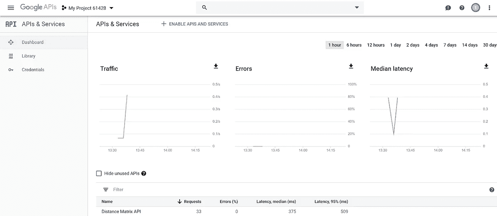
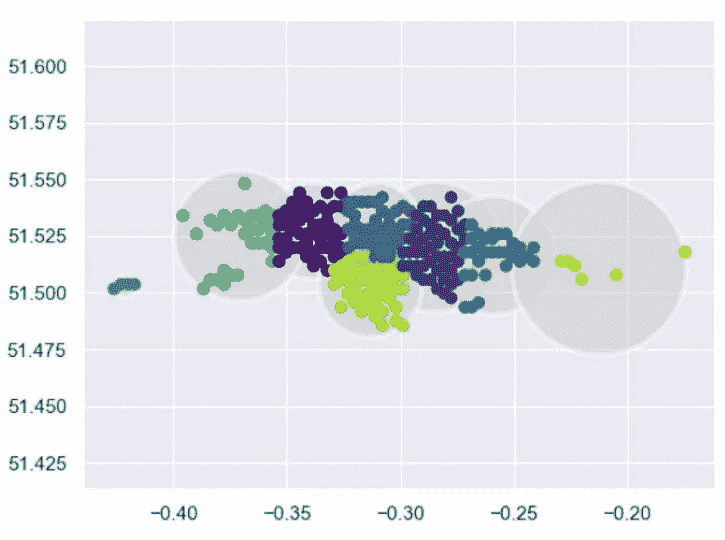

# 创建伦敦的现代旅游地图

> 原文：<https://towardsdatascience.com/travel-map-8407796c9219?source=collection_archive---------11----------------------->

## 我设计了一张个性化的伦敦地图，显示了我在 10 分钟、20 分钟、30 分钟等时间内使用公共交通工具可以走多远..)分钟。它看起来是这样的:


Map of London showing how far you can travel using public transport from my house in Ealing. [Interactive map here](https://sebstrug.github.io/map_Lond_2). Can you guess where the tube stops are?

更好的是，[代码](https://github.com/SebStrug/HowFarCanIGo)可以在世界任何地方使用，也可以行走。以下是我有幸居住过的另外三个大城市的个性化地图:


Travel time areas for 10, 20, 30, and 45 minutes travel around where I lived in Montreal, Manchester, and Edinburgh, using any public transport available.

# 该过程

在一个慵懒的周日早晨，我偶然发现了一系列美丽的历史地图。这些被称为*等时线*地图，代表了制图员对你在不同时期能走多远的估计。我最喜欢的是巴塞洛缪的从伦敦到世界各地的等时距离图。


John G. Bartholomew’s isochronic map [1]. Look how inaccessible South America, Africa, and Australia are.

虽然这些很有趣，但我们应该有所保留。我怀疑巴塞洛缪先生是否广泛研究过波兰的火车时刻表。但是这些天我们*做*有高度准确的旅行时间预测。那么，对于世界上我最喜欢的城市来说，真正的等时地图会是什么样的呢？

我发现伦敦特别有趣的地方是，从我住在伦敦西部的地方，我可以很快到达主要的博物馆，并进入伦敦金融城([伦敦内一平方英里的区域](https://youtu.be/LrObZ_HZZUc))。但是去伦敦东南部旅行是一场噩梦(大约 1.5 小时)，比从爱丁堡到格拉斯哥的旅程还要长。

到代码上…

# 代码

为了创建个性化地图，我们需要选择一组要分析的点，检索这些点的旅行时间，通过绘制外壳将这些点分组到边界中，并在地图上绘制这些点。

当创建一个点的点阵时，我始终专注于使用 NumPy 来利用它的矢量化，以及比 Python 列表更高效的计算。我创建了两个选项:

1.  以原点为中心的局部网格，具有定义的点间距和点数
2.  一个全球格网，取一个区域的最小和最大纬度和经度进行搜索，以及格网分割的次数

接下来，我必须生成旅行的实际时间。有许多选项可以做到这一点，但我决定使用谷歌[距离矩阵 API](https://developers.google.com/maps/documentation/distance-matrix/start) 。这将返回往返目的地的距离和时间。我查看的其他选项包括 Google [方向 API](https://developers.google.com/maps/documentation/directions/intro) (它也返回方向，这对于这个应用程序是不必要的)，以及 [MapQuest 方向 API](https://developer.mapquest.com/documentation/directions-api/) 。



Screenshot of my Google Developer Console

你可以通过谷歌开发者控制台访问超过 24 个谷歌 API 的套件。我发现设置 API 非常直观，虽然这些 API 是付费的，但你可以在 12 个月的试用期内获得 300 美元的免费积分，我发现这对我的项目来说绰绰有余。确保您对结果进行了筛选，这样您就不需要多次调用同一个区域的 API 了！

```
# Storing my latitudes, longitudes, and travel times from the API
pickle.dump([lats, lngs, travel_times], open(pickle_path, 'wb'))
```

我在使用这个 API 时发现了一些有趣的怪癖，包括:

1.  您发送给 API 的查询字符串可能太长，在这种情况下，您需要使用[折线编码](https://developers.google.com/maps/documentation/utilities/polylinealgorithm)对其进行编码。
2.  每个请求只能发送 100 个元素(1 个起点，100 个目的地)，所以我使用`chunked_latitudes = np.split(latitudes, len(latitudes)//chunk_size)`分块我的 NumPy 数组。
3.  它意外超时，所以我每 5000 个请求就暂停一次代码。

有了一组数据点，我就必须想出如何根据旅行时间将它们连接到不同的区域。这并不是一项简单的任务。我的第一个想法是把外面的点连接起来，这就是所谓的[凸包](https://en.wikipedia.org/wiki/Convex_hull)。然而这不是我想要的。我想要的是进入角落和缝隙，在数据中找到“峡湾”。这种实现称为凹面外壳。


The unique convex hull for the set of points on the left, and a concave hull for these points on the right [3].

凹面外壳是不唯一的，你可以通过选择最近邻的数量来决定你希望你的凹面外壳在点周围有多少包裹。我使用了 J. P. Figueira 写的一个很棒的实现[,我使用了这个实现。](/the-concave-hull-c649795c0f0f)

凹面外壳实现没有处理的是点的孤岛。这些是地图上最有趣的部分。特别是，地铁和公共汽车周围的区域是可以到达的，而地理位置更近的区域则不可以。这是我真正好奇的:伦敦有哪些离我比较近，但又隐藏起来的地方？


Points I can access within 30 minutes from my home in London. Are there 7, 8, or 9 islands?

我对机器学习很感兴趣，所以我开始尝试实现两种无监督的机器学习方法:K-means 聚类和高斯混合方法(GMMs)。然而两者都有问题。

K-means 聚类在聚类中心周围绘制一个恒定的半径，这并没有考虑到点是如何在纵向上更加分散的。



A K-means clustering for the points with 7 clusters. It’s terrible. Code thanks to [Python: Data Science Handbook by J. VanderPlas](https://jakevdp.github.io/PythonDataScienceHandbook/index.html)

GMM 通过绘制任意对齐的椭圆来分组集群岛，从而解决了这个问题。然而，我发现这些省略号仍然是病态的。这并不奇怪，因为 GMM 主要是一种密度估计方法。事实上，我寻找的是一种没有聚类中心的聚类方法，它只是根据成对的距离对点进行分组。

经过一番搜索(并试图自己编写算法)，我意识到我需要的是 [DBSCAN](https://en.wikipedia.org/wiki/DBSCAN) 。Sci-kit learn 有一个易于使用的实现，但是有[讨论](https://stackoverflow.com/questions/16381577/scikit-learn-dbscan-memory-usage)这个实现是否是一个有效的。

The code to implement Sci-kit learn’s DBSCAN

在这一切当中，我发现 [J .范德普拉斯的书](https://github.com/jakevdp/PythonDataScienceHandbook)非常有助于理解这些方法以及为什么它们不适合我的问题。这是一个很好的教训，在尝试重新发明轮子之前，要先寻找存在的东西，并且思考简单而不是复杂的方法。

这个问题的最后一步是把数据放到地图上。有相当多的地图库可用，包括允许你将数据直接放到谷歌地图上的库。然而，我一直在寻找的是绘制多边形的能力，事实证明,[叶子](https://python-visualization.github.io/folium/)库可以为 OpenStreetMap 做到这一点。

Folium 是一个直观的库，因为它遵循与 Matplotlib 相似的编码风格，让您创建一个地图对象，并将子对象作为点或多边形的层添加到其中。此外，它们被创建为交互式 html 页面，您可以放大和缩小，或者选择和取消选择图层。

Adding island-clusters of points onto the map

**我们还可以将它用于哪些有趣的应用？**

伦敦在繁忙的地区有一组标志，显示你可以在 5 或 15 分钟内到达哪里，但它们是相当不准确的圆圈。精确的版本呢？


Photo I took of a sign in London at Charing Cross station left. Map with the sign’s five minute walking radius in red, with the true five minute walking distance in black right. No more trying to walk into the Thames.

我尚未探索的想法:

*   查看伦敦哪些地区的交通状况较差，尤其是到“文化中心”的交通状况，并调查可达性和贫困指数之间的相关性。
*   这种个性化地图是如何在 24 小时内演变的，尤其是自从引入夜视管以来。

完成后不久，我在网上找到了两家这样做的公司。不幸的是，其中一个只允许你在付费前进行两次搜索，另一个有国家限制。由于他们画出的形状和他们找到的岛屿是不同的，我将联系他们来找出他们的方法是如何比较的。

你还能在哪里使用这个代码？你可以用它来找到一个合适的住处，离你的工作地点、健身房或其他地方都很近。

请随意使用[我的 GitHub 代码](https://github.com/SebStrug/HowFarCanIGo)(适当地)，或者有任何疑问或想法联系我。

# 参考

[1] J. G. Bartholomew，I [社会距离图](https://www.davidrumsey.com/luna/servlet/detail/RUMSEY~8~1~248974~5516374:Isochronic-Distance-Chart,-1904--Av?sort=pub_list_no_initialsort%2Cpub_date%2Cpub_list_no%2Cseries_no&qvq=w4s:/who%2FBartholomew%25252C%2BJ.%2BG.%2Fwhat%2FAtlas%2BMap%2Fwhere%2FWorld%2Fwhen%2F1907;sort:pub_list_no_initialsort%2Cpub_date%2Cpub_list_no%2Cseries_no;lc:RUMSEY~8~1&mi=11&trs=50) (1904 年)，通过大卫·拉姆齐地图收集获得。

[2] [波兰在 1795 年至 1918 年间甚至还不存在。](https://en.wikipedia.org/wiki/History_of_Poland)

[3] E .罗森、e .扬松和 m .布伦丁，[实现一种快速有效的凹壳算法](https://docplayer.net/47744110-Implementation-of-a-fast-and-efficient-concave-hull-algorithm.html) (2014)。

[4]奥莱，[https://www.oalley.net/](https://www.oalley.net/)

[5]旅行时间地图，[https://app.traveltimeplatform.com/](https://app.traveltimeplatform.com/)