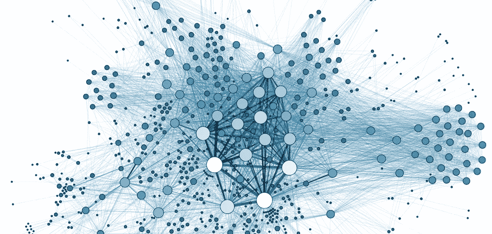
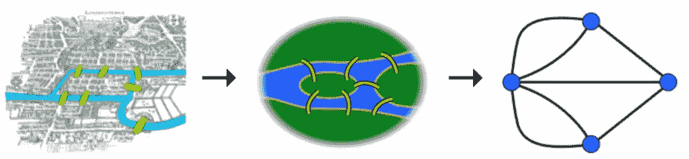
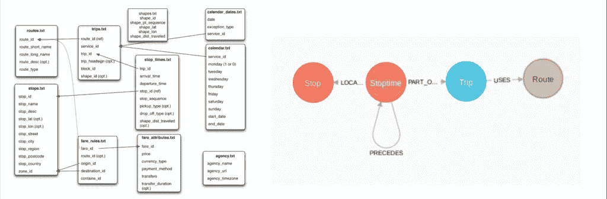
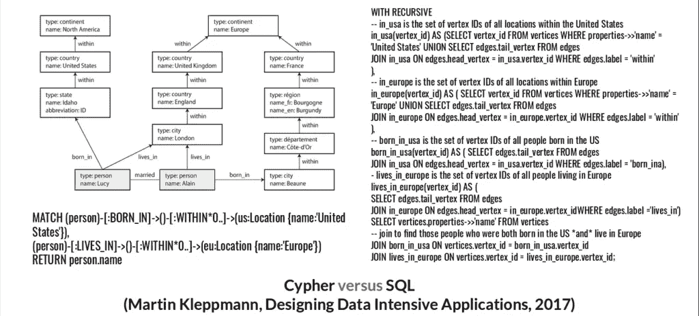
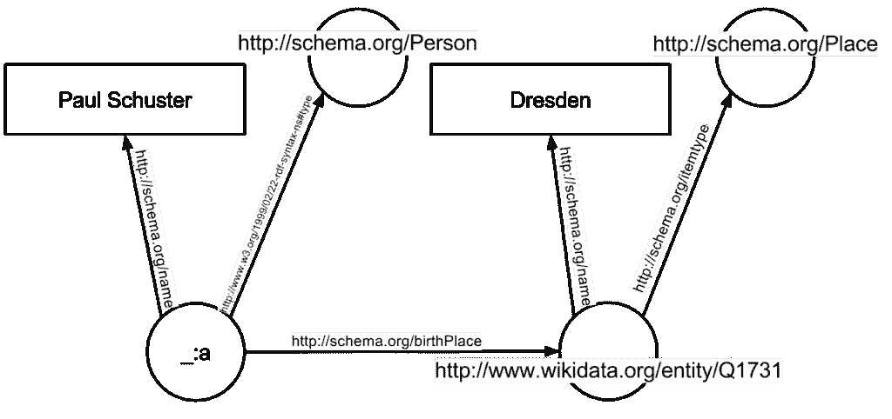
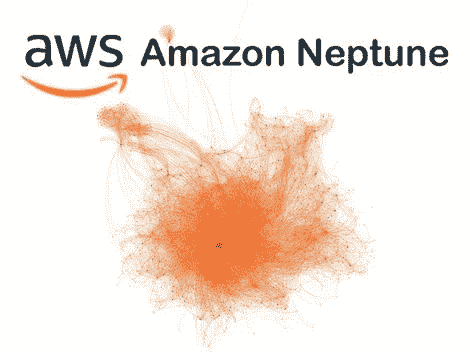

# 穿越图形计算和数据库领域

> 原文：<https://towardsdatascience.com/traversing-the-land-of-graph-computing-and-databases-5cbf8e8ad66b?source=collection_archive---------24----------------------->

## *您对图形技术世界的一站式介绍。*

Photo courtesy: [Neo4j](https://neo4j.com/)

*该博客最初发表于亚特兰蒂斯* *数据刊物* [*人类。*](https://humansofdata.atlan.com/2019/07/what-is-graph-database-and-graph-tech/)

图形是优雅而强大的数据结构，可以在不同规模的多个行业和组织中找到应用。本文旨在向数据人员介绍图形数据库和图形技术领域，并揭开它们的神秘面纱。

***注*** *:我最近有幸在意大利的*[*PyCon X*](https://www.pycon.it/en/)*演讲。这个演讲，就像它的名字一样，和这篇文章有着共同的目标。如果你喜欢这种视觉媒体，可以在这里随意观看***。**

# *为什么要关心图形？*

*   *图表是数据的优雅表示，适合各种用例。作为一个数据人，了解它们可以帮助你评估它们对你的问题陈述的效用。*
*   *从十九世纪开始，图论就作为一个学术领域存在了，从[柯尼斯堡桥问题](https://en.wikipedia.org/wiki/Seven_Bridges_of_K%C3%B6nigsberg)开始。你可以利用大量相关的工作和理论。突出的用例包括最短路径问题、链接预测和 [PageRank](https://en.wikipedia.org/wiki/PageRank) 。*

**

*The Königsberg bridge problem from the 1800s. Photo courtesy: [Wikipedia](https://en.wikipedia.org/wiki/Seven_Bridges_of_Königsberg)*

*   *过去几十年的发展导致了图表技术的兴起。图表为互联网巨头提供动力，如谷歌([知识图表](https://www.blog.google/products/search/introducing-knowledge-graph-things-not/))、脸书([社交图表](https://developers.facebook.com/docs/graph-api/))和 LinkedIn ( [经济图表](https://economicgraph.linkedin.com/))。*

# *什么是图？*

*图是一组顶点(节点、实体)和边(关系)。*

*传统上，数据以表格格式表示。图表以一种更接近我们心智模型的方式来表示数据。*

# *图形技术怎么样？*

*图形技术指的是允许用户利用图形数据结构的软件。*

*Graph tech 软件可以是数据库，如 [Neo4j](http://neo4j.com/) 或 [AWS Neptune](https://aws.amazon.com/neptune/) ，处理框架，如 [Apache Giraph](https://giraph.apache.org/) 或 [Apache Spark 的 GraphX](https://spark.apache.org/graphx/) ，或可视化工具，如 [Cytoscape](https://cytoscape.org/) 。*

*让我们比较一下图表数据格式和表格数据结构。*

*多年来，表格已经成为我们表示数据的事实上的格式。尽管表格模型很有用，但它有局限性，因为它处理的是行和列，而不是真实世界中的实体。逻辑和业务模型从技术模型中分离出来，这就产生了对中介的需求。*

*这里有一个例子。它涉及到印度 DTC(德里运输公司)的一些 [GTFS](https://en.wikipedia.org/wiki/General_Transit_Feed_Specification) (通用公交馈电规范)公交数据。*

*最初由谷歌推出，GTFS 定义了公共交通时刻表和相关地理信息的标准格式。我们用 GTFS 做旅行计划。这些数据由一系列文件组成，比如路线、站点和站点时间，它描绘了德里的公共汽车交通状况。*

*为了执行有意义的分析，您要么必须在查询/读取时连接各种表，要么以重复的非规范化格式存储它们，这很快就会变得混乱。*

*连接是一项开销很大的操作。如果您以前处理过关系数据库，您就会知道这样的操作会如何增加您的成本。*

*处理 GTFS 数据的一个更好的方法是将其存储为图表。通过这样做，我们可以利用健壮的图算法来[寻找最短路径](https://en.wikipedia.org/wiki/Shortest_path_problem)和[连接组件](https://en.wikipedia.org/wiki/Component_(graph_theory))。图表在视觉上也有很大的不同。*

**

# *可以用 SQL 做图吗？*

*鉴于我们对基于 SQL 的解决方案的熟悉，我们可能倾向于在忠于它们的同时解决这个问题，而不是选择图形技术。但这可能会导致一个痛苦的世界。*

*请看以下摘自 Martin Kleppmann 和 O'Reilly Media 的 [*设计数据密集型应用*](https://www.oreilly.com/library/view/designing-data-intensive-applications/9781491903063/) 的节选，它为 graph tech 提供了一个强有力的案例。*

**

*An excerpt from Designing Data-Intensive Applications on comparing Cypher with SQL*

*在左上角，您可以看到我们的数据模型。它显示了一对夫妇 Lucy 和 Alain 的信息，以及他们的地理位置。你可以注意到不同国家之间的区域结构和粒度存在差异。*

*如果我们决定不使用图形数据库会怎么样？*

*就用基于 SQL 的解决方案比如 Postgres？*

*虽然我们可以创建一些表——顶点和边——但是 SQL 并不是为查询图形而设计的。*

*一个创建从美国移民到欧洲的人的列表的查询，显示在上图的右侧，可能需要 50 多行。*

*如果我们选择基于图形的本地解决方案，我们的数据模型将保持不变。*

*我们可以使用一种图形查询语言，比如 Cypher，只需几行代码就可以获得相同的信息。*

> *可读性很重要。*
> 
> **-* [*禅宗之蟒*](https://www.python.org/dev/peps/pep-0020/)*

# *为什么这些年来图形技术变得越来越流行？*

*有几个因素导致了 graph tech 今天的地位。这是过去几十年图形技术发展的时间表。*

# *语义网*

*我们的故事始于 2001 年的语义网。*

*WWW 发明者蒂姆·伯纳斯·李和他的合著者在《科学美国人》的一篇文章中创造了这个词，它被建模为网络的延伸。语义泛指对意义的研究。*

*语义网标准旨在用一个物联网取代网页。一个关键的概念是将实体表示为三元组，即主体-客体-谓词，即节点和关系。*

*尽管语义网还没有完全实现，但它对图形技术的发展做出了巨大的贡献。*

**

*A representation of semantic web. Photo courtesy: [Wikipedia](https://en.wikipedia.org/wiki/Semantic_Web#/media/File:RDF_example.svg)*

# *开源生态系统*

*从 2000 年代末开始，一个庞大的图形技术开源生态系统——包括数据库、处理(OLAP/OLTP)和可视化软件——已经形成并继续增长。*

*还有几种查询语言(Cypher，Gremlin)和抽象层(GraphQL)。*

*最近，已经开始努力提出一个通用的图形查询标准， [GQL](https://www.gqlstandards.org/) 。目标是让 GQL 成为所有基于图形的系统的统一标准，类似于 SQL 对于表格数据系统的意义。*

*标准化对任何技术来说都是一个好兆头。因此，GQL 的努力是一大积极因素。*

# *托管云服务*

*Graph tech 将受益于各种大小厂商提供的托管服务。这些产品包括 AWS Neptune 和 [Tigergraph cloud](https://www.tigergraph.com/cloud/) 等。这与上一个关于开源生态系统的观点相联系，并从中受益。*

**

*AWS Neptune is an example of a managed cloud database.
Photo courtesy: [ZDNet](https://www.zdnet.com/article/aws-neptune-going-ga-the-good-the-bad-and-the-ugly-for-graph-database-users-and-vendors/)*

# *野外的图表*

*这一部分可以合理地包含一整篇文章，甚至一系列文章。*

*现在，我将强调一些用例。这些概述了广泛的问题陈述，可以使用图表来解决。*

*这里一个共同的主题是关系的重要性。*

*   ***知识图谱(KGs)** :许多组织如[谷歌](https://www.blog.google/products/search/introducing-knowledge-graph-things-not/)和[美国宇航局](https://neo4j.com/blog/nasa-critical-data-knowledge-graph/)利用知识图谱来改善服务和内部效率。KG 以图形格式存储关于域或组织的信息。在数据点之间的关系变得越来越重要的时代，这是一个高度相关的概念。*
*   ***数据民主化和发现**:数据民主化意味着允许最终用户，包括非专业人员，能够在没有任何外部帮助的情况下访问和分析数据。阅读这篇关于 Airbnb 如何在图形数据库的帮助下在他们的组织内部实现同样功能的精彩报道。*
*   ***调查性新闻**:巴拿马论文背后的 [ICIJ](https://www.icij.org/) (国际调查记者联盟)团队使用图形数据模型有效地探索数据。即使是非技术用户也能够处理视觉上丰富的图形数据。*

*其他值得注意的用例包括数据治理和合规性( [Apache Atlas](https://atlas.apache.org/) )、推荐( [Pinterest](https://www.analyticsindiamag.com/graph-based-recommendation-pinterest-billion-images/) 、[亚马逊](http://lunadong.com/talks/PG.pdf))和社交网络([脸书](https://developers.facebook.com/docs/graph-api/))。*

# *与数据相关的技术挑战是什么？*

*这些挑战可以分为两个主要方面:*

*1.**发展中的生态系统和缺乏共识/标准***

*无论是选择存储和处理图形数据的工具，还是选择合适的查询语言，决策都可能变得令人不知所措。但是进展很快。为发展 GQL 所做的努力就是一个很好的例子。*

*2.**将数据转换成图形格式***

*将数据转换为图表格式的过程可能涉及大量的处理和清理工作。它还会导致重复数据删除或[记录链接](https://en.wikipedia.org/wiki/Record_linkage)。杂乱的数据让这种转变更加痛苦。*

*我们在 [Atlan](https://atlan.com/) 的数据团队在数据民主化和发现方面投入巨大——这是我们构建知识图表平台的主要动机。一个好的平台所提供的抽象将会消除上面提到的挑战。*

# *你应该使用图形数据库吗？*

> *我的建议是:知道你的目的。*

*你应该根据你的问题陈述仔细评估 graph tech 的效用。一些相关的包括欺诈检测、推荐引擎和法规遵从性。*

*有些情况下，graph tech 可能不是最合适的，例如简单的 [CRUD](https://en.wikipedia.org/wiki/Create,_read,_update_and_delete) 应用程序或定期执行数据批量扫描的系统。*

# *最后的话*

*我希望能够让您相信，在数据关系是首要公民的世界里，图表会一直存在。*

*别等了。继续前进，穿越图表的土地！*