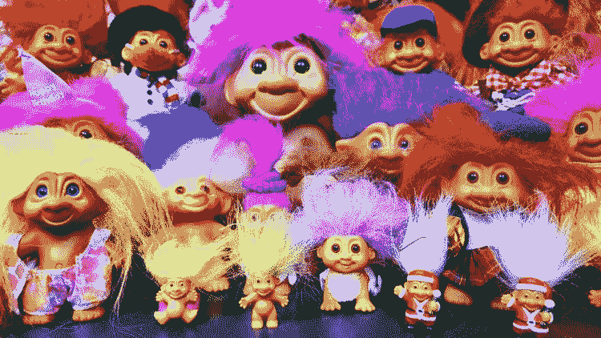
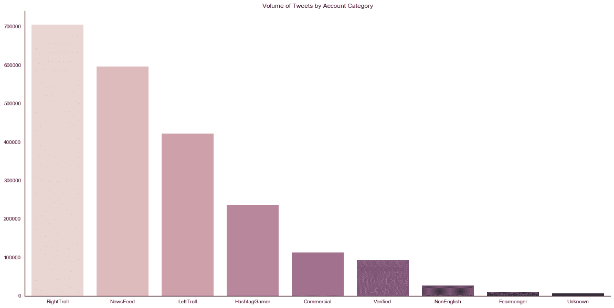
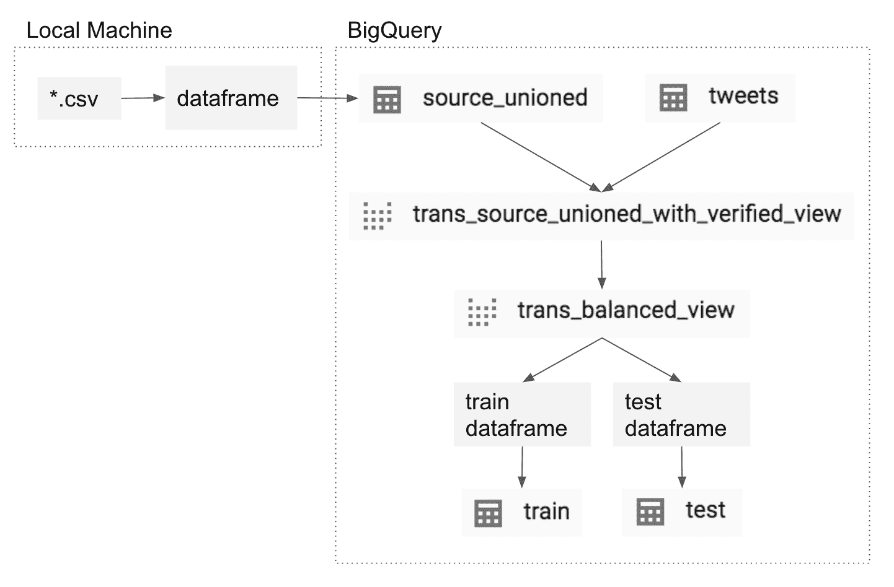
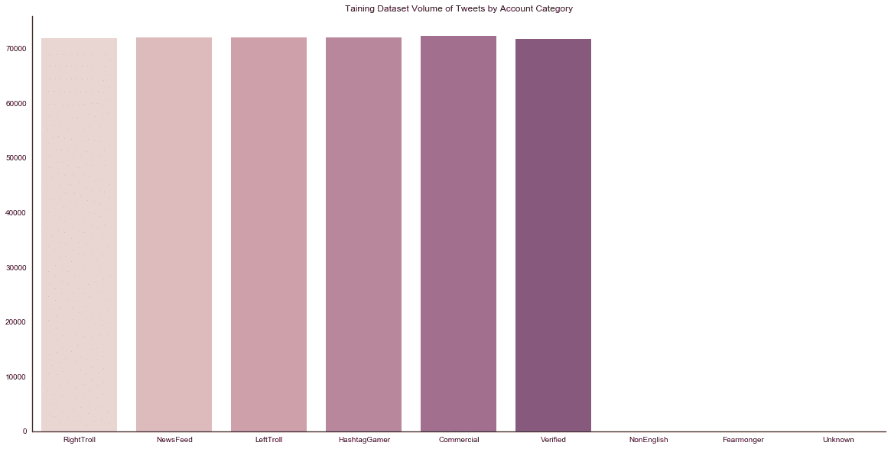
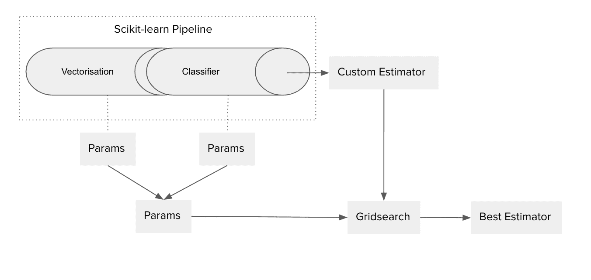

# 在推特上搜索钓鱼信息

> 原文：<https://towardsdatascience.com/trawling-twitter-for-trollish-tweets-6a6307f96453?source=collection_archive---------35----------------------->


Source: [JNL — Troll of Nordic folklore turning to stone in the daylight](https://commons.wikimedia.org/wiki/File:Troll_becoming_a_mountain_ill_jnl.png)

虚假信息是民主的最大威胁之一。假新闻、钓鱼和其他政治和社会颠覆性内容困扰着社会。社交媒体巨头在促成和培养这种行为方面发挥了作用。一些人甚至出现在美国国会和欧盟议会面前，承诺采取更多措施应对社交媒体上的虚假信息和仇恨言论的挑战。这些承诺中的一些已经花了将近一年时间，而 T2 仍然受到限制。

因此，当有机会在谷歌云平台(GCP)上创建一个生产机器学习(ML)系统的演示时，我欣然接受了创建一个 trolling tweet 检测器的机会。该演示要求在 GCP 上建立一个完整的项目结构，该结构将生成并部署一个定制的 ML 估计器到云 ML 引擎。

我本可以选择更“商业”的东西。然而，虚假信息识别的用例激励着我。虚假信息和仇恨言论的危害是真实的，我想在这个话题上发表自己的看法，尽管只是一小步。

在这篇文章中，我将重点关注特定于这个 trollish tweet 检测器的数据集和模型开发，在后续文章中，我将讨论使用 MLFlow 跟踪模型性能，以及使用 GCP 部署模型。[之前，我写过](https://medium.com/weareservian/scaling-the-wall-between-data-scientist-and-data-engineer-51b0a99da073)关于 ProductionML 框架的文章，它在更广泛的架构层次上涵盖了这个主题，并呼吁在数据科学家和数据工程师之间架起一座桥梁。

# 在钓鱼数据集上进行训练和测试

## 收集数据

我使用的数据集是由 *FiveThirtyEight* 在他们的故事 [*中分享的推文集合，为什么我们要分享 300 万条俄罗斯巨魔推文*](https://fivethirtyeight.com/features/why-were-sharing-3-million-russian-troll-tweets/) *。*

这就是 *FiveThirtyEight 要说的:*

> *FiveThirtyEight 于 2018 年 7 月 25 日从克莱姆森大学研究人员* [*传播学副教授达伦·林维尔*](https://www.clemson.edu/cbshs/faculty-staff/profiles/darrenl) *和经济学副教授* [*帕特里克·沃伦*](http://pwarren.people.clemson.edu/) *处获得数据。他们在一个名为 Social Studio 的工具上使用定制搜索收集数据，该工具归 Salesforce 所有，并由克莱姆森的* [*社交媒体收听中心*](https://www.clemson.edu/cbshs/centers-institutes/smlc/) *签约使用...*
> 
> *...他的* [*目录*](https://github.com/fivethirtyeight/russian-troll-tweets/) *包含了近 300 万条推文的数据，这些推文是从连接到互联网研究机构、俄罗斯“巨魔工厂”和司法部于 2018 年 2 月提交的一份起诉书* [*中的一名被告*](https://www.justice.gov/file/1035477/download) *中发送的，作为特别顾问罗伯特·穆勒俄罗斯调查的一部分。这个数据库中的推文是在 2012 年 2 月至 2018 年 5 月之间发送的，其中绝大多数是在 2015 年至 2017 年发布的。*

数据集是存储在 GitHub 存储库中的一系列 CSV 文件。我将它们下载到我的本地机器上，并使用 Python 的 Pandas 库将每个数据帧结合在一起。此时，我已经在一个统一的结构中拥有了完整的数据集，然后我将它存储在 BigQuery 中，再次使用 Pandas。

```
import os
import pandas as pd# Union
paths = [os.path.join("../data", x) for x in os.listdir("../data")]
cols = pd.read_csv(paths[0]).columns
df = pd.DataFrame(columns=cols) # roughly 3+ million recordsfor path in paths:
 df_tmp = pd.read_csv(path)
 df = pd.concat([df, df_tmp])# Store in BigQuery
df.to_gbq(
 destination_table="dataset.table_name"
 , project_id=project_id
 , chunksize=None
 , verbose=None
 , reauth=False
 , if_exists='fail'
 , private_key=None
 , auth_local_webserver=False
 , table_schema=table_schema
)
```

我在下游使用的关键特性是`account_category`和`content`字段。然而，获得完整的数据集，然后通过 BigQuery 视图，根据需要进行转换，以确保您可以在将来需要时利用更多功能，这始终是一种好的做法。视图，如果您不知道，就不要创建新表——不会存储任何新内容，也不会产生新的存储成本。简单地说，视图是保存到需要时的查询。

# 阶级不平衡

在阅读了关于数据集的文档并做了初步的探索性数据分析(EDA)后，我得出结论，需要解决一些与类不平衡相关的挑战。



首先，在`account_category`下有八个等级或类别。所有这些都来自被怀疑或确认与互联网研究机构(IRA)有关的句柄，因此没有一个是非巨魔，而是与 IRA 有关的各种类型的巨魔。

以下是这些类以及与每个类相关的一些内容示例:

**RightTroll**

*   “我们有一位在任的民主党参议员因腐败接受审判，而你几乎没有听到主流媒体的一点声音。”~ @nedryun
*   Marshawn Lynch 穿着反特朗普的衬衫参加比赛。从他下垂的裤子来看，衬衫上应该写着林奇对贝尔特
*   倒下的海军水手的女儿提供了强大的颂歌抗议独白，燃烧她的 NFL 包装工齿轮。#抵制 NFL
*   刚刚消息:特朗普总统将总统杯高尔夫锦标赛奖杯献给佛罗里达州、德克萨斯州和波多黎各的人民。
*   一万九千尊重我们的国歌！#StandForOurAnthem🇺🇸

**非英语**

*   Причина #67 Мутко: «Зенит-Арене» для адаптации к ЧМ потребуется 1,5–2 млрд рублей
*   Причина #70 Житель Самары умер в очереди в поликлинике
*   Причина #74 Президентский советник предложил ограничить Интернет, как в Китае
*   Причина #75 Казаков благословили на защиту интернет-пространства
*   Причина #77 В Кстово полицейские сломали женщине лицевую кость, когда та отказалась показать грудь

**恐惧使者**

*   #食物中毒不是玩笑！#沃尔玛#科奇农场
*   感谢上帝，我几天前吃的#火鸡很好吃。#科赫农场
*   我很容易受伤，我只是不表现出来。你可以伤害别人却不自知。
*   金和坎耶的婚礼
*   谁的妆最差，别告诉我，魔镜

**LeftTroll**

*   # blacklivesmatter # BLM # equality # equal rights
*   @big_gun_in_utah 所以？如果你交更多的税，你就有更多的权利？“这就是它的工作原理，”
*   @犹他州的 big_gun_in_utah 有人吗？
*   黑人学生迫使大学放弃私人监狱 2500 万美元#blacktwitter
*   种族主义的缅因州州长在“毒品问题”上#种族主义渣滓#白痴

**未知**

*   我的牙医让他的助手吸(我嘴里的水)，但我以为他在跟我说话，所以我吸了他的手指。我很羞愧
*   48.“我不吃水牛”
*   新闻史上最伟大的台词
*   从没在这么短的时间内见过这么多的面部表情
*   我不敢相信奶牛是整个宇宙中最可爱、最完美的动物:-)不

**HashtagGamer**

*   本周由@googlygirl98 主持的@GooglyTags 是# ItWasJustThatOneTime
*   总统自己政党的参议员花在询问总统可能行为不端的情况上的时间似乎异常多。
*   #今天将变得伟大因为我选择不在乎任何人说什么或做什么！！这是我的生活，我为自己而活。
*   说真的，如果塞申斯追求色情，特朗普将永远失去动画纳粹
*   #今天会很棒，因为我有酒

**新闻提要**

*   阿尔伯克基男子因试图出售偷来的枪支零件被捕
*   阿尔伯克基口袋妖怪 Go 玩家在这里停留和回馈
*   英国女王伊丽莎白二世因“重感冒”错过了教堂
*   新任联合国秘书长敦促新年决议:“把和平放在第一位”
*   中国表示将在 2017 年底停止象牙贸易

**商业**

*   APA 风格研究论文写作指南
*   为什么教室过敏最严重
*   下周别来上课了，我要生病了。史上最伟大的大学教授
*   脸书的 15 个白痴被叫了出来

幸运的是，我的一个同事一直在挖掘推文——其中许多来自经过验证的 Twitter 账户。所以，我从那些经过验证的账户中提取了推文，并用它们作为非钓鱼者的代理。“已验证”成为 account_category 中的第九个类别。

我们遇到的与类相关的第二个挑战是数据集作为一个整体是不平衡的。每节课的内容量差异很大；有几门课的音量低得令人痛苦。



为了快速有效地处理这个问题，我们做了两件事:

1.  删除了非常低的账户类别-非英语、散布谣言者和未知
2.  开发了 train_test_split.py 来拆分和平衡我们的数据集

数据集的平衡通过以下 BigQuery 视图解决:

```
SELECT * FROM (SELECT * FROM (SELECT account_category, content FROM `project_id.ira_russian_troll_tweets.trans_source_unioned_with_verified_view` WHERE account_category = 'Verified' ORDER BY rand() LIMIT 90000)UNION ALLSELECT * FROM (SELECT account_category, content FROM `project_id.ira_russian_troll_tweets.trans_source_unioned_with_verified_view` WHERE account_category = 'Commercial' ORDER BY rand() LIMIT 90000)UNION ALLSELECT * FROM (SELECT account_category, content FROM `project_id.ira_russian_troll_tweets.trans_source_unioned_with_verified_view` WHERE account_category = 'LeftTroll' ORDER BY rand() LIMIT 90000)UNION ALLSELECT * FROM (SELECT account_category, content FROM `project_id.ira_russian_troll_tweets.trans_source_unioned_with_verified_view` WHERE account_category = 'RightTroll' ORDER BY rand() LIMIT 90000)UNION ALLSELECT * FROM (SELECT account_category, content FROM `project_id.ira_russian_troll_tweets.trans_source_unioned_with_verified_view` WHERE account_category = 'HashtagGamer' ORDER BY rand() LIMIT 90000)UNION ALLSELECT * FROM (SELECT account_category, content FROM `project_id.ira_russian_troll_tweets.trans_source_unioned_with_verified_view` WHERE account_category = 'NewsFeed' ORDER BY rand() LIMIT 90000))ORDER BY rand()
```

train_test_split.py 脚本用于创建该视图。此外，该脚本使用 trans_balanced_view(即 transform 中的 trans)来开发一个数据帧，随后将其拆分为 train 和 test 表。



训练-测试划分为 80/20——80%的数据用于训练，20%用于测试。在训练和测试子数据集中，跨“帐户类别”的数据分布应该保持相等。



# ML 管道

## sci kit-学习管道

对于机器学习模型，我选择使用 Scikit-learn。我做出这个选择很大程度上是出于重用我已经开发的东西的愿望——如果你只想证明汽车是向前行驶的，那么再造轮子又有什么意义呢？



对于那些不知道的人，Scikit-learn 中的[管道](https://scikit-learn.org/stable/modules/generated/sklearn.pipeline.Pipeline.html)允许特征提取器(例如计数或 TF-IDF [矢量器](https://scikit-learn.org/stable/modules/generated/sklearn.feature_extraction.text.CountVectorizer.html#sklearn.feature_extraction.text.CountVectorizer))和 ML 估计器的耦合。换句话说，我能够将矢量器(一种将文本转换为有意义的数字数组的方法)与决策树分类器(一种非常简单的预测目标特征类别的学习方法)连接起来。这帮助我自动化了每次运行所需的数据建模。此外，这允许我使用整个文本(例如一条 tweet)作为输入，而不是整个文本的矢量形式。

虽然将特征提取器与监督学习模型链接在一起相对简单，但它有效地展示了如何以简洁的方式从原始数据输入到预测。

```
pipeline = Pipeline(
 [
 ("vectorizer", vectorizers[vectorizer])
 ,(model, models[model][0])
 ]
)grid_search_cv = GridSearchCV(
 estimator=pipline
 , param_grid=models[model][1]
 , scoring=None
 , fit_params=None
 , n_jobs=1
 , iid=True
 , refit=True
 , cv=2
 , verbose=0
 , pre_dispatch='2*n_jobs'
 , error_score='raise'
)
```

## 网格搜索

任何好的 ML 系统的一个关键方面是[超参数调整](https://en.wikipedia.org/wiki/Hyperparameter_optimization)。通过这种方法，不仅可以选择最佳的统计模型，还可以选择最佳的特征提取器(至少在 Scikit-Learn 中)。

在这个项目中，我选择了使用 Gridsearch，这是公认的非常暴力的方法。也就是说，Gridsearch 很容易理解并被广泛使用。它基于所有允许的参数评估模型的所有排列的性能。

请参见下面的示例，了解如何限制或扩展我为 Gridsearch 提供的参数选项(如矢量器 __ngram_range 或‘DTC _ model _ _ criteria’)。

```
vectorizer_params = {
 "vectorizer__ngram_range": [(1,1), (2,2)]
 , "vectorizer__stop_words": [None] 
}count_vectorizer = CountVectorizer()
tfidf_vectorizer = TfidfVectorizer()vectorizers = {
 "count_vectorizer": count_vectorizer
 , "tfidf_vectorizer": tfidf_vectorizer
}# Statistical Model
splitter = ['best', 'random']
min_impurity_decrease = [0.0, 0.8]
max_leaf_nodes = [None, 5]
min_samples_leaf = [1, 5]
min_samples_split = [2, 5]
min_weight_fraction_leaf = [0.0, 0.50]
criterion = ['entropy', 'gini']
random_state = [None, 42]
max_features = [None, 'auto']
max_depth = [None, 5]
class_weight = [None]dtc_param = {
 'dtc_model__splitter': splitter
 , 'dtc_model__min_impurity_decrease': min_impurity_decrease
 , 'dtc_model__max_leaf_nodes': max_leaf_nodes
 , 'dtc_model__min_samples_leaf': min_samples_leaf
 , 'dtc_model__min_samples_split': min_samples_split
 , 'dtc_model__min_weight_fraction_leaf': min_weight_fraction_leaf
 , 'dtc_model__criterion': criterion #
 , 'dtc_model__random_state': random_state
 , 'dtc_model__max_features': max_features
 , 'dtc_model__max_depth': max_depth
 , 'dtc_model__class_weight': class_weight
}for key in vectorizer_params.keys():
 dtc_param[key] = vectorizer_params[key]
```

从上面的代码中，我向参数字典中添加了矢量器和 ML 模型参数。这允许我们使用作为特征提取的一部分的参数来调整我们的估计器，这可能对估计器的最佳性能有重大影响。

# 现状核实

重要的是退一步。正如你所看到的，这是一个模型的基础，可以检测一个给定的推文可能属于哪个类别；训练数据集中过去推文的相似词汇和词频有助于建立一个模型，将新推文与该类别或类别相关联。

使用词汇的频率作为特征意味着这个模型仅限于照亮与过去的推文相似的推文。因此，产生的 ML 模型肯定需要与其他模型一起使用来识别单个的巨魔。结合预测其他方面的模型，如病毒范围、辱骂性语言或仇恨图像，可以帮助识别个体巨魔。

研究人员和社交媒体公司正在研究的策略中可以看到这种混合方法。在一项名为[自动处理虚假信息](http://www.europarl.europa.eu/RegData/etudes/STUD/2019/624278/EPRS_STU(2019)624278_EN.pdf)的研究中，欧洲议会研究服务(EPRS)详细说明了导致虚假信息传播的因素，并探索了处理虚假信息的可能技术方法。我做的这个小项目很可能符合第 *3.2 节中描述的工作。检测计算放大和假账* (p33)。

如果你对跟踪和解决虚假信息的话题以及更广泛的内容监控话题感兴趣，以下内容可能值得一读:

*   [乔希·拉塞尔](https://medium.com/@josh_emerson)
*   [社交机器人传播低可信度内容](https://www.nature.com/articles/s41467-018-06930-7)
*   [全球反误导行动指南](https://www.poynter.org/ifcn/anti-misinformation-actions/)
*   [不可能的工作:脸书努力调和 20 亿人口的内幕](https://motherboard.vice.com/en_us/article/xwk9zd/how-facebook-content-moderation-works)

# 下一步是什么？

好，我有一个模型。那又怎样！

一个 ML 模型不是生活在一个静态的环境中。这个项目就是一个完美的例子。政治和文化的变化。人们在推特上谈论的变化。必须对模型进行再培训，使其准确、相关、可持续和负责任。

那么，如果我把这个模型投入生产，会是什么样子呢？我们如何快速再培训？我们如何跟踪模型性能以确保寿命？我们如何部署到最终用户可以通过 API 访问的源？

我将在下一篇文章中解决这些问题。敬请关注。

喜欢你读的吗？在 Medium 或 LinkedIn 上关注我。

*本文原载于* [*Servian:云和数据专业人士*](https://medium.com/weareservian)