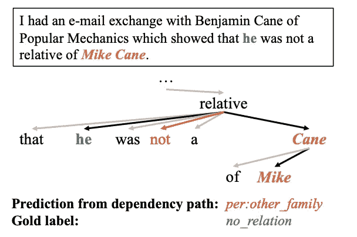

# 根据你的自然语言处理任务不同对待否定停用词

> 原文：<https://towardsdatascience.com/treat-negation-stopwords-differently-according-to-your-nlp-task-e5a59ab7c91f?source=collection_archive---------6----------------------->

## 否定词(not，nor，never)在 NLTK，spacy 和 sklearn 中都被认为是停用词，但我们应该根据 NLP 任务的不同给予不同的注意

Photo by [Jose Aragones](https://unsplash.com/@jodaarba?utm_source=unsplash&utm_medium=referral&utm_content=creditCopyText) on [Unsplash](https://unsplash.com/search/photos/stop?utm_source=unsplash&utm_medium=referral&utm_content=creditCopyText)

最近我在做一个关系抽取(RE)项目。但是我注意到一些流行的 NLP 工具，NLTK，spacy 和 sklearn，都把否定词当做停用词。如果我将这些否定词作为停用词删除，这将对检测两个实体之间的真实关系产生不良影响。所以我写这篇文章是为了那些遇到同样问题的人。

# **什么是停用词？**

在计算中， [**停用词**](https://www.wikiwand.com/en/Stop_words) 是在处理自然语言数据(文本)之前或之后过滤掉的词。停用词通常是语言中最常见的词。

我们可以看到这个定义是从统计学的角度来看的。但是在某些自然语言处理任务中，对于否定词的识别是有限的。

# 为什么要区别对待否定词？

在 RE 任务中，两个实体之间的[**【SDP】**](/how-to-find-shortest-dependency-path-with-spacy-and-stanfordnlp-539d45d28239)**最短依赖路径，被证明可以有效地提取出识别两个实体之间关系的最重要信息。**

**下面是我从论文中选取的一个例子:[修剪后的依赖树上的图卷积改进了关系提取](https://arxiv.org/pdf/1809.10185.pdf)。**

****

**在这个例子中，SDP 是`['he', 'relative', 'Cane', 'Mike']`。预测关系为`per:other_family`。但真正的标签是`no_relation`。因为`not`不在 SDP 中，`not`表示`he`和`Cane Mike`之间没有关系。**

**我们可以看到`not`是一个重要的上下文词，它直接影响对两个实体之间关系的判断。我们不能只删除`not`作为正常的停用词。**

# **如何看待不同 NLP 任务中的否定词？**

**这取决于我们想要解决什么样的 NLP 任务。如果你的项目很小，你只需要统计功能，像词袋，tf-idf，你可以删除否定词作为停用词。**

**如果你的 NLP 任务是与上下文相关的，例如，情感分析，我们应该保留否定词。我建议根据 NLP 任务定制一个停用词列表。Twitter 否定语料库就是一个例子。本文中给出了对该方法的解释**

**如果你的 NLP 任务是**高度**上下文相关的，我推荐使用 ELMo、ULMFiT、BERT、XLNet 等上下文相关模型。在这种模型中，所有停用词都被保留以提供足够的上下文信息。**

> *****查看我的其他帖子*** [***中等***](https://medium.com/@bramblexu) ***同*** [***一分类查看***](https://bramblexu.com/posts/eb7bd472/) ***！
> GitHub:***[***bramble Xu***](https://github.com/BrambleXu) ***LinkedIn:***[***徐亮***](https://www.linkedin.com/in/xu-liang-99356891/) ***博客:***[***bramble Xu***](https://bramblexu.com)**

# **参考**

*   **[如何用 spaCy 和 StanfordNLP 找到最短依赖路径](/how-to-find-shortest-dependency-path-with-spacy-and-stanfordnlp-539d45d28239)**
*   **[修剪后的依赖树上的图形卷积改进了关系提取](https://arxiv.org/pdf/1809.10185.pdf)**
*   **[Twitter 情感分析的否定范围检测](https://www.cs.cmu.edu/~ark/EMNLP-2015/proceedings/WASSA/pdf/WASSA14.pdf)**
*   **[https://data science . stack exchange . com/questions/15765/NLP-why-is-not-a-stop-word](https://datascience.stackexchange.com/questions/15765/nlp-why-is-not-a-stop-word)**