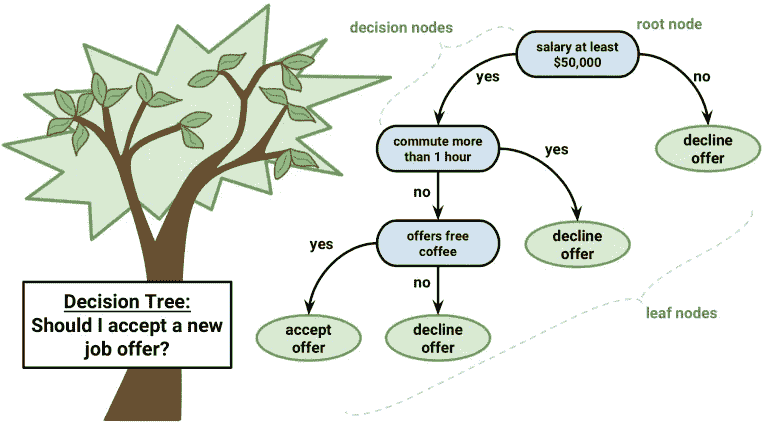
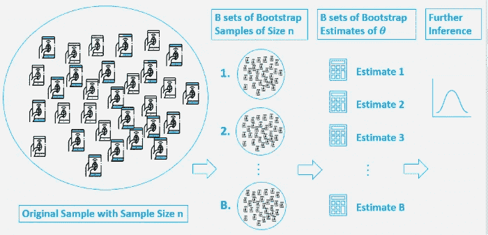

# 数据科学中的树

> 原文：<https://towardsdatascience.com/trees-in-data-science-dcd9830cbfcf?source=collection_archive---------28----------------------->

## 在简单的决策树中导航，引导/打包，最终形成随机森林模型

机器学习中最容易解释的模型之一是 CART(分类和回归树),俗称决策树。在这篇文章中，我希望给出一个决策树的概述，一些围绕决策树的基本概念，最后是随机森林。内容如下

*   理解决策树
*   纯洁
*   自举和打包
*   随机森林

我们走吧！

# **决策树**



Basic structure of a Decision Tree (Source: [cway-quan](http://cway-quantlab.blogspot.com/2017/06/optimize-trading-system-with-gradient_21.html))

在机器学习宇宙中，树实际上是真实树的颠倒版本。假设我们有一个由特征‘X’和目标‘Y’组成的数据集。决策树所做的是在 X 中寻找模式，并基于这些模式将数据集分割成更小的子集。

在上面略加简化的图像中想象这些分裂。这是一份工作是否被接受的问题。“X”包含“通勤时间”、“薪水”、“免费咖啡”等特征。

基于“X”中的模式，该树被分成分支，直到它到达到达“Y”的纯答案的点。在我们的场景中，被接受的工作机会必须提供超过 50k 的薪水，通勤时间< 1hr and free coffee. In this manner the tree reaches the last leaf which is a pure decision about ‘Y’.

## ***决策树中的纯度***

决策树根据节点的纯度进行分裂。这种纯度是基于“Y”的分布来测量的。如果我们的“Y”是连续的，我们的问题是一个回归问题，节点是基于 MSE(均方误差)分裂的。如果“Y”是离散的，我们的模型正在处理一个分类问题，需要不同的纯度测量。

在分类案例中，广泛使用的衡量标准是基尼系数。基尼系数的公式如下:


Source: General Assembly DSI curriculum (Authors:David Yerrington, Matt Brems)

当决定在给定的节点上进行哪个分裂时，它挑选从父节点到子节点的基尼不纯度下降最大的分裂。

# 自举和打包

要理解 bootstrapping 和 bagging，第一步是理解为什么首先需要它们。它基本上是试图模仿“群体的智慧”原则，即多个模型的综合结果优于单个模型的结果。下面这张由 Lorna Yen 拍摄的图片给出了一个关于系鞋带的好主意。



(Author: Lorna yen, [Source](/an-introduction-to-the-bootstrap-method-58bcb51b4d60))

如上所示的自举只是对数据进行随机采样，并进行替换。Bagging 只是在这些样本中的每一个上构建决策树并获得总体预测的过程。概括来说，装袋包括以下步骤:

1.  从大小为 n 的原始数据，用替换引导 k 个大小为 n 的样本
2.  在每个引导样本上构建一个决策树。
3.  通过所有采油树传递测试数据，并开发一个综合预测

Bagging 因此也被称为**自举聚合**。

# 随机森林模型

仔细观察下面的图片，你会对随机森林有一个基本的直觉。


Source: globalsoftwaresupport.com, ([link](https://www.globalsoftwaresupport.com/random-forest-classifier-bagging-machine-learning/))

bagging 的一个基本障碍是各个决策树高度相关，因为所有的树都使用相同的特征。所以我们模型的预测受到方差问题的困扰。要了解更多关于方差或偏差的信息，您可以阅读此[链接](/bias-variance-and-regularization-f3a0eefe99af)。去相关我们的模型是一个解决方案，这正是随机森林所做的。

随机森林在 bagging 中遵循类似的步骤，除了它们在学习过程中的每个分裂处使用特征的**随机子集。这减轻了装袋中的差异问题，并且通常产生更好的结果。这种有效而简单的方法使随机森林成为广泛实施的机器学习模型。**

# **奖金**

用于在 sklearn 中导入解释的三个分类模型的代码。

```
#Import for decision trees
**from** **sklearn.tree** **import** DecisionTreeClassifier#Import for bagging
**from** **sklearn.ensemble** **import** BaggingClassifier#Import for random Forests
**from** **sklearn.ensemble** **import** RandomForestClassifier 
```