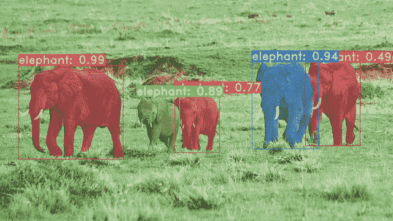
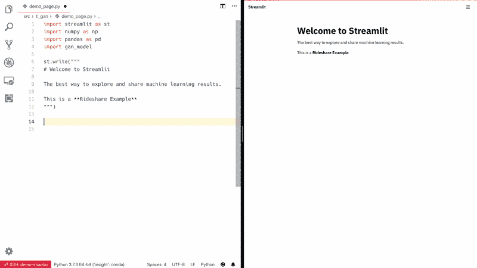
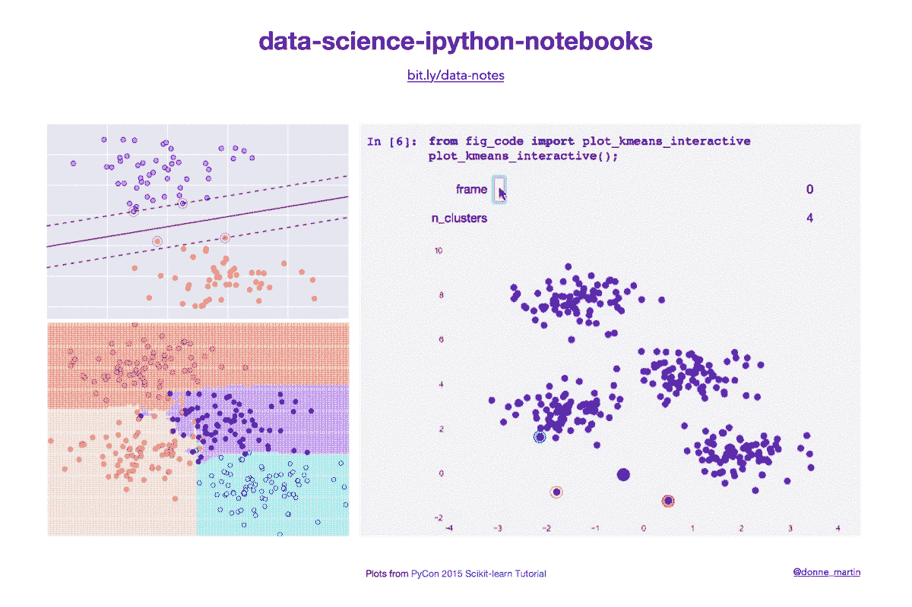

# 本周热门人工智能项目 44-19

> 原文：<https://towardsdatascience.com/trending-ai-projects-of-the-week-44-19-1fb4085edf59?source=collection_archive---------36----------------------->

关注我，这样你就不会错过伟大的人工智能项目。

**这里有几个你可能会感兴趣的链接:**

```
- [Labeling and Data Engineering for Conversational AI and Analytics](https://www.humanfirst.ai/)- [Data Science for Business Leaders](https://imp.i115008.net/c/2402645/880006/11298) [Course]- [Intro to Machine Learning with PyTorch](https://imp.i115008.net/c/2402645/788201/11298) [Course]- [Become a Growth Product Manager](https://imp.i115008.net/c/2402645/803127/11298) [Course]- [Deep Learning (Adaptive Computation and ML series)](https://amzn.to/3ncTG7D) [Ebook]- [Free skill tests for Data Scientists & Machine Learning Engineers](https://aigents.co/skills)
```

*上面的一些链接是附属链接，如果你通过它们进行购买，我会赚取佣金。请记住，我链接课程是因为它们的质量，而不是因为我从你的购买中获得的佣金。*

# 你只看系数



[yolact](https://github.com/dbolya/yolact) 是一个简单的、完全卷积的实时实例分割模型，其任务是检测和描绘图像中出现的每个不同的感兴趣对象。这是用于显著更快(比任何以前的竞争方法)实例分割的开源代码。

# 细流



[Streamlit](https://github.com/streamlit/streamlit) 让你用看似简单的 Python 脚本为你的机器学习项目创建应用。它支持热重新加载，因此当您编辑和保存文件时，您的应用程序会实时更新。不需要弄乱 HTTP 请求、HTML、JavaScript 等。你所需要的只是你最喜欢的编辑器和浏览器。

[Streamlit 演示项目](https://github.com/streamlit/demo-self-driving)让你浏览整个 [Udacity 自动驾驶汽车数据集](https://github.com/udacity/self-driving-car)并实时运行推理。

# PyTorch 示例

[展示深度学习库 PyTorch 使用示例的优秀知识库](https://github.com/pytorch/examples/):

*   [使用 Convnets 的图像分类(MNIST)](https://github.com/pytorch/examples/blob/master/mnist)
*   [使用 LSTM RNNs 的单词级语言建模](https://github.com/pytorch/examples/blob/master/word_language_model)
*   [用残差网络训练 Imagenet 分类器](https://github.com/pytorch/examples/blob/master/imagenet)
*   [生成对抗网络(DCGAN)](https://github.com/pytorch/examples/blob/master/dcgan)
*   [变型自动编码器](https://github.com/pytorch/examples/blob/master/vae)

# 数据-科学-ipython-笔记本

[数据科学 Python 笔记本](https://github.com/donnemartin/data-science-ipython-notebooks)深度学习(TensorFlow，Theano，Caffe，Keras)，scikit-learn，Kaggle，大数据(Spark，Hadoop MapReduce，HDFS)，matplotlib，pandas，NumPy，SciPy，Python essentials，AWS，各种命令行。



# pwnagotchi

不同于像大多数基于强化学习的人工智能那样仅仅玩超级马里奥或雅达利游戏， [Pwnagotchi](https://github.com/evilsocket/pwnagotchi) 随着时间的推移调整其参数，以便在你暴露的环境中更好地控制 WiFi。更具体地说，Pwnagotchi 正在使用一个带有 MLP 特征提取器的 [LSTM 作为其针对](https://stable-baselines.readthedocs.io/en/master/modules/policies.html#stable_baselines.common.policies.MlpLstmPolicy) [A2C 代理](https://stable-baselines.readthedocs.io/en/master/modules/a2c.html)的策略网络。如果你对 A2C 不熟悉，这里有一个非常好的介绍性解释(以漫画的形式！)Pwnagotchi 如何学习背后的基本原则。

# 在你走之前

在 [Twitter](https://twitter.com/romanorac) 上关注我，在那里我定期[发布关于数据科学和机器学习的](https://twitter.com/romanorac/status/1328952374447267843)消息。


Photo by [Courtney Hedger](https://unsplash.com/@cmhedger?utm_source=medium&utm_medium=referral) on [Unsplash](https://unsplash.com/?utm_source=medium&utm_medium=referral)